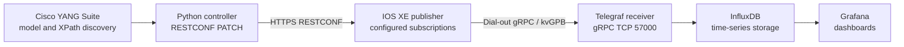

# Lab 6: Model-Driven Telemetry with IOS XE and TIG

## Lab Introduction

Polling asks a device for current state at intervals chosen by the collector. Although polling is familiar, it creates repeated session and request overhead, can synchronize load across many devices, and may miss changes between polls. Model-driven telemetry reverses that relationship. A controller installs a subscription describing the desired YANG data, publication policy, encoding, and receiver; the network device then pushes structured updates to the collector.

This lab uses the configured, or dial-out, push model. RESTCONF installs three persistent subscriptions on a reservable IOS XE sandbox. IOS XE sends key-value Google Protocol Buffer data over clear-text gRPC to Telegraf on the learner's Ubuntu 26.04 workstation. The subscriptions carry CPU utilization, memory-pool statistics, and input/output counters for GigabitEthernet1. Telegraf converts the messages into metrics, InfluxDB stores the time series, and Grafana visualizes utilization and traffic rates. Cisco YANG Suite is used to discover the active models, validate XPath filters, inspect the RESTCONF payload, and compare configured with operational subscription state.

## Learning Objectives

After completing this lab, you will be able to:

- Compare polling, dial-in telemetry, and configured dial-out telemetry.
- Identify publisher, controller, receiver, datastore, stream, and subscription roles.
- Use YANG Suite to inspect telemetry configuration and operational models.
- Identify CPU, memory, and interface-statistics operational paths.
- Build configured MDT subscriptions with `Cisco-IOS-XE-mdt-cfg`.
- Install subscriptions through RESTCONF.
- Configure a named gRPC receiver and kvGPB encoding.
- Explain periodic publication units and sampling trade-offs.
- Make a Dockerized Telegraf listener reachable from a reserved sandbox.
- Verify subscription and receiver state through RESTCONF and CLI.
- Inspect MDT measurements and fields in InfluxDB.
- Calculate traffic rates from monotonically increasing octet counters.
- Build Grafana panels for CPU, memory, input traffic, and output traffic.
- Diagnose disconnected receivers, empty streams, counter resets, and schema variation.
- Remove only the subscriptions and receiver owned by the lab.

## Estimated Time

Allow approximately **4 to 6 hours**. VPN routing and collector reachability are the most environment-dependent portions.

## Prerequisites

- Ubuntu 26.04 workstation prepared in Lab 1
- TIG stack and Cisco YANG Suite from Lab 1
- Active `ccnpauto` Python virtual environment
- Local GitLab access
- Cisco IOS XE **reservable** DevNet Sandbox
- VPN connection when required by the reservation
- RESTCONF access to IOS XE
- A workstation VPN address that the sandbox router can route to
- Permission to receive TCP 57000 on that VPN interface

Dial-out telemetry requires connectivity in the opposite direction from ordinary management. It is not enough for the workstation to reach IOS XE. The router must be able to open a TCP connection back to the Telegraf receiver. Some corporate firewalls, NAT designs, endpoint controls, or sandbox topologies prohibit this return path. If the router cannot reach the learner workstation, place Telegraf on an instructor-provided host reachable from the sandbox and use that host's address in the subscription.

## Lab Architecture



The RESTCONF session is the control plane for subscription configuration. The gRPC connection is the telemetry data plane and is initiated by IOS XE. InfluxDB and Grafana never contact the router directly.

## Subscription Design

| ID | YANG data | Period | Purpose |
|---:|---|---:|---|
| 601 | `/process-cpu-ios-xe-oper:cpu-usage/cpu-utilization` | 1000 centiseconds | Five-second, one-minute, and five-minute CPU utilization |
| 602 | `/memory-ios-xe-oper:memory-statistics/memory-statistic` | 1000 centiseconds | Total, used, and free values for memory pools |
| 603 | `/interfaces-ios-xe-oper:interfaces/interface[name='GigabitEthernet1']/statistics` | 1000 centiseconds | Input and output octets, packets, errors, and discards |

In `Cisco-IOS-XE-mdt-cfg`, the periodic value is expressed in hundredths of a second. Therefore, 1000 centiseconds equals 10 seconds. The lab uses separate subscriptions because each configured subscription carries one filter. This also makes failures easier to isolate.

## Project Structure

```text
lab6-iosxe-telemetry/
├── .env.example
├── .gitignore
├── requirements.txt
├── files/
│   ├── compose.mdt.yaml
│   └── telegraf-mdt.conf
├── scripts/
│   ├── preview_subscription.py
│   ├── configure_subscriptions.py
│   ├── check_subscription_state.py
│   └── cleanup_lab6.py
└── src/
    ├── settings.py
    ├── payload.py
    └── restconf.py
```

## Task 1: Create the GitLab Project

Create a blank private GitLab project named `lab6-iosxe-telemetry`, copy its exact HTTP clone URL, and clone it:

```bash
cd "$HOME/ccnpauto-workspace"
git clone \
  http://gitlab.lab.local:8088/ACTUAL_USERNAME/lab6-iosxe-telemetry.git
cd lab6-iosxe-telemetry
```

Copy the supplied files:

```bash
LAB6_FILES="/path/to/CCNPAUTO/LAB/Lab6"
cp "$LAB6_FILES/.env.example" "$LAB6_FILES/.gitignore" .
cp "$LAB6_FILES/requirements.txt" .
cp -R "$LAB6_FILES/files" "$LAB6_FILES/scripts" "$LAB6_FILES/src" .
```

Install missing Python dependencies and commit the baseline:

```bash
source "$HOME/.venvs/ccnpauto/bin/activate"
python -m pip install -r requirements.txt
python -m pip check

git add .
git commit -m "Add IOS XE telemetry lab"
git push -u origin main
```

## Task 2: Identify the Reachable Collector Address

Connect the sandbox VPN, then inspect workstation addresses and routes:

```bash
ip -brief address
ip route
```

Identify the VPN interface and its IPv4 address. Do not use `127.0.0.1`, a Docker bridge address, or a private LAN address that the sandbox cannot route to. Record the chosen address:

```bash
export TELEMETRY_IP="REPLACE_WITH_VPN_INTERFACE_IP"
echo "$TELEMETRY_IP"
```

If UFW is active, permit the telemetry listener on the VPN interface only. Replace the interface name:

```bash
sudo ufw status
sudo ufw allow in on VPN_INTERFACE_NAME to any port 57000 proto tcp
```

This rule is intentionally narrower than opening TCP 57000 on every interface. In a production design, use gRPC TLS, mutual authentication, source restrictions, and network policy. The clear-text receiver exists only for an isolated training environment.

## Task 3: Extend the Lab 1 TIG Stack for MDT

The Lab 1 Telegraf configuration monitors the workstation but does not expose a Cisco MDT listener. Copy the Lab 6 override and Telegraf configuration into the Lab 1 service directory:

```bash
LAB1_ROOT="/path/to/CCNPAUTO/LAB/Lab1"
cp files/compose.mdt.yaml "$LAB1_ROOT/files/compose.mdt.yaml"
cp files/telegraf-mdt.conf "$LAB1_ROOT/files/telegraf-mdt.conf"
```

Validate the merged Compose configuration without printing secret values:

```bash
cd "$LAB1_ROOT"
docker compose --env-file .env \
  -f files/compose.yaml \
  -f files/compose.mdt.yaml config --quiet
```

Start or recreate the TIG services:

```bash
docker compose --env-file .env \
  -f files/compose.yaml \
  -f files/compose.mdt.yaml up -d --force-recreate

docker compose --env-file .env \
  -f files/compose.yaml \
  -f files/compose.mdt.yaml ps
```

Confirm that the host publishes TCP 57000 and that Telegraf loaded the Cisco plugin:

```bash
sudo ss -lntp | grep ':57000'
docker logs --tail=100 lab1-telegraf
docker exec lab1-telegraf telegraf --input-list | grep cisco_telemetry_mdt
```

The Cisco MDT plugin is a service input. It waits for IOS XE to initiate a connection, so `telegraf --test` does not generate a sample by itself.

## Task 4: Start YANG Suite and Refresh the Device Models

Start YANG Suite from the Lab 1 installation:

```bash
cd "$HOME/lab-services/yangsuite/docker"
docker compose up -d
docker compose ps
```

Open YANG Suite, select the reserved IOS XE device profile, and refresh its NETCONF capabilities and module repository. Locate these modules:

- `Cisco-IOS-XE-mdt-cfg`
- `Cisco-IOS-XE-mdt-common-defs`
- `Cisco-IOS-XE-mdt-oper`
- `Cisco-IOS-XE-process-cpu-oper`
- `Cisco-IOS-XE-memory-oper`
- `Cisco-IOS-XE-interfaces-oper`

Record the revisions advertised by the active IOS XE image. The supplied payload follows the modern named-receiver hierarchy published for IOS XE 17.x. YANG Suite must remain the final authority because a different image may expose a legacy receiver structure or a different operational path.

## Task 5: Explore the MDT Configuration Model

In YANG Suite's tree explorer, follow:

```text
mdt-config-data
├── mdt-subscription [subscription-id]
│   ├── subscription-id
│   ├── base
│   │   ├── stream
│   │   ├── encoding
│   │   ├── rcvr-type
│   │   ├── period
│   │   └── xpath
│   └── mdt-receiver-names
│       └── mdt-receiver-name [name]
└── mdt-named-protocol-rcvrs
    └── mdt-named-protocol-rcvr [name]
        ├── protocol
        ├── host/address
        └── port
```

The named receiver is defined once and referenced by all three subscriptions. `grpc-tcp` selects clear-text gRPC, while `encode-kvgpb` produces self-describing key-value protobuf messages understood by Telegraf's Cisco MDT plugin.

Now inspect `Cisco-IOS-XE-mdt-oper`. Its `mdt-oper-data` container reports subscription validity, receiver state, comments, connection state, and last-change timestamps. Configuration can be syntactically valid while the receiver remains disconnected; therefore operational telemetry state is essential evidence.

## Task 6: Discover and Validate the Sensor Paths

Use YANG Suite to inspect each operational tree.

The CPU path contains percentage leaves such as:

```text
cpu-usage/cpu-utilization
├── five-seconds
├── five-seconds-intr
├── one-minute
└── five-minutes
```

The memory list is keyed by pool name and exposes byte counters:

```text
memory-statistics/memory-statistic [name]
├── total-memory
├── used-memory
└── free-memory
```

The interface list is keyed by `name`. Under `statistics`, locate at least:

```text
in-octets
out-octets
in-unicast-pkts
out-unicast-pkts
in-errors
out-errors
in-discards
out-discards
```

Use YANG Suite's RESTCONF function to GET each operational resource before subscribing. Confirm that the interface key on the sandbox is exactly `GigabitEthernet1`; some platforms use a different management interface name. If it differs, update the XPath in `src/payload.py` before proceeding.

## Task 7: Configure the Local Environment and Preview the Payload

Return to the Lab 6 repository and create the environment file:

```bash
cd "$HOME/ccnpauto-workspace/lab6-iosxe-telemetry"
cp .env.example .env
chmod 600 .env
code .env
```

Enter the reserved router information and the reachable workstation VPN address. Keep the safety gate disabled:

```dotenv
TELEMETRY_RECEIVER_IP=REACHABLE_VPN_IP
TELEMETRY_RECEIVER_PORT=57000
TELEMETRY_PERIOD_CS=1000
ALLOW_CONFIG_CHANGES=false
```

Generate the payload:

```bash
git switch -c feature/configure-iosxe-telemetry
python -m scripts.preview_subscription
python -m json.tool artifacts/mdt-subscriptions.json
```

Confirm that:

- The receiver address matches the VPN interface.
- The receiver port is 57000.
- Protocol is `grpc-tcp`.
- Encoding is `encode-kvgpb`.
- Stream is `yang-push`.
- Subscription IDs are 601, 602, and 603.
- The period is 1000 centiseconds.
- The interface filter contains only GigabitEthernet1.

## Task 8: Validate the RESTCONF Payload with YANG Suite

In YANG Suite, open the RESTCONF area and select `Cisco-IOS-XE-mdt-cfg:mdt-config-data`. Perform a GET first:

```text
/restconf/data/Cisco-IOS-XE-mdt-cfg:mdt-config-data
```

Inspect existing configured subscriptions. If IDs 601–603 or receiver `LAB6_TELEGRAF` already belong to another exercise, stop and choose instructor-approved values in both the code and cleanup workflow.

Validate the generated JSON against the active model set. Pay particular attention to the placement of `period` and `xpath` inside `base`, the named receiver reference, and the `host/address` choice. Do not send the payload from YANG Suite if Python will perform the configuration; otherwise, evidence from two controllers becomes harder to interpret.

## Task 9: Configure Dial-Out Subscriptions Through RESTCONF

Enable the explicit change gate:

```dotenv
ALLOW_CONFIG_CHANGES=true
```

Run the configuration workflow:

```bash
python -m scripts.configure_subscriptions
```

The script PATCHes:

```text
/restconf/data/Cisco-IOS-XE-mdt-cfg:mdt-config-data
```

PATCH merges the three keyed subscriptions and named receiver without replacing unrelated telemetry configuration. A successful edit normally returns HTTP 204, although another successful 2xx response is accepted. The script then retrieves configured state so the intended IDs, filters, period, and receiver can be compared with IOS XE.

## Task 10: Verify Receiver and Subscription State

Retrieve operational telemetry state:

```bash
python -m scripts.check_subscription_state
```

Look for valid subscriptions and a connected receiver. Useful states include:

| State | Meaning |
|---|---|
| `sub-state-valid` | Subscription passed configuration validation |
| `sub-state-invalid` | Model, filter, encoding, or receiver configuration is invalid |
| `rcvr-state-connecting` | IOS XE is attempting the outbound connection |
| `rcvr-state-connected` | The gRPC session is established |
| `rcvr-state-disconnected` | No active collector connection |

Verify independently through IOS XE CLI:

```text
show telemetry ietf subscription all
show telemetry ietf subscription 601 detail
show telemetry ietf subscription 602 detail
show telemetry ietf subscription 603 detail
```

Then watch Telegraf:

```bash
docker logs --follow lab1-telegraf
```

Stop log following with `Ctrl+C`. A connected IOS XE source and incoming MDT messages indicate that the reverse network path, gRPC listener, encoding, and subscriptions are working together.

## Task 11: Confirm Metrics in InfluxDB

Open InfluxDB at `http://127.0.0.1:8086`, select **Data Explorer**, choose the Lab 1 organization and bucket, and inspect recent measurements. Depending on the exact IOS XE and Telegraf versions, aliases should make measurements easier to recognize as `iosxe_cpu`, `iosxe_memory`, and `iosxe_interface`. If aliases do not match the received encoding path, inspect the raw measurement names rather than assuming data is absent.

Use Schema Explorer to record:

- Actual measurement names
- Source-address or `mdt_source` fields/tags
- Interface and memory-pool tag keys
- CPU field names
- Memory field names
- Input and output octet field names
- Numeric field types

Telegraf's MDT decoder can normalize punctuation in field names. Therefore, discover whether a leaf such as `five-seconds` appears as `five-seconds`, `five_seconds`, or another encoded key before writing a dashboard query.

## Task 12: Generate Controlled Interface Traffic

The interface octet values are cumulative counters. To make their change visible, generate approved management traffic through GigabitEthernet1. From the workstation, repeat a read-only RESTCONF request for approximately one minute:

```bash
for request in $(seq 1 60); do
  curl --silent --insecure \
    --user 'USERNAME:PASSWORD' \
    --header 'Accept: application/yang-data+json' \
    'https://IOSXE_HOST:HTTPS_PORT/restconf/data/Cisco-IOS-XE-interfaces-oper:interfaces/interface=GigabitEthernet1/statistics' \
    >/dev/null
  sleep 1
done
```

Replace every placeholder and avoid storing the command with real credentials in a shared shell history. An alternative is an instructor-approved ping or file transfer through the interface. Do not scan the sandbox, run an unbounded load generator, or attempt to saturate a shared link.

Wait for at least two additional telemetry periods, then confirm that `in-octets` and `out-octets` increased.

## Task 13: Build the Grafana Dashboard

Open Grafana at `http://127.0.0.1:3000`. If the InfluxDB data source was not configured in Lab 1, add it with:

- Query language: Flux
- URL from Grafana's container perspective: `http://influxdb:8086`
- Organization: Lab 1 `INFLUX_ORG`
- Token: Lab 1 `INFLUX_TOKEN`
- Default bucket: Lab 1 `INFLUX_BUCKET`

Create a dashboard named **IOS XE Model-Driven Telemetry** with four panels.

### CPU Utilization

Select the CPU measurement and the five-second utilization field. Use percent as the unit and set reasonable thresholds such as 50, 75, and 90 percent. Add the one-minute value as a second series if present.

### Memory Utilization

Filter the memory measurement to the primary processor pool discovered in InfluxDB. Calculate:

```text
memory utilization percent = used-memory / total-memory × 100
```

Keep free bytes available as a second panel or tooltip because percentage alone can hide the magnitude of remaining memory.

### GigabitEthernet1 Input Rate

Filter to the interface and input-octet field. Counters are not rates. Apply a non-negative derivative over one second and multiply by eight:

```text
input bits per second = nonnegative_derivative(in-octets) × 8
```

### GigabitEthernet1 Output Rate

Repeat the calculation for `out-octets`. Use bits per second as the unit and retain the raw cumulative counters in Data Explorer for troubleshooting.

The exact Flux field and tag names must come from Task 11. A typical query shape is:

```flux
from(bucket: "workstation")
  |> range(start: -15m)
  |> filter(fn: (r) => r._measurement == "iosxe_interface")
  |> filter(fn: (r) => r._field == "in-octets")
  |> derivative(unit: 1s, nonNegative: true)
  |> map(fn: (r) => ({r with _value: r._value * 8.0}))
```

Adapt the bucket, measurement, field, and interface filter to the observed schema. `nonNegative: true` prevents a counter reset after reload from appearing as a large negative traffic rate.

## Task 14: Observe Failure and Recovery

Stop only Telegraf:

```bash
cd "$LAB1_ROOT"
docker compose --env-file .env \
  -f files/compose.yaml \
  -f files/compose.mdt.yaml stop telegraf
```

After a short interval, retrieve MDT operational state again. The receiver should transition away from connected, and IOS XE should attempt reconnection using its configured subscription. Restart Telegraf:

```bash
docker compose --env-file .env \
  -f files/compose.yaml \
  -f files/compose.mdt.yaml start telegraf
```

Watch the logs and operational state until the receiver reconnects. Then examine Grafana. The gap represents unavailable collection, not zero CPU, zero memory, or zero traffic. Good dashboards distinguish missing data from a legitimate zero value.

## Task 15: Commit Evidence and Clean Up

Do not commit `.env`, InfluxDB data, tokens, or full unredacted telemetry payloads. Commit learner-authored notes and sanitized dashboard screenshots on the feature branch:

```bash
cd "$HOME/ccnpauto-workspace/lab6-iosxe-telemetry"
git status --short --ignored
git add .
git diff --staged
git commit -m "Complete IOS XE telemetry lab"
git push -u origin feature/configure-iosxe-telemetry
```

Create and merge a GitLab merge request. Then remove the lab-owned router configuration:

```bash
python -m scripts.cleanup_lab6
python -m scripts.check_subscription_state
```

The cleanup deletes subscriptions 601–603 before deleting the shared named receiver. HTTP 404 is accepted because it means the selected resource is already absent. Verify with:

```text
show telemetry ietf subscription all
```

Return the safety gate to false:

```dotenv
ALLOW_CONFIG_CHANGES=false
```

Remove the temporary firewall rule if it is no longer required, using the same interface-specific rule shown by `sudo ufw status numbered`. Stop the MDT-enabled TIG override when finished:

```bash
cd "$LAB1_ROOT"
docker compose --env-file .env \
  -f files/compose.yaml \
  -f files/compose.mdt.yaml stop
```

Do not delete the Lab 1 persistent volumes.

## Expected Evidence

- YANG Suite capability and module revision evidence
- MDT configuration and operational tree screenshots
- Validated RESTCONF JSON payload
- Telegraf listener on TCP 57000
- RESTCONF PATCH success result
- Subscriptions 601–603 in valid state
- Receiver in connected state
- Telegraf log showing the IOS XE telemetry source
- InfluxDB measurement and field discovery
- CPU time series
- Memory utilization calculation
- GigabitEthernet1 input and output rate panels
- Receiver disconnect and reconnect observation
- Scoped cleanup result
- Clean Git history without credentials

## Troubleshooting

### Telegraf does not listen on TCP 57000

Validate the merged Compose configuration and inspect logs:

```bash
docker compose --env-file "$LAB1_ROOT/.env" \
  -f "$LAB1_ROOT/files/compose.yaml" \
  -f "$LAB1_ROOT/files/compose.mdt.yaml" config --quiet
docker logs --tail=200 lab1-telegraf
sudo ss -lntp | grep ':57000'
```

Confirm that `telegraf-mdt.conf` is mounted at `/etc/telegraf/telegraf.conf` and that no other process owns the port.

### Subscription is valid but receiver is disconnected

The payload passed model validation, but IOS XE cannot complete the outbound connection. Verify the receiver IP, VPN route, host firewall, Docker port publication, and any upstream policy. A private workstation LAN address is rarely reachable from a remote sandbox.

### RESTCONF returns a YANG validation error

Inspect `ietf-restconf:errors`, especially `error-path` and `error-message`. Compare the payload with the active `Cisco-IOS-XE-mdt-cfg` revision in YANG Suite. Older releases may require the deprecated inline receiver list rather than named receivers.

### CPU or memory data arrives but interface data does not

Use RESTCONF and YANG Suite to confirm the exact interface key. Check case and spacing. Test a broader interface XPath temporarily only with instructor approval; a broad periodic interface subscription produces more data.

### Telegraf receives data but InfluxDB appears empty

Check Telegraf output errors, token permissions, organization, bucket, time range, and workstation clock. Search raw measurements before relying on aliases.

### Traffic graph shows a large negative or positive spike

A device reload, interface reset, counter wrap, or schema/type conversion can reset a cumulative counter. Use a non-negative derivative and correlate discontinuity time or device uptime before treating the spike as real traffic.

### Grafana displays no data

Verify the InfluxDB data source from the Grafana container's perspective. Use `http://influxdb:8086`, not `127.0.0.1:8086`, because localhost inside the Grafana container refers to Grafana itself.

## Key Takeaways

- Dial-out telemetry causes IOS XE to initiate and maintain the collector connection.
- RESTCONF configures subscriptions; gRPC carries the telemetry updates.
- YANG Suite reveals the active model revisions and validates filter paths.
- CPU, memory, and interface counters come from separate IOS XE operational models.
- Periodic subscription values in `Cisco-IOS-XE-mdt-cfg` use centiseconds.
- kvGPB is the supported self-describing encoding for IOS XE gRPC dial-out in this workflow.
- A valid subscription can still have a disconnected receiver because configuration and reachability are different concerns.
- Telegraf decodes MDT, InfluxDB stores time-indexed fields, and Grafana presents derived meaning.
- Octet counters must be differentiated over time and multiplied by eight to produce bits per second.
- Missing telemetry is unknown state, not a zero measurement.
- Clear-text gRPC is acceptable only for this isolated lab; production telemetry requires stronger transport and receiver security.
- Cleanup must delete dependent subscriptions before their named receiver.

The next lab can incorporate telemetry health into configuration-management and CI/CD workflows, allowing automation to validate not only intended configuration but also observed operational outcomes.

## Further Reading

- [Cisco IOS XE Model-Driven Telemetry](https://www.cisco.com/c/en/us/td/docs/ios-xml/ios/prog/configuration/174/b_174_programmability_cg/model_driven_telemetry.html)
- [Cisco YANG Suite telemetry configuration guide](https://www.cisco.com/c/en/us/support/docs/ios-nx-os-software/ios-xe-17/217427-configure-model-driven-telemetry-on-cisc.html)
- [Cisco YANG Suite gRPC receiver](https://developer.cisco.com/docs/yangsuite/telemetry-over-grpc-clear-channel/)
- [Cisco IOS XE YANG models](https://github.com/YangModels/yang/tree/main/vendor/cisco/xe)
- [Telegraf Cisco MDT input plugin](https://docs.influxdata.com/telegraf/v1/input-plugins/cisco_telemetry_mdt/)
- [InfluxDB Flux documentation](https://docs.influxdata.com/flux/)
- [Grafana InfluxDB data source](https://grafana.com/docs/grafana/latest/datasources/influxdb/)
- [RFC 8641: Subscription to YANG Notifications for Datastore Updates](https://www.rfc-editor.org/rfc/rfc8641)
