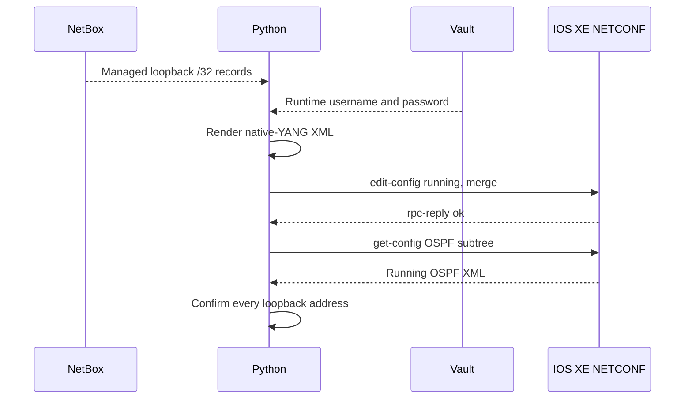

# Lab 6: Configure Network Device Using NETCONF with YANG Payload

## Lab Introduction

The project currently creates loopback interfaces through Netmiko. In this lab, learners add a second southbound method: NETCONF. The application reads the same loopbacks from NetBox, retrieves credentials through Vault, renders a Cisco IOS XE native-YANG XML payload, and merges OSPF network statements into the running datastore. Every managed loopback is advertised in OSPF area 0 with a host wildcard of `0.0.0.0`.

Cisco Yangsuite is central to the exercise. Learners can use the local installation prepared in Lab 1 or Cisco DevNet Sandbox Yangsuite at `http://10.10.20.50:8480` to inspect the model revision exposed by their reserved router and to build and test the payload before Python sends it. The supplied Jinja2 template represents a common IOS XE native model hierarchy, but the device-advertised model remains authoritative.

## Learning Objectives

- Verify NETCONF capabilities on IOS XE.
- Inspect Cisco IOS XE native and OSPF YANG modules in Yangsuite.
- Build an `<edit-config>` payload from the device model.
- Render one OSPF network element for every NetBox loopback.
- Use `ncclient` with credentials obtained from Vault.
- Merge configuration into the running datastore.
- Retrieve OSPF configuration through NETCONF for verification.
- Interpret NETCONF RPC errors rather than hiding them.

## Prerequisites

- Labs 1 and 3–5 completed
- Existing `network_automation_project`
- Access to local Yangsuite at `https://localhost:8443` or Cisco DevNet Sandbox Yangsuite at `http://10.10.20.50:8480`
- NetBox and Vault running
- Active IOS XE reservable sandbox and VPN
- NETCONF enabled by the sandbox

## Task 1: Continue the Existing Repository

Start and verify the project dependencies before editing code:

```bash
cd "$HOME/lab-services/netbox-docker"
docker compose up -d
vault status
```

For local Yangsuite, run `docker compose up -d` from `~/lab-services/yangsuite/docker` and open `https://localhost:8443`. Alternatively, open Cisco DevNet Sandbox Yangsuite at `http://10.10.20.50:8480`. TIG is not required and may remain stopped.

```bash
cd ~/ccnpauto-workspace/network_automation_project
git switch main
git pull --ff-only
git switch -c feature/netconf-ospf
```

Using the VS Code Explorer, copy and paste:

- `iosxe_netconf.py` and `ospf_renderer.py` from `CCNPAUTO/LAB/Lab6/src/` to the project's `src/`;
- `configure_ospf.py` from `CCNPAUTO/LAB/Lab6/scripts/` to `scripts/`;
- `ospf_native.xml.j2` from `CCNPAUTO/LAB/Lab6/templates/` to `templates/`;
- `pytest.ini` from `CCNPAUTO/LAB/Lab6/` to the project root;
- `test_ospf_renderer.py` from `CCNPAUTO/LAB/Lab6/tests/` to the project's `tests/`.

Keep the shared `src/logging_config.py` and `logs/` directory. The NETCONF components record session establishment, payload validation, target datastore, RPC outcome, and verification. Because diagnostic logs may describe operational intent, protect them with the same access and retention controls used for configuration evidence.

Modify the existing `requirements.txt` by adding `ncclient>=0.7,<1` and `pytest>=8,<9` if needed. Save it and run `python -m pip install -r requirements.txt`.

## Task 2: Add NETCONF Settings

Add this attribute inside `Settings.__init__`:

```python
self.netconf_port = int(os.getenv("IOSXE_NETCONF_PORT", "830"))
```

Add these nonsecret values to `.env`:

```dotenv
IOSXE_NETCONF_PORT=830
OSPF_PROCESS_ID=1
OSPF_AREA=0
```

The NETCONF client receives the username and password from the same Vault-backed settings used by Netmiko.

## Task 3: Verify NETCONF Access

In Yangsuite, open the `iosxe-ospf` device profile and select **Check connectivity** for NETCONF port `830`.

On IOS XE, confirm NETCONF-YANG is enabled:

```text
show running-config | include netconf-yang
show netconf-yang sessions
```

If permitted and required on the reserved instance:

```text
configure terminal
 netconf-yang
end
```

Do not modify AAA, management routing, or unrelated services.

## Task 4: Use Yangsuite to Discover the OSPF Model

Open the Yangsuite option selected in Lab 1:

```text
https://localhost:8443
or
http://10.10.20.50:8480
```

Use the local administrator account created during installation or the Cisco DevNet Sandbox credentials.

### Create the Device Profile

1. Select **Setup > Device profiles**, then select **New profile**.
2. Enter a profile name such as `iosxe-reservation`.
3. Enter the current reservation hostname or management address, username, and password.
4. Enable **NETCONF** and set its port to `830`. Enable **RESTCONF** and set its HTTPS port to `443` for later URI exercises.
5. Select **Check connectivity**. NETCONF must succeed before an RPC can be built or executed.
6. Save the device profile. Credentials are stored by the selected Yangsuite service, so use only Cisco DevNet Sandbox credentials and never production credentials on the sandbox instance.

### Download the Device-Advertised Schemas

1. Select **Setup > YANG files and repositories** and create a repository named for the current IOS XE reservation or release.
2. In **Add modules to repository**, select the **NETCONF** tab and choose `iosxe-reservation`.
3. Select **Get schema list**. The list comes from the router's NETCONF capabilities rather than from a generic model archive.
4. Select and download `Cisco-IOS-XE-native`, `Cisco-IOS-XE-ospf`, `ietf-netconf`, and their reported dependencies.
5. Select **Setup > YANG module sets**, create a set named `iosxe-ospf`, and add the downloaded modules. Record each module revision because a different sandbox image may expose a different tree.

Locate:

- `Cisco-IOS-XE-native`
- `Cisco-IOS-XE-ospf`
- `ietf-netconf`

In the tree viewer, follow the OSPF hierarchy under native configuration. Record the exact module revisions and confirm the structure leading to:

```text
native
└── router
    └── router-ospf
        └── ospf
            └── process-id
                ├── id
                └── network
                    ├── ip
                    ├── wildcard
                    └── area
```

### Build and Validate the NETCONF XML

1. Select **Protocols > NETCONF**.
2. Choose the `iosxe-ospf` YANG set and the `iosxe-reservation` device profile.
3. Load `Cisco-IOS-XE-native` and `Cisco-IOS-XE-ospf`.
4. Select **get-config**, expand the tree to `native/router/router-ospf/ospf`, select that subtree, and choose the `running` datastore.
5. Select **Build RPC**, review the generated `<filter>`, and then select **Run RPC**. The reply shows the hierarchy and namespaces the router currently accepts.
6. Clear the operation selections, choose **edit-config**, and select the `running` target with the default operation `merge`.
7. In the model tree, set `process-id/id` to `1`. Add one `network` list entry with the IP address of an existing loopback, wildcard `0.0.0.0`, and area `0`.
8. Select **Build RPC**. Confirm that the generated document contains the NETCONF base namespace on `<rpc>` and `<config>`, the Cisco native namespace on `<native>`, and the Cisco OSPF namespace on `<router-ospf>`.
9. Save the generated RPC as evidence. The project calls `ncclient.edit_config()`, so copy only the `<config>...</config>` element into the Jinja2 design; `ncclient` creates the outer `<rpc>` and `<edit-config>` envelope.
10. Do not run the change from Yangsuite if the same configuration will be applied by the lab script. First compare its `<config>` body with `templates/ospf_native.xml.j2`.

The important distinction is that Yangsuite discovers the exact tree and namespaces, while Jinja2 supplies repeatable values. The loop belongs in the template so one payload can contain every NetBox-managed loopback.

## Task 5: Understand the Rendered Payload

The supplied template loops over the normalized NetBox records:

```jinja2

<network>
  <ip>{{ loopback.ipv4 }}</ip>
  <wildcard>0.0.0.0</wildcard>
  <area>{{ area }}</area>
</network>

```

A loopback uses a `/32`, so `0.0.0.0` matches exactly one interface address. All entries use area 0 as required by the course design.

Run the local renderer test:

```bash
pytest -q tests/test_ospf_renderer.py
```

Next, preview without allowing a change. Temporarily add a print-only call in a Python shell if desired:

```bash
python - <<'PY'
from src.netbox_source import NetBoxLoopbackSource
from src.ospf_renderer import OSPFRenderer
from src.settings import Settings

s = Settings()
items = NetBoxLoopbackSource(s.netbox_url, s.netbox_token, s.netbox_device, s.netbox_tag).load()
print(OSPFRenderer().render(items, process_id=1, area=0))
PY
```

Compare the result with the Yangsuite payload. If the reserved IOS XE release advertises a different hierarchy, update the Jinja2 template and the test together.

## Task 6: Ensure Loopbacks Exist First

OSPF should reference interfaces already present on IOS XE. Reconcile NetBox loopbacks before the OSPF task:

```bash
python -m scripts.sync_loopbacks_from_netbox
```

This explicit order becomes a CI dependency in Lab 7.

## Task 7: Configure OSPF Through NETCONF

Run:

```bash
python -m scripts.configure_ospf
```

The workflow is:


```mermaid
sequenceDiagram
    participant N as NetBox
    participant P as Python
    participant V as Vault
    participant X as IOS XE NETCONF
    N-->>P: Managed loopback /32 records
    V-->>P: Runtime username and password
    P->>P: Render native-YANG XML
    P->>X: edit-config running, merge
    X-->>P: rpc-reply ok
    P->>X: get-config OSPF subtree
    X-->>P: Running OSPF XML
    P->>P: Confirm every loopback address
```

The script prints the payload for study, sends `edit-config` with merge semantics, retrieves the OSPF subtree, and confirms that every NetBox address is present.

To trace this workflow, set `ENABLE_FILE_LOGGING=true`, repeat the run, and inspect the new `logs/configure_ospf_*.log`. Look for the loopback count, XML validation, NETCONF connection state, `<edit-config>` outcome, and verification. Do not edit a log to make a failed execution appear successful.

## Task 8: Verify Operationally

Use read-only IOS XE commands:

```text
show ip ospf interface brief
show ip protocols
show running-config | section router ospf
```

A loopback can be included in OSPF even when no neighbor forms on it. The objective is to place each loopback's address under process 1, area 0—not to create an OSPF adjacency on a loopback.

## Task 9: Observe an RPC Error Safely

Make a temporary working copy of the template outside the repository and misspell one modeled leaf. Preview it and compare it with Yangsuite. If the instructor permits sending the invalid payload in the reserved sandbox, IOS XE should return an `rpc-error` with an error tag, path, and message. Restore the valid template immediately.

The application catches `RPCError` and stops. It must not silently continue to verification after the device rejects configuration.

## Task 10: Commit and Merge

```bash
git add requirements.txt pytest.ini src scripts templates tests
git commit -m "Configure loopback OSPF through NETCONF"
git push -u origin feature/netconf-ospf
```

Merge after reviewing the exact XML template and successful verification evidence.

## Key Takeaways

- Yangsuite reveals the payload structure supported by the active IOS XE release.
- NETCONF transports modeled XML and returns structured RPC errors.
- NetBox remains the single loopback source of truth.
- Vault supplies credentials to both CLI and NETCONF clients.
- Jinja2 creates one area 0 network statement for every managed `/32`.
- Configuration success must be followed by retrieved-state and operational verification.

Lab 7 places the same validation, loopback, OSPF, and verification steps into a NetBox-triggered GitLab pipeline.

## References

- [NETCONF RFC 6241](https://www.rfc-editor.org/rfc/rfc6241)
- [Cisco Yangsuite](https://developer.cisco.com/docs/yangsuite/)
- [Cisco IOS XE YANG models](https://github.com/YangModels/yang/tree/main/vendor/cisco/xe)
- [ncclient documentation](https://ncclient.readthedocs.io/)
