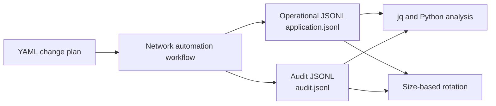

# Lab 7: Application Logging for Network Automation

## Lab Introduction

When network automation succeeds, the visible result may be only a changed configuration. When it fails, the operator must reconstruct which change was attempted, who initiated it, which devices were reached, where execution stopped, and whether any device was left in a partial state. Console `print()` statements rarely provide enough evidence because they lack stable structure, severity, correlation, retention, and security controls.

This lab treats logging as an application design feature. A simulated network-change workflow processes two routers and records operational events in JSON Lines format. A separate audit log records security- and change-relevant outcomes. Learners generate authentication, timeout, command, and verification failures; trace each run with a correlation ID; analyze events with `jq` and Python; verify secret redaction; and force file rotation. The simulation makes failure testing safe and repeatable without a Cisco sandbox.

## Learning Objectives

After completing this lab, you will be able to:

- Distinguish console output, operational logs, audit logs, metrics, and traces.
- Select appropriate DEBUG, INFO, WARNING, ERROR, and CRITICAL severity.
- Produce structured JSON logs with UTC timestamps.
- Correlate events belonging to one automation execution.
- Record actor, change ID, device, duration, outcome, and error type.
- Capture exceptions and stack traces for troubleshooting.
- Separate operational detail from audit evidence.
- Prevent passwords, tokens, and authorization values from entering logs.
- Rotate files to prevent unbounded disk consumption.
- Analyze events by severity, type, device, outcome, and correlation ID.
- Diagnose partial network-automation failures from event order.
- Define retention and centralization requirements for production logging.

## Estimated Time

Allow approximately **3 to 4 hours**.

## Prerequisites

- Ubuntu 26.04 workstation
- Python virtual environment from Lab 1
- Git and local GitLab
- `jq`

No Cisco sandbox is required. Device operations are simulated, while the event flow follows a realistic network-change application.

## Logging Architecture



Each JSONL line is an independent JSON object. This makes files append-friendly and compatible with log collectors while remaining readable with standard command-line tools.

## What Should Be Logged?

Useful logs answer operational questions without exposing sensitive data.

| Question | Suggested field |
|---|---|
| When did it occur? | UTC `timestamp` |
| How serious is it? | `level` |
| Which run? | `correlation_id` |
| Which approved change? | `change_id` |
| Who initiated it? | `actor` |
| Which target? | `device`, `management_ip` |
| What happened? | `event_type`, `message` |
| Did it succeed? | `outcome` |
| How long did it take? | `duration_ms` |
| Why did it fail? | `error_type`, exception trace |

Passwords, tokens, private keys, full authorization headers, session cookies, and unreviewed device payloads should not be logged. Even configuration commands may contain secrets and should be represented by a count, change ID, or protected hash unless policy explicitly allows their retention.

## Project Structure

```text
lab7-application-logging/
├── .gitignore
├── requirements.txt
├── app.py
├── analyze_logs.py
├── data/
│   └── change_plan.yaml
├── src/
│   └── logging_config.py
└── logs/
    ├── application.jsonl
    └── audit.jsonl
```

## Task 1: Create the Project

Create a blank GitLab project named `lab7-application-logging`, clone it, and copy the supplied files:

```bash
cd "$HOME/ccnpauto-workspace"
git clone \
  http://gitlab.lab.local:8088/ACTUAL_USERNAME/lab7-application-logging.git
cd lab7-application-logging

LAB7_FILES="/path/to/CCNPAUTO/LAB/Lab7"
cp "$LAB7_FILES/.gitignore" "$LAB7_FILES/requirements.txt" .
cp "$LAB7_FILES/app.py" "$LAB7_FILES/analyze_logs.py" .
cp -R "$LAB7_FILES/data" "$LAB7_FILES/src" .
```

Activate the environment and install dependencies:

```bash
source "$HOME/.venvs/ccnpauto/bin/activate"
python -m pip install -r requirements.txt
```

Commit the baseline before generating runtime logs:

```bash
git add .
git commit -m "Add structured logging lab"
git push -u origin main
```

## Task 2: Review the Change Plan

Open `data/change_plan.yaml`. It contains an approved change ID, two simulated routers, and three intended commands. The application validates the top-level contract before execution. This prevents malformed input from reaching the device workflow.

The management addresses use the documentation block `192.0.2.0/24`; no connection is attempted. The actor comes from `AUTOMATION_ACTOR` or the local user, while the correlation ID is generated for every run.

## Task 3: Run a Successful Workflow

Run the default scenario:

```bash
export AUTOMATION_ACTOR="learner@example.net"
python app.py --scenario success
echo $?
```

The exit code should be zero. Inspect the files:

```bash
ls -lh logs
head -n 2 logs/application.jsonl | jq
cat logs/audit.jsonl | jq
```

Operational logs contain connection and verification events. The audit log contains submitted and completed change outcomes but not raw credentials or command text.

## Task 4: Understand Severity

The standard levels convey increasing urgency:

- **DEBUG** contains detailed diagnostic state useful during development.
- **INFO** records normal lifecycle milestones.
- **WARNING** indicates an abnormal condition from which the application recovered.
- **ERROR** records a failed operation requiring attention.
- **CRITICAL** indicates that the application or service cannot continue safely.

Severity must describe operational impact rather than developer emotion. A successful device connection is INFO, while invalid credentials are ERROR. Logging every normal event as ERROR produces alert fatigue and hides genuine incidents.

Run with an ERROR threshold and compare output:

```bash
python app.py --scenario success --log-level ERROR
```

The operational logger suppresses lower-severity events, but the audit logger remains at INFO because audit retention is policy-driven rather than a troubleshooting verbosity switch.

## Task 5: Generate an Authentication Failure

```bash
python app.py --scenario auth || true
tail -n 6 logs/application.jsonl | jq
tail -n 4 logs/audit.jsonl | jq
```

The first router records `AuthenticationFailure`, while the workflow continues to the second router and ends as `partial_failure`. This event order tells an operator that no configuration was submitted to the first device but the second device completed.

Search only authentication failures:

```bash
jq 'select(.error_type == "AuthenticationFailure")' logs/application.jsonl
```

## Task 6: Generate Timeout and Command Failures

Run two more scenarios:

```bash
python app.py --scenario timeout || true
python app.py --scenario partial || true
```

Compare their failure points:

```bash
jq -r '
  select(.outcome == "failure") |
  [.timestamp, .correlation_id, .device, .error_type, .message] |
  @tsv
' logs/application.jsonl
```

A timeout occurs before configuration submission. The partial scenario connects successfully but fails during the configuration method on `branch-r2`. That distinction materially changes rollback and incident response.

## Task 7: Generate a Verification Failure

```bash
python app.py --scenario verify || true
```

The audit log shows that the change was submitted before verification failed. This is more serious than a pre-change authentication failure because actual state may differ from intent. A real application should collect evidence, stop dependent changes, and invoke an approved rollback or escalation policy.

## Task 8: Trace One Run by Correlation ID

List workflow completion events:

```bash
jq -r 'select(.event_type == "workflow_completed") |
  [.correlation_id, .outcome, .duration_ms] | @tsv' \
  logs/application.jsonl
```

Copy one correlation ID and reconstruct its timeline:

```bash
CORRELATION_ID="PASTE_ONE_ID"
jq --arg id "$CORRELATION_ID" \
  'select(.correlation_id == $id)' \
  logs/application.jsonl
```

Correlation IDs become especially valuable when concurrent workers interleave events from many devices and changes.

## Task 9: Use the Python Log Analyzer

```bash
python analyze_logs.py logs/application.jsonl
python analyze_logs.py logs/audit.jsonl
```

The analyzer validates every JSON line, counts levels, event types and outcomes, and reconstructs each correlation timeline. A malformed line causes a clear error rather than silently dropping evidence.

Extend the analyzer to report average device duration or failure counts by device. Commit the enhancement on a feature branch.

## Task 10: Verify Secret Redaction

The formatter redacts sensitive dictionary keys and common `password=value` or `token: value` text patterns. Test it without using a real secret:

```bash
python - <<'PY'
from src.logging_config import configure_logging

logger, _ = configure_logging()
logger.warning(
    "Test password=NOT-A-REAL-PASSWORD token:NOT-A-REAL-TOKEN",
    extra={"event_type": "redaction_test", "correlation_id": "test-only"},
)
PY

tail -n 1 logs/application.jsonl | jq
```

The values should appear as `***REDACTED***`. Redaction is defense in depth, not permission to pass secrets into log messages. Novel formats can bypass patterns, and exception text from third-party libraries may contain unexpected data.

## Task 11: Force and Observe Log Rotation

Production applications must prevent logs from consuming unlimited disk space. The supplied handler rotates after a configurable number of bytes and retains three backups.

Use an intentionally small threshold and produce several runs:

```bash
for run in $(seq 1 8); do
  python app.py --scenario partial --max-log-bytes 1500 || true
done
ls -lh logs
```

Expected files include `application.jsonl`, `application.jsonl.1`, and additional numbered backups. Rotation limits local storage, but retention policy must also address central copies, legal requirements, privacy, deletion, and incident holds.

## Task 12: Diagnose an Initialization Failure

Create a temporary invalid plan by copying the YAML and removing the `commands` key. Run it:

```bash
cp data/change_plan.yaml /tmp/invalid-change-plan.yaml
code /tmp/invalid-change-plan.yaml
set +e
python app.py --plan /tmp/invalid-change-plan.yaml
RETURN_CODE=$?
set -e
echo "$RETURN_CODE"
```

Initialization failures use exit code 2, while completed workflows containing device failures use exit code 1. Distinct exit codes help schedulers and CI/CD systems classify failures.

## Task 13: Design a Production Logging Strategy

Document answers for the following scenario: a controller manages 5,000 devices through parallel workers.

- Which events remain INFO, and which move to DEBUG?
- Which fields become searchable labels?
- How are logs shipped if the worker crashes?
- How long are operational and audit records retained?
- Who may read device addresses and change details?
- How are clocks synchronized?
- How are duplicate events handled during retry?
- How are correlation IDs propagated into API and device tasks?
- Which events create alerts rather than merely logs?

Avoid high-cardinality labels such as raw exception messages in a metrics system. Logs preserve detailed events; metrics summarize rates and distributions; traces represent causal work across components.

## Task 14: Commit and Clean Up

Confirm generated logs are ignored:

```bash
git status --short --ignored
git check-ignore -v logs/application.jsonl logs/audit.jsonl
```

Commit only source changes and learner documentation:

```bash
git add .
git diff --staged
git commit -m "Complete application logging lab"
git push
```

Remove local simulated logs when they are no longer required. Do not delete audit evidence from a real system outside its approved retention process.

## Troubleshooting

### The log file is empty

Confirm the working directory, selected severity, and whether the application reached `configure_logging()`. The relative `logs` directory is created beneath the directory from which the command runs.

### `jq` reports an invalid value

JSONL contains one object per line, not one enclosing array. Use `jq` directly against the file without array assumptions. The analyzer identifies the exact malformed line.

### A correlation ID appears in only one event

Check whether initialization failed before workflow construction or whether a logger call omitted the shared context. Centralized middleware or `LoggerAdapter` can enforce context in larger applications.

### Rotation makes an event difficult to find

Search the active file and backups. Production systems should ship events centrally before local retention expires.

## Key Takeaways

- Logs are operational evidence, not decorative console output.
- Structured events are easier to search, aggregate and validate than free-form text.
- UTC timestamps and correlation IDs reconstruct distributed workflow order.
- Operational and audit logs serve related but different purposes.
- Failure location determines whether device state may have changed.
- Exception traces accelerate troubleshooting but require redaction review.
- Secrets should never be intentionally logged; redaction is only a safety net.
- Rotation controls local disk use, while retention and centralization require policy.
- Logs, metrics and traces answer different observability questions.

The next lab uses Vault-backed Ansible and Terraform, where the logging principles established here can record declarative changes without exposing device credentials.

## Further Reading

- [Python logging documentation](https://docs.python.org/3/library/logging.html)
- [Python logging cookbook](https://docs.python.org/3/howto/logging-cookbook.html)
- [OWASP Logging Cheat Sheet](https://cheatsheetseries.owasp.org/cheatsheets/Logging_Cheat_Sheet.html)
- [OpenTelemetry logs](https://opentelemetry.io/docs/specs/otel/logs/)
