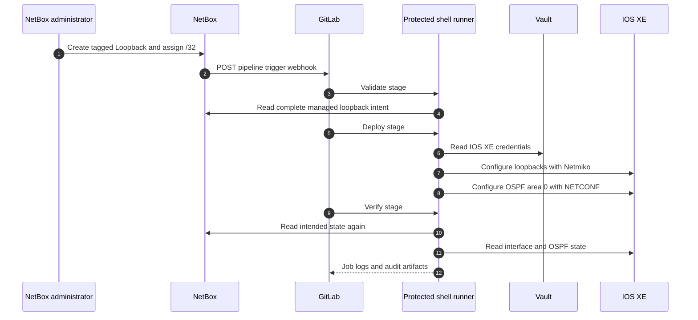

# Lab 7: Trigger Network Automation from NetBox with GitLab CI/CD

## Lab Introduction

Labs 4–6 introduced the components separately. NetBox stores loopback intent, Vault stores IOS XE credentials, Netmiko configures interfaces, and NETCONF configures OSPF. Lab 7 connects those components into one small CI/CD workflow.

An administrator creates a tagged virtual loopback in NetBox and assigns one IPv4 `/32`. A NetBox event rule sends a webhook to GitLab's pipeline-trigger endpoint. A protected shell runner validates the complete NetBox source of truth, configures all managed loopbacks, adds all of them to OSPF area 0, and verifies IOS XE against NetBox. Logs are retained as GitLab artifacts.

The pipeline reconciles the complete managed set rather than trusting fields in the webhook body. The webhook only means “intent may have changed”; NetBox remains authoritative.

## Learning Objectives

- Explain webhook-driven automation and source-of-truth reconciliation.
- Register a protected shell runner for local network deployment.
- Store pipeline secrets as protected and masked variables.
- Build validate, deploy, and verify stages.
- Serialize access to a shared sandbox with a resource group.
- Trigger a pipeline from a NetBox IP-address event.
- Reuse the Python modules built in Labs 2–6.
- Retain deployment evidence as artifacts.
- Diagnose webhook, runner, Vault, NetBox, SSH, and NETCONF failures.

## Prerequisites

- Labs 1–6 completed
- `network_automation_project` merged through Lab 6
- NetBox, Vault, GitLab, and GitLab Runner running on the workstation
- Active IOS XE reservable sandbox and VPN
- A NetBox API token and GitLab project-maintainer access
- A valid IOS XE secret at `secret/ccnpauto/iosxe`

## End-to-End Flow



## Task 1: Prepare the Existing Repository

```bash
cd ~/ccnpauto-workspace/network_automation_project
git switch main
git pull --ff-only
git switch -c feature/netbox-cicd
```

Copy the pipeline and verification script:

```bash
LAB7_FILES="/path/to/CCNPAUTO/LAB/Lab7"
cp "$LAB7_FILES/.gitlab-ci.yml" .
cp "$LAB7_FILES/requirements.txt" requirements.txt
cp "$LAB7_FILES/scripts/verify_network.py" scripts/
```

Run locally before involving CI:

```bash
python -m pip install -r requirements.txt
python -m scripts.validate_netbox
python -m scripts.verify_network
```

Verification should pass for the loopbacks configured in Labs 4 and 6.

## Task 2: Register a Dedicated Shell Runner

The Docker runner from Lab 1 is suitable for ordinary tests, but a local network-deployment job needs uncomplicated access to the workstation VPN, NetBox on loopback, and Vault on loopback. Create a second project runner in GitLab:

- Description: `network-deploy-runner`
- Tag: `network-deploy`
- Run untagged jobs: disabled
- Protected: enabled
- Locked to this project: enabled

Register it with the shell executor using the temporary `glrt-` token shown by GitLab:

```bash
sudo gitlab-runner register \
  --non-interactive \
  --url "http://gitlab.lab.local:8088" \
  --token "PASTE_GLRT_TOKEN" \
  --executor "shell"

sudo systemctl restart gitlab-runner
sudo gitlab-runner verify
```

The shell runner executes repository code directly on the workstation. Protecting the runner and main branch is therefore essential. Do not make this runner available to untrusted projects or merge requests.

## Task 3: Protect the Main Branch

In GitLab, open **Settings > Repository > Branch rules** and protect `main`:

- Maintainers may merge.
- Direct pushes are not allowed for ordinary developers.
- Force push is disabled.

The deployment job runs only when `CI_COMMIT_BRANCH` is `main`. Merge requests can be reviewed without changing the router.

## Task 4: Configure CI/CD Variables

In **Settings > CI/CD > Variables**, create these variables. Mark secrets as masked and protected.

| Variable | Example | Protection |
|---|---|---|
| `IOSXE_HOST` | Current reserved host | Protected |
| `IOSXE_SSH_PORT` | `22` | Protected |
| `IOSXE_NETCONF_PORT` | `830` | Protected |
| `IOSXE_HTTPS_PORT` | `443` | Protected |
| `SANDBOX_MODE` | `reserved` | Protected |
| `ALLOW_CONFIG_CHANGES` | `true` | Protected |
| `VERIFY_TLS` | `false` | Protected |
| `NETBOX_URL` | `http://127.0.0.1:8000` | Protected |
| `NETBOX_TOKEN` | NetBox token | Masked and protected |
| `NETBOX_DEVICE` | `iosxe-sandbox` | Protected |
| `NETBOX_TAG` | `automation-managed` | Protected |
| `VAULT_ADDR` | `http://127.0.0.1:8200` | Protected |
| `VAULT_TOKEN` | `lab-root-token` | Masked and protected |
| `VAULT_MOUNT` | `secret` | Protected |
| `VAULT_IOSXE_PATH` | `ccnpauto/iosxe` | Protected |
| `OSPF_PROCESS_ID` | `1` | Protected |
| `OSPF_AREA` | `0` | Protected |

The Vault token authenticates the pipeline to Vault; the IOS XE username and password remain inside Vault. The root development token is accepted only in this single-user lab. Production CI should obtain a short-lived token through OIDC/JWT or AppRole with a read-only secret policy.

## Task 5: Review the Pipeline

The pipeline has three stages:

1. `validate-netbox` rejects incomplete or inconsistent intent without touching IOS XE.
2. `deploy-loopback-and-ospf` configures interfaces first and OSPF second.
3. `verify-network` compares NetBox with CLI interface state and NETCONF OSPF configuration.

The deployment job uses:

```yaml
resource_group: iosxe-sandbox
```

This prevents two deployment jobs using the same resource group from running concurrently. Each command writes its output through `tee` to an artifact file. Because `set -o pipefail` is enabled, `tee` does not hide a failed Python exit status.

## Task 6: Commit and Test a Manual Pipeline

```bash
git add .gitlab-ci.yml requirements.txt scripts/verify_network.py
git commit -m "Add NetBox-driven deployment pipeline"
git push -u origin feature/netbox-cicd
```

Create a merge request. Review the YAML and confirm no secret values are present. Merge into `main`. The push to main may start a pipeline depending on project settings. Ensure the sandbox reservation, VPN, NetBox, and Vault are active before allowing deployment.

Inspect all three jobs and download the artifact logs. A passing pipeline proves the cumulative project works before webhook automation is introduced.

## Task 7: Create a GitLab Pipeline Trigger Token

In GitLab, open **Settings > CI/CD > Pipeline trigger tokens**. Create a trigger named `netbox-loopback-trigger` and copy the token once.

Record the numeric project ID from the project overview page. Build the URL locally without committing it:

```text
http://gitlab.lab.local:8088/api/v4/projects/PROJECT_ID/trigger/pipeline?token=TRIGGER_TOKEN&ref=main
```

The trigger token can start a pipeline and must be protected. Do not place it in Git, screenshots, or ordinary logs.

## Task 8: Create the NetBox Webhook

In NetBox, create a webhook named `Trigger network_automation_project`:

- Method: POST
- URL: the GitLab trigger URL
- HTTP content type: `application/json`
- SSL verification: not applicable to the local HTTP training endpoint
- Additional headers: none

The NetBox worker container must resolve `gitlab.lab.local` to the Docker host. The updated Lab 1 NetBox Compose override provides that mapping. Test from the worker if required:

```bash
cd ~/lab-services/netbox-docker
docker compose exec netbox-worker getent hosts gitlab.lab.local
```

## Task 9: Create the NetBox Event Rule

Create an event rule with:

- Name: `Loopback IP change triggers GitLab`
- Object type: IPAM > IP address
- Events: object created and object updated
- Action: the GitLab webhook

The event fires when the administrator assigns or changes the loopback `/32`, after the interface itself exists. The pipeline ignores webhook payload fields and retrieves the complete current state from NetBox.

In a shared production NetBox, add conditions or a custom event-processing service so unrelated IP changes do not start this project. The training NetBox is dedicated to the learner, so the simple rule is acceptable.

## Task 10: Trigger the End-to-End Workflow

In NetBox:

1. Create `Loopback103` on `iosxe-sandbox`.
2. Set type to Virtual and enabled to Yes.
3. Add description `NETBOX_CICD_LAB7`.
4. Add tag `automation-managed`.
5. Create `192.0.2.103/32` and assign it to `Loopback103`.

The IP-address event should trigger the pipeline. Watch **Build > Pipelines**. Do not manually start another deployment while it is running.

After completion, verify:

```text
show ip interface brief | include Loopback103
show running-config | section router ospf
show ip ospf interface brief
```

The interface should exist with `192.0.2.103`, and OSPF process 1 should include host network `192.0.2.103 0.0.0.0 area 0`.

## Task 11: Observe a Validation Failure

Create a virtual interface tagged `automation-managed` but do not assign an address. Manually run the pipeline or cause an IP-related event elsewhere in the training NetBox. The validation stage should fail, and deployment must not start.

Correct the NetBox record by assigning one `/32`. The next pipeline should pass. This demonstrates why validation is a separate gate rather than part of a partially completed device change.

## Task 12: Audit and Troubleshoot

Use four evidence sources:

- NetBox change log and event-rule delivery status
- GitLab pipeline, job, and artifact history
- Vault audit information where enabled
- IOS XE configuration and operational state

| Failure | First check |
|---|---|
| No pipeline appears | NetBox event rule and webhook delivery result |
| Webhook cannot resolve GitLab | `getent hosts` in `netbox-worker` |
| Job remains pending | Protected shell runner, tag, and branch eligibility |
| NetBox validation fails | Tagged interface type, name, and assigned `/32` |
| Vault authentication fails | Vault process, `VAULT_ADDR`, token, and secret path |
| Netmiko times out | VPN, reservation hostname, and SSH port |
| NETCONF RPC fails | YANG Suite model revision and rendered XML |
| Verification fails | Compare NetBox intent with CLI and NETCONF output |

## Safety and Cleanup

When the reservation ends, disable the NetBox event rule or pause the deploy runner so later NetBox edits cannot target an expired sandbox. Set the GitLab variable `ALLOW_CONFIG_CHANGES=false`, revoke the pipeline trigger token if the lab is complete, and stop development Vault.

Do not delete NetBox records merely because the disposable sandbox resets. NetBox represents intended lab state and can be reused with the next reservation after credentials and host variables are updated.

## Key Takeaways

- Labs 2–7 form one evolving `network_automation_project`.
- NetBox events trigger reconciliation but do not supply trusted configuration directly.
- Validation must complete before device changes begin.
- Vault separates device credentials from GitLab repository content.
- Netmiko creates loopbacks before NETCONF adds their addresses to OSPF area 0.
- Protected branches, protected runners, resource groups, and artifacts make deployment safer and auditable.
- CI success means little without independent verification against intended and observed state.

## References

- [GitLab pipeline triggers](https://docs.gitlab.com/ci/triggers/)
- [GitLab protected runners](https://docs.gitlab.com/ci/runners/configure_runners/)
- [GitLab resource groups](https://docs.gitlab.com/ci/resource_groups/)
- [NetBox webhooks](https://netboxlabs.com/docs/netbox/integrations/webhooks/)
- [NetBox event rules](https://netboxlabs.com/docs/netbox/features/event-rules/)

