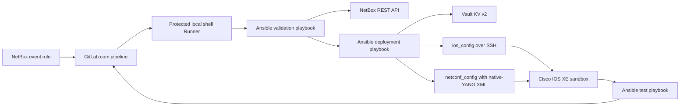
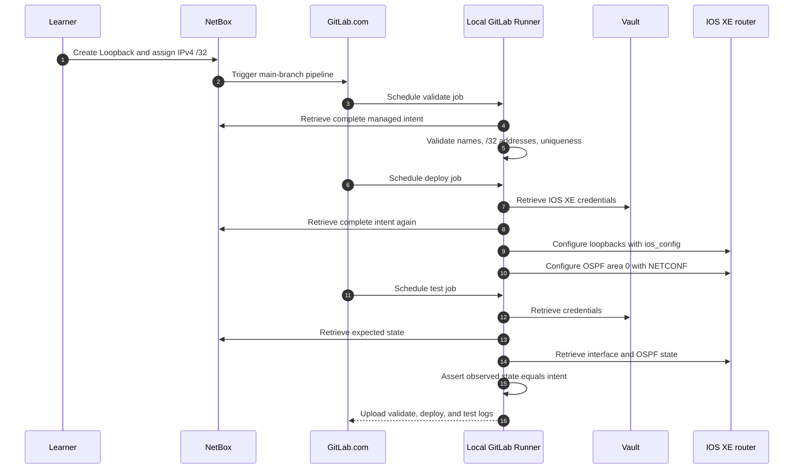
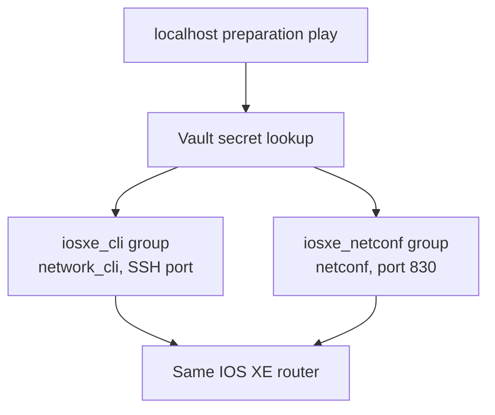

# Lab 8: Migrate the Network Automation Project to Ansible

## Lab Introduction

Labs 3–7 developed a complete Python-based automation workflow. NetBox holds the intended loopback interfaces, Vault protects IOS XE credentials, and a NetBox event triggers the GitLab CI/CD pipeline. Lab 8 keeps exactly that operating model while replacing the Python orchestration jobs with Ansible playbooks and supported network collections.

This is a migration rather than a new project. Learners continue using the GitLab.com repository named `network_automation_project`, the existing NetBox objects, the same Vault path, the protected local Runner, the NetBox webhook, and the reserved IOS XE sandbox. After the migration, a learner creates one or more loopbacks and IPv4 addresses in NetBox. NetBox triggers GitLab.com, the local Runner executes Ansible, Ansible retrieves the current network intent from NetBox and credentials from Vault, the router is configured, tests compare observed state with NetBox, and GitLab stores the job logs as artifacts.

The migration demonstrates an important engineering tradeoff. Python offers precise control and is often the better choice for specialized application logic. Ansible provides a declarative task model, mature network modules, standardized inventories, secret lookups, check and diff capabilities, and readable execution reports. Neither tool automatically makes automation safe. The source of truth, validation rules, credential boundary, change guard, idempotence, serialization, and post-change verification must still be designed deliberately.

## Learning Objectives

After completing this lab, learners will be able to:

- Map an existing Python automation workflow to Ansible plays, tasks, modules, variables, templates, and collections.
- Retrieve loopback intent from the NetBox REST API with `ansible.builtin.uri`.
- Validate interface names, IPv4 `/32` assignments, and uniqueness before deployment.
- Retrieve IOS XE credentials from Vault KV version 2 without writing secrets to inventory or logs.
- Build temporary in-memory inventory hosts for CLI and NETCONF connections.
- Configure loopback interfaces with `cisco.ios.ios_config`.
- Render Cisco IOS XE native-YANG XML and send it with `ansible.netcommon.netconf_config`.
- Test observed interface and OSPF state against NetBox with `cisco.ios.ios_command` and assertions.
- Replace the Python jobs in the existing GitLab pipeline with Ansible playbooks.
- Preserve the existing NetBox-triggered reconciliation workflow and audit artifacts.

## Estimated Time

Allow approximately **3 to 4 hours**. The lab assumes the cumulative project from Labs 3–7 is already working.

## Prerequisites

- Labs 1–7 completed and merged into `main`
- Existing clone at `~/ccnpauto-workspace/network_automation_project`
- GitLab.com project-maintainer access
- Protected `network-deploy` shell Runner online
- NetBox and Vault running on the workstation
- Existing NetBox device `iosxe-sandbox` with tagged virtual loopbacks and one IPv4 `/32` per loopback
- Existing Vault secret at `secret/ccnpauto/iosxe`
- Active IOS XE reservable sandbox and VPN connection
- NETCONF enabled on the reserved router
- GitLab CI/CD variables created in Lab 7

## Event-Driven Lab Flow





The webhook is only a notification that intent changed. It does not pass trusted configuration directly to the router. Every stage retrieves the complete current managed set from NetBox, which remains the authoritative source of truth.

The functional responsibilities remain the same, but their implementations change:

| Responsibility | Labs 3–7 implementation | Lab 8 implementation |
|---|---|---|
| Read NetBox | `pynetbox` class | `ansible.builtin.uri` tasks |
| Validate intent | Python functions and exceptions | `assert`, filters, and normalized facts |
| Read Vault | `hvac` provider | `community.hashi_vault.vault_kv2_get` lookup |
| Runtime inventory | Python settings object | `add_host` with in-memory groups |
| Configure loopbacks | Netmiko and Jinja2 CLI | `cisco.ios.ios_config` |
| Configure OSPF | `ncclient` and XML template | `ansible.netcommon.netconf_config` and the same YANG hierarchy |
| Test state | Python comparison script | `ios_command` plus Ansible assertions |
| Pipeline entry points | `python -m scripts...` | `ansible-playbook playbooks/...` |

## Supplied Project Additions

```text
network_automation_project/
├── .gitlab-ci.yml
├── ansible.cfg
├── requirements.txt
├── collections/
│   └── requirements.yml
├── inventory/
│   └── hosts.yml
├── playbooks/
│   ├── validate.yml
│   ├── deploy.yml
│   └── test.yml
├── tasks/
│   ├── load_intent.yml
│   └── load_runtime.yml
└── templates/
    └── ospf_native.xml.j2
```

The inventory initially contains only `localhost`. The deployment playbook creates temporary `iosxe_cli` and `iosxe_netconf` hosts after it has safely retrieved the credentials. Consequently, the repository never contains a device password.

## Task 1: Create the Migration Branch

Update the same cumulative repository and create a feature branch:

```bash
cd ~/ccnpauto-workspace/network_automation_project
git switch main
git pull --ff-only
git switch -c feature/ansible-migration
```

Do not create another GitLab project. Keeping the migration in one repository preserves the complete evolution from YAML and Python through NetBox, Vault, NETCONF, CI/CD, and Ansible.

Copy the Lab 8 files:

```bash
LAB8_FILES="/path/to/CCNPAUTO/LAB/Lab8"

cp "$LAB8_FILES/ansible.cfg" .
cp "$LAB8_FILES/requirements.txt" requirements.txt
cp "$LAB8_FILES/.gitlab-ci.yml" .gitlab-ci.yml
mkdir -p collections inventory playbooks tasks templates
cp "$LAB8_FILES/collections/requirements.yml" collections/
cp "$LAB8_FILES/inventory/hosts.yml" inventory/
cp "$LAB8_FILES/playbooks/"*.yml playbooks/
cp "$LAB8_FILES/tasks/"*.yml tasks/
cp "$LAB8_FILES/templates/ospf_native.xml.j2" templates/
```

Do not delete `src/`, `scripts/`, or their tests. They document the working Python implementation and allow a meaningful comparison during review. The new `.gitlab-ci.yml` determines which implementation is active in CI/CD.

## Task 2: Install the Ansible Runtime and Collections

Activate the course virtual environment and install the Python packages:

```bash
source ~/.venvs/ccnpauto/bin/activate
cd ~/ccnpauto-workspace/network_automation_project
python -m pip install -r requirements.txt
ansible-galaxy collection install -r collections/requirements.yml
ansible --version
ansible-galaxy collection list | grep -E 'cisco.ios|ansible.netcommon|community.hashi_vault|ansible.utils'
```

Python still exists beneath Ansible because modules and connection plugins execute Python code. However, learners now express the workflow through YAML task declarations and reusable collection content rather than maintaining the orchestration classes themselves.

The versions are bounded intentionally. A lower bound ensures the required modules and behavior are present, while the upper bound prevents an unreviewed major release from changing the lab unexpectedly. In a production repository, a tested execution environment or lock process should make dependency resolution even more repeatable.

Run static syntax checks before contacting any service:

```bash
ansible-inventory --graph
ansible-playbook --syntax-check playbooks/validate.yml
ansible-playbook --syntax-check playbooks/deploy.yml
ansible-playbook --syntax-check playbooks/test.yml
```

The inventory graph should show `localhost` and empty runtime groups. Those groups contain no router hostname or credential until `add_host` executes inside a playbook.

## Task 3: Export the Existing Nonsecret Settings

Ansible controller lookups read environment variables from the process that launches `ansible-playbook`. Export the same values used by the cumulative project. Substitute the current reserved hostname and ports:

```bash
export NETBOX_URL="http://127.0.0.1:8000"
export NETBOX_TOKEN="<existing-netbox-token>"
export NETBOX_DEVICE="iosxe-sandbox"
export NETBOX_TAG="automation-managed"

export VAULT_ADDR="http://127.0.0.1:8200"
export VAULT_TOKEN="lab-root-token"
export VAULT_MOUNT="secret"
export VAULT_IOSXE_PATH="ccnpauto/iosxe"

export IOSXE_HOST="<reserved-router-hostname>"
export IOSXE_SSH_PORT="22"
export IOSXE_NETCONF_PORT="830"
export SANDBOX_MODE="reserved"
export ALLOW_CONFIG_CHANGES="false"
export OSPF_PROCESS_ID="1"
export OSPF_AREA="0"
```

`NETBOX_TOKEN` and `VAULT_TOKEN` are secrets even though they are exported for the training session. Do not place them in `ansible.cfg`, inventory, playbooks, shell screenshots, or Git. Lab 7 already stores the CI copies as protected and masked GitLab variables.

Confirm that the supporting services are reachable without printing tokens:

```bash
curl -I http://127.0.0.1:8000
VAULT_ADDR=http://127.0.0.1:8200 vault status
nc -vz "$IOSXE_HOST" "$IOSXE_SSH_PORT"
nc -vz "$IOSXE_HOST" "$IOSXE_NETCONF_PORT"
```

With host-key checking enabled, trust the reserved host only after comparing its fingerprint with the sandbox information or instructor-approved value:

```bash
mkdir -p ~/.ssh
chmod 700 ~/.ssh
ssh-keyscan -p "$IOSXE_SSH_PORT" "$IOSXE_HOST" >> ~/.ssh/known_hosts
ssh-keyscan -p "$IOSXE_NETCONF_PORT" "$IOSXE_HOST" >> ~/.ssh/known_hosts
chmod 600 ~/.ssh/known_hosts
```

Never use `host_key_checking=False` merely to hide an unknown-key error. A changed key might be expected when a sandbox reservation changes, but it should still be investigated before the obsolete entry is removed.

## Task 4: Understand and Run NetBox Validation

The validation playbook includes `tasks/load_intent.yml`. It first queries virtual interfaces belonging to `iosxe-sandbox` and tagged `automation-managed`. For every returned interface, it performs a second API request for assigned IP addresses. The tasks then enforce the project contract:

- At least one managed interface must exist.
- Each name must match `Loopback<number>`.
- Each interface must have exactly one valid IPv4 `/32`.
- Interface names must be unique.
- IPv4 addresses must be unique.

Only after validation does Ansible create the normalized `managed_loopbacks` fact. Run the read-only playbook:

```bash
ansible-playbook playbooks/validate.yml
```

A successful recap should report `failed=0` and display the number and names of validated loopbacks. API tasks use `no_log: true` because their request headers contain the NetBox token. This makes troubleshooting slightly less convenient, but preventing credentials from entering terminal and CI logs is the correct default.

To observe a safe validation failure, create a tagged virtual interface in NetBox without assigning an address. Run the validation playbook again. The play must fail before any IOS XE connection occurs. Assign one unused IPv4 `/32`, rerun the playbook, and confirm that validation passes.

## Task 5: Understand Vault Retrieval and In-Memory Inventory

`tasks/load_runtime.yml` retrieves the `username` and `password` fields from Vault KV version 2 through the `community.hashi_vault.vault_kv2_get` lookup. Both the lookup and the following `add_host` tasks use `no_log: true`. Credentials therefore exist in Ansible controller memory for the duration of the run but are not written to the static inventory.

The deployment playbook creates two logical hosts that point to the same router:



The separate hosts matter because an Ansible host normally has one active connection plugin. CLI modules require `ansible.netcommon.network_cli`, whereas modeled NETCONF operations require `ansible.netcommon.netconf`. Creating both hosts dynamically avoids duplicating secrets in files and makes the transport boundary visible.

The runtime task also enforces three safeguards before configuration:

1. `IOSXE_HOST` must not be empty.
2. `SANDBOX_MODE` must equal `reserved`.
3. Deployment requires `ALLOW_CONFIG_CHANGES=true`.

The test play does not require change approval because it is read-only, although it still requires the explicit reserved-sandbox context.

## Task 6: Preview the OSPF Native-YANG Template

The Ansible template preserves the model hierarchy verified with YANG Suite in Lab 6. Jinja2 creates one `<network>` element for every normalized NetBox loopback. Each `/32` uses wildcard `0.0.0.0` and area 0.

Inspect the template:

```bash
sed -n '1,220p' templates/ospf_native.xml.j2
```

The template must match the modules and revisions advertised by the current IOS XE reservation. Reopen YANG Suite if the sandbox image changed, retrieve the `Cisco-IOS-XE-native` and `Cisco-IOS-XE-ospf` schemas, and compare the tree with the XML hierarchy. A syntactically valid XML document can still be invalid according to the device's YANG schema.

Ansible's `netconf_config` module sends the rendered `<config>` content to the running datastore with merge behavior. Existing unrelated OSPF configuration is not intentionally replaced. Nevertheless, learners must review the rendered structure and use only the reserved sandbox because a model operation can affect configuration beyond the intended leaf when its hierarchy or default operation is misunderstood.

## Task 7: Deploy Loopbacks and OSPF with Ansible

Enable the deliberate write guard only after validation, reservation, VPN, Vault, and host-key checks have passed:

```bash
export ALLOW_CONFIG_CHANGES="true"
ansible-playbook playbooks/deploy.yml --diff
```

The playbook performs three plays in strict order:

1. The localhost play validates NetBox, reads Vault, and creates runtime hosts.
2. The CLI play uses `cisco.ios.ios_config` to reconcile each interface description, `/32` address, and administrative state.
3. The NETCONF play renders the native-YANG XML and merges every loopback into OSPF process 1, area 0.

`ios_config` compares the requested lines with the relevant running configuration. On the first run it should report changes. Run the same command a second time:

```bash
ansible-playbook playbooks/deploy.yml --diff
```

The CLI tasks should now report `changed=0` when IOS XE represents the lines in the expected form. The NETCONF module may report a change whenever an edit RPC is sent, depending on device and module behavior. Therefore, a changed count is not by itself proof that operational state differs. Idempotence must be evaluated using both module reporting and retrieved device state.

Return the local guard to its safe value when deployment is complete:

```bash
export ALLOW_CONFIG_CHANGES="false"
```

## Task 8: Run the Ansible Tests Locally

Run the independent read-only test playbook:

```bash
ansible-playbook playbooks/test.yml
```

The play retrieves `show ip interface brief` and the OSPF section of the running configuration. For each NetBox record, separate assertions test the interface name, interface address, and OSPF network statement. A successful deploy job followed by a failed test job remains a failed pipeline.

Compare Ansible's result with direct read-only CLI commands:

```text
show ip interface brief
show running-config | section router ospf
show ip ospf interface brief
```

The assertion checks configuration and basic interface presence. The operational command adds context: a loopback can be advertised by OSPF without forming a neighbor, so the absence of a loopback adjacency is not a failure.

## Task 9: Review the Ansible GitLab Pipeline

The replacement `.gitlab-ci.yml` keeps the three-stage design from Lab 7:

| Stage | Ansible command | Purpose |
|---|---|---|
| Validate | `ansible-playbook playbooks/validate.yml` | Reject bad NetBox intent before device access |
| Deploy | `ansible-playbook playbooks/deploy.yml` | Configure interfaces, then OSPF |
| Test | `ansible-playbook playbooks/test.yml` | Test IOS XE interface and OSPF state against NetBox intent |

The pipeline continues to use:

- The protected `network-deploy` Runner tag.
- `resource_group: iosxe-sandbox` to serialize deployments.
- A workflow rule that creates pipelines only for the protected default branch.
- Existing protected and masked CI/CD variables.
- Artifact logs retained for 14 days.
- `set -o pipefail` so `tee` cannot conceal an Ansible failure.

Each job creates an isolated virtual environment and installs the declared Ansible collections. This is slower than reusing arbitrary workstation packages, but it makes pipeline dependencies explicit. A later production improvement would package the tested Python packages and collections into a signed Ansible execution-environment image.

The shell Runner executes as the `gitlab-runner` operating-system account, which has a different home directory from the learner. After verifying the router fingerprints, install the approved keys for that account as well:

```bash
ssh-keyscan -p "$IOSXE_SSH_PORT" "$IOSXE_HOST" > /tmp/iosxe-known-hosts
ssh-keyscan -p "$IOSXE_NETCONF_PORT" "$IOSXE_HOST" >> /tmp/iosxe-known-hosts
ssh-keygen -lf /tmp/iosxe-known-hosts

sudo install -d -m 700 -o gitlab-runner -g gitlab-runner \
  /home/gitlab-runner/.ssh
sudo install -m 600 -o gitlab-runner -g gitlab-runner \
  /tmp/iosxe-known-hosts /home/gitlab-runner/.ssh/known_hosts
rm /tmp/iosxe-known-hosts
```

Do not automate acceptance of an unverified key inside `.gitlab-ci.yml`. When a new reservation legitimately changes the endpoint or key, repeat this controlled trust step.

Before pushing, inspect the exact changes:

```bash
git status --short
git diff -- .gitlab-ci.yml ansible.cfg requirements.txt \
  collections inventory playbooks tasks templates/ospf_native.xml.j2
```

Confirm that the diff contains no NetBox token, Vault token, IOS XE credential, private SSH key, or real password.

## Task 10: Commit and Activate the Ansible Pipeline

Commit the migration:

```bash
git add .gitlab-ci.yml ansible.cfg requirements.txt \
  collections inventory playbooks tasks templates/ospf_native.xml.j2
git commit -m "Migrate network automation workflow to Ansible"
git push -u origin feature/ansible-migration
```

Create a merge request on GitLab.com. Review the playbooks, native-YANG template, collection versions, pipeline rules, and protected variables. The feature branch intentionally creates no pipeline because the protected secrets and deployment Runner are reserved for the protected default branch. Merge into `main` only while the reserved sandbox, VPN, NetBox, Vault, and Runner are ready. The resulting main-branch pipeline should run the Ansible jobs.

The first main-branch pipeline reconciles the loopbacks already held in NetBox. Confirm that all three jobs pass and that their logs contain Ansible play recaps rather than Python entry-point commands. This proves the migration before new intent is introduced.

## Task 11: Add a New Loopback and Trigger Ansible Automatically

The NetBox webhook from Lab 7 remains unchanged because it triggers the GitLab pipeline rather than calling a particular implementation. Add a complete new intent record through NetBox:

1. Open **Devices > Devices > iosxe-sandbox**.
2. Select the **Interfaces** tab.
3. Select **Add Interfaces**.
4. Enter an unused interface name such as `Loopback104`.
5. Select **Virtual** as the interface type.
6. Enable the interface.
7. Enter a useful description such as `ANSIBLE_CICD_LAB8`.
8. Assign the `automation-managed` tag.
9. Select **Create**.
10. Open **IPAM > IP Addresses** and select **Add**.
11. Enter an unused address such as `192.0.2.104/32`.
12. Set the assigned object type to **DCIM > Interface**.
13. Select device `iosxe-sandbox` and interface `Loopback104`.
14. Select **Create**.

The IP-address creation event should cause NetBox to call the existing GitLab pipeline-trigger URL. Open **Build > Pipelines** in `network_automation_project` and observe the complete sequence:

1. `validate-netbox-with-ansible` retrieves all tagged loopbacks and validates the complete intended set.
2. `deploy-with-ansible` retrieves the IOS XE username and password from Vault, reads the current intent from NetBox again, creates the loopback through `ios_config`, and adds its `/32` to OSPF area 0 through NETCONF.
3. `test-with-ansible` retrieves credentials and intent again, collects IOS XE interface and OSPF state, and fails if any intended loopback is missing.
4. Each job uploads its log under **Job artifacts**, even when the job fails.

Do not manually start another pipeline while the event-driven pipeline is running. The `resource_group` serializes deploy jobs, but avoiding unnecessary concurrent runs makes the outcome easier to interpret.

After the pipeline passes, verify operational state:

```text
show ip interface brief | include Loopback104
show running-config | section router ospf
show ip ospf interface brief
```

The output should contain `Loopback104`, `192.0.2.104`, and an OSPF host network statement for `192.0.2.104` in area 0. Download `ansible-validate.log`, `ansible-deploy.log`, and `ansible-test.log`; confirm that they contain useful task evidence but no credentials or tokens.

## Task 12: Add Multiple Loopbacks

Repeat the same NetBox workflow for additional interfaces such as `Loopback105` and `Loopback106`, using unique IPv4 `/32` addresses. Complete one interface and its address before beginning the next, then allow its pipeline to finish. This sequence matters because the source-of-truth validator correctly rejects a tagged interface that has not yet received its required `/32`.

Every NetBox address event starts a pipeline, and every pipeline retrieves the complete managed set. The second pipeline therefore reconciles both new loopbacks, while the third reconciles all three. Existing configuration should remain unchanged because the Ansible tasks are designed to be repeatable.

For a larger production batch, an approval or change-set mechanism would be preferable to launching one pipeline per object. In this lab, sequential changes keep the event behavior visible and ensure that each NetBox object is complete before automation consumes it.

Inspect the artifact from the final pipeline. Its validation, deployment, and test summaries should report the complete number of NetBox-managed loopbacks rather than only the last interface that caused the event.

## Task 13: Compare the Python and Ansible Implementations

Review the old Python entry points without running them from CI. The comparison should focus on design rather than line count.

Python remains attractive when validation requires complex algorithms, application-specific state machines, asynchronous API coordination, or a long-lived service. It also gives developers direct control over exception types, retries, data models, and tests. However, that control creates more code that the project team must design and maintain.

Ansible is effective here because the workflow is a recognizable sequence of API reads, assertions, configuration modules, templates, and verification tasks. Collection modules hide much of the transport plumbing, while play recaps and task names provide an accessible operational record. On the other hand, deeply nested Jinja expressions and large fact transformations can become harder to test than ordinary Python. A mature system may combine both approaches by using Ansible for orchestration and small, tested Python filters or modules for genuinely complex logic.

## Troubleshooting

| Symptom | Likely cause | First action |
|---|---|---|
| Collection or module not found | Collections were not installed in the active environment | Run `ansible-galaxy collection install -r collections/requirements.yml` |
| NetBox task fails but details are hidden | `no_log` protects the token | Test NetBox health, token permissions, device name, and tag without printing the token |
| No managed interfaces returned | Wrong NetBox device/tag or objects are not Virtual | Review the NetBox interface records from Lab 4 |
| Validation reports address failure | Missing, duplicate, non-IPv4, or non-`/32` assignment | Correct the authoritative NetBox record |
| Vault lookup fails | Vault stopped, token invalid, or KV mount/path incorrect | Run `vault status` and verify secret metadata |
| Host-key verification fails | New reservation presents a different key | Verify the new fingerprint before updating `known_hosts` |
| CLI connection times out | VPN, hostname, SSH port, or reservation expired | Test with `nc` and inspect the sandbox details |
| NETCONF fails while CLI works | Port 830 unavailable, NETCONF disabled, or wrong connection plugin | Test port 830 and confirm `netconf-yang` |
| `rpc-error` mentions an unknown element | Template differs from the advertised IOS XE YANG revision | Rebuild and test the payload in YANG Suite |
| Pipeline job remains pending | Runner offline or `network-deploy` tag/protection mismatch | Review the project Runner and protected branch eligibility |
| Pipeline reaches NetBox but not IOS XE | Runner lacks VPN route | Test reachability as the `gitlab-runner` service account |
| Deploy job passes but test fails | Requested and observed state differ | Treat the pipeline as failed and compare NetBox, CLI, and OSPF output |

## Safety and Cleanup

Disable write access after the exercise by setting the GitLab variable `ALLOW_CONFIG_CHANGES` to `false`. Disable the NetBox event rule or pause the deployment Runner when the sandbox reservation ends. Otherwise, a later NetBox edit can trigger a pipeline against an expired or reassigned endpoint.

Do not delete the Python implementation merely because Ansible now drives the project. Retain it until the migration has passed functional testing and the team has agreed on its archival policy. In production, migration rollback should be deliberate: two active automation engines must never compete to manage the same device state.

Vault development mode remains training-only. Stop it when the lab is complete, remembering that its in-memory secrets disappear. Revoke the GitLab pipeline trigger token when it is no longer needed, and never store downloaded artifact logs in a public location.

## Key Takeaways

- Lab 8 preserves the architecture and replaces only the orchestration implementation.
- NetBox remains authoritative; Ansible retrieves and validates the complete intended state on every run.
- Vault credentials are loaded into memory and never stored in static inventory.
- Separate runtime hosts allow CLI and NETCONF connection plugins to address the same router cleanly.
- `ios_config` manages loopback CLI configuration, while `netconf_config` sends the YANG-modeled OSPF payload.
- Validation, a deliberate change guard, serialized deployment, and independent testing remain essential after changing tools.
- GitLab.com, the protected local Runner, webhook, CI variables, and artifacts continue to operate as before.
- Python and Ansible are complementary tools; the best choice depends on workflow complexity, team skills, testing needs, and long-term maintainability.

The cumulative project now demonstrates two complete implementation styles and shows how an automation platform can evolve without replacing its source of truth, secret store, transport models, or delivery controls.

Lab 9 keeps the Ansible event flow and adds timeout handling, rate-limit awareness, bounded retries, and exponential backoff to API access.

## References

- [Ansible network getting started](https://docs.ansible.com/ansible/latest/network/getting_started/index.html)
- [Cisco IOS collection](https://docs.ansible.com/ansible/latest/collections/cisco/ios/)
- [Cisco IOS `ios_config` module](https://docs.ansible.com/ansible/latest/collections/cisco/ios/ios_config_module.html)
- [Ansible NETCONF guide](https://docs.ansible.com/ansible/latest/network/user_guide/platform_netconf_enabled.html)
- [Ansible `netconf_config` module](https://docs.ansible.com/ansible/latest/collections/ansible/netcommon/netconf_config_module.html)
- [Community HashiCorp Vault collection](https://docs.ansible.com/ansible/latest/collections/community/hashi_vault/)
- [Ansible `uri` module](https://docs.ansible.com/ansible/latest/collections/ansible/builtin/uri_module.html)
- [NetBox REST API](https://netboxlabs.com/docs/netbox/integrations/rest-api/)
- [Cisco YANG Suite](https://developer.cisco.com/docs/yangsuite/)
- [GitLab CI/CD pipelines](https://docs.gitlab.com/ci/pipelines/)
