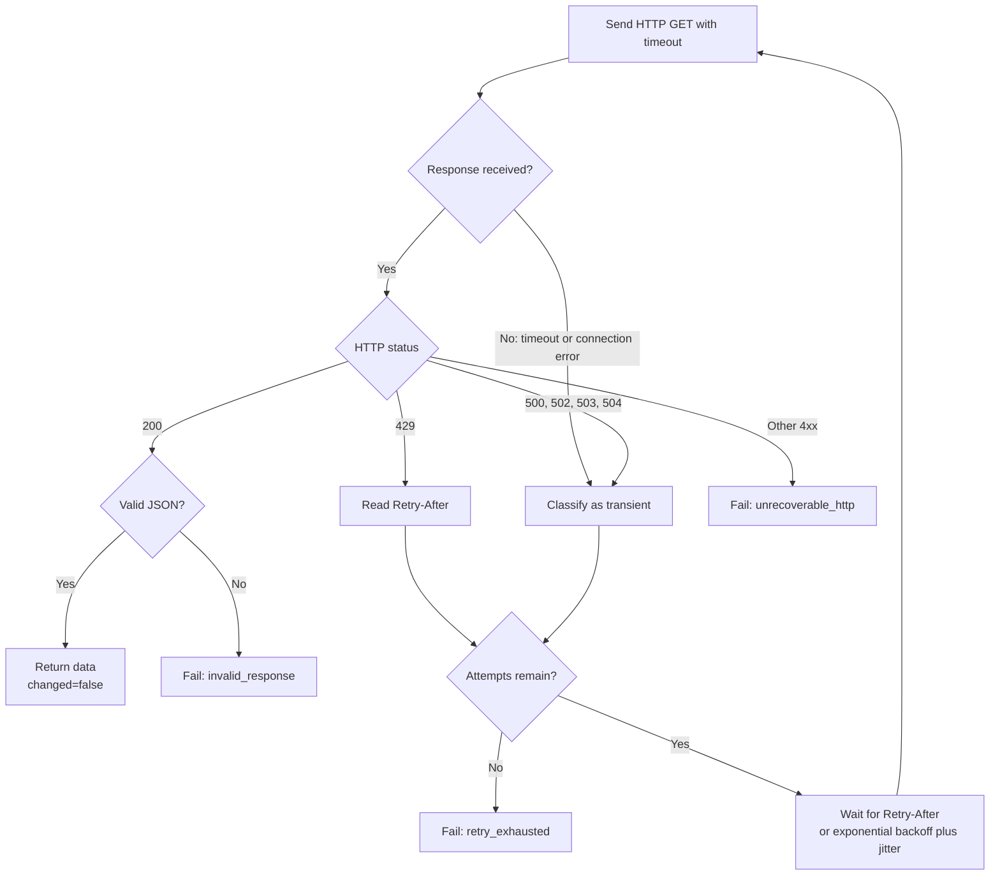
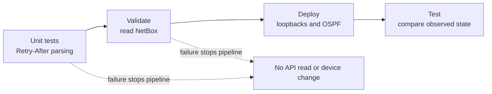

# Lab 9: Make API Communication Resilient

## Lab Introduction

Lab 8 moved the network automation project to Ansible, but its API calls still
assume that NetBox responds successfully on the first attempt. That assumption
is reasonable in a small demonstration and unsafe in an operational workflow.
A temporary network interruption, an overloaded API service, or a rate limit
can otherwise stop an approved deployment even though the request would
succeed a few seconds later.

This lab adds resilience at the API boundary without changing the project's
source of truth or deployment intent. NetBox still owns the loopback records,
Vault still owns the IOS XE credentials, and Ansible still configures and
tests the router. The change is narrower: API reads now use a custom Ansible
module that applies timeouts, classifies failures, performs bounded retries,
honors `Retry-After`, and preserves diagnostic evidence.

Resilience does not mean retrying every failure. A timeout or HTTP `503`
usually describes a temporary condition, whereas HTTP `401` means the
credential is wrong. Waiting cannot repair an invalid token. Consequently,
learners will first examine the failure policy and implementation, then
observe recoverable and unrecoverable behavior through the existing NetBox
workflow before integrating it with GitLab CI/CD.

## Learning Objectives

By completing this lab, learners will be able to:

- Distinguish transient transport failures, rate limiting, server failures,
  client errors, and malformed responses.
- Explain the difference between a timeout, retry budget, exponential
  backoff, jitter, and `Retry-After`.
- Trace an API request through a custom Ansible module.
- Interpret the module's status, category, attempt history, and diagnostic
  log.
- Explain how the module responds to HTTP `429`, `503`, `401`, and invalid
  JSON.
- Replace direct NetBox reads with bounded resilient reads.
- Place resilience tests before validation and deployment in GitLab CI/CD.

## Prerequisites

- Labs 1–8 completed
- `network_automation_project` synchronized on `main`
- NetBox, Vault, and the protected GitLab Runner available
- Existing Ansible playbooks from Lab 8 working
- Course virtual environment at `~/.venvs/ccnpauto`

Local Yangsuite and TIG are not used in this lab and may remain stopped.

## The Operational Problem

Consider a NetBox-triggered pipeline that reads 20 interface records. If one
API request experiences a short connection reset, immediately failing the
complete pipeline creates unnecessary operational work. However, retrying
forever is equally unsafe because a deployment job could hold the Runner and
the router indefinitely.

The project therefore uses a bounded decision process:



The most important design property is the failure boundary. If NetBox cannot
be read reliably, `managed_loopbacks` is never produced. The deployment play
therefore has no trusted intent and must stop before opening an IOS XE
connection.

## Understanding the Retry Policy

The module considers these conditions recoverable:

| Condition | Why it may recover | Module action |
|---|---|---|
| Connection timeout or reset | The network path or service may recover | Retry within the attempt budget |
| HTTP `429` | The server is intentionally limiting request frequency | Use `Retry-After` when supplied |
| HTTP `500` | The server encountered a temporary internal failure | Retry with backoff |
| HTTP `502` | A gateway received an invalid upstream response | Retry with backoff |
| HTTP `503` | The service is temporarily unavailable | Retry with backoff |
| HTTP `504` | A gateway timed out waiting for an upstream service | Retry with backoff |

By contrast, the following outcomes stop immediately:

| Condition | Why waiting is inappropriate | Module result |
|---|---|---|
| HTTP `400` | The request is invalid | `unrecoverable_http` |
| HTTP `401` | Authentication is missing or invalid | `unrecoverable_http` |
| HTTP `403` | The identity lacks authorization | `unrecoverable_http` |
| HTTP `404` | The resource or URL is wrong | `unrecoverable_http` |
| HTTP `200` with invalid JSON | The response cannot safely become network intent | `invalid_response` |
| Retry budget exhausted | The temporary condition lasted beyond the approved budget | `retry_exhausted` |

### Timeout, attempts, and elapsed time

`timeout: 10` limits how long one HTTP attempt can wait. It does not limit the
complete operation. With `max_attempts: 5`, the worst case also includes as
many as five request timeouts and four waits. This distinction matters when
estimating how long a CI job may occupy a Runner.

### Exponential backoff

When a retryable response does not provide `Retry-After`, the module calculates:

```text
delay = minimum(max_delay, base_delay × 2^(attempt - 1)) + jitter
```

With a one-second base delay and a 16-second maximum, the nominal waits are:

| Failed attempt | Nominal wait before the next attempt |
|---:|---:|
| 1 | 1 second |
| 2 | 2 seconds |
| 3 | 4 seconds |
| 4 | 8 seconds |

Jitter adds a small random amount. Without jitter, many workers that fail at
the same moment would retry at the same moment, potentially creating another
load spike. This synchronized behavior is commonly called a retry storm.

### `Retry-After`

An HTTP `429` response can provide `Retry-After` as either a number of seconds
or an HTTP date. The helper `retry_after_seconds()` converts either form to a
delay. When the header is valid, the module follows the server's instruction
instead of calculating exponential backoff.

## Task 1: Create the Lab Feature Branch

Start the services required by the cumulative project:

```bash
cd "$HOME/lab-services/netbox-docker"
docker compose up -d
vault status
sudo systemctl start gitlab-runner
sudo gitlab-runner verify
```

Return to the project, synchronize the approved Lab 8 release, and create a
feature branch:

```bash
cd ~/ccnpauto-workspace/network_automation_project
git switch main
git pull --ff-only
git switch -c feature/api-resilience
```

Do not continue from the Lab 8 feature branch. The Lab 9 comparison must begin
from the version that was reviewed, merged, and pulled into `main`.

## Task 2: Add the Lab Components

Using the VS Code Explorer, copy and paste these items from
`CCNPAUTO/LAB/Lab9/` into the matching locations in
`network_automation_project/`:

| Source | Destination | Purpose |
|---|---|---|
| `library/resilient_http.py` | `library/resilient_http.py` | Custom Ansible HTTP module |
| `library/__init__.py` | `library/__init__.py` | Allows pytest to import the module helper |
| `tasks/load_intent.yml` | `tasks/load_intent.yml` | Replaces direct NetBox reads with resilient reads |
| `tests/test_resilient_http_helpers.py` | `tests/test_resilient_http_helpers.py` | Tests `Retry-After` conversion |
| `.gitlab-ci.yml` | `.gitlab-ci.yml` | Adds resilience tests before deployment |

Create missing folders in VS Code before pasting. Do not create another
`requirements.txt`. Open the existing file and confirm it includes:

```text
pytest>=8,<9
```

The repository should now include:

```text
network_automation_project/
├── library/
│   ├── __init__.py
│   └── resilient_http.py
├── tasks/
│   ├── load_intent.yml
│   └── load_runtime.yml
└── tests/
    └── test_resilient_http_helpers.py
```

Ansible automatically searches a project-level `library/` directory for
custom modules. Therefore, a task can invoke `resilient_http:` in the same way
that it invokes a collection module, even though this module belongs only to
this repository.

## Task 3: Read the Custom Module Before Running It

Open `library/resilient_http.py` in VS Code. The objective is not to memorize
every line but to connect each block to an operational responsibility.

### Inputs and secret protection

`AnsibleModule` defines a clear interface:

```python
"url": {"type": "str", "required": True},
"headers": {"type": "dict", "default": {}, "no_log": True},
"timeout": {"type": "float", "default": 10.0},
"max_attempts": {"type": "int", "default": 5},
"base_delay": {"type": "float", "default": 1.0},
"max_delay": {"type": "float", "default": 16.0},
"verify_tls": {"type": "bool", "default": False},
```

Marking `headers` with `no_log: True` prevents an Authorization header from
appearing in normal Ansible output. The NetBox tasks also use `no_log: true`.
These controls are complementary: the module protects its sensitive argument,
while the playbook protects the task result and invocation.

### One request attempt

Each iteration calls:

```python
response = requests.get(
    p["url"],
    headers=p["headers"],
    timeout=p["timeout"],
    verify=p["verify_tls"],
)
```

The lab uses `verify_tls: false` for local training services and sandbox
endpoints with untrusted certificates. Production HTTPS clients should trust
an approved CA and use verification.

### Status classification

The constant below is deliberately small:

```python
RETRYABLE = {429, 500, 502, 503, 504}
```

If a status is not `200` and not in this set, the module calls
`module.fail_json()` immediately with category `unrecoverable_http`. This is
how control flow prevents an invalid token or wrong URL from consuming five
identical attempts.

### Attempt history

Every response or transport error adds a small record to `history`:

```python
{"attempt": 1, "status": 429}
{"attempt": 2, "status": 429}
{"attempt": 3, "status": 200}
```

This metadata is useful in a terminal, test, CI artifact, or incident review.
The history records decisions without storing tokens or complete response
bodies.

### Ansible change reporting

A successful read returns `changed=False`. A GET request observes state and
does not modify NetBox. Correct change reporting keeps Ansible recaps useful
and prevents a read-only task from looking like a network change.

## Task 4: Prepare and Validate the Runtime

Activate the course environment and install the project requirements:

```bash
source ~/.venvs/ccnpauto/bin/activate
cd ~/ccnpauto-workspace/network_automation_project
python -m pip install -r requirements.txt
```

Load the existing `.env` into the current terminal because Ansible environment
lookups cannot read an unexported file:

```bash
set -a
source .env
set +a
```

Check Python and YAML syntax before contacting NetBox:

```bash
python -m py_compile library/resilient_http.py \
  tests/test_resilient_http_helpers.py
ansible-playbook --syntax-check playbooks/validate.yml
ansible-playbook --syntax-check playbooks/deploy.yml
ansible-playbook --syntax-check playbooks/test.yml
```

A syntax check proves that files can be parsed. It does not prove that an API
is reachable, a token is valid, or a retry policy behaves as intended. The
next tasks connect those checks to the real project.

## Task 5: Run and Understand the Automated Helper Tests

The unit tests focus on the small `Retry-After` conversion helper:

```bash
pytest -q tests/test_resilient_http_helpers.py
```

Read the three test names and connect each to a requirement:

- Integer seconds such as `Retry-After: 7` become seven seconds.
- A future HTTP date becomes the remaining interval.
- A malformed value returns `None`, allowing the caller to use exponential
  backoff instead.

The tests run quickly because they do not sleep or contact an external API.
They validate one deterministic calculation while the later NetBox tasks
exercise the complete Ansible module.

## Task 6: Trace the Resilient NetBox Read

Open `tasks/load_intent.yml` beside the Lab 8 version in Git history. The
normalization and validation stages remain familiar; only the API transport
has changed.

The first call retrieves all tagged virtual interfaces:

```yaml
- name: Retrieve interfaces with bounded retries
  resilient_http:
    url: >-
      {{ netbox_url }}/api/dcim/interfaces/
      ?device={{ netbox_device | urlencode }}
      &tag={{ netbox_tag | urlencode }}
      &type=virtual
      &limit=0
    timeout: 10
    max_attempts: 5
```

The real file keeps the URL on one line so it is transmitted without
whitespace. The conceptual formatting above highlights each query parameter.

After the interface list succeeds, Ansible iterates through those interfaces
and retrieves assigned addresses. Each request receives its own retry budget.
Only when every required response succeeds does the playbook normalize
records into:

```yaml
- name: Loopback101
  prefix: 192.0.2.101/32
  ipv4: 192.0.2.101
  enabled: true
```

The interface name, address count, and uniqueness assertions still execute
after transport success. Resilience cannot replace data validation; it merely
improves the reliability of obtaining the data that must be validated.

## Task 7: Establish a Successful NetBox Baseline

With NetBox running and the correct token exported from `.env`, run:

```bash
ansible-playbook playbooks/validate.yml
```

The output should report the number of validated loopbacks. When
`ENABLE_FILE_LOGGING=true`, inspect the newly timestamped
`logs/resilient_http_*.log` files. One file is created for each module
execution, so a router with several managed loopbacks generates an interface
query log and separate address-query logs.

Do not expect every successful request to show retries. A normal one-attempt
success is the preferred operational result. The retry path exists for
temporary failures rather than as a routine delay.

## Task 8: Observe Retry-Budget Exhaustion

Stop only the NetBox application briefly:

```bash
cd ~/lab-services/netbox-docker
docker compose stop netbox
```

Return to the project and run validation:

```bash
cd ~/ccnpauto-workspace/network_automation_project
time ansible-playbook playbooks/validate.yml
```

The module should record transport failures, wait between attempts, and
eventually fail with category `retry_exhausted`. The command must terminate;
it must not wait indefinitely.

Restart NetBox immediately after collecting the result:

```bash
cd ~/lab-services/netbox-docker
docker compose up -d
```

Then return to the project and confirm validation succeeds again. This
comparison proves that the same request can fail safely during an outage and
succeed when the service recovers.

## Task 9: Observe a Real Authentication Failure

Preserve the valid token in a temporary shell variable without printing it,
then substitute an invalid value:

```bash
cd ~/ccnpauto-workspace/network_automation_project
VALID_NETBOX_TOKEN="$NETBOX_TOKEN"
export NETBOX_TOKEN="invalid-token-for-lab"
ansible-playbook playbooks/validate.yml
```

NetBox should return `401` or `403`. The module must stop after one request
with category `unrecoverable_http`.

Restore and remove the temporary copy:

```bash
export NETBOX_TOKEN="$VALID_NETBOX_TOKEN"
unset VALID_NETBOX_TOKEN
ansible-playbook playbooks/validate.yml
```

The shell history contains the variable names and deliberately invalid test
value, not the valid token. Nevertheless, avoid screenshots that display
environment contents, and never run commands that print the secret.

## Task 10: Understand the Pipeline Sequence

The updated pipeline introduces a `resilience-test` stage before the existing
workflow:



The first job does not require NetBox, Vault, VPN, or IOS XE because it tests
pure helper logic. The validation job then exercises the real API. GitLab will
not schedule deployment unless both stages succeed.

The pipeline continues to use the protected `network-deploy` Runner and
default branch. It also preserves:

- `resilience-tests.log`
- Ansible validation, deployment, and test logs
- Timestamped `logs/resilient_http_*.log` files

This evidence answers different questions. The unit-test artifact proves the
helper behaved as designed, the Ansible logs show workflow progress, and the
module logs show individual HTTP attempts and waits.

## Task 11: Commit, Review, and Exercise the Event Flow

Review the change before committing:

```bash
git status
git diff -- .gitlab-ci.yml requirements.txt library tasks tests
```

Confirm that no `.env`, token, password, generated log, or unrelated file is
staged.

Commit and push:

```bash
git add .gitlab-ci.yml requirements.txt library tasks/load_intent.yml tests
git commit -m "Add bounded API retries and backoff"
git push -u origin feature/api-resilience
```

Create a merge request into `main`, review the failure policy and pipeline
ordering, obtain approval where configured, and merge while NetBox, Vault,
VPN, the Runner, and the reserved sandbox are ready.

After the main-branch pipeline succeeds, create one complete loopback and IPv4
address in NetBox. The webhook should trigger another pipeline. Confirm that
the complete source of truth is read through `resilient_http`, the intended
configuration is applied, tests pass, and artifacts contain no secrets.

## Troubleshooting

| Symptom | Likely cause | First action |
|---|---|---|
| No diagnostic log appears | `enable_file_logging` or `ENABLE_FILE_LOGGING` is false | Enable logging and confirm the project `logs/` directory exists |
| Validation reports `retry_exhausted` while NetBox should be running | NetBox is stopped, still starting, or the URL is wrong | Confirm the service state and `NETBOX_URL`, then retry |
| Validation reports `unrecoverable_http` with `401` or `403` | NetBox token is invalid or insufficient | Restore the approved token and its permissions |
| Validation reports `404` | The API URL or resource path is wrong | Compare the generated URL with the NetBox API path |
| Authorization value appears in output | `no_log` protection was removed | Stop, revoke the exposed token, restore `no_log`, and create a replacement token |
| Pipeline unit tests fail before validation | Retry helper behavior no longer matches its tests | Review the helper change; do not bypass the stage |

## Finish on the Latest Main Branch

After GitLab shows the merge request as **Merged** and the pipeline succeeds,
synchronize the local clone:

```bash
cd ~/ccnpauto-workspace/network_automation_project
git switch main
git pull --ff-only
git status
```

Confirm that `main` is up to date with `origin/main` and the working tree is
clean. Begin Lab 10 from this approved branch rather than from
`feature/api-resilience`.

## Key Takeaways

- Resilience begins with failure classification rather than a generic retry
  loop.
- Timeouts bound one attempt; a retry budget bounds the number of attempts.
- HTTP `429` should honor `Retry-After`, while temporary server failures use
  exponential backoff with jitter.
- Authentication, authorization, URL, and representation errors require
  correction rather than waiting.
- A resilient source-of-truth read must still be followed by schema and intent
  validation.
- If trusted intent cannot be retrieved, the pipeline must stop before device
  configuration.
- Attempt history, categories, timestamps, and retained logs make retry
  behavior explainable during troubleshooting and audit.

Lab 10 builds on this evidence by turning Ansible execution events into
structured audit logs and observability metrics.

## References

- [HTTP Semantics RFC 9110](https://www.rfc-editor.org/rfc/rfc9110)
- [Ansible custom-module development](https://docs.ansible.com/ansible/latest/dev_guide/developing_modules_general.html)
- [Ansible local custom modules](https://docs.ansible.com/ansible/latest/dev_guide/developing_locally.html)
- [Requests timeout guidance](https://requests.readthedocs.io/en/latest/user/quickstart/#timeouts)
- [GitLab CI/CD pipelines](https://docs.gitlab.com/ci/pipelines/)
