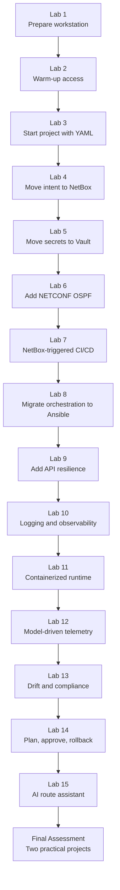
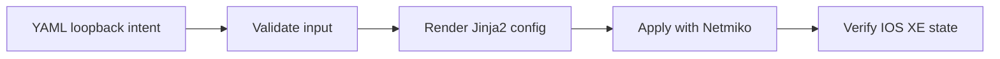
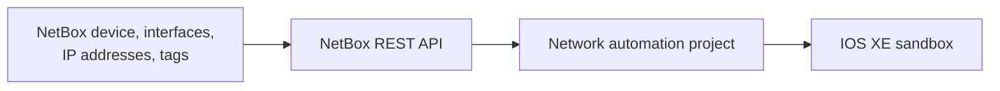
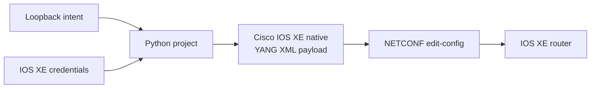
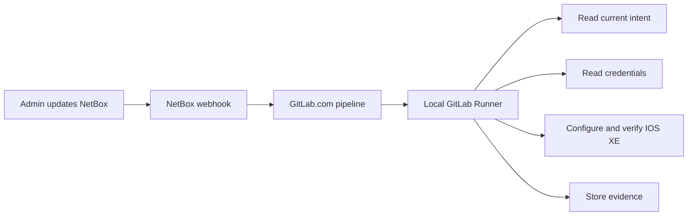
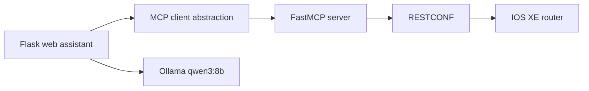

# CCNPAUTO Lab Guide

## Lab Guide Introduction

This lab series is the practical companion to the CCNPAUTO study guide. The theory chapters explain software design, APIs, deployment, security, infrastructure automation, Cisco platforms, and AI-assisted network operations. The labs turn those ideas into a working environment and a cumulative network automation project.

The course begins with a single Ubuntu workstation and gradually builds toward a professional automation workflow. Learners first prepare tools and validate basic device access. Then they create a GitLab.com project, move from file-based intent to NetBox, protect credentials with Vault, configure IOS XE with CLI and model-driven interfaces, automate the workflow with GitLab CI/CD, migrate orchestration to Ansible, add resilience and observability, containerize the runtime, collect model-driven telemetry, detect drift, plan and roll back changes, and finally build an AI route assistant that uses FastMCP and RESTCONF.

The labs are written for learners with CCNA-level networking knowledge and basic Python experience. The goal is not simply to make scripts work once. The goal is to build the habits that matter in real network automation: version control, source of truth, credential protection, validation, idempotence, controlled deployment, evidence retention, observability, rollback thinking, and safe AI integration.

## Recommended Lab Order

Follow the labs in order unless the instructor explicitly says otherwise. Labs 3–14 are cumulative and use the same main project repository, so skipping one may leave missing modules, variables, services, or pipeline files.

## Repository Flow

The labs use GitLab.com for repositories and pipeline coordination.

| Repository | Used by | Purpose |
|---|---|---|
| `lab2_warm_up` | Lab 2 | Disposable warm-up repository used to confirm Git, Python, DevNet VPN, CLI parsing, and RESTCONF access. |
| `network_automation_project` | Labs 3–14 | Main cumulative automation project. Learners keep improving this repository across multiple labs. |
| `ai_route_assistant` | Lab 15 | Separate AI assistant project using Flask, Ollama, FastMCP, and RESTCONF. |

This separation keeps the warm-up and AI assistant independent from the main production-style automation project. The main project remains focused on source-of-truth-driven network changes, CI/CD, Ansible, observability, compliance, and rollback.

## Lab Summary

### Lab 1: Preparing the Network Automation Workstation

[Lab 1](Lab1/Lab1.md) prepares the Ubuntu 26.04 workstation used throughout the course. Learners install Python tooling, network automation libraries, Ansible, Terraform, Docker, TIG stack, Cisco YANG Suite, NetBox, Vault, Git, Visual Studio Code, and GitLab Runner. This lab also establishes the local services used later: NetBox for source of truth, Vault for secrets, TIG for observability, and YANG Suite for model-driven programmability.

This is the foundation lab. If a later lab fails because a service is missing, a Python package is unavailable, or a runner is not registered, return to Lab 1 and verify the workstation.

### Lab 2: Network Automation Warm-Up

[Lab 2](Lab2/Lab2.md) confirms that the learner can use GitLab.com, Python virtual environments, a Cisco DevNet IOS XE reservable sandbox, Netmiko, TextFSM, and RESTCONF. The lab intentionally uses a separate repository named `lab2_warm_up` because it is a readiness check rather than part of the main project.

Learners retrieve `show version` and `show ip interface brief`, parse CLI output, display tables, and then compare that with structured YANG JSON from RESTCONF. This lab helps learners see why structured APIs become valuable as automation grows.

### Lab 3: Start the Network Automation Project

[Lab 3](Lab3/Lab3.md) begins the cumulative repository named `network_automation_project`. Learners define loopback interfaces in YAML, validate the source of truth, render IOS XE configuration with Jinja2, apply the configuration with Netmiko, and verify the resulting device state.

This lab introduces the first version of the automation workflow:

The YAML file is useful for learning because it is easy to read and version in Git. However, it has limited relationships, API capability, and operational governance. Lab 4 improves that by moving intent to NetBox.

### Lab 4: Move the Source of Truth to NetBox

[Lab 4](Lab4/Lab4.md) replaces the active YAML source of truth with NetBox. Learners model the IOS XE sandbox router, create loopback virtual interfaces, assign `/32` IP addresses, tag managed objects, and retrieve intent through the NetBox REST API.

The automation still reuses the validation, Jinja2, Netmiko, and verification ideas from Lab 3. The main change is the source of truth:

NetBox becomes important because later labs need an authoritative inventory and intent system that can trigger automation.

### Lab 5: Manage Credentials with HashiCorp Vault

[Lab 5](Lab5/Lab5.md) moves IOS XE credentials out of `.env` and into HashiCorp Vault. The project continues to use the same device clients, but the settings layer now retrieves secrets from Vault rather than from local files.

This lab reinforces a key production habit: ignoring a file in Git is not the same as managing a secret. Vault gives learners a safer pattern for storing and retrieving credentials, while also teaching why development-mode Vault is not production-ready.

### Lab 6: Configure OSPF with NETCONF and YANG

[Lab 6](Lab6/Lab6.md) adds model-driven configuration to the project. Learners use Cisco YANG Suite to inspect IOS XE native YANG models, build an OSPF payload, render XML with Jinja2, and send an `<edit-config>` operation through NETCONF. The lab advertises all managed loopback interfaces into OSPF area 0.

This lab is where learners begin to connect source of truth, secret management, and model-driven programmability:

The important lesson is that model-driven automation requires checking the device-advertised model, not blindly trusting a sample payload.

### Lab 7: Trigger Automation from NetBox with GitLab CI/CD

[Lab 7](Lab7/Lab7.md) connects the individual components into an event-driven workflow. A NetBox event rule triggers a GitLab.com pipeline. The local GitLab Runner validates NetBox intent, retrieves credentials from Vault, configures loopbacks, configures OSPF, verifies IOS XE state, and stores artifacts.

The webhook does not carry trusted configuration by itself. It only signals that intent may have changed. The pipeline re-reads NetBox as the authoritative source of truth before making changes.

### Lab 8: Migrate Orchestration from Python to Ansible

[Lab 8](Lab8/Lab8.md) keeps the same operating model from Lab 7 but migrates orchestration from custom Python jobs to Ansible playbooks. NetBox still provides intent, Vault still provides credentials, GitLab CI/CD still triggers the workflow, and IOS XE remains the target.

This lab helps learners compare Python and Ansible realistically. Python offers precise application logic. Ansible offers readable task execution, network modules, collections, check mode, diff behavior, and familiar operational reports. The lab shows that tooling changes do not remove the need for validation, secret handling, and verification.

### Lab 9: Add API Resilience

[Lab 9](Lab9/Lab9.md) improves the project’s behavior when APIs are unreliable. Learners add bounded retry logic, timeouts, exponential backoff, jitter, and `Retry-After` handling. The lab distinguishes recoverable failures such as temporary `5xx` responses from unrecoverable problems such as invalid credentials or malformed requests.

This lab matters because real automation depends on other systems. NetBox, Vault, controllers, and devices can all be slow or temporarily unavailable. A professional automation workflow fails clearly, retries carefully, and avoids infinite loops.

### Lab 10: Add Application Logging and Observability

[Lab 10](Lab10/Lab10.md) adds structured JSON Lines audit events, GitLab artifacts, InfluxDB metrics, and Grafana dashboards. Learners observe who triggered automation, which tasks ran, how long they took, what changed, and where failures occurred.

This lab separates three ideas:

- human-readable job output,
- structured audit records,
- and time-series metrics.

That separation is important because troubleshooting one failed pipeline and understanding long-term automation reliability require different kinds of evidence.

### Lab 11: Containerize the Automation Runtime

[Lab 11](Lab11/Lab11.md) packages the Ansible runtime into a Docker image. Instead of rebuilding the environment from scratch during every pipeline, the project uses a consistent container image containing pinned Python dependencies and Ansible collections.

Containerizing the runtime improves repeatability. The source code remains in Git, secrets remain outside the image, and the pipeline runs with a known set of tools. This prepares learners for production practices where automation jobs run in controlled execution environments.

### Lab 12: Add Model-Driven Telemetry

[Lab 12](Lab12/Lab12.md) shifts attention from the automation application to the network device itself. Learners configure IOS XE model-driven telemetry so the router pushes CPU, memory, and interface counter data to Telegraf. The TIG stack stores and visualizes the telemetry.

This lab demonstrates the difference between polling and streaming. It also introduces an important reachability issue: dial-out telemetry requires the IOS XE sandbox to initiate a connection back to the workstation. If the DevNet VPN path does not allow this, learners may need an instructor-provided collector or another reachable IOS XE environment.

### Lab 13: Detect Configuration Drift and Report Compliance

[Lab 13](Lab13/Lab13.md) adds a read-only compliance pipeline. The project compares NetBox intent with observed IOS XE loopback and OSPF state, reports drift, and preserves structured evidence without automatically correcting the device.

The lab teaches that drift detection and remediation are different decisions. Sometimes the safest first step is to report clearly rather than repair automatically. This is especially true when multiple teams or systems might touch the same network.

### Lab 14: Plan, Approve, Back Up, and Roll Back Changes

[Lab 14](Lab14/Lab14.md) adds a safer change-management workflow. The pipeline generates a plan, pauses for protected approval, captures pre-change state, deploys, tests, and performs scoped rollback if the post-change test fails.

This lab ties many professional practices together. Automation is not just speed; it is controlled speed. A good pipeline should show what it intends to do, require approval for risky actions, preserve evidence, and provide a realistic recovery path.

### Lab 15: Build an AI Network Route Assistant

[Lab 15](Lab15/Lab15.md) introduces AI-assisted network operations in a controlled way. Learners build a Flask web assistant with a professional dark theme, run Qwen 8B locally through Ollama, expose route-information tools through Python FastMCP, and retrieve live IOS XE route data through RESTCONF behind the MCP server.

The key architecture is intentional:

The AI model answers questions from MCP-provided route context. It does not receive router credentials, does not connect directly to IOS XE, and does not execute configuration. This reinforces the Chapter 17 principle that AI belongs behind narrow, controlled, auditable tools.

### Final Assessment Lab: Enterprise Network Automation Delivery

[Final Assessment Lab](FinalLab/README.md) tests learners through two realistic company projects. The first project uses Netmiko and Jinja2 to automate VLAN creation on a Cisco Nexus NX-OS sandbox switch, representing legacy CLI-based devices. The second project uses NETCONF, RESTCONF, YANG Suite, Vault, and Flask to automate static routes and monitor an IOS XE sandbox router, representing modern programmable infrastructure.

The assessment is worth 100 points and includes self-grading scripts so learners can check their completion before submission.

## Main Project Evolution

Labs 3–14 progressively improve the same `network_automation_project` repository.

| Stage | Main Improvement | Operational Lesson |
|---|---|---|
| Lab 3 | YAML intent and Python/Netmiko deployment | Start with a readable workflow and verify results. |
| Lab 4 | NetBox source of truth | Intent belongs in a system that has objects, relationships, API access, and history. |
| Lab 5 | Vault credentials | Secrets should be retrieved from a controlled secret store, not scattered in files. |
| Lab 6 | NETCONF/YANG OSPF configuration | Model-driven interfaces require model discovery and payload validation. |
| Lab 7 | NetBox-triggered GitLab CI/CD | Events should trigger reconciliation against authoritative intent. |
| Lab 8 | Ansible orchestration | Declarative automation still requires validation, secrets, and verification. |
| Lab 9 | API resilience | External dependencies fail; automation must handle timeouts and rate limits safely. |
| Lab 10 | Logging and observability | Operators need evidence, metrics, and retained artifacts. |
| Lab 11 | Containerized runtime | Reproducible execution environments reduce dependency drift. |
| Lab 12 | Model-driven telemetry | Streaming telemetry provides operational visibility into network state. |
| Lab 13 | Drift detection | Compliance reporting can be read-only and evidence-based. |
| Lab 14 | Plan and rollback | Safe automation includes approval, backup, testing, and recovery. |

## Services Used Across the Labs

| Service or Tool | Introduced | Used For |
|---|---|---|
| GitLab.com | Lab 1 / Lab 2 | Git repositories, merge requests, pipeline coordination |
| GitLab Runner | Lab 1 | Local execution of GitLab.com jobs that need workstation services and DevNet VPN access |
| Cisco DevNet IOS XE Sandbox | Lab 2 | Router target for CLI, RESTCONF, NETCONF, telemetry, and route assistant labs |
| NetBox | Lab 1 / Lab 4 | Source of truth for managed loopback intent |
| HashiCorp Vault | Lab 1 / Lab 5 | Device credential storage and retrieval |
| Cisco YANG Suite | Lab 1 / Lab 6 | NETCONF and RESTCONF model discovery and payload testing |
| TIG Stack | Lab 1 / Lab 10 / Lab 12 | InfluxDB, Telegraf, and Grafana observability |
| Docker | Lab 1 / Lab 11 | Runtime packaging and local service hosting |
| Ollama | Lab 15 | Local LLM runtime for the AI route assistant |
| FastMCP | Lab 15 | Controlled AI tool boundary for network information |

## Working Practices for Every Lab

Use these habits consistently:

- Start from the correct repository and branch before copying lab files.
- Keep secrets out of Git. Commit `.env.example`, not `.env`.
- Read the expected workflow before running commands.
- Test connectivity before debugging application logic.
- Validate source-of-truth data before configuring devices.
- Preview or plan changes before deployment when the lab supports it.
- Verify operational state after deployment.
- Preserve artifacts and logs because they are the evidence of what happened.
- When an API or model path fails, check product documentation and the deployed software version rather than assuming the sample is universal.

## Common Recovery Checklist

When a lab fails, work from the foundation upward:

1. Confirm the DevNet sandbox reservation is active and the VPN is connected.
2. Confirm local services are running, such as NetBox, Vault, YANG Suite, TIG, or Ollama.
3. Confirm the Python virtual environment is active.
4. Confirm required environment variables or GitLab CI/CD variables are present.
5. Confirm GitLab Runner is online when a pipeline is expected to run.
6. Confirm credentials are correct and not expired.
7. Confirm the IOS XE sandbox supports the requested RESTCONF, NETCONF, or telemetry model path.
8. Read the preserved logs or artifacts before rerunning the job.

## Completion Outcome

After Lab 15, learners should have practiced a complete professional network automation lifecycle. They will have built automation from simple CLI collection through source-of-truth-driven changes, secret management, model-driven configuration, CI/CD, observability, containerized execution, telemetry, compliance, rollback, and AI-assisted route analysis.

The final result is not one monolithic script. It is a set of engineering patterns that learners can reuse in real Cisco network automation work.
