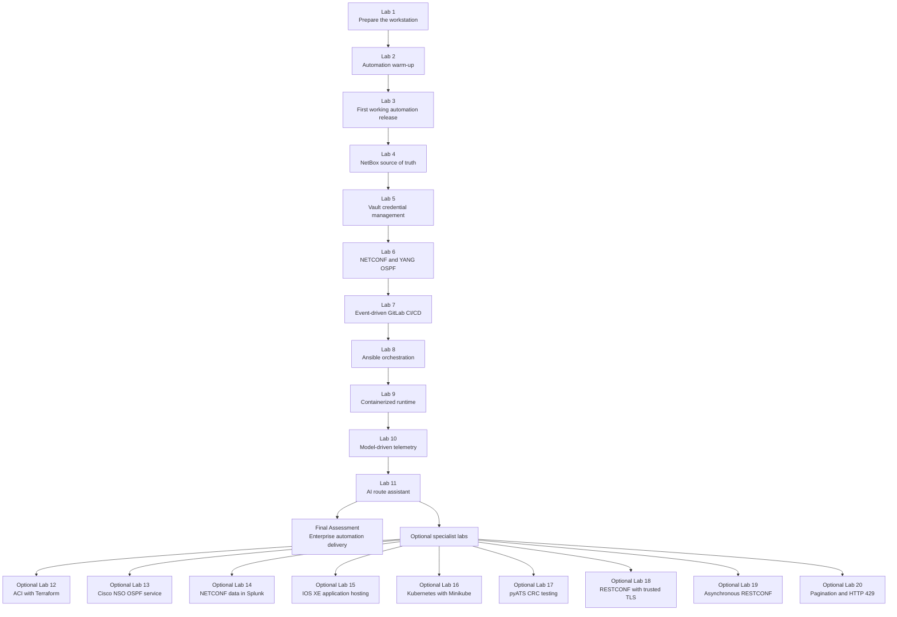
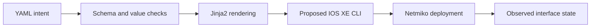
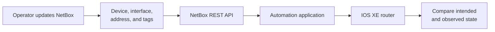
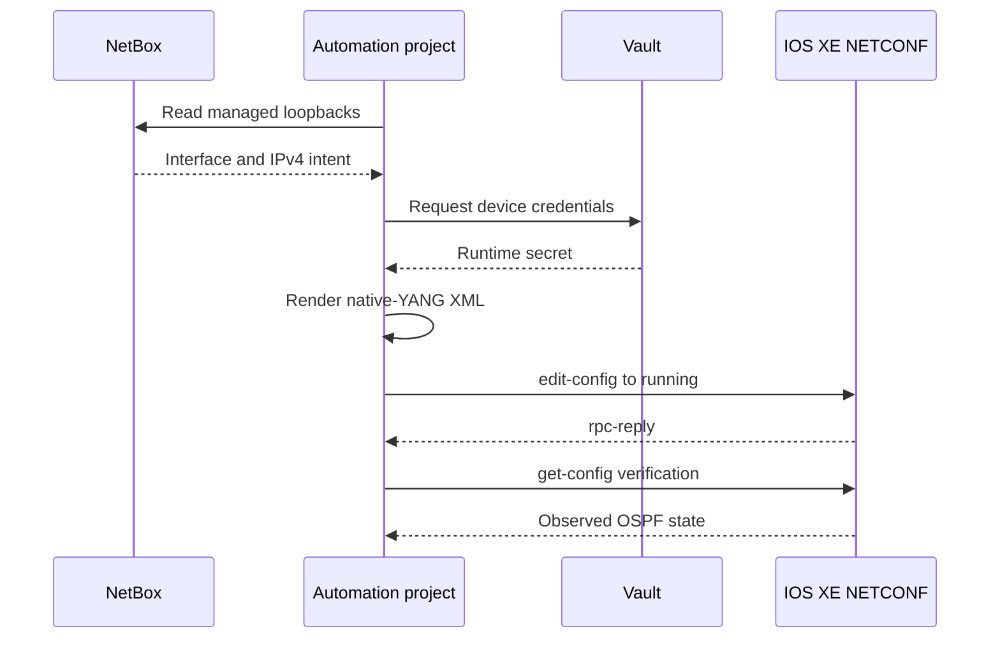
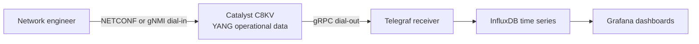
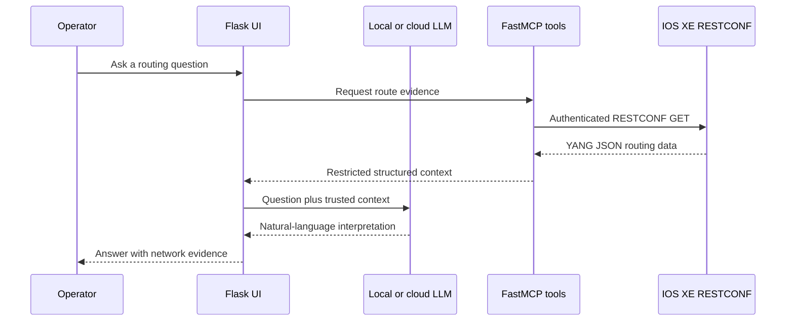

# CCNPAUTO Enterprise Network Automation Lab Program

## Welcome to the Project

Imagine that you have joined the network engineering team of a growing enterprise. The company operates Cisco infrastructure across offices, data centers, and cloud-connected environments. Most network changes are still performed manually, device credentials are handled inconsistently, configuration records are spread across files, and troubleshooting depends heavily on individual experience.

The immediate requirement sounds simple: manage loopback interfaces and OSPF on an IOS XE router. However, the engineering manager does not want another one-off script. The company needs a workflow that can answer much harder questions:

- Where does approved network intent live?
- How are credentials protected?
- How can a proposed change be validated before it reaches a device?
- Which interface should be used when a platform supports CLI, RESTCONF, and NETCONF?
- How can the team prove what changed, who initiated it, and whether it succeeded?
- How can performance problems and operational failures be detected?
- Where can containers, telemetry, and AI add value without weakening control?

Across this lab program, you will build that workflow in stages. The project
begins as a small Python application and develops into a
source-of-truth-driven automation service with secret management,
model-driven configuration, CI/CD, Ansible orchestration, a reproducible
container runtime, telemetry, and a controlled AI interface. A final
standalone API lab then makes pagination and rate-limit recovery observable
through timestamped evidence.

You are not completing unrelated exercises. You are delivering successive releases of the same enterprise capability.

## The System You Will Build

By the end of the required labs, the automation environment will resemble a small but credible enterprise platform:


```mermaid
flowchart LR
    Engineer["Network engineer"] --> NetBox["NetBox<br/>approved intent"]
    Engineer --> GitLab["GitLab.com<br/>code and review"]
    NetBox --> Trigger["Event trigger"]
    Trigger --> Pipeline["GitLab CI/CD pipeline"]
    GitLab --> Pipeline
    Pipeline --> Runner["Local GitLab Runner"]

    Runner --> Validate["Validate intent"]
    Validate --> Vault["Retrieve secrets<br/>from Vault"]
    Vault --> Generate["Generate proposed change"]
    Generate --> Apply["Apply through CLI<br/>or NETCONF"]
    Apply --> IOSXE["Cisco IOS XE"]
    IOSXE --> Verify["Verify observed state"]
    Verify --> Evidence["Logs, reports,<br/>and artifacts"]

    IOSXE --> Telemetry["Model-driven telemetry"]
    Telemetry --> TIG["Telegraf, InfluxDB,<br/>and Grafana"]
```

This design follows a controlled change lifecycle:

```text
Observe current state
        ↓
Validate approved intent
        ↓
Generate and inspect the proposed change
        ↓
Apply through the appropriate interface
        ↓
Verify the operational result
        ↓
Preserve evidence for troubleshooting and audit
```

At first, you will perform many of these steps directly. Later, GitLab CI/CD and Ansible will coordinate them. The business intent remains the same even as the implementation becomes more reliable and scalable.

## Your Role and Starting Point

You are working as a network automation engineer, not merely as a script operator. You are expected to understand the change being made, interpret device and API responses, recognize unsafe assumptions, and use evidence to troubleshoot failures.

The program assumes CCNA Automation knowledge. Before beginning, you should be able to:

- Explain IP addressing, routing, switching, VLANs, interfaces, and OSPF at approximately CCNA level.
- Read and modify Python that uses functions, classes, loops, conditionals, dictionaries, modules, and exception handling.
- Work with Python virtual environments and install packages with `pip`.
- Read and edit YAML, JSON, and XML.
- Explain HTTP methods, headers, authentication, and common response codes.
- Perform normal Git operations such as clone, branch, commit, merge, and push.
- Describe the purposes of CLI automation, RESTCONF, NETCONF, YANG, and controller APIs.

The labs provide commands, code, file locations, and verification points. Nevertheless, a professional engineer must also read logs, compare intended and observed state, and determine why a result is correct.

## How the Lab Story Develops

The required sequence contains four connected workstreams.

### Workstream 1: Establish the Engineering Environment

Labs 1 and 2 prepare the workstation and prove that the learner can reach GitLab.com, local services, and a Cisco DevNet reservable sandbox. Lab 2 uses a disposable repository named `lab2_warm_up`; its purpose is to establish confidence before work begins on the main project.

### Workstream 2: Build the Automation Product

Labs 3–6 create the first useful automation product in `network_automation_project`. The product initially reads YAML and configures loopbacks through CLI. It then adopts NetBox as the source of truth, Vault as the secret store, and NETCONF with Cisco IOS XE native YANG for OSPF.

### Workstream 3: Make the Product Operable

Labs 7–9 convert the application into a production-style service. GitLab
CI/CD responds to intent changes, Ansible takes over orchestration, and the
execution environment is packaged as a controlled container image. Lab 10
then extends the operational view with model-driven device telemetry.

### Workstream 4: Add a Controlled AI Interface

Lab 11 is a separate application called `ai_route_assistant`. It demonstrates
how an LLM can answer operational routing questions while FastMCP—not the
model—controls access to RESTCONF and live network evidence. Optional Lab 20
is also standalone: it provides a deterministic local API for practising
pagination and HTTP `429` recovery.

The complete learning path is shown below. Every required lab is displayed separately because each one introduces a distinct release of the system. The optional labs branch from the completed core program and can be selected according to platform access, course time, and learner interest.


```mermaid
flowchart TD
    L1["Lab 1<br/>Prepare the workstation"]
    L2["Lab 2<br/>Automation warm-up"]
    L3["Lab 3<br/>First working automation release"]
    L4["Lab 4<br/>NetBox source of truth"]
    L5["Lab 5<br/>Vault credential management"]
    L6["Lab 6<br/>NETCONF and YANG OSPF"]
    L7["Lab 7<br/>Event-driven GitLab CI/CD"]
    L8["Lab 8<br/>Ansible orchestration"]
    L9["Lab 9<br/>Containerized runtime"]
    L10["Lab 10<br/>Model-driven telemetry"]
    L11["Lab 11<br/>AI route assistant"]
    FINAL["Final Assessment<br/>Enterprise automation delivery"]
    OPTIONAL["Optional specialist labs"]
    L12["Optional Lab 12<br/>ACI with Terraform"]
    L13["Optional Lab 13<br/>Cisco NSO OSPF service"]
    L14["Optional Lab 14<br/>NETCONF data in Splunk"]
    L15["Optional Lab 15<br/>IOS XE application hosting"]
    L16["Optional Lab 16<br/>Kubernetes with Minikube"]
    L17["Optional Lab 17<br/>pyATS CRC testing"]
    L18["Optional Lab 18<br/>RESTCONF with trusted TLS"]
    L19["Optional Lab 19<br/>Asynchronous RESTCONF"]
    L20["Optional Lab 20<br/>Pagination and HTTP 429"]

    L1 --> L2
    L2 --> L3
    L3 --> L4
    L4 --> L5
    L5 --> L6
    L6 --> L7
    L7 --> L8
    L8 --> L9
    L9 --> L10
    L10 --> L11
    L11 --> FINAL
    L11 --> OPTIONAL
    OPTIONAL --> L12
    OPTIONAL --> L13
    OPTIONAL --> L14
    OPTIONAL --> L15
    OPTIONAL --> L16
    OPTIONAL --> L17
    OPTIONAL --> L18
    OPTIONAL --> L19
    OPTIONAL --> L20
```

Follow the required labs in order. Labs 3–9 modify the same repository, so
each release assumes that the preceding release exists. Labs 10 and 11 are
separate projects. Optional Labs 12–20 can be selected according to platform
access, available time, and learner interest.

## Required Project Journey

### Phase 1 — Prepare the Engineering Platform

#### Lab 1: Prepare the Network Automation Workstation

In [Lab 1](Lab1/Lab1.md), you receive a clean Ubuntu 26.04 workstation and turn it into an engineering platform. You install Python tooling, network automation libraries, Ansible, Terraform, Docker, Git, Visual Studio Code, GitLab Runner, NetBox, and Vault. You can also install TIG and Cisco Yangsuite locally or use the equivalent services in the Cisco DevNet sandbox.

This work resembles onboarding a new automation worker into an enterprise team. A script may be correct and still fail if its dependencies, container networking, VPN routes, certificates, or service endpoints are inconsistent. Consequently, the output of this lab is not just a workstation with software installed; it is a verified execution environment that later pipelines can trust.

**Delivery evidence:** working Python environment, accessible lab services, GitLab.com connectivity, Docker operation, and an online GitLab Runner.

#### Lab 2: Prove End-to-End Connectivity

In [Lab 2](Lab2/Lab2.md), you act as the engineer performing a readiness test before accepting a project. In the separate `lab2_warm_up` repository, you connect to an IOS XE reservable sandbox with Netmiko, run `show version` and `show ip interface brief`, parse unstructured CLI output with TextFSM, and present the results in tables.

You then inspect RESTCONF manually in Postman and retrieve structured YANG JSON in Python. Seeing both approaches against the same device reveals an important architectural distinction: CLI parsing can extend automation to legacy platforms, whereas model-driven interfaces reduce dependence on screen-oriented text.

**Delivery evidence:** committed warm-up code, parsed device inventory, Postman RESTCONF exchange, and a structured Python result.

### Phase 2 — Deliver the First Automation Release

#### Lab 3: Build the First Working Loopback Automation Release

In [Lab 3](Lab3/Lab3.md), the company asks for repeatable creation of one or many loopback interfaces. This is the first release of `network_automation_project`.

You define desired loopbacks in YAML, validate the data, render IOS XE CLI with a Jinja2 loop, connect with Netmiko, apply the configuration, and retrieve device state to confirm the result. Detailed Python logging can be enabled from `.env`; each execution creates a timestamped text log in `logs/`, allowing two runs of the same program to be compared without overwriting evidence.


```mermaid
flowchart LR
    YAML["YAML intent"] --> Validation["Schema and value checks"]
    Validation --> Jinja["Jinja2 rendering"]
    Jinja --> Preview["Proposed IOS XE CLI"]
    Preview --> Netmiko["Netmiko deployment"]
    Netmiko --> Verification["Observed interface state"]
```

In product engineering, a **minimum viable product**, often abbreviated as **MVP**, is the smallest working version that delivers useful value and proves the main end-to-end process. Lab 3 meets that definition because it can read approved intent, generate configuration, change a router, and verify the result. It is not yet production-ready: the YAML file has no object relationships, access controls, API history, or event system. Those limitations create the business case for Lab 4.

**Delivery evidence:** valid source-of-truth data, rendered configuration, verified loopbacks, Git history, and timestamped diagnostic logs.

### Phase 3 — Introduce Governance and Model-Driven Control

#### Lab 4: Make NetBox the Source of Truth

In [Lab 4](Lab4/Lab4.md), the network grows beyond what a local YAML file can govern. You model the sandbox router in NetBox, create virtual loopback interfaces, assign `/32` addresses, apply management tags, and retrieve the approved intent through the NetBox REST API.

The existing validation, Jinja2, Netmiko, and verification functions remain useful. Only the authority for intent changes. This demonstrates a central automation design principle: a source of truth describes what the network should be; the device reports what the network currently is.


```mermaid
flowchart LR
    Operator["Operator updates NetBox"] --> Objects["Device, interface,<br/>address, and tags"]
    Objects --> API["NetBox REST API"]
    API --> Project["Automation application"]
    Project --> Router["IOS XE router"]
    Router --> Compare["Compare intended<br/>and observed state"]
```

**Delivery evidence:** correctly modeled NetBox objects, least-privilege API token, retrieved intent, and a successful source-of-truth-driven deployment.

#### Lab 5: Replace File-Based Credentials with Vault

In [Lab 5](Lab5/Lab5.md), a security review identifies device credentials in the application environment. Even though `.env` is excluded from Git, it still copies long-lived secrets onto workstations and pipeline environments.

You start HashiCorp Vault, create the required credential path, and implement a settings layer that retrieves IOS XE credentials at runtime. The rest of the application should not need to know whether a password came from a file, Vault, or another secret provider. This separation keeps secret handling out of network logic and prepares the project for CI/CD.

Vault development mode is suitable for the course but not for production. The engineering pattern—centralized storage, controlled retrieval, minimal exposure, and clear failure handling—is the transferable lesson.

**Delivery evidence:** populated Vault path, successful runtime secret retrieval, redacted logs, and no committed credentials.

#### Lab 6: Configure OSPF Through NETCONF and Native YANG

In [Lab 6](Lab6/Lab6.md), the company wants every managed loopback advertised in OSPF area 0. Rather than adding more screen-scraped CLI, you use NETCONF and the Cisco IOS XE native YANG model.

You use Cisco Yangsuite locally or at `http://10.10.20.50:8480` in the Cisco DevNet sandbox to locate the model hierarchy, identify namespaces, and construct an `<edit-config>` payload. Jinja2 renders one `<network>` element for every NetBox-managed loopback, after which `ncclient` sends the RPC and the application verifies the resulting OSPF configuration.


```mermaid
sequenceDiagram
    participant N as NetBox
    participant A as Automation project
    participant V as Vault
    participant R as IOS XE NETCONF
    A->>N: Read managed loopbacks
    N-->>A: Interface and IPv4 intent
    A->>V: Request device credentials
    V-->>A: Runtime secret
    A->>A: Render native-YANG XML
    A->>R: edit-config to running
    R-->>A: rpc-reply
    A->>R: get-config verification
    R-->>A: Observed OSPF state
```

This lab reinforces that a sample XML document is not automatically valid for every release. Professional model-driven automation checks the models advertised by the target device.

**Delivery evidence:** Yangsuite discovery, valid XML, successful `<rpc-reply>`, OSPF area 0 configuration, and verified observed state.

### Phase 4 — Turn the Application into a Delivery Service

#### Lab 7: Create an Event-Driven CI/CD Workflow

In [Lab 7](Lab7/Lab7.md), the team no longer wants engineers to run the application manually. A network administrator creates or updates a managed loopback in NetBox, and a NetBox event rule triggers a GitLab.com pipeline.

The webhook is only a notification. It does not become trusted intent. The local GitLab Runner re-reads NetBox, validates the current desired state, obtains credentials from Vault, configures loopbacks and OSPF, verifies the device, and uploads evidence.


```mermaid
flowchart LR
    Change["Approved NetBox change"] --> Event["Webhook event"]
    Event --> GitLab["GitLab.com pipeline"]
    GitLab --> Runner["Local Runner"]
    Runner --> Read["Re-read authoritative intent"]
    Read --> Validate["Validate"]
    Validate --> Deploy["Deploy loopback and OSPF"]
    Deploy --> Test["Verify device state"]
    Test --> Artifacts["Retain reports and logs"]
```

The result is a small reconciliation system: an event announces that intent might have changed, but the pipeline independently discovers what should exist before acting.

**Delivery evidence:** NetBox event rule, protected trigger and CI/CD variables, successful pipeline, device verification, and downloadable artifacts.

#### Lab 8: Migrate Orchestration to Ansible

In [Lab 8](Lab8/Lab8.md), operations leadership asks whether the workflow can be made easier for a broader network team to maintain. You keep the architecture from Lab 7 but migrate orchestration to straightforward Ansible playbooks.

NetBox remains authoritative, Vault remains the secret provider, and GitLab remains the delivery controller. Ansible dynamically builds the in-memory inventory, validates intent, applies loopback CLI with `ios_config`, sends the verified OSPF XML through `netconf_config`, and runs post-change tests. The supplied `ansible.cfg` disables SSH host-key checking for the controlled lab environment so that first-time sandbox access remains simple.

This is not a rewrite of the business process. It is a change of implementation tool. Comparing the Python and Ansible versions helps you decide when explicit application logic is valuable and when readable task-based orchestration is a better operational fit.

**Delivery evidence:** syntactically valid playbooks, successful CLI and NETCONF tasks, idempotent repeat execution where supported, verification output, and CI/CD artifacts.

### Phase 5 — Standardize the Runtime and Observe the Network

#### Lab 9: Containerize the Runtime

In [Lab 9](Lab9/Lab9.md), two runners produce different results because their Python packages and Ansible collections are not identical. You package the automation runtime in a Docker image with controlled dependencies.

The application code remains in Git, secrets remain outside the image, and the container uses host networking so it can follow the learner workstation’s DevNet VPN and local-service routes. A reproducible runtime makes pipeline behavior easier to test, transfer, and support.

**Delivery evidence:** buildable image, pinned dependencies, host-networked execution, successful automation from the container, and no embedded secrets.

#### Lab 10: Add Model-Driven Telemetry

In [Lab 10](Lab10/Lab10.md), the network operations team needs continuous visibility into CPU, memory, and `GigabitEthernet1` traffic. Polling occasional show commands cannot provide an effective operational timeline.

You use Yangsuite to discover the required operational paths, examine NETCONF and gNMI dial-in collection, and manually configure gRPC dial-out subscriptions beginning with subscription ID 201. In the Cisco Catalyst C8KV sandbox, telemetry is sent to the pre-integrated Telegraf service at `10.10.20.50:57500` and displayed in Grafana at `http://10.10.20.50:3000`. If you use a locally hosted C8KV, you start the local TIG services from Lab 1 and send telemetry to the workstation on TCP port `57000`.


```mermaid
flowchart LR
    C8KV["Catalyst C8KV<br/>YANG operational data"] -->|"gRPC dial-out"| Telegraf["Telegraf receiver"]
    Telegraf --> InfluxDB["InfluxDB time series"]
    InfluxDB --> Grafana["Grafana dashboards"]
    Engineer["Network engineer"] -->|"NETCONF or gNMI dial-in"| C8KV
```

At the end of the lab, you can explain the trade-off between a collector requesting data and a device maintaining a streaming subscription.

**Delivery evidence:** verified model paths, active subscriptions, received measurements, and readable CPU, memory, and traffic dashboards.

### Phase 6 — Add AI Without Giving Up Control

#### Lab 11: Build an AI Route Assistant

In [Lab 11](Lab11/Lab11.md), operations staff want to ask natural-language questions such as “How many static routes exist?”, “Which next hop reaches this prefix?”, and “Show connected routes with their metrics.”

You build `ai_route_assistant`, a Flask application with a professional dark interface. The assistant can use local Qwen through Ollama or a learner-owned OpenAI or Anthropic account. A smaller local Qwen model can be selected when workstation resources are limited.

The critical design boundary is FastMCP. The MCP server retrieves routing information from IOS XE through RESTCONF and exposes narrow read-only tools. The LLM receives controlled evidence; it does not hold router credentials, call RESTCONF directly, or configure the device.


```mermaid
sequenceDiagram
    participant U as Operator
    participant W as Flask UI
    participant M as Local or cloud LLM
    participant T as FastMCP tools
    participant R as IOS XE RESTCONF
    U->>W: Ask a routing question
    W->>T: Request route evidence
    T->>R: Authenticated RESTCONF GET
    R-->>T: YANG JSON routing data
    T-->>W: Restricted structured context
    W->>M: Question plus trusted context
    M-->>W: Natural-language interpretation
    W-->>U: Answer with network evidence
```

You compare local and cloud models for latency, accuracy, privacy, and resource use. The exercise shows where AI can improve operator experience while deterministic tools continue to control network access.

**Delivery evidence:** working web application, FastMCP tools, RESTCONF route evidence, provider comparison, redacted logs, and no configuration capability.

## Project Evolution at a Glance

| Release | Engineering change | What the organization gains |
|---|---|---|
| Lab 3 | YAML, Jinja2, Netmiko, verification | A repeatable first working automation release |
| Lab 4 | NetBox replaces YAML as active intent | Authoritative objects, relationships, API access, and events |
| Lab 5 | Vault replaces file-based device credentials | Centralized runtime secret retrieval |
| Lab 6 | NETCONF and native YANG configure OSPF | Structured, model-driven change |
| Lab 7 | NetBox event triggers GitLab CI/CD | Repeatable and traceable delivery |
| Lab 8 | Ansible coordinates the workflow | An operator-friendly orchestration layer |
| Lab 9 | Containerized execution environment | Reproducibility across runners |
| Lab 10 | Streaming model-driven telemetry | Continuous network visibility |
| Lab 11 | FastMCP-backed route assistant | Controlled natural-language operations |
| Optional Lab 20 | Pagination and HTTP 429 simulation | Evidence-based API resilience |

## Repositories and Deliverables

| Repository | Labs | Role in the program |
|---|---|---|
| `lab2_warm_up` | Lab 2 | Disposable readiness exercise for Git, Python, CLI parsing, Postman, and RESTCONF |
| `network_automation_project` | Labs 3–9 | The main enterprise project, enhanced one release at a time |
| `ai_route_assistant` | Lab 11 | Standalone Flask, FastMCP, RESTCONF, and LLM application |
| `standalone_http_resilience` | Optional Lab 20 | Local Flask simulation, pagination client, bounded backoff, and CSV evidence |
| `optional_lab12_aci_terraform` | Optional Lab 12 | Cisco ACI infrastructure-as-code project |
| `optional_lab14_splunk_netconf` | Optional Lab 14 | NETCONF telemetry collector and Splunk integration |
| `optional_lab15_iosxe_app_hosting` | Optional Lab 15 | IOS XE IOx loopback recovery application |
| `optional_lab16_minikube` | Optional Lab 16 | Standalone beginner Kubernetes workload |
| `optional_lab17_pyats_crc` | Optional Lab 17 | pyATS/Genie CRC counter test |
| `optional_lab18_restconf_pki` | Optional Lab 18 | Local CA and certificate-validating RESTCONF client |
| `optional_lab19_async_restconf` | Optional Lab 19 | Trusted asynchronous RESTCONF collector |

Optional Lab 13 uses an NSO development runtime and service package rather than a conventional standalone application repository.

## Optional Specialist Assignments

The optional labs apply the same engineering principles to specialist roles. They are not prerequisites for the final assessment.

| Assignment | Enterprise situation | Capability delivered |
|---|---|---|
| [Optional Lab 12](Lab12/Lab12.md) | A data-center team wants repeatable ACI application policy. | Terraform provisions a tenant, VRF, bridge domain, subnet, application profile, and EPGs in an ACI simulator. |
| [Optional Lab 13](Lab13/Lab13.md) | A service-provider team needs transactional multi-device services. | Cisco NSO manages IOS XE through a CLI NED and deploys a YANG-modeled OSPF service with FASTMAP ownership. |
| [Optional Lab 14](Lab14/Lab14.md) | Operations wants IOS XE CPU events in its existing analytics platform. | A NETCONF dial-in collector sends normalized data to Splunk HEC; learners investigate it with SPL and Splunk dashboards. |
| [Optional Lab 15](Lab15/Lab15.md) | A branch needs a lightweight recovery function close to the device. | An IOx Docker application receives IOS XE syslog and uses Netmiko to re-enable `Loopback1`. |
| [Optional Lab 16](Lab16/Lab16.md) | The automation team is beginning its Kubernetes journey. | Minikube demonstrates deployments, services, probes, scaling, rollout, and self-healing. |
| [Optional Lab 17](Lab17/Lab17.md) | A campus team needs repeatable interface health tests. | pyATS and Genie detect increasing CRC counters and preserve structured evidence. |
| [Optional Lab 18](Lab18/Lab18.md) | Security prohibits RESTCONF clients from disabling TLS verification. | A local OpenSSL CA signs the IOS XE HTTPS identity and Python validates its chain and hostname. |
| [Optional Lab 19](Lab19/Lab19.md) | A collector must retrieve several RESTCONF resources efficiently. | `aiohttp` adds bounded concurrency while retaining trusted TLS from Lab 18. |

## Optional Standalone API Resilience Assignment

[Optional Lab 20](Lab20/Lab20.md) is independent of the Cisco sandboxes and the
cumulative project. A local Flask API exposes 100 interface records in pages
of 20 and deliberately returns `429 Too Many Requests` when a client exceeds
its allowance. Learners follow server-provided pagination links, respect
`Retry-After`, apply bounded backoff, run 100 logical requests, and preserve
timestamped CSV evidence of successful, limited, recovered, and failed
attempts.

The local simulation is intentional. It guarantees that every learner can
observe a rate limit without sending abusive traffic to a shared controller
or depending on an external platform's changing policy.

## Final Assessment: Production Acceptance

The [Final Assessment Lab](FinalLab/README.md) represents a production-acceptance assignment rather than a blank-page coding exercise. The company already has two partially implemented solutions, and you must complete the missing engineering work.

Project 1 addresses legacy infrastructure. You use Netmiko and Jinja2 to automate VLAN creation on a Cisco Nexus NX-OS sandbox, complete the required device dictionary, and handle authentication and connection timeouts.

Project 2 addresses modern programmable infrastructure. You use Cisco IOS XE native YANG, NETCONF, RESTCONF, Vault, and Flask to deploy static routes and complete an operational monitoring portal.

The assessment is worth 100 points. Its self-graders identify which requirements are satisfied, what is missing, and the condition required to earn each remaining point. The graders provide rapid feedback, but live device verification remains part of professional acceptance.

## Shared Services and Endpoints

| Service | Purpose | Normal access |
|---|---|---|
| GitLab.com | Repositories, merge requests, variables, and CI/CD pipelines | Learner GitLab.com account |
| Local GitLab Runner | Executes jobs that need local services and DevNet VPN reachability | `systemctl` service |
| NetBox | Authoritative loopback intent | `http://127.0.0.1:8080` |
| Vault | Runtime device credentials | Local development server |
| Local Yangsuite | Model discovery and payload development | `https://localhost:8443` |
| Cisco DevNet sandbox Yangsuite | Alternative model and payload environment | `http://10.10.20.50:8480` |
| Local TIG stack | Automation metrics and local C8KV telemetry | Grafana at `http://127.0.0.1:3000` |
| Cisco DevNet sandbox TIG stack | Pre-integrated C8KV telemetry | Telegraf `10.10.20.50:57500`; Grafana `http://10.10.20.50:3000` |
| Cisco Catalyst C8KV reservable sandbox | CLI, NETCONF, RESTCONF, and telemetry target | Reservation-provided endpoint and credentials |
| Docker | Local services and repeatable automation runtime | Host networking where DevNet VPN access is required; bridge networking for NetBox |
| Ollama or cloud LLM | Route-assistant language model | Learner-selected provider |

Containers that must follow the workstation’s Cisco DevNet VPN route use Linux host networking. NetBox remains on its standard Compose bridge network and publishes only `127.0.0.1:8080`; Docker bridge networking still permits its worker to call GitLab.com. Minikube in Optional Lab 16 manages its own Kubernetes network.

## Start Only What the Current Release Needs

| Service | Start and verify | Stop when unused |
|---|---|---|
| NetBox | In `~/lab-services/netbox-docker`, run `docker compose up -d`, then open `http://127.0.0.1:8080`. | Run `docker compose stop` in the same folder. |
| Local TIG | In `~/lab-services/tig`, run `docker compose up -d`, then open `http://127.0.0.1:3000`. | Run `docker compose stop` in the same folder. |
| Local Yangsuite | In `~/lab-services/yangsuite/docker`, run `docker compose up -d`. | Run `docker compose stop` in the same folder. |
| Vault | Start the Lab 5 development server in its dedicated terminal, then run `vault status`. | Press `Ctrl+C` in the server terminal. |
| GitLab Runner | Run `sudo systemctl start gitlab-runner`, then `sudo gitlab-runner verify`. | Run `sudo systemctl stop gitlab-runner`. |
| Ollama | Run `ollama serve`, then confirm the selected model with `ollama list`. | Press `Ctrl+C` if it is running interactively. |

## Token and Secret Responsibilities

Treat every token as a credential. Give it only the permissions required by the lab, store it in the designated untracked `.env` or protected GitLab variable, and never paste it into source code, screenshots, artifacts, or chat prompts.

| Platform | Where to obtain it | Course use |
|---|---|---|
| NetBox | User menu **API Tokens > Add a Token**. Disable write permission when only read access is needed. | `NETBOX_TOKEN` in `.env` and a masked CI/CD variable |
| Vault | Lab 5 starts the development server with the course root token; authenticate with the documented `vault login` command. | Runtime credential retrieval and protected `VAULT_TOKEN` |
| GitLab project Runner | **Settings > CI/CD > Runners > Create project runner** | Temporary `glrt-...` registration token |
| GitLab pipeline trigger | **Settings > CI/CD > Pipeline trigger tokens** | Private NetBox webhook URL |
| InfluxDB | **Load Data > API Tokens > Generate Custom API Token** with write access only to the required bucket | Masked `INFLUX_TOKEN` |
| Grafana | No API token is required for normal browser dashboard work. | Interactive dashboard creation |
| OpenAI | Create a project API key in the learner’s OpenAI API platform account. | `OPENAI_API_KEY` in Lab 11’s untracked `.env` |
| Anthropic | Create a lab-specific key in the Anthropic Console workspace. | `ANTHROPIC_API_KEY` in Lab 11’s untracked `.env` |
| Splunk HEC | **Settings > Data Inputs > HTTP Event Collector** in Splunk Web | `SPLUNK_HEC_TOKEN` in Optional Lab 14 |

Cisco DevNet sandbox Yangsuite and Grafana use credentials supplied with the reservation; the standard lab does not require a separately generated API token.

## Engineering Rules for the Project

Treat the following as team standards:

1. Start from the correct repository and branch.
2. Create `.env` from the supplied `.env.example` when a project begins. Later cumulative labs modify that same `.env`, `requirements.txt`, and `ansible.cfg` rather than creating competing lab-specific versions.
3. Keep `.env`, passwords, tokens, private keys, and generated secrets out of Git.
4. Validate source-of-truth data before generating configuration.
5. Inspect proposed CLI or XML whenever the workflow provides a preview.
6. Use the intended interface for the task rather than assuming one protocol fits every platform.
7. Apply only the approved scope of change.
8. Verify operational state after every deployment.
9. Preserve timestamped logs, structured reports, and pipeline artifacts.
10. Diagnose from evidence before rerunning a failed job.

When a lab supplies new content, open both the lab file and the destination project in Visual Studio Code, then copy and paste into the specified existing file. This makes each enhancement visible in Git history and keeps the project structure stable.

## Troubleshooting as an Engineer

When something fails, trace the transaction from its foundation instead of changing several components at once:

1. Confirm that the Cisco DevNet reservation is active and the VPN is connected.
2. Confirm that the service required by the current lab is running.
3. Confirm that the correct Python virtual environment is active.
4. Confirm that local `.env` values and protected GitLab variables refer to the intended endpoints.
5. Confirm that the GitLab Runner is online when a pipeline should execute.
6. Confirm that tokens and device credentials are valid and have the required permissions.
7. Read the newest timestamped application log and the pipeline artifact before rerunning.
8. Inspect HTTP status codes, NETCONF `<rpc-error>` content, Ansible task results, or device output at the failing boundary.
9. Verify that the YANG model and path exist on the actual device release.
10. Change one assumption, rerun, and compare the new evidence with the previous run.

This approach mirrors real incident work: determine which boundary failed, preserve the evidence, and correct the cause rather than masking the symptom.

## What You Will Be Able to Show

After completing the required labs, you will have more than a collection of scripts. You will be able to demonstrate:

- A Git-managed automation product that develops through traceable releases.
- NetBox-driven network intent and Vault-managed credentials.
- CLI automation for broad compatibility and NETCONF/YANG for structured configuration.
- An event-driven GitLab CI/CD path from approved intent to verified device state.
- Equivalent orchestration patterns in Python and Ansible.
- A reproducible containerized execution environment.
- Model-driven network telemetry and Grafana visualization.
- An AI assistant whose access to live network data is constrained by FastMCP tools.

Most importantly, you will be able to explain why each component exists and what risk it addresses. That is the difference between running an automation script and engineering a network automation system.

Learners who complete Optional Lab 20 can additionally demonstrate a
resilient API client that follows pagination, recovers from HTTP `429`, and
preserves request-level evidence.
