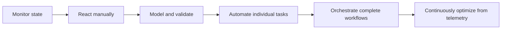
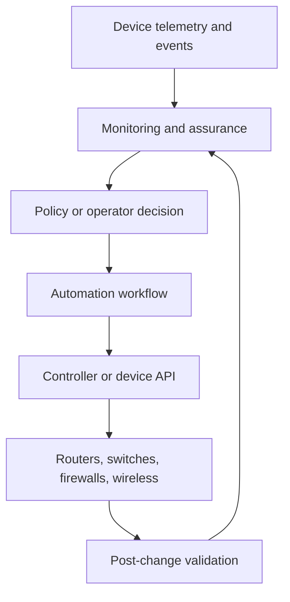
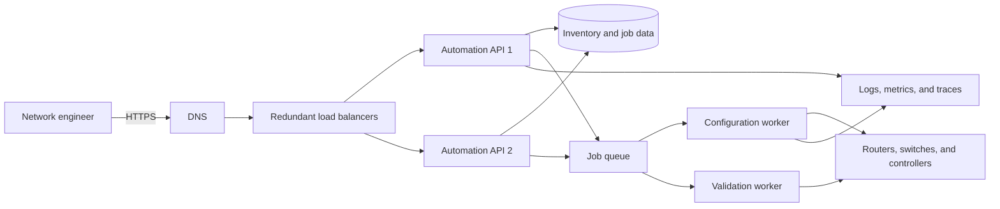
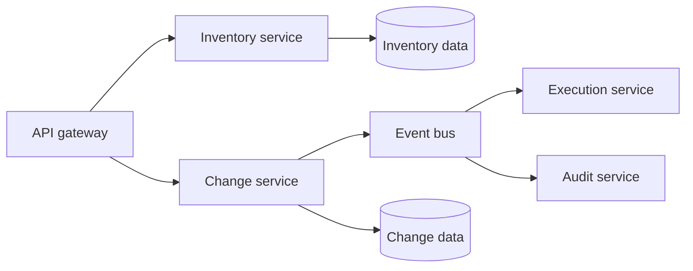
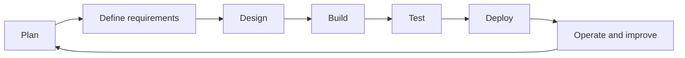
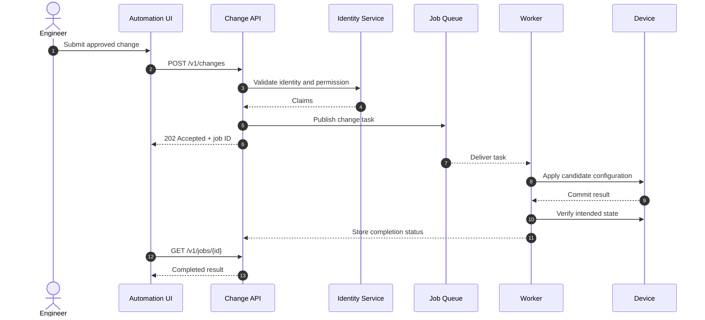
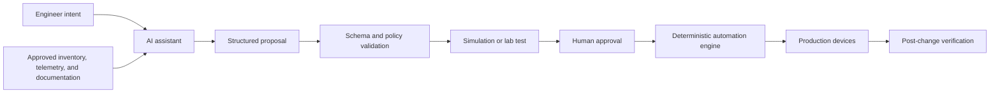
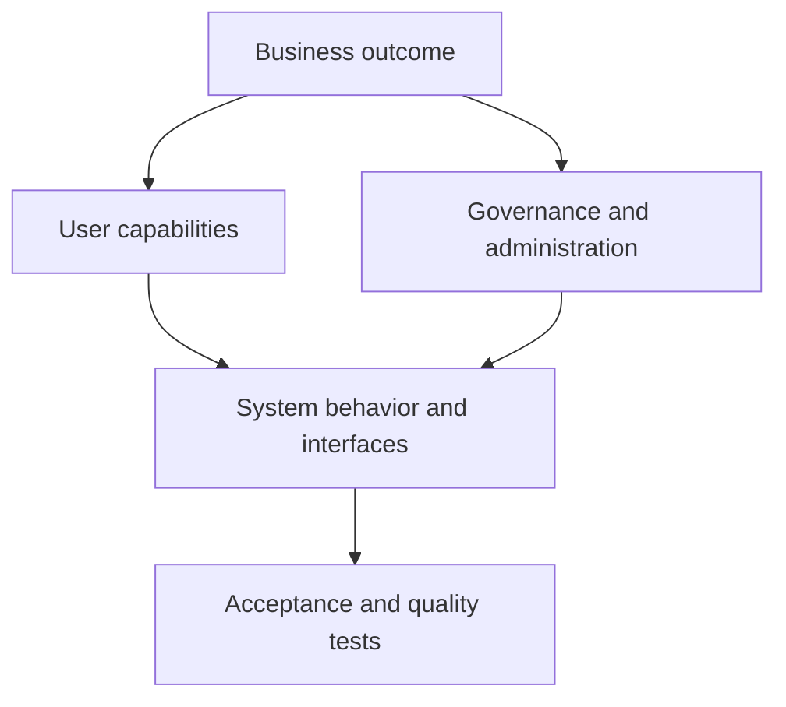
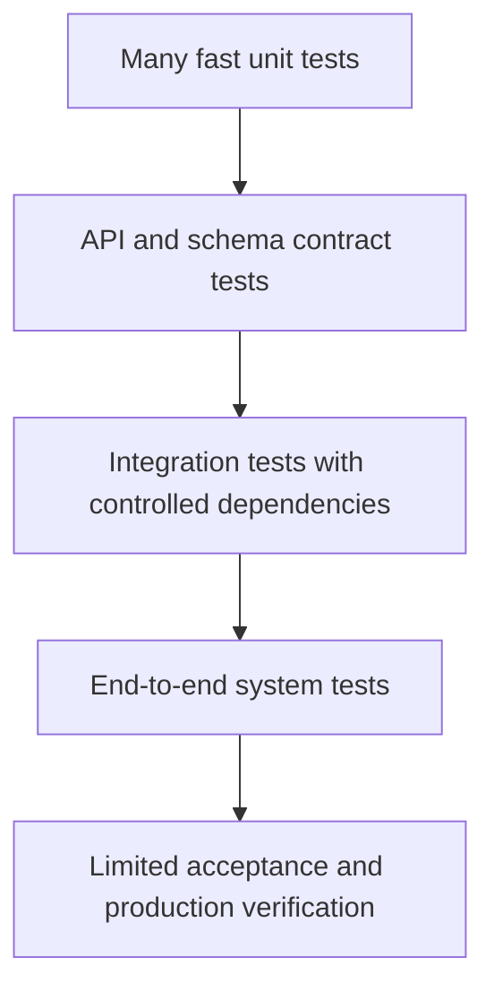
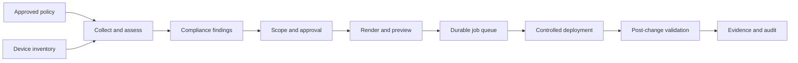

# Chapter 1: Software Design Foundations

## Chapter Introduction

Network automation starts with code, but useful automation quickly grows beyond a script. The moment several engineers depend on it, the software needs requirements, interfaces, security controls, testing, state management, and a reliable delivery process. This chapter explains those foundations in the language of network operations.

As you work through the chapter, follow one central question: **How does an operator's intent become a safe, observable change in the network?** The answer connects front-end applications, APIs, job queues, workers, databases, controllers, and network devices.

## 1. From Network Management to Software-Driven Operations

Early enterprise networks were managed one device at a time. An administrator connected to a router or switch, entered commands, checked the result, and repeated the process on the next device. That approach was workable for a small environment, but it became slow and risky as networks grew. Two engineers could perform the same task differently, and even a small typing mistake could create an outage.

The adoption of the Simple Network Management Protocol (SNMP) introduced a standard relationship between agents on managed devices and central managers. Network management systems could collect status and performance data across many devices.

Virtualization then separated logical functions from dedicated hardware. Servers, routers, firewalls, and load balancers could be represented and controlled through software. APIs exposed those functions to automation, while software-defined networking separated control decisions from packet forwarding.

Operations consequently progressed through several stages:

The distinction between automation and orchestration is important. Monitoring can report that an interface is down. Automation can gather diagnostics or apply a known correction. Orchestration coordinates the complete operational process: identify the affected service, confirm the approved policy, make the change, validate the result, update the ticket, and notify the right team.

The following view connects that operational evolution to a modern automation platform:

This is a closed-loop system. The application does not assume that a successful API response means the network is healthy; it observes the result and compares actual state with intended state.

### 1.1 Software Engineering and Development

Software engineering emphasizes problem decomposition, requirements, architecture, trade-offs, and delivery strategy. Software development emphasizes implementation and integration. In practice, these responsibilities overlap. A developer who understands architectural consequences writes safer code, while an architect who understands implementation constraints makes more realistic decisions.

Network automation requires both perspectives. A script may configure one switch successfully, but an engineered application must manage credentials, concurrency, failure, auditability, multiple platforms, and safe recovery across thousands of devices.

## 2. Distributed Application Structure

A distributed application contains components that run in separate processes or systems and communicate over a network. Distribution enables independent scaling, geographic placement, and fault isolation, but it introduces latency, partial failure, data-consistency challenges, and operational complexity.

An engineer submitting an access-list change for 500 branches interacts with the front end. The request enters through a load balancer and reaches an API instance. The API authenticates the user, validates the change, records a job, and publishes device tasks. Workers execute those tasks at a controlled rate and report progress. Keeping the browser connection open until every device finishes would make the workflow fragile; returning a job identifier separates user interaction from long-running execution.

### 2.1 Front End

The front end may be a browser interface, mobile application, command-line client, or another software system. It presents data, collects input, manages interface state, and calls APIs.

Its responsibilities include:

- Rendering controls and results
- Performing user-friendly input checks
- Managing authentication tokens securely
- Handling latency, timeouts, and failures
- Displaying asynchronous job status
- Producing client-side telemetry

Front-end validation improves usability but does not establish trust. A caller can bypass the interface or modify a request, so the back end must enforce validation, authentication, and authorization.

### 2.2 Back End

The back end applies business rules and controls protected operations. It authenticates callers, validates input, reads and writes data, calls dependent services, publishes events, and returns consistent responses.

Interfaces may use REST, GraphQL, gRPC, WebSocket connections, message queues, or device protocols such as NETCONF and RESTCONF. A contract should define:

- Methods and resource paths
- Request and response schemas
- Authentication and authorization
- Error structure
- Rate limits
- Versioning and compatibility
- Timeout and retry expectations

### 2.3 Stateless and Stateful Components

A stateless service does not rely on local session data between requests. Any healthy instance can process the next request because shared state is stored externally. Stateless API and worker tiers are easier to replace and scale horizontally.

Stateful components retain information across interactions. Databases, queues, topology stores, and caches need replication, backup, consistency, and recovery design. State should be placed deliberately in services built to protect it rather than hidden in an application process.

If a worker records a job only in local memory, its failure loses progress. If job and device state are persisted, another worker can resume safely. Operation identifiers are still needed to prevent a reassigned task from configuring a device twice.

### 2.4 Load Balancing

A load balancer provides a stable service endpoint and distributes requests across healthy instances.

| Algorithm | Behavior | Suitable condition |
|---|---|---|
| Round robin | Sends requests in sequence | Similar stateless instances |
| Weighted round robin | Sends more traffic to stronger instances | Unequal capacity |
| Least connections | Selects the least-busy instance | Long-lived connections |
| Least response time | Uses connection and latency observations | Uneven real-time performance |
| Hash-based | Maps a stable property to an instance | Affinity is required |

Layer 4 load balancing uses addresses and transport ports. Layer 7 load balancing understands HTTP hostnames, paths, headers, methods, and cookies and may terminate TLS.

Health checks determine whether an instance should receive traffic. A TCP connection proves only that a process listens on a port. Readiness should confirm that the application can perform required work. Liveness answers whether the process should be restarted; it should not fail merely because a remote dependency experiences a short outage.

## 3. Architecture as a System Blueprint

Software architecture describes the structures needed to reason about a system: its elements, relationships, interfaces, properties, and governing decisions. It translates business needs into a technical organization.

Architecture documents:

- Component responsibilities
- Interactions and dependencies
- Data ownership and flow
- Trust and failure boundaries
- Technology constraints
- Quality priorities and trade-offs
- Deployment and operational assumptions

It also provides a shared reference for product owners, developers, security teams, network engineers, and operators. A decision record should explain important choices and alternatives, not merely show the final diagram.

## 4. Requirements and Constraints

Architecture begins with agreed requirements.

### 4.1 Functional Requirements

Functional requirements describe what the application must do. A network compliance platform may need to:

- Discover managed devices.
- collect configuration and operational state.
- compare state with approved policy.
- produce a compliance report.
- create a controlled remediation job.
- record approval and execution history.

A user story states a goal from a user perspective: “As a network operator, I want to see devices that violate the approved NTP policy so that I can remediate them.” A use case adds interaction and system detail, including input, normal path, alternate path, output, and permissions.

Functional requirements should be concise, testable, unambiguous, and specific about actors, data, failure behavior, and prohibited actions.

### 4.2 Nonfunctional Requirements

Nonfunctional requirements describe how well the system performs its functions. They include performance, availability, resilience, scalability, security, usability, interoperability, testability, portability, and maintainability.

“The inventory API must be fast” cannot be tested consistently. “The inventory API shall return 95 percent of queries for 10,000 devices within 500 ms under normal production load” can guide design and acceptance testing.

Quality attributes interact. Strong consistency can increase latency; more telemetry can increase cost; distribution can improve scale while adding failure modes. Chapter 2 develops this trade-off analysis.

### 4.3 Constraints

Constraints are decisions or limits the team cannot freely change, such as:

- Required programming languages or runtime
- Existing identity and database platforms
- Mandatory cloud region or on-premises deployment
- Regulatory and data-residency obligations
- Approved device protocols
- Legacy interfaces
- Budget and delivery dates

Constraints should be documented separately from functional needs so future teams understand which choices were intentional and which were imposed.

## 5. Architectural Models

### 5.1 Monolithic Architecture

A monolith packages the application's major functions as one deployable unit. A well-designed monolith can still contain clear internal modules.

It offers simple deployment, local calls, straightforward transactions, and easier debugging for small systems. The whole application must usually be scaled and released together, and weak internal boundaries can turn a growing codebase into tightly coupled code.

A modular monolith is often a sensible beginning for an internal automation platform. Inventory, rendering, scheduling, execution, and auditing remain separate modules without introducing network calls between them.

### 5.2 Service-Oriented Architecture

Service-oriented architecture organizes reusable business functions as services with explicit contracts. Services can use different technologies and may communicate through shared integration middleware.

SOA supports enterprise interoperability and reuse, but centralized transformation and routing can become a bottleneck or governance burden if too much behavior accumulates in the integration layer.

### 5.3 Microservices Architecture

Microservices divide the application into independently owned and deployed services aligned with business capabilities.

Independent deployment and scaling are valuable when components have different workloads or owners. Costs include network latency, partial failure, distributed data consistency, API compatibility, security surfaces, and observability requirements.

Services should own their data rather than share tables as an undocumented interface. A workflow spanning services may use eventual consistency and compensating actions instead of one global transaction.

### 5.4 Event-Driven Architecture

Event-driven systems publish state changes that consumers process asynchronously. A producer does not need to know every consumer.

Publish/subscribe delivers an event to interested consumers. Competing consumers share work from a queue. Event streaming retains an ordered history that consumers can read and replay.

This model buffers load and allows new consumers to be added without modifying producers. It also introduces duplicate delivery, ordering, schema evolution, replay, and troubleshooting challenges. Consumers should be idempotent, and repeatedly failing messages need controlled isolation and recovery.

### 5.5 Selecting and Combining Models

| Model | Strong fit | Primary cost |
|---|---|---|
| Modular monolith | Small teams and cohesive systems | Limited independent deployment |
| SOA | Enterprise reuse and integration | Middleware and governance complexity |
| Microservices | Independent ownership and scaling | Distributed-system operations |
| Event-driven | Asynchronous workflows and high event volume | Eventual consistency and diagnosis |

Architectures are commonly combined. A modular monolith can publish events. A microservices platform may use synchronous APIs for queries and events for state changes. The smallest architecture that satisfies the requirements is usually the easiest to deliver and operate.

## 6. Software Development Lifecycle

The software development lifecycle organizes delivery from problem definition to operation.

### 6.1 Planning and Definition

Planning establishes the business problem, stakeholders, risks, scope, and intended outcome. Definition turns that context into functional requirements, measurable quality attributes, constraints, and acceptance criteria.

### 6.2 Design and Build

Design identifies components, interfaces, data flow, deployment, security boundaries, and trade-offs. Building implements the design with source control, coding standards, automated tests, and dependency management.

### 6.3 Test, Deploy, and Operate

Testing verifies units, integrations, complete workflows, performance, security, and acceptance criteria. Deployment may use a pilot, canary, rolling, or blue-green approach. Operation includes monitoring, incident response, maintenance, feedback, and improvement.

## 7. Development Models

### 7.1 Waterfall

Waterfall moves through phases sequentially. Each phase is completed and approved before the next begins. It provides clear documentation and formal control when requirements are stable, but late discoveries are expensive because earlier work may need to be repeated.

### 7.2 Agile

Agile delivers small increments through short feedback cycles. It emphasizes working software, stakeholder collaboration, responsiveness to change, technical excellence, and regular process improvement.

Agile does not mean absence of architecture or documentation. Teams still need system-wide direction, measurable outcomes, and controlled interfaces. Iteration changes the timing and scope of planning rather than eliminating it.

### 7.3 Scrum, Kanban, Extreme Programming, and Lean

- **Scrum** organizes work into time-boxed sprints with defined goals and review points.
- **Kanban** visualizes flow and limits work in progress.
- **Extreme Programming** emphasizes short feedback cycles, close stakeholder participation, and disciplined engineering practices.
- **Lean** prioritizes value, eliminates waste, defers irreversible decisions until sufficient information exists, and builds quality into the process.

A network automation team may use Kanban for unpredictable operational requests while using sprint planning for larger platform capabilities. The method should serve the work rather than become an administrative objective.

## 8. DevOps and Delivery Automation

DevOps connects development and operations through shared responsibility, automation, and rapid feedback.

Continuous integration merges changes frequently and validates them with automated builds and tests. Continuous delivery keeps approved software releasable. Continuous deployment automatically releases changes that pass all required controls.

Useful delivery and operational metrics include:

- Deployment frequency
- Lead time for change
- Change failure rate
- Mean time to recovery
- Release volume
- Service-request and incident trends

Automation reduces human error and creates repeatable procedures, but unsafe logic becomes repeatably unsafe. Reviews, tests, policy checks, limited permissions, staged rollout, and observability remain necessary.

## 9. Reviews and Testing

Architecture review confirms that design decisions satisfy requirements and quality priorities. Code review checks implementation, tests, security, interfaces, naming, documentation, and alignment with architecture.

Review can involve peers, internal stakeholders, or independent assessors. Findings should be documented and treated as shared learning rather than personal criticism.

### 9.1 Testing Levels

- **Unit testing** verifies a function, method, or class in isolation.
- **Integration testing** verifies interactions among components.
- **System testing** evaluates the complete application against requirements.
- **Acceptance testing** confirms suitability for users and stakeholders.

White-box testing uses knowledge of internal implementation. Black-box testing evaluates behavior through public interfaces. Gray-box testing uses partial knowledge.

An automation renderer can be unit-tested with desired-state input and expected configuration output. Integration tests can exercise a device simulator. System tests can run approval, deployment, and validation as one workflow. A limited production canary can confirm behavior against low-risk devices before full rollout.

## 10. Sequence Diagrams for API Workflows

Sequence diagrams show interactions in time order and make synchronous calls, events, errors, and trust boundaries visible.

The diagram reveals design questions: whether submission is idempotent, how long authentication may take, what happens when the device commits but the worker loses connectivity, how duplicate delivery is handled, and which identifiers connect telemetry across participants.

## 11. AI in Modern Application Development

AI assists developers with code explanation, test scaffolding, documentation, refactoring suggestions, incident summarization, and natural-language interfaces. AI-enabled network applications can correlate telemetry, retrieve approved procedures, identify anomalies, and produce candidate remediation plans.

Model output is probabilistic. It can be convincing and wrong. Generated code must pass the same review, testing, security, and licensing controls as human-written code. Sensitive source, configurations, credentials, and customer data must remain within approved systems.

For production automation, probabilistic reasoning should be separated from deterministic execution:

Retrieval-augmented generation can ground the model in approved enterprise knowledge. Tool-using agents should receive narrow permissions, validated inputs, output limits, and complete audit logging. Read-only diagnostic tools should be separated from mutation tools.

AI systems need evaluation beyond normal availability and latency. Teams should measure task success, factual grounding, unsafe output, tool-call rejection, human correction, model cost, and behavior across model or prompt changes.

## 12. Requirements Engineering in Practice

Requirement discovery is iterative. Stakeholders often describe a desired feature without identifying data ownership, failure behavior, authorization, scale, or operational impact. The development team turns that broad intent into a collection of testable statements.

A useful discovery sequence begins with the business outcome and identifies actors, triggers, inputs, normal behavior, alternate behavior, outputs, and downstream effects. A request to “automate branch deployment” expands into questions about inventory source, device identity, address allocation, controller availability, approval, retries, rollback, and evidence of success.

### 12.1 Requirement Categories

Business requirements explain why the system exists. User requirements describe results that operators and consumers need. Administrative requirements cover identity, policy, audit, retention, and routine support. System requirements identify software, hardware, interface, and protocol behavior.

A single requirement should address one behavior and should identify the responsible actor. “The application shall discover devices, configure them, and produce reports” combines several independently testable capabilities. Separating them permits different priorities and delivery iterations.

Negative requirements are equally important. A network change service shall not deploy an unapproved candidate, reveal credentials, continue after failed prechecks, or apply a template to an unsupported platform.

### 12.2 Traceability

Traceability connects a business need to requirements, design elements, code, tests, and release evidence. When a security policy changes, the team can identify affected interfaces and tests. When a test fails, the team can identify the requirement at risk.

| Trace item | Network automation content |
|---|---|
| Business need | Reduce branch activation time without reducing control |
| Functional requirement | Create a branch deployment job from approved site data |
| Quality requirement | Complete 95 percent of deployments within 20 minutes |
| Design element | Job API, queue, regional worker, controller adapter |
| Verification | Contract, integration, performance, and rollback tests |
| Operational evidence | Job events, configuration diff, post-change validation |

## 13. Architecture Documentation and Decision-Making

No single diagram can describe an entire architecture. Teams need views suited to different questions:

- A context view shows users, external systems, and trust boundaries.
- A component view shows responsibilities and interfaces.
- A deployment view maps components to processes, hosts, clusters, or regions.
- A data-flow view shows creation, movement, storage, and retention.
- A sequence view shows runtime interaction and timing.

Architecture decision records capture a decision, context, alternatives, consequences, and status. The value lies in preserving why the team chose a queue instead of a synchronous call, a modular monolith instead of microservices, or a controller API instead of direct device access.

Documentation must evolve with the implementation. A stale architecture diagram is worse than a visibly incomplete one because it creates false confidence. Automated generation can help inventory deployed components, but it does not replace explanations of intent and trade-offs.

## 14. Testing Strategy Across the Delivery Lifecycle

A test strategy balances speed, isolation, and realism.

Unit tests can validate template selection, parsing, and policy evaluation without a network. Contract tests verify OpenAPI, event, or YANG expectations. Integration tests exercise databases, queues, controllers, and device simulators. System tests run the complete approval and deployment workflow. Production verification should be small, observable, and reversible.

Test data needs the same care as production data. Captured device output may contain addresses, usernames, keys, or customer identifiers and should be sanitized. Simulators should include slow responses, malformed payloads, disconnections, partial success, and unsupported capability rather than only ideal behavior.

Automated tests reduce regression risk but cannot prove that every operational condition is safe. Architecture review, threat modeling, load testing, failure injection, and staged deployment address risks that ordinary functional tests miss.

## 15. Delivery Models and Organizational Fit

Waterfall provides value when scope is stable, formal approval is mandatory, and later change is rare. Agile methods are effective when feedback and requirements evolve. Most organizations combine elements: annual architecture and budget planning, iterative product delivery, continuous integration, and controlled production change windows.

Scrum uses a prioritized backlog, time-boxed sprint, review, and retrospective. Kanban limits work in progress and reveals flow constraints. Extreme Programming emphasizes practices such as automated tests, simple design, refactoring, and close feedback. Lean asks whether each activity creates customer value and encourages the team to optimize the complete system rather than one local step.

The development model does not eliminate operational responsibilities. A sprint that ends with unreviewed code is not a finished increment. The definition of done should include tests, documentation, security checks, packaging, deployment readiness, and relevant telemetry.

## 16. End-to-End Architecture Walkthrough

Consider a platform that validates and remediates network configuration. Its purpose is not simply to send commands. It must translate business policy into controlled actions and preserve evidence.

The workflow begins when policy owners define an approved standard. The inventory service identifies devices, sites, roles, platform families, and management endpoints. Collectors retrieve operational and configuration state through controller APIs, NETCONF, RESTCONF, or other approved interfaces. Parsers normalize vendor-specific data into an internal model. The policy engine compares observed state with desired state and produces findings.

An operator selects findings for remediation. The application verifies scope, approval, maintenance window, device reachability, and rollback capability. It renders candidates and stores immutable previews. A durable queue separates submission from execution. Workers apply bounded concurrency so a controller or device management plane is not overwhelmed.

Post-change validation confirms intended state and checks for negative effects. A job is complete only when execution and verification reach a terminal outcome. Audit records connect user identity, approval, code version, template version, input data, device result, and timestamps.

Each stage exposes a contract. Inventory does not need to understand template syntax. The renderer does not need device credentials. Approval logic does not open sessions. These boundaries support testability and independent change even when the application remains one deployment.

Failure behavior is part of architecture. If collection fails, the system records unknown state rather than assuming compliance. If approval expires, execution stops. If the device commits but the response is lost, the worker checks observed state before retrying. If validation fails, the workflow follows a defined rollback or escalation policy.

## 17. Security Throughout the Lifecycle

Security requirements apply to design, implementation, delivery, and operation.

Threat modeling identifies assets, trust boundaries, entry points, abuse cases, and controls. In an automation platform, important assets include credentials, configuration, inventory, approval records, software artifacts, and the ability to alter production devices.

Controls include:

- Strong workload and user identity
- Least-privilege authorization
- Secret storage and rotation
- TLS with certificate validation
- Input and schema validation
- Output encoding and log redaction
- Dependency and artifact scanning
- Signed or attested releases
- Tamper-resistant audit records
- Rate and concurrency limits

Security tests should verify denied behavior as well as permitted behavior. A read-only user must not create a change by calling the API directly. A worker credential for one tenant must not access another. A template field must not inject arbitrary commands.

Defense in depth assumes one control can fail. Even after the UI hides a button, the API enforces permission. Even after the API validates scope, the worker receives narrowly scoped credentials. Even after the worker succeeds, post-change validation detects unexpected state.

> **Study guide takeaway:** When evaluating an automation design, trace one change from user intent to post-change verification. If you cannot identify the owner of state, the trust boundaries, the failure path, and the evidence of success, the design is not yet complete.

## 18. AI in Modern Software Design

Machine learning adds data preparation, feature quality, model evaluation, drift, and retraining to the normal software lifecycle. Generative AI can accelerate design exploration, documentation, tests, and code scaffolding, while agentic AI can plan and invoke tools across several steps. These capabilities do not remove architecture or review: generated code, tool permissions, model output, and retrieved context require validation, observability, and clear human-approval boundaries. “Vibe coding” is useful for fast prototypes, but production network automation still needs explicit requirements, tests, least privilege, and reproducible releases.

## Key Takeaways

- Distributed applications separate front-end interaction, back-end logic, data, execution, and telemetry across cooperating components.
- Requirements, constraints, and quality attributes guide the choice among monolithic, service-oriented, microservices, and event-driven architectures.
- The SDLC, DevOps, reviews, testing, sequence diagrams, and governed AI assistance turn code into dependable operational software.

With the software-development foundation established, Chapter 2 examines the quality attributes that determine whether an application is trustworthy in production.

## Further Reading and References

- [The Twelve-Factor App](https://12factor.net/) - principles for portable service design.
- [Mermaid sequence diagrams](https://mermaid.js.org/syntax/sequenceDiagram.html) - syntax for documenting API interactions.
- [NIST AI Risk Management Framework](https://www.nist.gov/itl/ai-risk-management-framework) - governance guidance for trustworthy AI systems.
