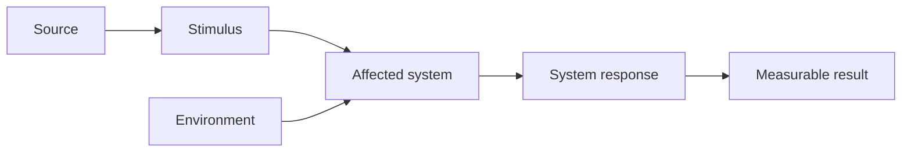
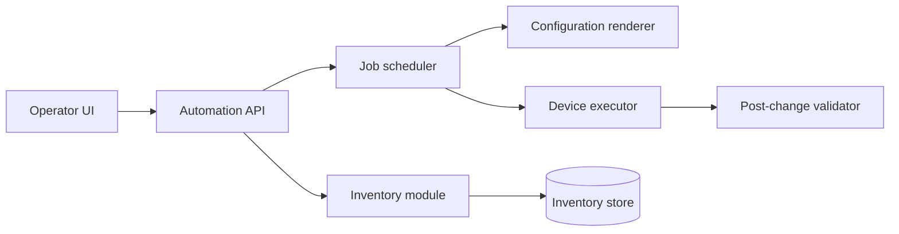
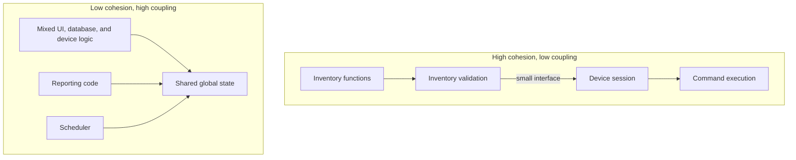
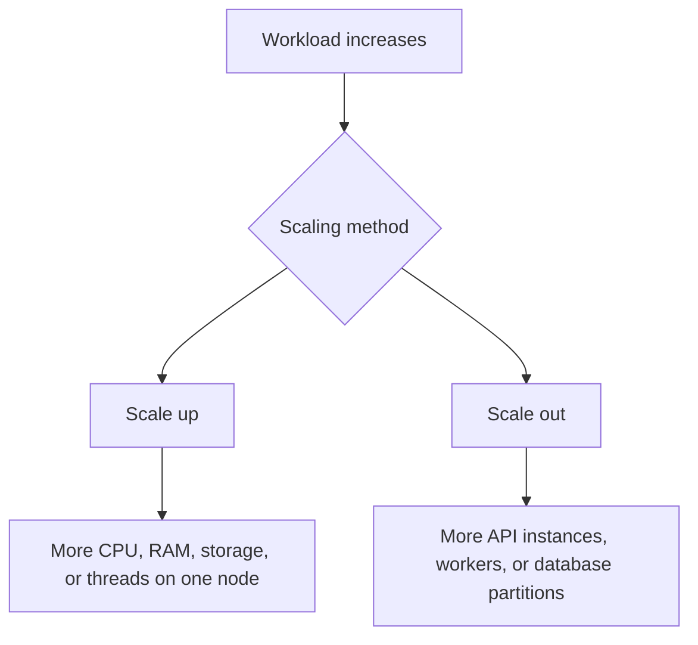
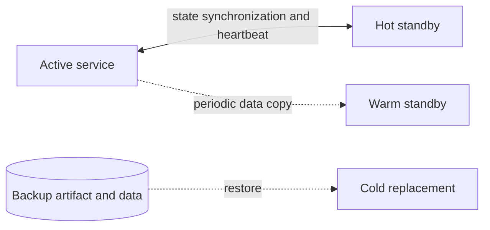
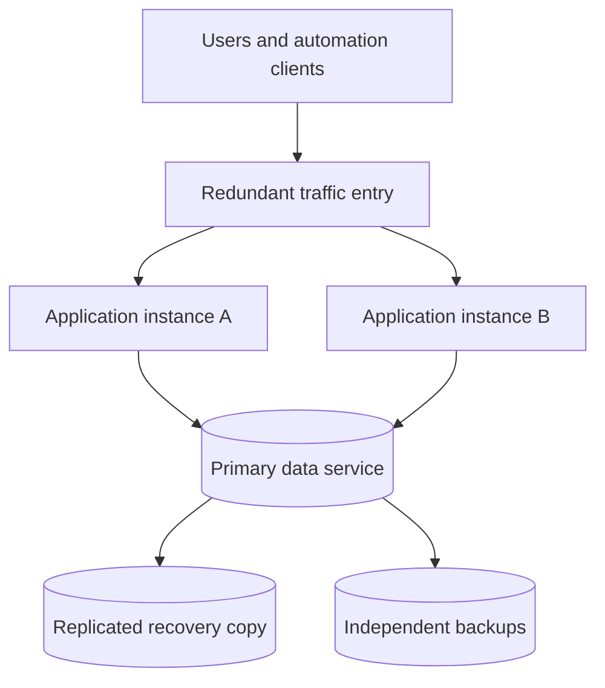
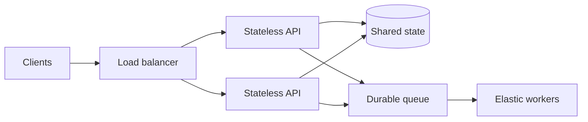
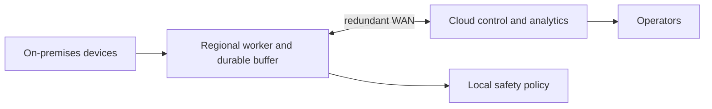

# Chapter 2: Software Quality and Resilience

## Chapter Introduction

Functional requirements tell us **what** an application must do. Quality attributes tell us whether the application is good enough to trust in production. A configuration service may eventually deploy the correct commands, but the design is still poor if the change takes an hour, exposes credentials in logs, loses jobs after a worker restart, or collapses when several engineers use it at once.

This chapter treats quality as an engineering decision rather than a vague promise. Terms such as *fast*, *secure*, *scalable*, and *highly available* become useful only when they are attached to a workload, an operating condition, an expected response, and a measurable target.

Use the following workflow whenever you review an application design:

1. Define measurable quality scenarios.
2. Establish priorities and trade-offs.
3. Design modular components and interfaces.
4. Plan for scale.
5. Engineer availability, resilience, and recovery.
6. Validate the design with evidence.

### A Running Scenario

Imagine a compliance platform that checks 10,000 routers and switches every night. It collects configuration, evaluates policy, and opens remediation jobs for violations. That single workflow raises nearly every quality question in this chapter:

- Can collection finish inside the maintenance window?
- Can workers scale without overwhelming device management planes?
- What happens when the database or WAN is unavailable?
- Can another worker safely resume an interrupted job?
- Can an operator understand why a device was marked noncompliant?

The design is successful only when those questions have measurable answers.

## 1. Quality Attributes and Nonfunctional Requirements

The terms *quality attribute* and *nonfunctional requirement* are often used interchangeably. A useful quality requirement describes a measurable response to a specific condition. Statements such as “the service must be fast,” “the platform must be secure,” or “the application must always be available” are too vague to guide design or testing.

A stronger requirement is:

> When 200 operators concurrently request device inventory during normal operation, the API shall return 95 percent of responses within 400 ms and 99 percent within 1 second.

This statement identifies workload, environment, behavior, and measurement. The design can now be tested against it.

### 1.1 Functional Behavior and Quality Are Connected

Quality cannot be evaluated without a function. Performance is measured while the system performs work. Availability is assessed while users attempt to access a service. Security is evaluated while identities request protected operations.

A configuration-compliance service may have the following requirements:

- **Functional:** Compare running device configuration with an approved baseline.
- **Performance:** Evaluate 10,000 devices within 30 minutes.
- **Availability:** Accept compliance jobs during the loss of one worker node.
- **Security:** Permit baseline changes only to authorized roles and record every change.
- **Testability:** Run policy evaluation with simulated device data in CI.
- **Modifiability:** Add a new vendor parser without changing core policy logic.

### 1.2 Common Quality Attributes

| Attribute | Architectural question | Applied measure |
|---|---|---|
| Performance | How quickly and efficiently does the system respond? | p95 latency, jobs/minute, CPU per transaction |
| Security | How does the system protect data and operations? | unauthorized requests rejected, secrets absent from logs |
| Availability | Is the service accessible when required? | successful service minutes per month |
| Resilience | Can acceptable service continue during and after failure? | recovery within 30 seconds without job loss |
| Reliability | How consistently does the system behave over time? | error-free executions over a defined workload |
| Modularity | Can components change independently? | parser replaced without changing scheduling code |
| Modifiability | How safely and efficiently can change be introduced? | effort, files changed, regression rate |
| Usability | Can intended users complete tasks effectively? | task completion time and user-error rate |
| Testability | Can behavior be controlled and observed in tests? | automated coverage of failure paths |
| Interoperability | Can systems exchange and use information? | standards-compliant API and schema validation |
| Serviceability | Can operators install, configure, monitor, and repair it? | deployment time and mean time to diagnose |
| Portability | Can it move across environments? | runs in test and production from the same artifact |

The ISO/IEC 25010 quality model groups characteristics into functional suitability, performance efficiency, compatibility, usability, reliability, security, maintainability, and portability. The model is useful as a checklist, but a project should select and quantify only the attributes relevant to its business context.

## 2. Defining Measurable Quality Scenarios

A quality scenario can be expressed with six parts:

1. **Source:** Who or what creates the event?
2. **Stimulus:** What condition occurs?
3. **Artifact:** Which system or component is affected?
4. **Environment:** Under what operating condition does it occur?
5. **Response:** What does the system do?
6. **Response measure:** How is success quantified?



### 2.1 Measuring Network High Availability

| Scenario element | Value |
|---|---|
| Source | Power system supplying the active switch |
| Stimulus | Power is lost and keepalives stop |
| Artifact | Redundant switching subsystem |
| Environment | Normal production traffic |
| Response | Standby switch assumes the active role using synchronized state |
| Measure | Forwarding resumes within 50 ms and established sessions are preserved |

The same structure applies to software. If an automation worker crashes while processing a device job, the queue can make the unacknowledged task visible to another worker. Success can be measured as reassignment within 10 seconds with no duplicate configuration action.

### 2.2 Trade-offs

Quality attributes influence one another:

- Encrypting and signing data improves security but consumes processing time.
- Synchronous replication improves recovery point and consistency but adds write latency.
- Horizontal distribution improves capacity but introduces network calls and coordination.
- Extensive telemetry improves diagnosability but adds storage, cost, and possible privacy risk.
- Aggressive caching improves response time but may return stale data.
- Strong isolation improves resilience but increases resource usage.

Architecture is therefore a process of prioritization, not maximization. “Maximum security, performance, availability, and flexibility at minimum cost” is not a usable requirement.

## 3. Modularity in Application Design

Modularity divides a system into components with focused responsibilities and controlled interactions. It reduces the amount of code and knowledge that must change together.



Each module has a clear purpose. The renderer creates candidate configuration from desired state but does not open device sessions. The executor applies a supplied candidate but does not decide business intent. This separation makes each responsibility easier to test and replace.

### 3.1 Benefits of Modularity

- Smaller changes reduce regression risk.
- Code is easier to understand, review, and debug.
- Teams can work on separate components with less coordination.
- Modules can be reused across workflows.
- Sensitive responsibilities can receive focused security controls.
- Components with different workloads can scale independently.
- Failures can be isolated behind stable interfaces.

### 3.2 Cohesion and Coupling

**Cohesion** measures how closely the responsibilities inside one module relate. High cohesion is desirable. **Coupling** measures dependency between modules. Low coupling is desirable.



A module with unrelated user-interface, database, and device-access behavior has low cohesion. If several modules modify the same global variables or database tables directly, they are tightly coupled.

### 3.3 Black-Box Behavior and Statelessness

A black-box module exposes a documented interface while hiding implementation details. Given the same input and conditions, it should produce a predictable result.

Stateless components support predictable behavior and horizontal scale. If a worker stores job state only in local memory, another worker cannot safely continue after failure. Persisting job state externally allows replacement instances to resume work.

Not every component can be stateless. Databases, queues, and topology stores hold state by design. The goal is to place state deliberately in systems engineered to protect it.

### 3.4 Interface Design

Good interfaces are:

- Small and specific
- Stable and versioned
- Explicit about input, output, and failure
- Independent of internal data representation
- Protected by validation and authorization
- Observable with correlation identifiers

The interface `deploy_config(device_id, candidate, change_id)` is preferable to one that exposes internal database objects and allows callers to alter execution state directly.

### 3.5 Microservices and Modularity

Microservices apply modularity at deployment level. Each service has a focused purpose, a defined interface, independent ownership, and potentially its own data.

Microservices can improve independent scaling and release frequency, but they are not automatically well designed. Services that share tables, require synchronized deployment, or make long chains of synchronous calls remain tightly coupled.

A modular monolith is often the better starting point for a small automation team. Service extraction becomes justified when a boundary has different scaling, security, ownership, or release requirements.

## 4. Scalability in Application Design

Scalability is the ability to add resources and maintain acceptable behavior as workload grows. Growth can involve:

- More functions or device types
- More users, tenants, or concurrent sessions
- Higher request or event rate
- Larger datasets
- Wider geographic coverage
- New external systems and vendors

### 4.1 Horizontal and Vertical Scaling



**Vertical scaling** adds capacity to one node. It is operationally simple but limited by the largest available system and may retain a single point of failure.

**Horizontal scaling** adds nodes. It provides elastic capacity and fault tolerance but requires load distribution, shared-state design, partitioning, and coordination.

**Elasticity** adds and removes resources according to measured or predicted demand. Scheduled scaling can prepare for known events, while metric-based scaling can react to queue depth, CPU, or request rate.

### 4.2 Load Balancing

A load balancer presents one service endpoint and distributes work across healthy instances. It may use round robin, weighted distribution, least connections, latency, or a stable hash.

Application health checks should verify readiness, not only port availability. An API process that accepts TCP connections but cannot reach its required database should normally be removed from service.

Network load can also be distributed with equal-cost multipath routing, traffic engineering, or SDN policy. Application and network load balancing solve related but different problems and should be observed together.

### 4.3 Data Scaling

Application scale often exposes data bottlenecks. Techniques include:

- Indexes for frequent query patterns
- Read replicas for read-heavy workloads
- Caching near consumers
- Connection pooling
- Partitioning or sharding
- Asynchronous writes through a queue
- Retention and aggregation policies

Sharding divides a dataset horizontally across nodes. A poor shard key can create one hot partition. Partitioning telemetry only by date may direct every current write to one partition, while combining device identity with a time bucket can distribute load more evenly.

### 4.4 Capacity Analysis

An automation system has 20 workers. Each worker completes an average of 30 device checks per minute. The theoretical rate is 600 checks per minute, but authentication, retries, and database writes reduce sustained capacity to 450.

If 12,000 devices must be checked in 20 minutes, the system requires 600 sustained checks per minute. Adding API servers does not solve the worker bottleneck. The design could add workers, reduce per-device round trips, reuse sessions safely, or move collection closer to remote sites.

### 4.5 Scalability Measures

Measure at baseline and peak load:

- Concurrent users and sessions
- Requests, jobs, or events per second
- Queue depth and processing lag
- Response-time percentiles
- CPU, memory, disk, and network utilization
- Database connections and query latency
- Cost per transaction or managed device

A scalable design should gain useful capacity from added resources without a major architectural rewrite.

## 5. High Availability and Resilience

Availability maximizes service uptime. Resilience preserves acceptable behavior during disruption and restores normal behavior quickly.

```text
Availability = MTBF / (MTBF + MTTR)
```

- **MTBF:** Mean time between failures
- **MTTR:** Mean time to repair, recover, or restore

Improving availability means increasing reliable operating time, reducing recovery time, or both.

### 5.1 Availability Targets

| Target | Approximate maximum downtime per year |
|---|---:|
| 99% | 3 days, 15 hours, 36 minutes |
| 99.9% | 8 hours, 46 minutes |
| 99.99% | 52 minutes, 34 seconds |
| 99.999% | 5 minutes, 15 seconds |

An end-to-end service depends on all required components. If every request needs an identity service, database, and controller, each dependency contributes to overall availability. Redundant application servers cannot compensate for a single required database with a lower target.

### 5.2 Failure, Fault, and Error

- A **failure** is externally observable incorrect behavior.
- A **fault** is the defective condition, such as incorrect code.
- An **error** is an incorrect internal state that may lead to failure.

The terms are often used loosely in practice, but distinguishing symptoms from causes improves diagnosis.

### 5.3 Detection

Failure detection mechanisms include:

- External monitoring
- Internal self-tests
- Heartbeats between redundant components
- Health checks
- Ping and path testing
- Sanity checks on important results
- Logs, metrics, and traces

A ping proves IP reachability, not application correctness. A readiness test for a network automation worker may verify that it can read its queue, retrieve credentials, and access required device networks.

### 5.4 Recovery Patterns

#### Redundancy Models

| Model | State before failure | Recovery characteristics |
|---|---|---|
| Hot standby | Running with synchronized state | Fastest takeover, highest resource cost |
| Warm standby | Running but requires state loading or convergence | Moderate recovery time and cost |
| Cold standby | Powered down or requires manual initialization | Lowest cost, longest recovery |



Other recovery mechanisms include:

- Bounded retries with exponential backoff and jitter
- Timeouts for every remote call
- Rollback to a known-good release or configuration
- In-service or rolling upgrades
- Automatic replacement of unhealthy instances
- Checkpointing long-running jobs

Retries must be controlled. If 1,000 workers retry a failed controller immediately, they can prevent its recovery. Idempotency keys or operation identifiers protect against duplicate changes.

### 5.5 Prevention

Preventive practices include:

- Isolate faulty components.
- Validate changes before deployment.
- Automate repeatable procedures.
- Use predictive analysis of telemetry and historical failures.
- Patch software and dependencies through controlled releases.
- Test capacity, failover, restoration, and rollback.
- Protect services from resource exhaustion and denial of service.

## 6. Business Continuity and Deployment Models

Business continuity planning keeps essential processes operating. Disaster recovery restores services after a major site or regional event.

### 6.1 Recovery Objectives

- **RTO:** Maximum acceptable time to restore service.
- **RPO:** Maximum acceptable amount of data loss measured in time.

A compliance dashboard may tolerate an RTO of two hours and an RPO of fifteen minutes. A change-control system that records production actions may require a much smaller RPO.

### 6.2 Deployment Building Blocks

- Data backup and tested restoration
- Replication across failure domains
- Clusters with replaceable nodes
- Redundant load balancers and network paths
- Geographic separation of recovery sites
- Continuous monitoring and failover automation
- Immutable release artifacts and rollback procedures



Replication preserves service continuity but also copies accidental deletion or corruption. Independent backups provide recovery to an earlier known point.

### 6.3 Developer Responsibilities

Developers contribute to HA by ensuring that applications:

- Exit or report clearly when required configuration is invalid.
- Expose liveness and readiness signals.
- Do not depend on local ephemeral state for critical work.
- Handle dependency timeouts and partial failure.
- Support graceful shutdown and job reassignment.
- Use backward-compatible APIs and data migrations.
- Emit actionable telemetry.
- Can be deployed and rolled back predictably.

## 7. Quality Review Checklist

Before approving an application architecture, verify:

- Every important quality attribute has a measurable scenario.
- Attribute priorities and trade-offs are documented.
- Modules have high cohesion, low coupling, and small interfaces.
- State ownership is explicit.
- Scaling bottlenecks have been load-tested.
- Data partitioning and cache consistency are understood.
- No required component is an accidental single point of failure.
- Failover, restoration, and rollback have been exercised.
- RTO, RPO, and availability targets match business value.
- Security and observability are included in normal operation and failure paths.

## 8. Quality Attributes as a Connected Model

Quality attributes should be assessed as a system rather than independent checkboxes. Performance efficiency includes response time, throughput, resource use, and capacity. Reliability includes maturity, availability, fault tolerance, and recoverability. Maintainability includes modularity, reusability, analyzability, modifiability, and testability.

Compatibility includes coexistence and interoperability. A controller integration may operate correctly alone but compete with another workload for database connections or device sessions. Interoperability means more than exchanging bytes; both systems must interpret identity, units, timestamps, and state consistently.

Usability includes recognizability, learnability, operability, accessibility, and protection from user error. A safe automation interface makes the target scope visible, previews the intended change, warns about high-risk devices, and requires confirmation appropriate to impact.

Security qualities include confidentiality, integrity, authenticity, accountability, and nonrepudiation. Configuration data must be visible only to authorized users, protected from unauthorized modification, attributable to an authenticated identity, and recorded so completed actions cannot be plausibly denied.

Portability includes adaptability, installability, and replaceability. Packaging the same service for on-premises and cloud deployment is useful only if external dependencies, data location, network access, and operational tooling are also portable.

## 9. Scalability Architecture in Depth

Scaling begins with a workload model. Request rate alone is insufficient. The model should include payload size, concurrency, read/write ratio, task duration, geographic distribution, data retention, and burst behavior.

### 9.1 Stateless Compute and Shared State

Stateless compute instances can be added behind a load balancer because any instance can serve any request. Session, job, and workflow state must be available through a shared data service.



The shared systems then become scaling dependencies. Connection limits, partitioning, replication, and queue capacity must increase with compute. Autoscaling APIs on CPU alone may create hundreds of database connections and move the bottleneck rather than remove it.

### 9.2 Backpressure and Load Shedding

Backpressure tells producers to slow down when consumers cannot keep pace. A bounded queue, concurrency semaphore, or `429` response prevents unlimited work from entering the system.

Load shedding rejects lower-priority work to preserve essential functions. During a controller outage, the system may stop scheduled inventory refresh while preserving operator access to existing data and emergency rollback.

### 9.3 Geographic Scaling

Serving multiple regions introduces data sovereignty, latency, routing, and consistency choices. Read-mostly content can be replicated near users. Write ownership may remain in one region or be partitioned by tenant or site.

Regional automation workers can reduce management-plane latency to branch devices. Central policy remains authoritative, while workers cache signed policy and buffer results during WAN interruption. The system must reconcile delayed events without treating old state as current.

### 9.4 Scalability Validation

Load testing should include ramp, steady-state, burst, and endurance phases. A short test may confirm peak throughput while missing memory leaks, connection exhaustion, index growth, or queue accumulation.

Results should report percentiles, saturation, errors, and cost. Doubling resources but gaining only ten percent throughput signals a constrained dependency or coordination overhead.

## 10. Availability Engineering in Depth

An availability target should identify service boundaries and planned maintenance. A dashboard remaining online is not useful if every data collector has stopped and displayed state is obsolete. Freshness may therefore be part of availability.

### 10.1 Dependency Availability

For components required in series, end-to-end availability is approximately the product of individual availability values. Three required services at 99.9 percent each produce roughly 99.7 percent before other dependencies are counted.

Optional dependencies should fail without taking down the primary function. A reporting engine outage need not prevent job submission. Circuit breakers, bounded resource pools, and fallback behavior enforce that separation.

### 10.2 Failure Domains

Redundancy must cross the failure domain being mitigated. Two virtual machines on one physical host do not protect against host failure. Two clusters using one database do not protect against database failure. Two sites using one identity provider do not provide independent site continuity.

Failure-domain analysis includes:

- Process and instance
- Host and rack
- Network device and path
- Power and cooling
- Storage system
- Availability zone and region
- Identity, DNS, certificate, and control-plane services
- Human and deployment process

### 10.3 Split-Brain and Quorum

When redundant systems lose communication, both may believe they are active. This split-brain state can create conflicting writes or duplicate device changes. Quorum, fencing, leases, and witness systems help ensure that only the authorized partition continues mutation.

Network devices use comparable mechanisms. Dual-active detection protects redundant switching systems from operating simultaneously after loss of their synchronization link.

### 10.4 Data Protection

Replication supports continuity; backup supports recovery from corruption, deletion, ransomware, and logic defects. Recovery tests must restore data into an isolated environment, verify integrity, and measure time.

Synchronous replication provides a smaller RPO but increases latency and may reduce write availability during partition. Asynchronous replication improves local response and fault isolation but can lose recent writes during failover. The business impact determines the correct trade-off.

### 10.5 Maintenance Without Outage

Rolling upgrades replace capacity gradually. Blue-green deployment maintains two complete environments and redirects traffic. In-service upgrades preserve forwarding or session state where the platform supports them.

Backward-compatible APIs and data formats are prerequisites. If the new release writes events the old release cannot read, rollback may fail even when the old binary remains available.

## 11. Resilience Verification

Resilience should be demonstrated through controlled failure:

- Terminate an application instance during active requests.
- Delay or deny database access.
- Disconnect a queue consumer after performing work but before acknowledgment.
- Exhaust a dependency's rate limit.
- Interrupt the WAN between regional worker and central service.
- Introduce malformed device responses.
- Restore a backup and compare recovered state.

The test must observe user impact, duplicate actions, data integrity, alert quality, and recovery time. A system that automatically restarts but loses jobs is not resilient.

Failure exercises also evaluate people and procedures. Operators need clear ownership, decision authority, communication channels, and runbooks. Technical redundancy cannot compensate for an unknown recovery process.

## 12. Security, Usability, and Interoperability Scenarios

Security is testable only when the protected asset, threat, operating condition, response, and measure are identified. “The platform is secure” is not a quality requirement.

| Source and stimulus | Required response | Measure |
|---|---|---|
| Unauthorized user submits configuration | Reject and record the attempt | `403`, no job created, audit event within 5 seconds |
| Token is replayed after revocation | Deny protected access | Rejection on next validation |
| Secret appears in application input | Prevent storage in ordinary logs | No matching secret in log test corpus |
| Excessive API requests arrive | Protect service capacity | Essential traffic remains within latency SLO |

Usability affects safety. If operators cannot distinguish a preview from a committed change, the interface encourages error. The system should display target count, sites, device roles, expected diff, maintenance window, and rollback readiness before approval.

User-error protection can require an additional confirmation for large scope, but repeated confirmation dialogs become ineffective. Risk-based interaction is stronger: routine low-risk read operations remain efficient, while destructive or broad changes require stronger evidence and authorization.

Interoperability requires syntactic and semantic agreement. Two systems may both use JSON while interpreting `status: down` differently. Contracts should define identifiers, units, timezones, enum meaning, null behavior, and lifecycle. Schema validation proves shape; integration tests prove shared meaning.

## 13. Testability and Serviceability

A testable component exposes controllable inputs and observable outputs. Time, random identifiers, network clients, and data stores should be replaceable in tests. Hidden global state and direct calls to production services make behavior difficult to reproduce.

A device driver can be tested against captured and sanitized protocol responses. The orchestration service can use a fake driver that returns success, timeout, authentication failure, partial commit, or malformed output. The purpose is not to imitate every device detail but to exercise the application's decisions.

Serviceability helps operators diagnose and repair the deployed system. It includes:

- Version and build information
- Health and readiness endpoints
- Structured events and correlation identifiers
- Configuration validation
- Safe diagnostic commands
- Runbooks and ownership
- Backup and restoration tooling
- Controlled feature flags

An error message should state what failed, the affected object, the relevant identifier, and what evidence is available. It should not expose a password or raw token.

## 14. Cost as an Architectural Constraint

Quality has a resource cost. Five-nines availability requires redundant capacity, operational coverage, tested failover, and compatible dependencies. Storing detailed telemetry indefinitely increases database and governance cost. Multi-region active-active design increases network, data, and testing complexity.

Cost should be evaluated per useful unit, such as API request, telemetry sample, managed device, or completed change. A design that scales technically but whose cost grows faster than customer value is not sustainable.

Reserved baseline capacity can handle normal demand, while elastic workers handle periodic compliance scans. Storage policies can keep detailed telemetry for short-term diagnosis and retain lower-resolution aggregates for trends. Quality targets should direct investment toward business-critical paths.

## 15. Availability Planning Across Environments

On-premises design must account for physical servers, storage, power, network paths, facilities, hardware lead time, and staffing. Cloud design replaces some hardware responsibilities with service configuration, quotas, identity, region selection, and shared-responsibility decisions.

Hybrid systems inherit both environments and the connection between them. An on-premises worker can continue local collection during cloud disconnection and buffer events. Cloud dashboards can report that data is stale rather than display the last value as current.



Recovery planning identifies which side is authoritative, how conflict is resolved, how backlog is limited, and which capabilities remain available during partition. Hybrid availability is not achieved merely by deploying components in two places.

> **Study guide takeaway:** Quality attributes become architecture only after they are measurable. Replace “highly available” with a failure scenario and recovery target; replace “scalable” with a workload and capacity target; replace “secure” with a protected asset, threat, and verifiable control.

## Key Takeaways

- Quality attributes become useful when they are expressed through measurable scenarios and acceptance thresholds.
- Modularity supports controlled change, testing, reuse, security, and independent scaling.
- Scalability, high availability, and resilience require deliberate trade-offs across compute, data, traffic, geography, recovery, and cost.

Chapter 3 builds on these quality goals by showing how architecture, performance engineering, observability, and database selection make them achievable.

## Further Reading and References

- [Google Site Reliability Engineering books](https://sre.google/books/) - availability, reliability, SLO, and incident practices.
- [AWS Well-Architected Framework](https://docs.aws.amazon.com/wellarchitected/latest/framework/welcome.html) - quality trade-offs for cloud systems.
