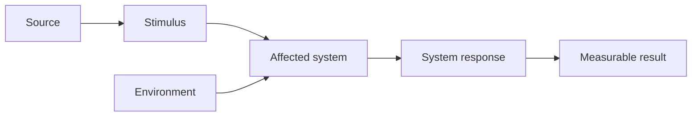
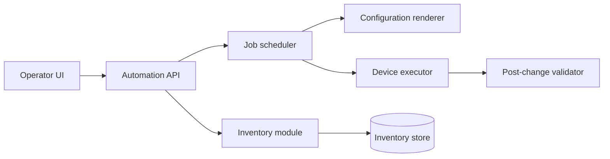
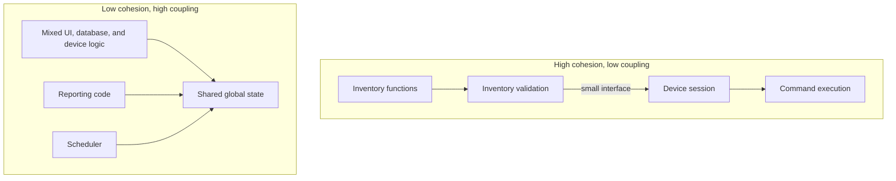
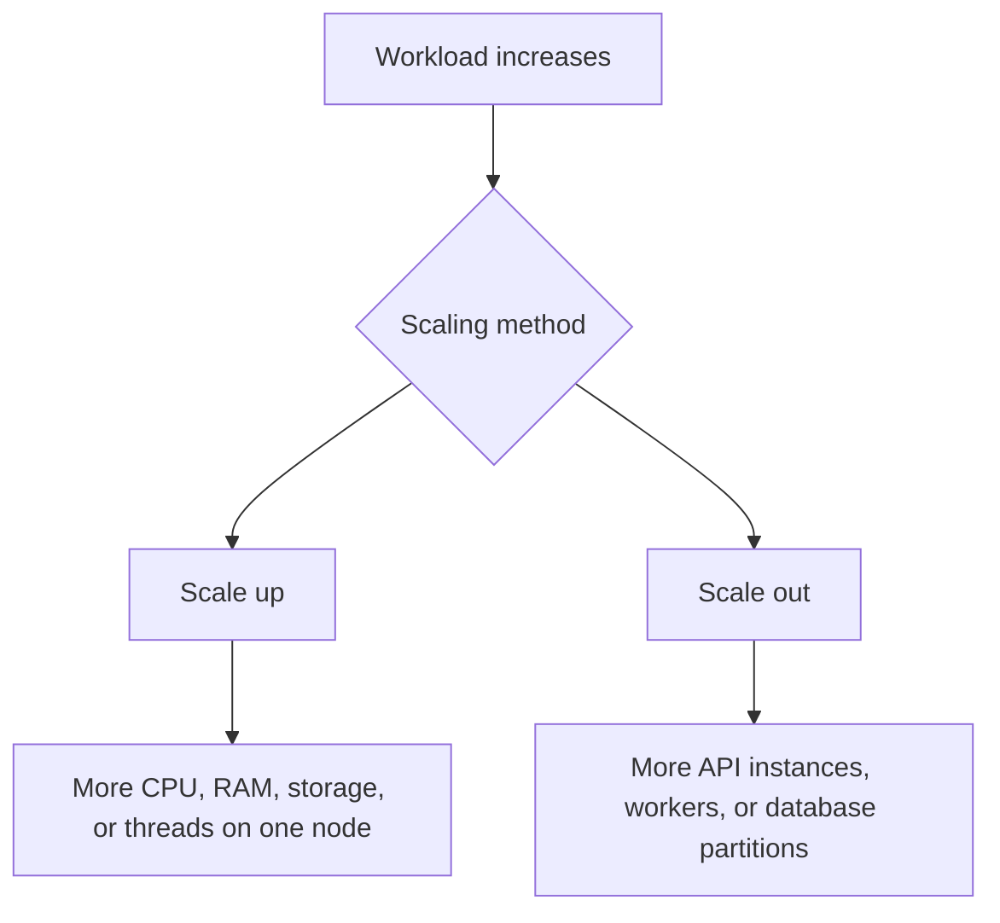
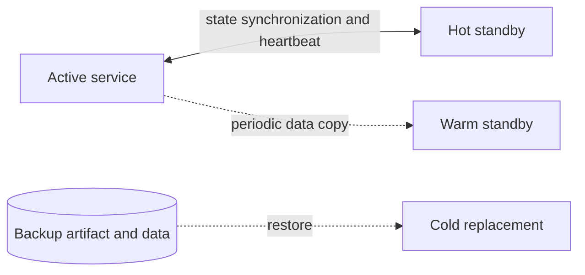
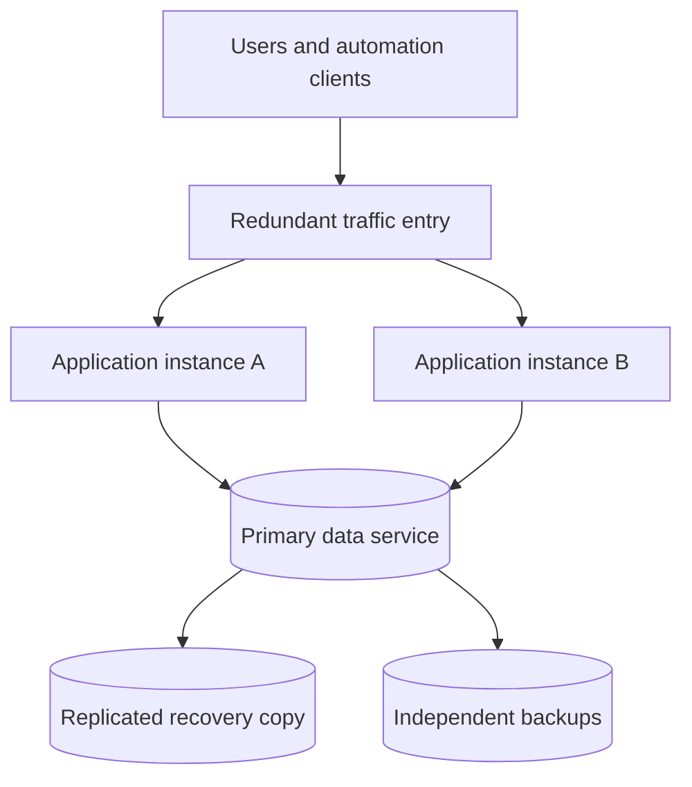

# Chapter 2: Software Quality Attributes

## Chapter Purpose

Functional requirements describe what an application does. Quality attributes describe how well it performs those functions under defined conditions. A network automation service may correctly deploy a configuration, but it is not a successful design if it takes an hour, exposes credentials, fails when one worker stops, or cannot support the required number of devices.

This chapter reorganizes software quality into a practical architecture workflow:

1. Define measurable quality scenarios.
2. Establish priorities and trade-offs.
3. Design modular components and interfaces.
4. Plan for scale.
5. Engineer availability, resilience, and recovery.
6. Validate the design with evidence.

## 1. Quality Attributes and Nonfunctional Requirements

The terms *quality attribute* and *nonfunctional requirement* are often used interchangeably. A useful quality requirement describes a measurable response to a specific condition. Statements such as “the service must be fast,” “the platform must be secure,” or “the application must always be available” are too vague to guide design or testing.

A stronger requirement is:

> When 200 operators concurrently request device inventory during normal operation, the API shall return 95 percent of responses within 400 ms and 99 percent within 1 second.

This statement identifies workload, environment, behavior, and measurement. The design can now be tested against it.

### 1.1 Functional Behavior and Quality Are Connected

Quality cannot be evaluated without a function. Performance is measured while the system performs work. Availability is assessed while users attempt to access a service. Security is evaluated while identities request protected operations.

A configuration-compliance service may have the following requirements:

- **Functional:** Compare running device configuration with an approved baseline.
- **Performance:** Evaluate 10,000 devices within 30 minutes.
- **Availability:** Accept compliance jobs during the loss of one worker node.
- **Security:** Permit baseline changes only to authorized roles and record every change.
- **Testability:** Run policy evaluation with simulated device data in CI.
- **Modifiability:** Add a new vendor parser without changing core policy logic.

### 1.2 Common Quality Attributes

| Attribute | Architectural question | Applied measure |
|---|---|---|
| Performance | How quickly and efficiently does the system respond? | p95 latency, jobs/minute, CPU per transaction |
| Security | How does the system protect data and operations? | unauthorized requests rejected, secrets absent from logs |
| Availability | Is the service accessible when required? | successful service minutes per month |
| Resilience | Can acceptable service continue during and after failure? | recovery within 30 seconds without job loss |
| Reliability | How consistently does the system behave over time? | error-free executions over a defined workload |
| Modularity | Can components change independently? | parser replaced without changing scheduling code |
| Modifiability | How safely and efficiently can change be introduced? | effort, files changed, regression rate |
| Usability | Can intended users complete tasks effectively? | task completion time and user-error rate |
| Testability | Can behavior be controlled and observed in tests? | automated coverage of failure paths |
| Interoperability | Can systems exchange and use information? | standards-compliant API and schema validation |
| Serviceability | Can operators install, configure, monitor, and repair it? | deployment time and mean time to diagnose |
| Portability | Can it move across environments? | runs in test and production from the same artifact |

The ISO/IEC 25010 quality model groups characteristics into functional suitability, performance efficiency, compatibility, usability, reliability, security, maintainability, and portability. The model is useful as a checklist, but a project should select and quantify only the attributes relevant to its business context.

## 2. Defining Measurable Quality Scenarios

A quality scenario can be expressed with six parts:

1. **Source:** Who or what creates the event?
2. **Stimulus:** What condition occurs?
3. **Artifact:** Which system or component is affected?
4. **Environment:** Under what operating condition does it occur?
5. **Response:** What does the system do?
6. **Response measure:** How is success quantified?



### 2.1 Measuring Network High Availability

| Scenario element | Value |
|---|---|
| Source | Power system supplying the active switch |
| Stimulus | Power is lost and keepalives stop |
| Artifact | Redundant switching subsystem |
| Environment | Normal production traffic |
| Response | Standby switch assumes the active role using synchronized state |
| Measure | Forwarding resumes within 50 ms and established sessions are preserved |

The same structure applies to software. If an automation worker crashes while processing a device job, the queue can make the unacknowledged task visible to another worker. Success can be measured as reassignment within 10 seconds with no duplicate configuration action.

### 2.2 Trade-offs

Quality attributes influence one another:

- Encrypting and signing data improves security but consumes processing time.
- Synchronous replication improves recovery point and consistency but adds write latency.
- Horizontal distribution improves capacity but introduces network calls and coordination.
- Extensive telemetry improves diagnosability but adds storage, cost, and possible privacy risk.
- Aggressive caching improves response time but may return stale data.
- Strong isolation improves resilience but increases resource usage.

Architecture is therefore a process of prioritization, not maximization. “Maximum security, performance, availability, and flexibility at minimum cost” is not a usable requirement.

## 3. Modularity in Application Design

Modularity divides a system into components with focused responsibilities and controlled interactions. It reduces the amount of code and knowledge that must change together.



Each module has a clear purpose. The renderer creates candidate configuration from desired state but does not open device sessions. The executor applies a supplied candidate but does not decide business intent. This separation makes each responsibility easier to test and replace.

### 3.1 Benefits of Modularity

- Smaller changes reduce regression risk.
- Code is easier to understand, review, and debug.
- Teams can work on separate components with less coordination.
- Modules can be reused across workflows.
- Sensitive responsibilities can receive focused security controls.
- Components with different workloads can scale independently.
- Failures can be isolated behind stable interfaces.

### 3.2 Cohesion and Coupling

**Cohesion** measures how closely the responsibilities inside one module relate. High cohesion is desirable. **Coupling** measures dependency between modules. Low coupling is desirable.



A module with unrelated user-interface, database, and device-access behavior has low cohesion. If several modules modify the same global variables or database tables directly, they are tightly coupled.

### 3.3 Black-Box Behavior and Statelessness

A black-box module exposes a documented interface while hiding implementation details. Given the same input and conditions, it should produce a predictable result.

Stateless components support predictable behavior and horizontal scale. If a worker stores job state only in local memory, another worker cannot safely continue after failure. Persisting job state externally allows replacement instances to resume work.

Not every component can be stateless. Databases, queues, and topology stores hold state by design. The goal is to place state deliberately in systems engineered to protect it.

### 3.4 Interface Design

Good interfaces are:

- Small and specific
- Stable and versioned
- Explicit about input, output, and failure
- Independent of internal data representation
- Protected by validation and authorization
- Observable with correlation identifiers

The interface `deploy_config(device_id, candidate, change_id)` is preferable to one that exposes internal database objects and allows callers to alter execution state directly.

### 3.5 Microservices and Modularity

Microservices apply modularity at deployment level. Each service has a focused purpose, a defined interface, independent ownership, and potentially its own data.

Microservices can improve independent scaling and release frequency, but they are not automatically well designed. Services that share tables, require synchronized deployment, or make long chains of synchronous calls remain tightly coupled.

A modular monolith is often the better starting point for a small automation team. Service extraction becomes justified when a boundary has different scaling, security, ownership, or release requirements.

## 4. Scalability in Application Design

Scalability is the ability to add resources and maintain acceptable behavior as workload grows. Growth can involve:

- More functions or device types
- More users, tenants, or concurrent sessions
- Higher request or event rate
- Larger datasets
- Wider geographic coverage
- New external systems and vendors

### 4.1 Horizontal and Vertical Scaling



**Vertical scaling** adds capacity to one node. It is operationally simple but limited by the largest available system and may retain a single point of failure.

**Horizontal scaling** adds nodes. It provides elastic capacity and fault tolerance but requires load distribution, shared-state design, partitioning, and coordination.

**Elasticity** adds and removes resources according to measured or predicted demand. Scheduled scaling can prepare for known events, while metric-based scaling can react to queue depth, CPU, or request rate.

### 4.2 Load Balancing

A load balancer presents one service endpoint and distributes work across healthy instances. It may use round robin, weighted distribution, least connections, latency, or a stable hash.

Application health checks should verify readiness, not only port availability. An API process that accepts TCP connections but cannot reach its required database should normally be removed from service.

Network load can also be distributed with equal-cost multipath routing, traffic engineering, or SDN policy. Application and network load balancing solve related but different problems and should be observed together.

### 4.3 Data Scaling

Application scale often exposes data bottlenecks. Techniques include:

- Indexes for frequent query patterns
- Read replicas for read-heavy workloads
- Caching near consumers
- Connection pooling
- Partitioning or sharding
- Asynchronous writes through a queue
- Retention and aggregation policies

Sharding divides a dataset horizontally across nodes. A poor shard key can create one hot partition. Partitioning telemetry only by date may direct every current write to one partition, while combining device identity with a time bucket can distribute load more evenly.

### 4.4 Capacity Analysis

An automation system has 20 workers. Each worker completes an average of 30 device checks per minute. The theoretical rate is 600 checks per minute, but authentication, retries, and database writes reduce sustained capacity to 450.

If 12,000 devices must be checked in 20 minutes, the system requires 600 sustained checks per minute. Adding API servers does not solve the worker bottleneck. The design could add workers, reduce per-device round trips, reuse sessions safely, or move collection closer to remote sites.

### 4.5 Scalability Measures

Measure at baseline and peak load:

- Concurrent users and sessions
- Requests, jobs, or events per second
- Queue depth and processing lag
- Response-time percentiles
- CPU, memory, disk, and network utilization
- Database connections and query latency
- Cost per transaction or managed device

A scalable design should gain useful capacity from added resources without a major architectural rewrite.

## 5. High Availability and Resilience

Availability maximizes service uptime. Resilience preserves acceptable behavior during disruption and restores normal behavior quickly.

```text
Availability = MTBF / (MTBF + MTTR)
```

- **MTBF:** Mean time between failures
- **MTTR:** Mean time to repair, recover, or restore

Improving availability means increasing reliable operating time, reducing recovery time, or both.

### 5.1 Availability Targets

| Target | Approximate maximum downtime per year |
|---|---:|
| 99% | 3 days, 15 hours, 36 minutes |
| 99.9% | 8 hours, 46 minutes |
| 99.99% | 52 minutes, 34 seconds |
| 99.999% | 5 minutes, 15 seconds |

An end-to-end service depends on all required components. If every request needs an identity service, database, and controller, each dependency contributes to overall availability. Redundant application servers cannot compensate for a single required database with a lower target.

### 5.2 Failure, Fault, and Error

- A **failure** is externally observable incorrect behavior.
- A **fault** is the defective condition, such as incorrect code.
- An **error** is an incorrect internal state that may lead to failure.

The terms are often used loosely in practice, but distinguishing symptoms from causes improves diagnosis.

### 5.3 Detection

Failure detection mechanisms include:

- External monitoring
- Internal self-tests
- Heartbeats between redundant components
- Health checks
- Ping and path testing
- Sanity checks on important results
- Logs, metrics, and traces

A ping proves IP reachability, not application correctness. A readiness test for a network automation worker may verify that it can read its queue, retrieve credentials, and access required device networks.

### 5.4 Recovery Patterns

#### Redundancy Models

| Model | State before failure | Recovery characteristics |
|---|---|---|
| Hot standby | Running with synchronized state | Fastest takeover, highest resource cost |
| Warm standby | Running but requires state loading or convergence | Moderate recovery time and cost |
| Cold standby | Powered down or requires manual initialization | Lowest cost, longest recovery |



Other recovery mechanisms include:

- Bounded retries with exponential backoff and jitter
- Timeouts for every remote call
- Rollback to a known-good release or configuration
- In-service or rolling upgrades
- Automatic replacement of unhealthy instances
- Checkpointing long-running jobs

Retries must be controlled. If 1,000 workers retry a failed controller immediately, they can prevent its recovery. Idempotency keys or operation identifiers protect against duplicate changes.

### 5.5 Prevention

Preventive practices include:

- Isolate faulty components.
- Validate changes before deployment.
- Automate repeatable procedures.
- Use predictive analysis of telemetry and historical failures.
- Patch software and dependencies through controlled releases.
- Test capacity, failover, restoration, and rollback.
- Protect services from resource exhaustion and denial of service.

AI-assisted anomaly detection can help identify unusual CPU, error, or path behavior, but predictions should be treated as evidence rather than unquestioned truth. Automated remediation still needs policy limits, deterministic validation, and audit records.

## 6. Business Continuity and Deployment Models

Business continuity planning keeps essential processes operating. Disaster recovery restores services after a major site or regional event.

### 6.1 Recovery Objectives

- **RTO:** Maximum acceptable time to restore service.
- **RPO:** Maximum acceptable amount of data loss measured in time.

A compliance dashboard may tolerate an RTO of two hours and an RPO of fifteen minutes. A change-control system that records production actions may require a much smaller RPO.

### 6.2 Deployment Building Blocks

- Data backup and tested restoration
- Replication across failure domains
- Clusters with replaceable nodes
- Redundant load balancers and network paths
- Geographic separation of recovery sites
- Continuous monitoring and failover automation
- Immutable release artifacts and rollback procedures



Replication preserves service continuity but also copies accidental deletion or corruption. Independent backups provide recovery to an earlier known point.

### 6.3 Developer Responsibilities

Developers contribute to HA by ensuring that applications:

- Exit or report clearly when required configuration is invalid.
- Expose liveness and readiness signals.
- Do not depend on local ephemeral state for critical work.
- Handle dependency timeouts and partial failure.
- Support graceful shutdown and job reassignment.
- Use backward-compatible APIs and data migrations.
- Emit actionable telemetry.
- Can be deployed and rolled back predictably.

## 7. Quality Review Checklist

Before approving an application architecture, verify:

- Every important quality attribute has a measurable scenario.
- Attribute priorities and trade-offs are documented.
- Modules have high cohesion, low coupling, and small interfaces.
- State ownership is explicit.
- Scaling bottlenecks have been load-tested.
- Data partitioning and cache consistency are understood.
- No required component is an accidental single point of failure.
- Failover, restoration, and rollback have been exercised.
- RTO, RPO, and availability targets match business value.
- Security and observability are included in normal operation and failure paths.

## Chapter Summary

Software quality is contextual and measurable. A good design does not merely claim to be fast, secure, scalable, or available; it describes the event, operating environment, expected response, and acceptance threshold.

Modularity supports change, testing, reuse, security, and scale through cohesive components and controlled interfaces. Scalability requires attention to compute, data, traffic distribution, state, geography, and cost. High availability depends on detection, redundancy, recovery, and prevention, while resilience demands acceptable behavior during disruption. These attributes must be balanced according to business priorities and validated through realistic tests.
