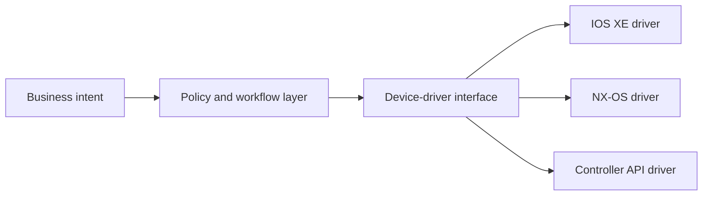
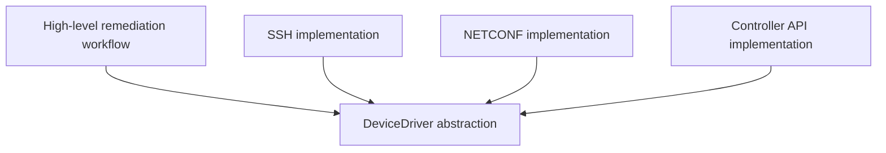
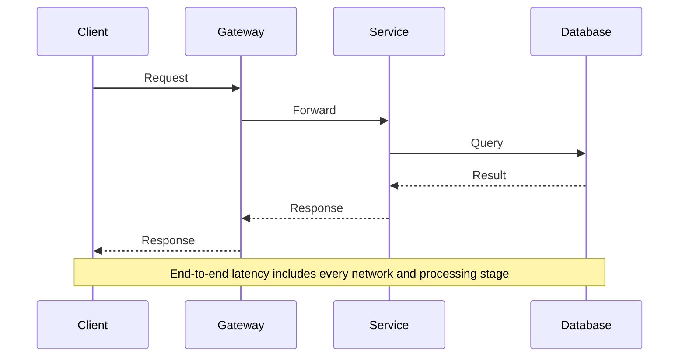
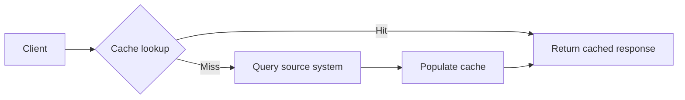
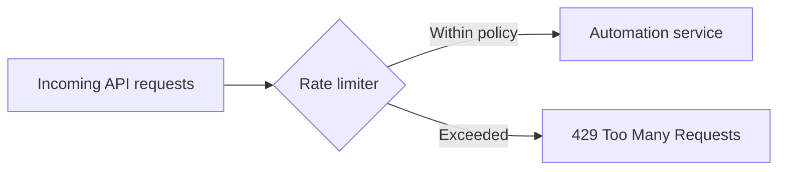
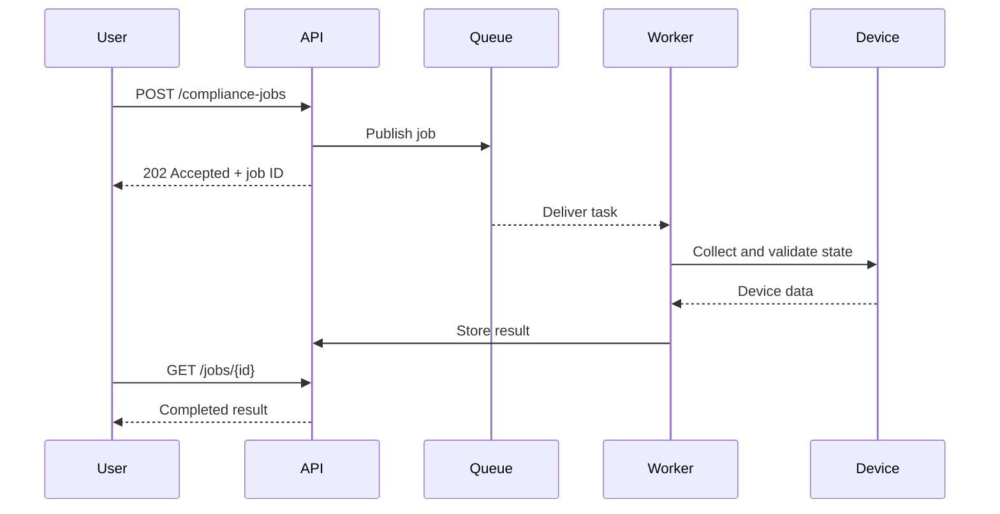
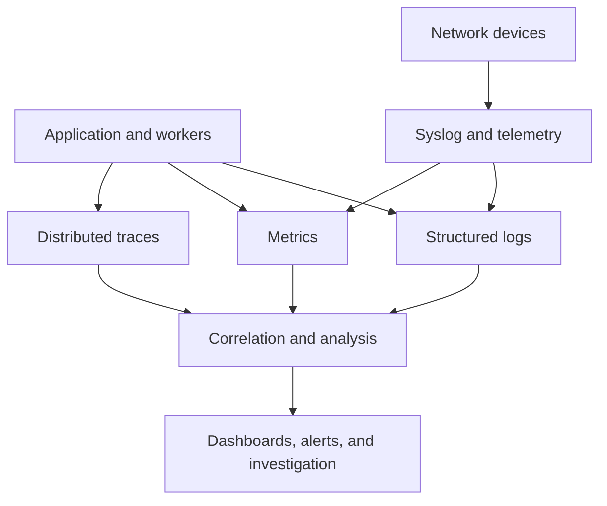
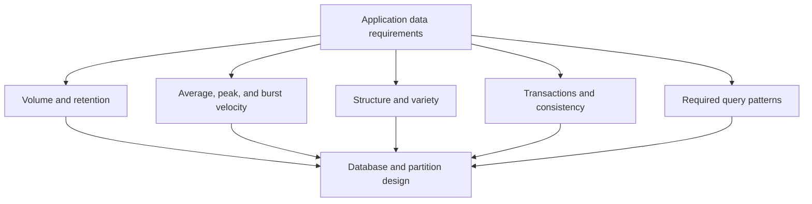
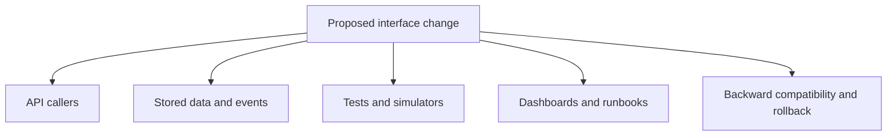
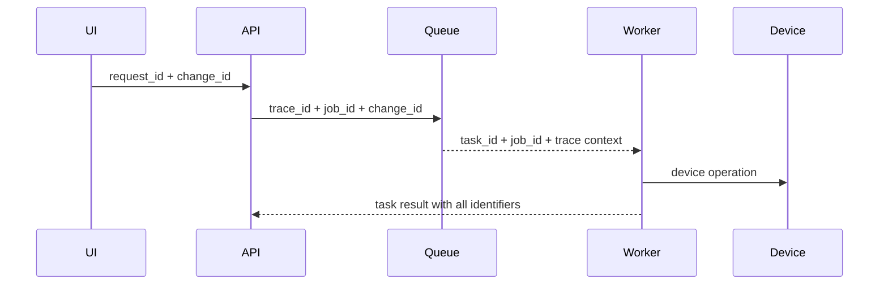

# Chapter 3: Performance, Data, and Observability

## Chapter Introduction

Application architecture affects much more than code organization. It determines how safely the software can change, how efficiently it uses compute and network resources, and how quickly an operations team can understand a failure.

This chapter brings together three concerns that are often discussed separately but behave as one system in production:

- Maintainable design and implementation
- Latency, throughput, and resource protection
- Observability and database selection

Network automation provides the operating context. These applications sit directly between human intent and production infrastructure, so poor maintainability slows every enhancement, poor performance delays operations, and poor observability turns a small fault into a long incident.

### The Engineering Mindset

When an application is slow, resist the temptation to begin by tuning code. First identify the user-visible symptom and follow the request across the application, database, network path, controller, and device. When a change is difficult, look for hidden coupling and unclear ownership rather than simply adding another conditional branch. Evidence should guide both diagnosis and design.

## 1. Maintainable Design and Implementation

Maintainability is the ability to analyze, correct, test, and extend software without introducing unacceptable risk. Modifiability is the ease with which a specific change can be made. Both attributes improve when responsibilities are clear, dependencies are controlled, and behavior is observable.

### 1.1 Sources of Maintenance Cost

Software changes because:

- Business requirements evolve.
- New device families and APIs appear.
- Defects and security vulnerabilities are discovered.
- Libraries and platforms reach end of support.
- Scale and performance expectations increase.
- Compliance policy changes.
- Cloud, data-center, or network architecture changes.

Maintenance includes corrective work, feature enhancement, performance tuning, dependency upgrades, environment migration, and operational support. A quick implementation that ignores these activities transfers cost into the future.

### 1.2 Maintainability Practices

- Use cohesive modules and stable interfaces.
- Separate business policy from device-specific execution.
- Keep configuration outside source code.
- Validate configuration and dependencies at startup.
- Use meaningful names and consistent error handling.
- Automate unit, contract, integration, and regression tests.
- Keep dependencies current and pinned.
- Document architecture decisions and constraints.
- Provide logs, metrics, traces, and health endpoints.
- Build immutable, repeatable deployment artifacts.



The workflow layer depends on an abstraction rather than vendor-specific commands. Adding a new driver does not require rewriting change approval or orchestration logic.

## 2. SOLID Design Principles

SOLID is a group of object-oriented design principles that support maintainable, modular software:

- Single Responsibility Principle
- Open-Closed Principle
- Liskov Substitution Principle
- Interface Segregation Principle
- Dependency Inversion Principle

These principles are design guidance rather than rigid laws. Their purpose is to reduce the impact of change.

### 2.1 Single Responsibility Principle

A class or module should have one primary reason to change. This does not mean one method per class. It means responsibilities affected by different stakeholders or change drivers should be separated.

The following design combines unrelated responsibilities:

```python
class ChangeService:
    def deploy(self, device, commands):
        # validates approval, retrieves secrets, opens SSH,
        # sends commands, writes audit data, and emails users
        ...
```

This class changes when approval policy, credential storage, transport, auditing, or notification changes.

Improved structure:

```python
class ChangeService:
    def __init__(self, authorizer, executor, audit_log, notifier):
        self.authorizer = authorizer
        self.executor = executor
        self.audit_log = audit_log
        self.notifier = notifier

    def deploy(self, request):
        self.authorizer.require_approval(request)
        result = self.executor.apply(request)
        self.audit_log.record(request, result)
        self.notifier.send_result(request, result)
        return result
```

Each collaborator has a focused responsibility and can be tested independently.

### 2.2 Open-Closed Principle

Software entities should be open to extension but closed to unnecessary modification. New behavior should often be added through an implementation of an existing interface rather than by repeatedly editing central conditional logic.

```python
from typing import Protocol

class DeviceDriver(Protocol):
    def apply(self, candidate: str) -> str: ...

class IOSXEDriver:
    def apply(self, candidate: str) -> str:
        return "IOS XE deployment result"

class NXOSDriver:
    def apply(self, candidate: str) -> str:
        return "NX-OS deployment result"
```

The orchestration code can use `DeviceDriver` without knowing every platform type. A new implementation extends support without changing the orchestration algorithm.

### 2.3 Liskov Substitution Principle

An implementation should be usable wherever its base type is expected without violating the base contract. A subtype must not silently change the meaning of an operation or introduce surprising restrictions.

If `DeviceDriver.apply()` promises either a deployment result or a defined `DeploymentError`, one driver should not return `None` for unsupported models while another returns a result. The contract should represent unsupported capability explicitly, perhaps through discovery before deployment.

### 2.4 Interface Segregation Principle

Clients should not depend on methods they do not use. Prefer several focused interfaces over one broad interface that forces implementations to provide meaningless methods.

Read-only telemetry collectors need not implement configuration methods:

```python
class TelemetryReader(Protocol):
    def read_interfaces(self) -> list[dict]: ...

class ConfigurationWriter(Protocol):
    def apply_candidate(self, candidate: str) -> str: ...
```

A device that supports telemetry but not programmatic configuration can implement only the appropriate contract.

### 2.5 Dependency Inversion Principle

High-level policy should not depend directly on low-level implementation details. Both should depend on abstractions.



Dependency injection supplies the selected implementation. Tests can provide a fake driver without opening real network sessions.

## 3. Performance Concepts

Performance measures how efficiently a system completes work under defined load and resource conditions.

### 3.1 Latency, Round-Trip Time, Bandwidth, and Throughput

| Measure | Networking view | Application view |
|---|---|---|
| Latency | Time for data to traverse a path | Time for one operation or stage |
| Round-trip time | Time for request and response across a path | Time for a complete remote interaction |
| Bandwidth | Maximum transfer capacity | Upper bound available to application traffic |
| Throughput | Data delivered per unit time | Requests, jobs, or transactions completed per unit time |

High bandwidth does not guarantee low latency. A long-distance link can carry large amounts of data while each round trip remains slow.



### 3.2 Sources of Latency and Degradation

- Propagation distance
- Congestion, drops, and retransmissions
- Serialization over constrained links
- DNS, TCP, and TLS setup
- Firewalls, proxies, and inspection devices
- CPU, memory, disk, or connection saturation
- Inefficient code or database queries
- Outdated libraries and software defects
- Poor routing or misconfiguration
- Wireless interference
- Excessive synchronous service calls

Network automation has an additional concern: management planes may support far fewer concurrent sessions than data-plane traffic. Unbounded parallel connections can harm device stability.

### 3.3 Latency Budgets

If a user-facing operation must finish in 2 seconds, its components need budgets distributed across the request path:

| Stage | Budget |
|---|---:|
| Gateway and authentication | 150 ms |
| Inventory lookup | 200 ms |
| Policy evaluation | 300 ms |
| Downstream controller | 900 ms |
| Serialization and remaining margin | 450 ms |

The total budget prevents every dependency from choosing a two-second timeout. Timeout values should become shorter as a request moves downstream so the caller retains time to return a controlled error.

## 4. Performance Trade-offs

- **Availability:** Replication and failover coordination can add latency.
- **Scalability:** Distribution adds serialization and network communication.
- **Security:** Encryption and deep inspection consume resources.
- **Consistency:** Synchronous data agreement increases write time.
- **Cost:** Low-latency regions, larger instances, and premium networks cost more.
- **Observability:** Detailed telemetry consumes processing and storage.

Optimization should follow measurement. Improving a fast component while ignoring the slowest dependency adds complexity without meaningful benefit.

## 5. Performance Improvement Techniques

### 5.1 Caching

A cache stores reusable data closer to the consumer or in a faster medium.



Network automation candidates include platform capability data, stable inventory metadata, templates, and vendor documentation. Live interface state and authorization decisions may require short or no caching.

Important considerations:

- Time to live and invalidation
- Stale-data risk
- Cache key design
- Hit and miss ratio
- Memory cost
- Behavior during source failure
- Protection against cache stampede

**Lazy loading** retrieves data when first needed. **Eager loading** retrieves it in advance. Lazy loading reduces startup cost but can make the first request slower. Eager loading improves the first request when the data will certainly be needed but wastes resources otherwise.

### 5.2 Pagination and Batching

Pagination bounds response size. An inventory API should return a controlled number of devices with a continuation token instead of loading an entire global inventory into memory.

Batching reduces protocol overhead. Retrieving 100 interface records in one bounded request can outperform 100 sequential requests. Very large batches, however, increase memory use and failure impact.

### 5.3 Rate Limiting

Rate limiting protects capacity and can enforce quotas or security controls.



Limits can apply per user, tenant, token, endpoint, source, or target device. Common algorithms include fixed window, sliding window, token bucket, and leaky bucket.

A device-automation system can separately limit global jobs, jobs per site, and concurrent sessions per device family. The response should state when retry is appropriate.

### 5.4 Parallel Processing

Parallelism reduces completion time when tasks are independent:

- **Multithreading** can help I/O-bound work such as waiting for devices.
- **Multiprocessing** can help CPU-bound parsing or computation.
- **Distributed workers** provide parallel execution across machines.

Concurrency must be bounded. If a controller safely supports 50 sessions, launching 2,000 tasks simultaneously creates contention and failure rather than speed.

### 5.5 Exponential Backoff

Repeated immediate retries amplify overload. Exponential backoff increases the wait after each failure:

```text
delay = min(cap, base * 2^attempt) + random_jitter
```

Jitter prevents many clients from retrying at the same moment. Operations must be idempotent, or retries must use an idempotency key.

### 5.6 Asynchronous Processing

Long-running tasks should often return `202 Accepted` with a job identifier. A queue buffers requests, workers process at a controlled rate, and clients query job status.



## 6. Designing for Observability

Observability is the ability to understand internal system state from emitted signals. Monitoring checks known conditions; observability supports investigation of unexpected ones.

The primary signals are:

- Logs
- Metrics
- Traces



### 6.1 Logging

Structured logs should include:

- Timestamp and timezone
- Severity
- Service name and version
- Environment and instance
- Request, trace, job, and device identifiers
- Event name and outcome
- Duration
- Error type and stack context

Do not log secrets, tokens, private keys, or full sensitive configurations. A hash or reference identifier may provide correlation without exposing content.

#### Severity Mapping

| Severity | Intended use |
|---|---|
| Emergency/Critical | Service unusable or immediate intervention required |
| Error | Operation failed and needs attention |
| Warning | Unexpected condition with continued operation |
| Notice/Info | Significant or normal lifecycle event |
| Debug | Detailed diagnostic data for controlled use |

Severity should reflect operational impact. If every event is an error, alerts lose meaning.

#### Diagnosing Application Failures from Event-Related Logs

Diagnosis begins with the first user-visible or monitoring symptom and a bounded time window. Search by correlation, trace, request, or job identifier rather than reading unrelated lines chronologically. Reconstruct the event sequence across the API gateway, worker, queue, database, Cisco controller task, and device response. The first error is not always the root cause: a database timeout may follow connection-pool exhaustion, while a device authentication failure may follow an earlier secret-rotation event.

Compare the failing transaction with a successful transaction of the same type. Check application version, instance, environment, input identifiers, duration, retry count, dependency status, and recent deployment or configuration events. Repeated identical errors across every instance suggest a shared dependency or configuration problem; errors isolated to one instance suggest local resource exhaustion, stale configuration, or an unhealthy node. A burst following a release should be correlated with the artifact digest and deployment timeline.

Logs should support a defensible conclusion. Preserve the original event, record timestamps in a consistent timezone, and distinguish facts from inference. If the workflow retries, the log must show each attempt and the final decision so an operator can determine whether the original operation completed remotely. After diagnosis, improve the event schema, metric, alert, or runbook where evidence was missing; observability should become stronger after each difficult incident.

### 6.2 Metrics

Useful application metrics include:

- Request rate, error rate, and duration
- Job creation and completion rate
- Queue depth and oldest-message age
- Device-session success and latency
- Retry and timeout counts
- CPU, memory, disk, and network saturation
- Database latency and connection usage
- Cache hit ratio

Prefer latency distributions and percentiles over averages. p95 and p99 expose slow experiences hidden by the mean.

Metric labels must have controlled cardinality. A label containing every job ID or device serial number can create millions of time series. Detailed identifiers belong in logs or traces.

### 6.3 Tracing

Distributed tracing follows one transaction across components. A trace contains spans representing gateway work, service logic, database calls, queue publication, and downstream APIs.

Tracing reveals:

- Which dependency is slow
- Where errors originate
- Which calls are redundant
- How retries affect duration
- Which route and service version handled the request

Context should propagate through HTTP headers and message metadata. Asynchronous work may continue the same trace or create a linked trace.

### 6.4 Full-Stack View

Application performance may depend on browser behavior, DNS, Internet paths, enterprise WAN, load balancers, services, containers, databases, and device APIs. Application performance monitoring and digital-experience monitoring complement one another by combining code-level behavior with network-path visibility.

### 6.5 Documentation as an Observability Aid

Every module should document:

- Name and responsibility
- Interfaces
- Source-code mapping
- Dependencies and constraints
- Test approach
- Monitoring and health signals
- Owner and escalation path
- Revision history

During an incident, accurate dependency and ownership information reduces time spent discovering how the system is supposed to work.

## 7. Database Selection Criteria

Database choice affects correctness, performance, scale, and maintainability. Selection should begin with data and query requirements rather than a preferred product.

### 7.1 Common Database Models

| Type | Strength | Network automation use |
|---|---|---|
| Relational | Transactions, constraints, joins | users, approvals, jobs, inventory relationships |
| Document | Flexible aggregate documents | configuration snapshots and device facts |
| Key-value | Very fast lookup by key | session, token, or short-lived cache data |
| Graph | Relationship traversal | topology, dependencies, reachability paths |
| Column-family | Distributed high-volume writes | large event and activity datasets |
| Time series | Timestamped ingestion, retention, aggregation | interface counters and telemetry |

A document database stores related fields as flexible JSON-like documents and is useful when device facts or configuration snapshots vary by platform. That flexibility does not remove the need for schema governance: applications should still validate required fields, identifiers, versions, and indexes.

### 7.2 The Three Vs

#### Volume

Estimate bytes, records, indexes, replicas, backup copies, and retention. Query performance depends not only on size in bytes but also on record count and index structure.

#### Velocity

Estimate average and peak ingest rate, burst patterns, read/write mix, and acceptable buffering. A queue can absorb short telemetry bursts, while partitioning can distribute sustained write load.

#### Variety

Determine whether records follow one stable schema or include varied documents, media, and device-specific structures. Flexible storage reduces migration friction but does not eliminate validation requirements.



### 7.3 Migration Cost

Changing database type can require:

- Schema transformation
- Application and SDK changes
- Dual writes or change-data capture
- Data validation
- Cutover and rollback planning
- Temporary capacity
- Downtime or write restrictions

The original choice should be informed, but analysis should not prevent delivery. Validate assumptions with a realistic proof of concept and load profile.

### 7.4 Network Automation Data Design

A platform stores change approvals in a relational database because transactions and audit relationships matter. It writes high-frequency interface counters to a time-series database with a 30-day detailed retention and one-year hourly rollups. Topology relationships are stored in a graph database only if multi-hop path queries justify the added operational burden. Polyglot persistence is valuable when specialized requirements outweigh the cost of operating multiple platforms.

## 8. Performance and Observability Review Checklist

- Are latency, throughput, and capacity targets measurable?
- Is the actual bottleneck known from tests?
- Do timeouts fit within an end-to-end budget?
- Are retries bounded, delayed, and safe?
- Are cache freshness and invalidation defined?
- Are concurrency and rate limits aligned with dependency capacity?
- Can one job be followed across logs, metrics, and traces?
- Are device and application events correlated by time and identifiers?
- Does the database match query, consistency, and scale requirements?
- Can a release be diagnosed and rolled back safely?

## 9. Maintainability Across Architecture and Operations

Maintainability extends beyond source readability. A service is difficult to maintain if its deployment is manual, ownership is unclear, interfaces are undocumented, tests require production access, or operators cannot identify the deployed version.

### 9.1 Change Impact Analysis

Before modifying a component, identify callers, data contracts, deployment dependencies, dashboards, alerts, runbooks, and rollback implications. A change to a device identifier may affect inventory keys, API paths, queue messages, log searches, metric labels, and database relationships.



Impact analysis is easier when dependencies point toward abstractions and data ownership is explicit. Direct database access by unrelated services hides coupling and makes analysis unreliable.

### 9.2 Configuration and Environment

Configuration should be typed, validated, and separated from code. Required values should fail at startup with a clear message rather than fail during a production request. Defaults must be safe and visible.

Development, test, staging, and production should use the same artifact with different external configuration. Environment parity does not require identical scale, but protocol behavior, authentication, database features, and deployment mechanics should remain representative.

### 9.3 Refactoring

Refactoring improves internal structure without intentionally changing external behavior. Automated tests create the safety net. Small refactors integrated frequently are safer than a long-lived rewrite that attempts to replace the entire system.

Duplicated device logic may first be moved into one module, then placed behind a driver interface, and only later extracted into a separate service if independent deployment is justified. Architecture evolves through controlled steps.

## 10. Performance Measurement and Test Design

Performance results are meaningful only when the workload, environment, and measurement method are documented.

### 10.1 Workload Profiles

- A baseline test measures ordinary operation.
- A load test verifies expected peak behavior.
- A stress test pushes beyond the expected limit to observe degradation.
- A spike test introduces a rapid burst.
- An endurance test reveals leaks and accumulating state.
- A capacity test identifies the maximum sustainable workload under an SLO.

A network collection service may perform well with 5,000 reachable devices but behave differently when 20 percent are slow or unreachable. Test distributions should include connection timeout, authentication failure, malformed output, and large payloads.

### 10.2 Coordinated Omission and Percentiles

A load generator that waits for each slow response before sending the next request can understate overload. The test should model the intended arrival rate independently of response time.

Percentiles describe experience better than averages. If 99 requests take 100 ms and one takes 20 seconds, the average hides the outlier while p99 exposes it. Report throughput and errors alongside latency; a service can appear fast because it rejects most work.

### 10.3 Resource Saturation

Utilization shows resource use, while saturation shows queued demand. CPU at 90 percent may be acceptable if latency and run queue remain stable. A connection pool at its limit with waiting requests is saturated even when CPU is low.

Correlate application and network layers:

| Symptom | Application evidence | Network evidence |
|---|---|---|
| Slow device collection | growing worker duration | RTT, loss, path change |
| API timeouts | dependency spans exceed budget | firewall or load-balancer resets |
| Low throughput | queue backlog, pool saturation | constrained WAN or retransmission |
| Intermittent failure | errors on one instance | asymmetric route or failed link member |

## 11. Caching and Consistency

Cache placement can occur in the browser, client library, gateway, service, database layer, CDN, or regional edge. Every cache creates a consistency decision.

### 11.1 Cache Patterns

- **Cache-aside:** Application checks cache, loads on miss, and populates it.
- **Read-through:** Cache retrieves from the source automatically.
- **Write-through:** Writes update cache and backing store synchronously.
- **Write-behind:** Cache acknowledges first and persists asynchronously.

Cache-aside is common and simple, but concurrent misses can create a stampede. Request coalescing, randomized expiry, and stale-while-revalidate behavior reduce synchronized reloads.

Invalidation can be time-based, event-based, or version-based. Time-to-live is easy but permits staleness. An inventory event can invalidate a device record promptly, but lost events must not leave incorrect data forever. Combining event invalidation with a maximum TTL provides a safety bound.

## 12. Rate Limiting and Fairness

Rate limiting protects both provider and dependencies. A global limit prevents complete overload, while per-tenant and per-target limits prevent one consumer from exhausting shared capacity.

A token bucket supports bursts up to bucket capacity and refills at a controlled rate. A leaky bucket shapes output at a steady rate. Fixed windows are simple but allow bursts at time boundaries. Sliding windows provide smoother enforcement at greater tracking cost.

When a controller returns `429`, the client should honor `Retry-After`. When a device management plane permits only a few sessions, the application may enforce its own semaphore without waiting for failure.

## 13. Observability Data Design

Telemetry needs a schema and lifecycle. Logs should use stable event names and fields. Metrics should define units and label bounds. Traces should propagate context through HTTP, queues, and scheduled work.

### 13.1 Correlation

One user operation may create a request ID, change ID, job ID, device task ID, and trace ID. These identifiers serve different scopes and should be logged together when the scopes meet.



### 13.2 Alert Quality

An alert should identify impact, evidence, urgency, owner, and first diagnostic action. CPU thresholds alone create noise. An alert that reports rising job failure rate, affected regions, deployed version, and linked traces is actionable.

SLO-based alerts watch user-impact risk over time. A fast-burn alert detects rapid error-budget consumption, while a slow-burn alert detects persistent smaller degradation.

## 14. Database Architecture and Consistency

Database design begins with access patterns and transaction boundaries. Normalize relational data when integrity and flexible joins matter. Denormalize when predictable high-volume reads justify duplication.

Indexes accelerate selected reads but consume storage and slow writes. Composite index order must reflect filtering and sorting. An index on `(site_id, status, last_seen)` supports different queries than separate indexes on every column.

Distributed databases often offer consistency choices. Strong consistency ensures a read observes the required latest write but may reduce availability during partition. Eventual consistency permits temporary differences among replicas. A compliance dashboard can tolerate slightly stale counters; an approval check before configuration cannot safely use stale authorization state.

Backups, replication, migration, retention, and deletion must be part of selection. A fast database without tested restoration does not satisfy durability.

## 15. Applying SOLID to a Network Automation Service

Suppose one service class selects devices, retrieves credentials, renders configuration, opens sessions, applies changes, validates results, and sends notifications. It has many reasons to change and cannot be tested without several real dependencies.

The design can be decomposed into interfaces:

```python
from typing import Protocol


class Inventory(Protocol):
    def devices_for_site(self, site_id: str) -> list[dict]: ...


class Renderer(Protocol):
    def render(self, device: dict, intent: dict) -> str: ...


class Executor(Protocol):
    def apply(self, device: dict, candidate: str) -> dict: ...


class Validator(Protocol):
    def validate(self, device: dict, intent: dict) -> dict: ...
```

An orchestration class depends on these abstractions and coordinates policy. Device-specific executors depend on the same contract. A new RESTCONF executor extends capability without changing orchestration. A fake executor enables failure testing.

Substitution still requires consistent semantics. Every executor must identify whether a change committed, whether retry is safe, and what evidence was collected. If one implementation returns success when it merely opened a session, it violates the contract even if its Python type is correct.

Interface segregation can separate read, candidate, commit, and rollback capability. A read-only device does not implement meaningless write methods. Capability discovery allows the workflow to reject unsupported change safely before execution.

## 16. Performance Diagnosis Walkthrough

Operators observe that compliance scans now take two hours instead of thirty minutes. The API still accepts jobs quickly, so user-facing request latency is not the constrained stage.

Queue metrics show rising oldest-message age. Worker CPU is low, but device-session duration increased. Traces divide the task into credential retrieval, connection, command execution, parsing, and database write. Connection spans account for most delay in one region.

Network telemetry shows increased RTT and packet loss after a path change. Retransmissions and authentication handshakes extend session time. Adding more workers would create more concurrent connections over the degraded path and could worsen loss.

The team restores the preferred route and scan duration recovers. It then adds regional worker-duration SLOs, path telemetry correlation, and a concurrency control that reduces pressure when connection latency rises.

This process moves from user impact to queue, worker, trace, and network evidence. No single metric establishes the cause.

## 17. Logging Design and Retention

Logging policy should define events, severity, fields, privacy classification, destination, retention, and access.

Lifecycle events for a change job may include accepted, approved, queued, assigned, precheck-completed, applied, validated, rolled-back, failed, and canceled. Each event records job, change, device, service version, result, and duration.

Debug logs can expose payloads and should be temporary, controlled, and redacted. Audit logs need stronger integrity and longer retention than ordinary diagnostics. Security events may require a separate access policy.

Retention should match use. High-volume debug events may remain for days, operational logs for weeks, and audit evidence for a regulated period. Aggregation and archival reduce cost, but deletion requirements apply to every copy.

## 18. Database Migration Strategy

A production migration should avoid coupling schema activation to one irreversible deployment.

The expand-and-contract sequence adds a new field or table while preserving the old form. New code writes both forms or writes the new form while remaining able to read old data. A background process migrates historical records and verifies counts and checksums. Consumers switch to the new representation. The old structure is removed only after rollback no longer requires it.

Large migrations need rate control so they do not starve production queries. Progress, errors, and remaining volume should be observable. Backups and restoration are verified before destructive change.

> **Study guide takeaway:** Start performance work with a timeline, not a guess. Follow the transaction across code, database, network, controller, and device; then optimize the stage that actually consumes the latency budget.

## Key Takeaways

- Maintainable applications isolate responsibilities, use stable abstractions, and expose behavior for testing and operations.
- Performance must be measured end to end before applying caching, pagination, concurrency, backoff, or asynchronous processing.
- Logs, metrics, traces, and event correlation support failure diagnosis, while database selection must match data shape, query, scale, and consistency requirements.

Chapter 4 turns these design practices into controlled teamwork through Git, advanced history operations, release packaging, and dependency management.

## Further Reading and References

- [OpenTelemetry documentation](https://opentelemetry.io/docs/) - vendor-neutral logs, metrics, and traces.
- [Prometheus documentation](https://prometheus.io/docs/introduction/overview/) - metric collection and alerting concepts.
- [PostgreSQL documentation](https://www.postgresql.org/docs/) - relational data, transactions, indexing, and performance.
