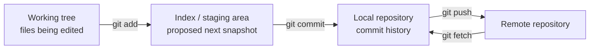
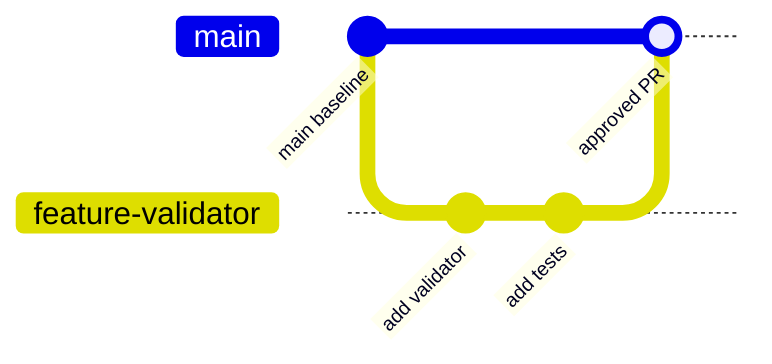
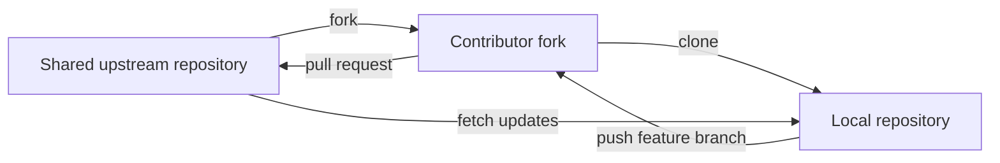
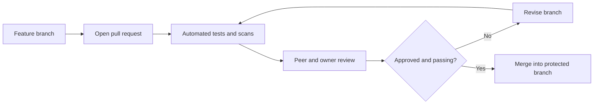
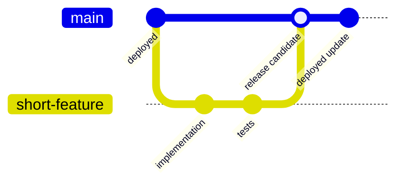
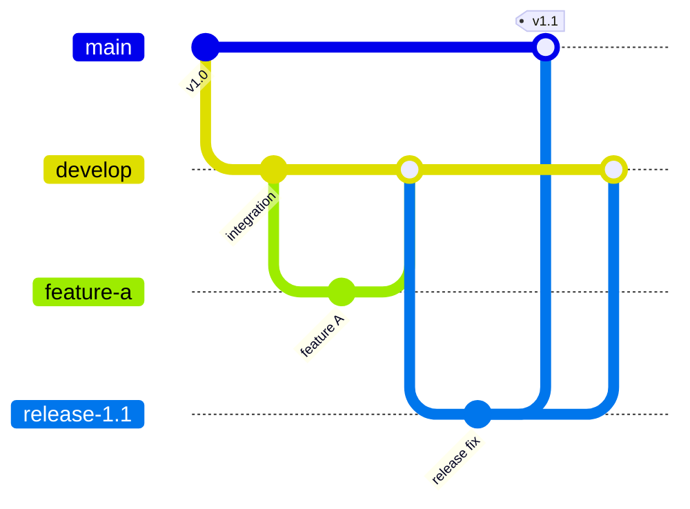
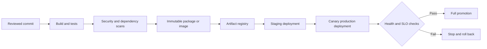

# Chapter 4: Version Control and Release Management with Git

## Chapter Purpose

Change is constant in software and network automation. Source code changes, but so do device templates, YANG models, schemas, infrastructure definitions, tests, runbooks, and pipeline configuration. Git gives the team a shared history of those changes: what changed, who changed it, why it changed, and how to recover when the result is not what the team expected.

Think of Git as more than a place to store files. It is part of the safety system around production automation. A focused commit supports review. A protected branch prevents unapproved integration. A signed release connects the deployed artifact to tested source. A useful history shortens incident investigation.

This chapter organizes Git around the decisions a professional team must make:

1. Understand Git's data model.
2. Select a collaboration workflow.
3. Use branches and pull requests safely.
4. Choose a branching strategy that matches release needs.
5. Resolve conflicts and recover from mistakes.
6. Connect commits to secure, repeatable releases.

```mermaid
flowchart LR
    Intent["Issue or change intent"] --> Branch["Focused branch"]
    Branch --> Commit["Reviewed commits"]
    Commit --> PR["Pull request and CI"]
    PR --> Main["Protected main branch"]
    Main --> Artifact["Signed release artifact"]
    Artifact --> Deploy["Controlled deployment"]
    Deploy --> Observe["Operational verification"]
```



This lifecycle is especially important for network automation because a software defect can be repeated across hundreds of devices faster than a human could make the same mistake manually.

## 1. Version Control Fundamentals

A version-control system (VCS) tracks revisions to files and enables collaboration. Important capabilities include:

- Complete change history
- Attribution and rationale
- Parallel work
- Comparison of revisions
- Review before integration
- Reversal of undesired changes
- Release identification
- Automation triggered by repository events

Network automation repositories may contain:

- Application source code
- Device templates and data models
- Infrastructure-as-code definitions
- CI/CD workflows
- Unit and integration tests
- API specifications
- Documentation and runbooks

Secrets, private keys, passwords, and production tokens should never be committed. Removing a secret from the latest revision does not remove it from history.

## 2. How Git Represents Work

Git is a distributed VCS. A normal clone contains the project history and supports most operations without continuous access to a server.

Git stores snapshots rather than treating history only as a sequence of file deltas. Every commit points to a project tree, parent commit information, author and committer metadata, and a message. Objects are addressed by cryptographic hash, which provides integrity checking.

### 2.1 The Working Tree, Index, and Repository



- The **working tree** contains checked-out files.
- The **index** or staging area defines what the next commit will contain.
- The **local repository** stores commits, branches, tags, and objects.
- A **remote** is a named reference to another repository.

This separation permits precise commits. A developer can edit several files but stage only changes associated with one logical purpose.

### 2.2 Repository Inspection

```bash
git status
git diff
git diff --staged
git log --oneline --graph --decorate --all
```

- `git status` shows branch and file state.
- `git diff` shows unstaged changes.
- `git diff --staged` shows what the next commit will contain.
- `git log` displays history and branch relationships.

Reviewing before staging and again before committing prevents accidental inclusion of debug code, generated files, or unrelated edits.

## 3. A Professional Local Workflow

### 3.1 Clone and Configure

```bash
git clone git@example.com:network/automation-platform.git
cd automation-platform
git config user.name "Network Developer"
git config user.email "developer@example.com"
```

Use SSH keys or approved token-based authentication. Protect credentials with least privilege and expiration policies.

### 3.2 Create a Focused Branch

```bash
git switch main
git pull --ff-only
git switch -c feature/add-nxos-validation
```

A descriptive branch identifies intent. Avoid making normal feature changes directly on a protected main branch.

### 3.3 Inspect, Stage, and Commit

```bash
git status
git diff
git add src/nxos_validator.py tests/test_nxos_validator.py
git diff --staged
git commit -m "Add NX-OS interface validation"
```

A good commit is:

- Focused on one logical change
- Small enough to review
- Accompanied by relevant tests
- Free of secrets and generated noise
- Described by an imperative message

The commit message body can explain why a design was selected, especially when the reason is not obvious from the code.

### 3.4 Push and Track

```bash
git push -u origin feature/add-nxos-validation
```

The `-u` option establishes the upstream tracking relationship. Later `git push` and `git pull` operations can use it by default.

## 4. Branch-and-Pull Workflow

The branch-and-pull workflow uses one shared remote repository. Contributors create branches in that repository and submit pull requests to a protected integration branch.



### 4.1 Appropriate Use

- Contributors are known and trusted.
- Team members have permission to push branches.
- The organization wants a simple internal workflow.
- Branch protection prevents direct changes to main.

### 4.2 Advantages

- Only one hosted repository is required.
- Remote configuration is simple.
- New Git users have fewer synchronization concepts to learn.
- CI and review are centralized.

### 4.3 Limitations

- Contributors need write access to the shared repository.
- Accidental force-pushes or branch modifications can affect others.
- The model is unsuitable for unknown public contributors.

Protected branches, required reviews, status checks, signed commits, and restricted force-pushes reduce risk.

## 5. Fork-and-Pull Workflow

In the fork-and-pull workflow, contributors push changes to personal repository forks. A pull request proposes integration into the shared upstream repository.



### 5.1 Appropriate Use

- Contributors do not need write access to the upstream repository.
- Public or untrusted contributors are accepted.
- The team follows common open-source practices.
- Contributors understand multiple remotes.

### 5.2 Remote Configuration

After cloning a personal fork, `origin` normally refers to that fork. Add the shared repository as `upstream`:

```bash
git remote -v
git remote add upstream git@example.com:network/automation-platform.git
git fetch upstream
```

Typical relationships are:

```text
origin    -> contributor-owned fork
upstream  -> shared source-of-truth repository
```

### 5.3 Synchronizing a Fork

```bash
git switch main
git fetch upstream
git merge --ff-only upstream/main
git push origin main
```

Alternatively, the contributor may rebase a private feature branch onto the latest upstream main.

### 5.4 Advantages and Costs

The workflow isolates contributor pushes from the upstream repository and supports untrusted contributors. It also adds conceptual and operational complexity because the contributor must synchronize a local clone, personal fork, and shared upstream.

## 6. Pull Requests and Code Review

A pull request is a collaboration and control mechanism, not only a request to merge files.

A useful pull request includes:

- Problem and desired outcome
- Scope of the change
- Architecture or API implications
- Test evidence
- Security considerations
- Deployment and rollback plan
- Related ticket or change record

For network automation changes, reviewers should ask:

- Are target devices and failure domains bounded?
- Is the operation idempotent?
- Are credentials handled safely?
- Are candidate configurations validated?
- Is pre-change and post-change state recorded?
- Does a rollback exist?
- Could retries duplicate an action?
- Are logs useful without exposing sensitive configuration?



Review comments should focus on correctness, security, maintainability, architecture, and testability rather than personal style. Automated formatters and linters can settle mechanical conventions.

## 7. Branching Strategies

A workflow describes repository collaboration. A branching strategy describes how branches represent development and release states.

Selection depends on:

- Release frequency
- Number of supported production versions
- Automated test quality
- Deployment and rollback maturity
- Team size and coordination cost
- Regulatory approval requirements

### 7.1 GitHub Flow

GitHub Flow is a lightweight strategy:

1. Keep `main` deployable.
2. Create a short-lived branch.
3. Commit and push changes.
4. Open a pull request.
5. Run tests and review.
6. Merge and deploy.



GitHub Flow fits frequent delivery, strong CI, and applications where the main branch can remain releasable. Feature flags can hide incomplete behavior without long-lived branches.

### 7.2 Git Flow

Git Flow uses longer-lived branches:

- `main` represents production releases.
- `develop` integrates upcoming work.
- `feature/*` branches add functionality.
- `release/*` branches stabilize a version.
- `hotfix/*` branches correct production urgently.



Git Flow can suit products with scheduled releases and parallel maintenance versions. Its cost is merge complexity, branch drift, and slower integration. It is not automatically appropriate for continuously deployed services.

### 7.3 Trunk-Based Development

Trunk-based development keeps contributors close to one main line. Changes are small and integrated frequently, often through very short-lived branches. It requires strong automated tests and feature-control practices.

This approach reduces integration drift but demands discipline. Large unfinished changes should be separated behind stable interfaces or feature flags.

### 7.4 Selecting a Strategy

An internal network compliance API deployed several times per week is well suited to GitHub Flow or trunk-based development. A network appliance product that ships quarterly and supports multiple maintained versions may benefit from release and maintenance branches similar to Git Flow.

## 8. Merge and Rebase

### 8.1 Merge

Merge combines histories:

```bash
git switch main
git merge feature/add-nxos-validation
```

A fast-forward merge moves the branch pointer when no divergence exists. A three-way merge creates a merge commit when histories diverge.

Merge preserves historical branch relationships and does not rewrite existing commits.

### 8.2 Rebase

Rebase replays commits onto a new base:

```bash
git switch feature/add-nxos-validation
git fetch origin
git rebase origin/main
```

Rebase creates new commit hashes. It can produce a linear history, but rebasing commits already shared with others disrupts collaboration. A safe rule is to rebase private work, not public shared history.

### 8.3 Interactive Rebase

```bash
git rebase -i HEAD~4
```

Interactive rebase can reorder, combine, edit, or remove local commits before review. It should be used carefully because every rewritten commit receives a new identity.

## 9. Conflict Resolution

A conflict occurs when Git cannot determine how to combine changes automatically.

```text
<<<<<<< current
timeout = 10
=======
timeout = 30
>>>>>>> incoming
```

The developer must understand the intended behavior rather than simply delete markers.

Conflict workflow:

1. Run `git status`.
2. Inspect each conflict.
3. Resolve the content deliberately.
4. Run tests and validation.
5. Stage the resolved files.
6. Continue or complete the operation.

```bash
git add path/to/resolved-file
git rebase --continue
# or complete the merge commit
```

Abort when necessary:

```bash
git rebase --abort
git merge --abort
```

For configuration templates, a syntactically clean merge can still produce unsafe commands. Render representative configurations and validate them in a lab or parser.

## 10. Advanced Git Operations

### 10.1 Cherry-Pick

Apply one selected commit to the current branch:

```bash
git cherry-pick <commit-id>
```

This is useful when a production fix must also be applied to a maintenance branch. It creates a new commit, so teams should record the relationship to avoid confusion.

### 10.2 Revert

Create a new commit that reverses an earlier commit:

```bash
git revert <commit-id>
```

Revert is appropriate for shared history. Reverting a merge requires identifying the parent that should remain the main line.

### 10.3 Reset and Restore

`git restore` can discard working-tree changes or restore files from a selected revision. `git reset` moves branch or index state and has soft, mixed, and hard modes.

Hard reset can destroy local work. It should not be used casually, and rewritten shared history should not be force-pushed without explicit coordination.

### 10.4 Stash

```bash
git stash push -m "partial telemetry parser"
git stash list
git stash pop
```

A stash temporarily stores local changes. Important work should be committed to a private branch rather than left indefinitely in a local stash.

### 10.5 Bisect

Git can use binary search to find the commit that introduced a failure:

```bash
git bisect start
git bisect bad
git bisect good <known-good-commit>
# test selected revisions and mark each good or bad
git bisect reset
```

If a test script reliably identifies the defect, the search can be automated. A parser regression test can locate the commit that first generated an invalid BGP template.

### 10.6 Reflog

The reflog records recent movement of local references:

```bash
git reflog
```

It can help recover a commit after an accidental reset or rebase, provided the object has not been removed by cleanup. Reflog is local and is not a substitute for pushing important work.

## 11. Tags and Release Identification

An annotated tag marks an important commit:

```bash
git tag -a v2.4.0 -m "Release 2.4.0"
git push origin v2.4.0
```

Semantic versioning commonly uses `MAJOR.MINOR.PATCH`:

- **MAJOR:** Incompatible change
- **MINOR:** Backward-compatible feature
- **PATCH:** Backward-compatible correction

Release tags should be protected and immutable. Signed tags or release attestations improve provenance.

## 12. Release Management

Version control identifies source; release management turns approved source into a deployable, traceable artifact.



### 12.1 Build Once, Promote the Same Artifact

The pipeline should build one artifact and promote it through environments. Rebuilding separately for production can introduce different dependencies or content.

Environment-specific values belong in external configuration or secret management, not in separately modified source packages.

### 12.2 Dependency and Base-Library Management

- Pin direct and transitive versions with lock files.
- Scan for vulnerabilities and license issues.
- Record an SBOM.
- Test upgrades before promotion.
- Keep shared library interfaces stable and versioned.
- Rebuild container images for patched base layers.
- Pin critical base images by immutable digest where appropriate.

Shared automation libraries may provide logging, device connection, retry, authentication, and telemetry behavior. A breaking library update can affect every automation service, so deprecation and migration plans are essential.

### 12.3 Release Strategies

- **Rolling:** Replace instances gradually.
- **Blue-green:** Switch traffic between complete old and new environments.
- **Canary:** Expose a small portion of workload to the new release.
- **Feature flag:** Deploy code independently of activation.

For network automation, a canary can limit a new worker version to lab devices or a small low-risk site before wider use.

### 12.4 Rollback and Data Compatibility

Application rollback is easy only when interfaces, database schemas, queued events, and configuration formats remain compatible. Use expand-and-contract migrations:

1. Add backward-compatible structures.
2. Deploy code that can handle old and new forms.
3. Migrate data and consumers.
4. Remove obsolete structures in a later release.

## 13. Network Automation Release Flow

A change adds a new configuration parser for campus switches:

1. A developer creates `feature/campus-parser`.
2. Unit tests cover valid, invalid, and unexpected device output.
3. A pull request triggers formatting, static analysis, dependency scanning, and simulated device tests.
4. Reviewers confirm that parser failure cannot trigger a configuration change.
5. The approved commit is merged into protected `main`.
6. CI builds one signed container image and records its Git revision and SBOM.
7. The image is deployed to a staging environment with captured device responses.
8. A production canary processes five percent of read-only compliance jobs.
9. Dashboards compare parse errors, duration, and memory usage by release version.
10. The release is promoted if SLOs remain healthy; otherwise, the canary is stopped and the previous image restored.

This workflow links code review, Git history, artifact provenance, deployment, observability, and recovery.

## 14. Git and Release Checklist

- Is the change on a focused branch?
- Were unstaged and staged differences reviewed?
- Does the commit contain tests and no secrets?
- Is the pull request clear about risk and rollback?
- Are required reviews and checks enforced?
- Does the branching strategy match release frequency?
- Is shared history protected from destructive rewriting?
- Can the deployed artifact be traced to a commit and tag?
- Are dependencies pinned, scanned, and recorded?
- Is the exact same artifact promoted between environments?
- Are schema and event changes backward compatible?
- Has canary behavior and rollback been tested?

## 15. Commit and History Design

Git history is an operational record. A useful history allows a reviewer to understand the evolution of behavior and allows an operator to identify the change associated with an incident.

### 15.1 Atomic Commits

An atomic commit contains one coherent change and leaves the repository in a valid state. Tests and implementation that depend on each other belong together. Unrelated formatting, refactoring, and feature work should normally be separated.

Patch staging can select portions of a file:

```bash
git add -p
git diff --staged
```

This is valuable when one working session contains several logical changes. The developer reviews each hunk before including it.

### 15.2 Commit Messages

The subject should state the change in imperative form. The body explains motivation, constraints, and consequences.

```text
Limit NETCONF sessions per device

Device management planes become unstable when concurrent collection
and deployment exceed four sessions. Add a per-device semaphore while
preserving the global worker limit.
```

Issue identifiers can provide business context, but the commit message should remain understandable if the external tracker later disappears.

### 15.3 Signed Work and Provenance

Commit or tag signatures help verify identity, while branch protection controls integration. Signatures do not prove code correctness. Review, CI, and release attestations remain necessary.

## 16. Collaboration Beyond the Basic Pull Request

### 16.1 Keeping a Feature Current

A contributor should fetch remote state before integrating:

```bash
git fetch origin
git switch feature/add-nxos-validation
git rebase origin/main
```

If the branch is shared, merging main may be safer because it does not rewrite collaborators' commits. Teams should document the chosen rule.

### 16.2 Reviewing Another Branch Locally

```bash
git fetch origin pull/418/head:review/pr-418
git switch review/pr-418
```

The exact remote ref syntax depends on the hosting platform. Local review permits tests, static analysis, and rendered configuration inspection that may be difficult in a web diff.

### 16.3 Comparing History

```bash
git log --oneline origin/main..HEAD
git diff origin/main...HEAD
git range-diff origin/main...feature-v1 origin/main...feature-v2
```

The triple-dot diff compares the feature against the common ancestor. `range-diff` helps reviewers understand how a rebased patch series changed between revisions.

## 17. Managing Release and Maintenance Branches

When several production versions are supported, each maintenance branch needs a policy for accepted changes, testing, and end of support.

A defect corrected on the current main branch may need backporting:

```mermaid
gitGraph
    commit id: "v2 baseline"
    branch release-1.x
    checkout main
    commit id: "fix parser defect"
    checkout release-1.x
    cherry-pick id: "backport fix"
    checkout main
    commit id: "continue v2"
```

The backport should be tested in the older dependency and schema environment. Cherry-picking a patch that compiles on main does not prove compatibility with the maintenance branch.

Release branches should not become permanent alternate development lines. Define which fixes qualify, how long the branch is supported, and how changes return to newer branches.

## 18. Release Artifacts and Supply-Chain Integrity

A release should be traceable from deployed artifact back to source, build environment, dependencies, tests, and approval.

### 18.1 Artifact Metadata

Record:

- Git commit and tag
- Build timestamp and pipeline identity
- Dependency lock and SBOM
- Compiler or runtime version
- Artifact digest
- Security scan results
- Signature or attestation

Container tags such as `latest` are mutable and do not uniquely identify content. Deployments should record an immutable digest.

### 18.2 Dependency Risk

Dependencies include language packages, container base images, operating-system packages, build actions, generated code, and external services. A lock file improves reproducibility but can also freeze a vulnerable version. Automated scanning and scheduled updates are therefore complementary.

An emergency security update still passes through tests and controlled rollout. Urgency changes the timeline, not the need for evidence.

### 18.3 Secret Prevention

Pre-commit and server-side scanning can detect likely credentials. If a secret enters history, rotate or revoke it immediately. Rewriting Git history reduces exposure but cannot make a copied secret trustworthy again.

## 19. Deployment and Rollback Mechanics

### 19.1 Rolling and Canary Deployment

A rolling deployment replaces instances in groups while maintaining capacity. A canary exposes a small workload to the new version and compares outcome metrics with the existing version.

Network automation can route read-only collection jobs to a canary before permitting write operations. The progression may move from simulators, to lab devices, to low-risk production sites, and finally to general production.

### 19.2 Blue-Green Deployment

Blue-green maintains two complete environments. The inactive environment receives the release and testing, then traffic switches. Rollback is fast while the old environment and compatible data remain available.

### 19.3 Feature Flags

Feature flags separate code deployment from feature activation. Flags need owners, expiry, tests for relevant combinations, and removal plans. Long-lived flags multiply behavior paths and maintenance burden.

### 19.4 Rollback Decision

Rollback should be triggered by measurable conditions such as error rate, latency, parser failures, or incorrect change outcomes. If a release has written an incompatible event or schema, forward correction may be safer than binary rollback.

## 20. Git Recovery Scenarios

Git provides recovery tools, but the safest choice depends on whether history is private or shared.

| Situation | Preferred action |
|---|---|
| Unstaged local edit should be discarded | `git restore <file>` |
| Staged file should be unstaged | `git restore --staged <file>` |
| Shared bad commit | `git revert <commit>` |
| Local commit needs message or content correction | `git commit --amend` |
| Local branch lost after reset | inspect `git reflog`, then create a branch |
| One fix needed on another branch | `git cherry-pick <commit>` |
| Unknown regression commit | `git bisect` with a reliable test |

Force pushing should use `--force-with-lease` when approved because it refuses to overwrite remote work the local repository has not observed. Even this option rewrites shared history and requires coordination.

## 21. Branch-and-Pull Operational Sequence

A trusted internal contributor begins from an updated main branch, creates a feature branch, reviews changes, commits, and pushes the branch to the shared repository.

```bash
git switch main
git fetch origin
git merge --ff-only origin/main
git switch -c feature/add-site-filter

# edit source and tests
git status
git diff
git add src/site_filter.py tests/test_site_filter.py
git diff --staged
git commit -m "Add site filter to inventory collection"
git push -u origin feature/add-site-filter
```

The pull request targets `main`. CI validates formatting, tests, security, and contract compatibility. Reviewers inspect logic and rendered output. Requested corrections are committed to the same branch, and the pull request updates automatically.

After merge, the remote branch can be deleted. The developer updates local main and deletes the local feature branch:

```bash
git switch main
git pull --ff-only
git branch -d feature/add-site-filter
```

Branch deletion does not delete merged commits; they remain reachable from main.

## 22. Fork-and-Pull Operational Sequence

A contributor without upstream write access forks the repository and clones the fork. `origin` points to the personal fork, while `upstream` points to the shared project.

```bash
git clone git@example.com:developer/automation-platform.git
cd automation-platform
git remote add upstream git@example.com:network/automation-platform.git
git fetch upstream
git remote -v
```

The contributor branches from current upstream state:

```bash
git switch main
git merge --ff-only upstream/main
git push origin main
git switch -c fix/netconf-timeout
```

After commit, the branch is pushed to the personal fork and a pull request is opened from that fork to upstream main.

If upstream changes during review, the contributor fetches and rebases the private branch, resolves conflicts, retests, and updates the fork:

```bash
git fetch upstream
git rebase upstream/main
git push --force-with-lease origin fix/netconf-timeout
```

The force is safe only because the contributor owns the feature branch and uses the lease check. A team branch with multiple contributors should use its agreed merge policy.

## 23. Continuous Integration Policy

CI protects integration by applying the same controls to every change. A network automation repository may require:

- Formatting and linting
- Unit and contract tests
- Type checking
- Secret and dependency scanning
- Template rendering
- YANG or JSON schema validation
- Device-simulator integration
- Container build and image scan
- Documentation link validation

Required checks should be deterministic and reasonably fast. Flaky tests teach developers to rerun failures rather than investigate them. Slow suites can be layered: fast checks gate every pull request, while broader system and performance suites run before release.

The pipeline executes untrusted repository content and therefore needs restricted credentials. Pull requests from forks should not automatically receive production secrets.

## 24. Release Notes and Change Communication

Release notes translate commit history into operational impact. They identify added behavior, corrections, security changes, deprecated interfaces, migration steps, known issues, and rollback constraints.

A change log generated only from commit subjects may omit user impact. Release owners curate the information needed by operators and consumers. API and SDK releases should identify compatibility, while network automation releases should identify supported platforms and any change in device behavior.

> **Study guide takeaway:** A good Git workflow creates evidence. The branch explains the scope, commits explain the change, the pull request records review, CI records verification, and the release artifact identifies exactly what reached production.

## Chapter Summary

Git is a distributed, snapshot-based version-control system that supports local history, parallel work, integrity checking, and controlled integration. The working tree, staging area, local repository, and remotes give developers precise control over what becomes part of a commit and when it is shared.

Branch-and-pull offers a simple workflow for trusted teams, while fork-and-pull supports contributors without upstream write access. GitHub Flow, Git Flow, and trunk-based development address different release patterns. Merge, rebase, cherry-pick, revert, stash, bisect, and reflog are valuable when their effects on history are understood.

Release management extends beyond Git. A reliable delivery system builds once, tests and scans the artifact, records provenance, promotes it gradually, observes production behavior, and supports rollback without corrupting persistent state. For network automation, these controls are especially important because software changes can directly affect production infrastructure.
