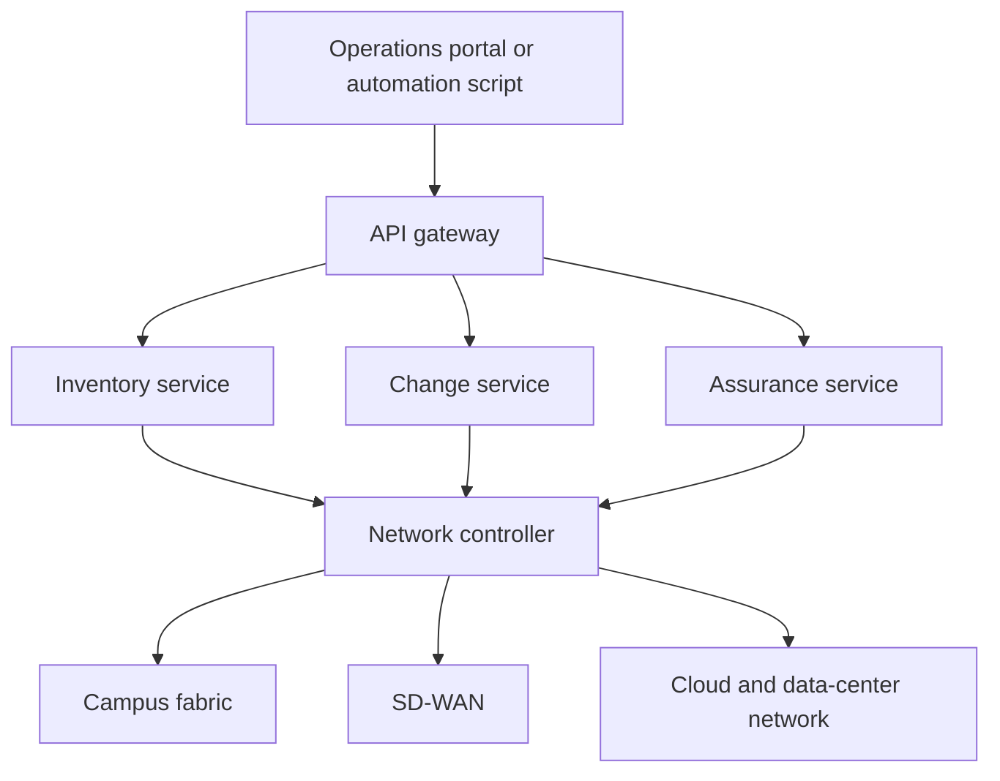
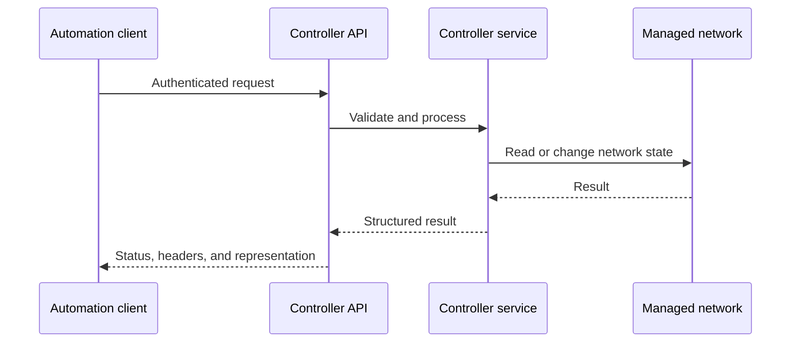
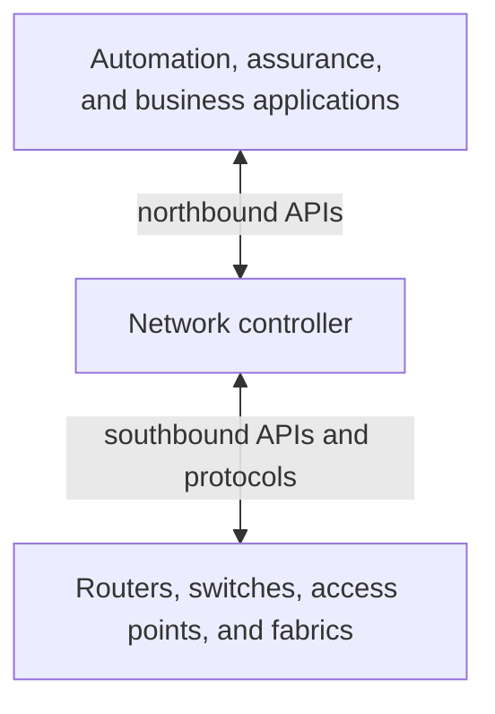
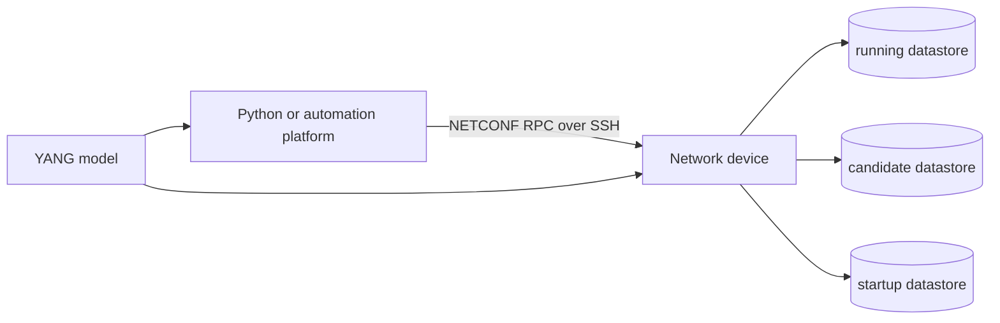
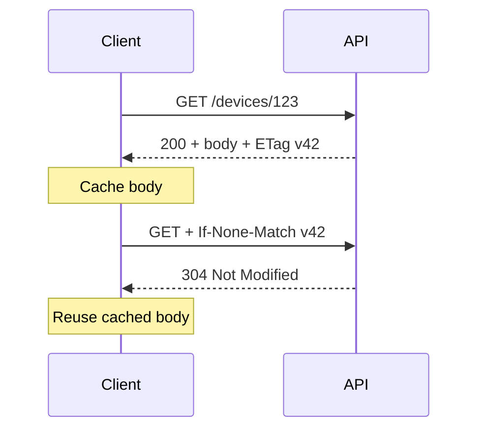
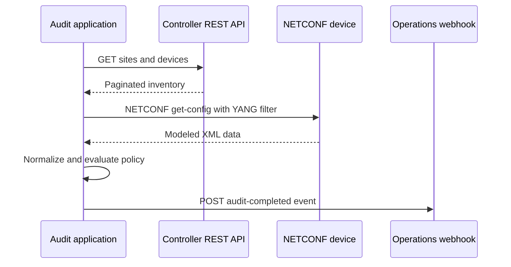

# Chapter 5: Network API Fundamentals

## Chapter Introduction

> **Side note:** An HTTP 200 response proves protocol success, not necessarily a correct network or business outcome.

An application programming interface (API) is a contract between software systems. It explains what a client may request, how the request must be formatted, what security is required, and what the provider will return. In network automation, APIs replace screen scraping and fragile command sequences with structured access to inventory, topology, operational state, configuration, and controller services.

The practical goal of this chapter is to help you look at an API and answer four questions: **What resource am I addressing? What operation am I requesting? What representation will cross the network? How will both sides handle security, failure, and change?**

This chapter develops API concepts from the request-response exchange through REST, RPC, gRPC, OpenAPI, and HTTP caching. Chapter 6 builds on these foundations with client development, authentication, OAuth, pagination, streaming, and resilient error handling.

### Where Network APIs Fit



The API gateway provides a stable entry point, while specialized services own inventory, change, and assurance behavior. The controller translates higher-level intent into actions on the underlying infrastructure.

## 1. API Fundamentals

An API is a documented contract containing methods, resources, data formats, security requirements, and expected responses. Consumers should not need direct access to the provider's internal database or implementation.



An API contract normally identifies:

- Methods or operations
- Resource identifiers
- Request and response formats
- Authentication and authorization
- Status and error behavior
- Pagination, filtering, and sorting
- Rate limits
- Versioning and lifecycle policy

### 1.1 API-First Design

API-first development designs and reviews the interface before implementing its internal behavior. Product owners, client developers, security teams, and service developers can validate the contract while changes remain inexpensive.

The provider owns more than endpoint code. It owns documentation, compatibility, monitoring, support, security, and deprecation. Internal services also benefit from these disciplines; an undocumented private interface creates coupling just as easily as an undocumented public one.

## 2. APIs in Network Architecture

Software-defined networking commonly distinguishes northbound and southbound interfaces.



Northbound APIs expose topology, inventory, assurance, policy, and provisioning to applications. Southbound APIs and protocols allow a controller to observe and modify network behavior.

A site-provisioning workflow can call a controller's northbound API to create a site, assign address pools, register devices, configure wireless networks, and retrieve health. The controller translates those requests into platform-specific southbound actions.

### 2.1 API Visibility

| Visibility | Consumers | Typical controls |
|---|---|---|
| Internal | Teams inside one organization | enterprise identity, private routing, internal governance |
| Partner | Approved business partners | onboarding, contracts, scoped credentials, quotas |
| Public | External developers | registration, documentation, strong isolation, rate limits |

An internal API should still authenticate callers and apply least privilege. Network location alone is not a sufficient trust decision.

### 2.2 APIs and Web Scraping

When no API exists, software may extract data from rendered web pages. Scraping depends on page structure intended for humans rather than a stable machine contract. Layout changes, JavaScript behavior, access policy, and anti-automation controls can break it.

A supported API is preferable because it provides structured data, documented security, defined limits, compatibility policy, and explicit provider intent. Scraping should be used only when permitted and when its maintenance and legal implications are understood.

## 3. HTTP Resource Methods

REST APIs commonly represent managed entities as resources and use HTTP methods to express intent.

| Method | Typical purpose | Safe | Normally idempotent |
|---|---|---:|---:|
| GET | Retrieve a representation | Yes | Yes |
| POST | Create a subordinate resource or start an action | No | No |
| PUT | Replace a resource at a known URI | No | Yes |
| PATCH | Partially modify a resource | No | Depends on operation |
| DELETE | Remove a resource | No | Yes |

A safe method does not request a state change. An idempotent method has the same intended server state after one or several identical requests.

### 3.1 Idempotency and Network Changes

`GET /devices/123/interfaces` can be repeated without modifying the device. `PUT /devices/123/banner` can replace the complete banner with the same value repeatedly. A `POST /changes` request may create a new job every time it is received.

Retries are therefore not equally safe. A client that loses the response to a POST cannot know whether the server created the job. An idempotency key allows the server to recognize repeated submissions:

```http
POST /v1/change-jobs HTTP/1.1
Host: automation.example.net
Authorization: Bearer <token>
Idempotency-Key: 7b51a176-01af-45c2-822c-2df9207b127a
Content-Type: application/json
```

The provider stores the key with the first result and returns the same logical result when the request is repeated.

### 3.2 Resource-Oriented URIs

Resource paths should normally use nouns:

```text
GET    /v1/devices
GET    /v1/devices/123
POST   /v1/change-jobs
GET    /v1/change-jobs/789
DELETE /v1/webhooks/456
```

Filtering, sorting, field selection, and pagination belong in query parameters when they do not identify a different resource:

```text
GET /v1/devices?site=sg01&status=unreachable&limit=100
```

## 4. Request and Response Structure

An HTTP request contains a method, target URI, headers, and sometimes a body. A response contains a status code, headers, and sometimes a body.

```http
GET /v1/devices/123 HTTP/1.1
Host: controller.example.net
Accept: application/json
Authorization: Bearer <token>
```

```http
HTTP/1.1 200 OK
Content-Type: application/json
Cache-Control: private, max-age=30
ETag: "device-123-v42"

{
  "id": "123",
  "hostname": "branch-123-r1",
  "managementIp": "192.0.2.10",
  "status": "reachable"
}
```

### 4.1 Important Headers

- `Accept` states which response formats the client can process.
- `Content-Type` identifies the request or response body format.
- `Authorization` carries credentials or tokens.
- `User-Agent` identifies the client implementation.
- `Location` identifies a created resource or redirect target.
- `Retry-After` tells a client when a retry may be appropriate.
- `Cache-Control`, `ETag`, and `Last-Modified` govern caching and validation.
- `X-Request-ID` or a standard trace header supports correlation.

Clients should validate `Content-Type` before assuming a response contains JSON. Gateways sometimes return an HTML error page even when the normal API is JSON.

### 4.2 JSON and XML

JSON represents objects, arrays, strings, numbers, Booleans, and null values. Its close mapping to common programming structures makes it the dominant format for REST APIs.

```json
{
  "siteId": "sg01",
  "devices": [
    {"id": "123", "role": "edge"},
    {"id": "124", "role": "distribution"}
  ],
  "maintenance": false
}
```

XML provides namespaces, attributes, schemas, and document-oriented capabilities. It remains important for SOAP and network technologies such as NETCONF. The correct format depends on the interface contract rather than personal preference.

## 5. Calling a REST API with Python

The `requests` library provides a direct mapping to HTTP concepts:

```python
import requests

BASE_URL = "https://controller.example.net/api/v1"

session = requests.Session()
session.headers.update({
    "Accept": "application/json",
    "Authorization": "Bearer <token>",
    "User-Agent": "network-compliance/2.0",
})

response = session.get(
    f"{BASE_URL}/devices",
    params={"site": "sg01", "limit": 100},
    timeout=(3.05, 20),
)

response.raise_for_status()
devices = response.json()

for device in devices["items"]:
    print(device["hostname"], device["status"])
```

The timeout tuple sets separate connection and read limits. Production clients should never depend on an unlimited default wait. Chapter 6 adds classification, retries, rate-limit handling, and terminal-error flow control.

Configuration should supply the base URL and credentials. Tokens should come from an approved secret store or environment integration rather than source code.

## 6. API Architectural Styles

### 6.1 REST

REST is an architectural style centered on resources, representations, a uniform interface, stateless requests, cacheability, and layered systems. HTTP supplies methods, status codes, content negotiation, and caching behavior.

REST works well for web-accessible resources and broad client compatibility. It can be inefficient when clients need many related resources and must make several round trips.

### 6.2 RPC and JSON-RPC

Remote procedure call APIs expose actions rather than only resources. The client invokes a named remote method with parameters.

```json
{
  "jsonrpc": "2.0",
  "method": "cli",
  "params": {"cmd": "show version", "version": 1},
  "id": 1
}
```

Cisco NX-API can accept CLI operations through JSON-RPC. The request identifier connects a response with its request. RPC is natural when the domain consists of explicit operations, but action-oriented contracts can become inconsistent if naming and errors are not standardized.

### 6.3 gRPC

gRPC uses HTTP/2 and Protocol Buffers. A `.proto` interface definition describes services and strongly typed messages, from which tools generate client and server code.

```protobuf
syntax = "proto3";

message InterfaceCounter {
  string device_id = 1;
  string interface_name = 2;
  uint64 input_bytes = 3;
  uint64 output_bytes = 4;
}
```

Binary encoding, multiplexing, streaming, and generated clients make gRPC efficient for service-to-service communication and telemetry. Browser accessibility and human inspection are less direct than with JSON REST APIs.

### 6.4 GraphQL

GraphQL lets clients specify the fields and relationships they need. A dashboard can retrieve device identity, health, and selected interface counters in one query instead of calling several endpoints.

This reduces over-fetching and under-fetching but moves query complexity to the provider. Depth limits, query-cost controls, authorization, and caching require deliberate design.

### 6.5 SOAP

SOAP is an XML-based messaging protocol with mature standards for security, reliability, and transactions. It remains appropriate in enterprise environments that require formal contracts and WS-* capabilities, although it is generally more verbose than REST or gRPC.

### 6.6 Style Selection

| Style | Strong fit | Main trade-off |
|---|---|---|
| REST | Resource APIs and broad HTTP compatibility | Multiple calls for complex related data |
| JSON-RPC | Explicit remote actions | Weaker resource semantics |
| gRPC | Efficient internal services and streaming | Binary tooling and browser limitations |
| GraphQL | Client-selected related data | Query governance and caching complexity |
| SOAP | Formal enterprise security and transactions | XML verbosity and heavier tooling |

## 7. Network API Styles

Network automation commonly uses HTTP-based REST APIs for controllers and services and model-driven protocols such as NETCONF for device configuration and operational state.

### 7.1 REST Constraints

A RESTful design follows these architectural constraints:

- **Client-server:** User interaction is separated from resource management.
- **Stateless:** Every request contains the information needed for processing.
- **Cacheable:** Responses identify whether and how they may be reused.
- **Uniform interface:** Resources, representations, and messages follow consistent semantics.
- **Layered system:** Clients need not know whether gateways, proxies, or other intermediaries exist.
- **Code on demand:** A server may optionally transfer executable behavior to a client.

Statelessness does not prohibit persistent TCP connections. HTTP keepalive can reuse a connection while each request remains independently understandable.

The uniform interface identifies resources with URIs, changes resources through representations, uses self-descriptive messages, and can provide links to related state. A device response may link to its interfaces, site, software image, and active jobs so the client does not construct every URI from undocumented knowledge.

### 7.2 NETCONF and YANG

NETCONF is an IETF protocol for retrieving operational data and managing device configuration. It uses RPC messages, commonly over SSH, and normally encodes YANG-modeled data as XML.

YANG defines the structure, types, constraints, configuration state, operational state, actions, and notifications exposed by a network system. Open models promote cross-vendor consistency, while native models expose vendor-specific capabilities.



Common NETCONF operations include:

- `get` retrieves configuration and operational data.
- `get-config` retrieves configuration from a selected datastore.
- `edit-config` modifies a target datastore.
- `copy-config` copies one configuration datastore to another.
- `lock` and `unlock` protect a datastore during controlled change.
- `commit` activates candidate configuration where supported.
- `discard-changes` abandons uncommitted candidate changes.

The candidate datastore allows a client to stage a complete change before committing it to running configuration. Validation and confirmed-commit capabilities can reduce the risk of a change that removes management connectivity.

### 7.3 REST and NETCONF

| Characteristic | REST API | NETCONF |
|---|---|---|
| Primary transport | HTTP/HTTPS | SSH, with other secure transports possible |
| Interaction | HTTP request and response | RPC and RPC reply |
| Common encoding | JSON or XML | XML in common implementations |
| State model | Application-defined resources | YANG-modeled configuration and operational state |
| Session behavior | Requests are stateless | Protocol session is stateful |
| Transactions | Provider-specific | Datastores, locking, validation, and commit capabilities |

Controller REST APIs are convenient for site, policy, assurance, and workflow resources. NETCONF is strong when an application needs model-driven device configuration with explicit datastore semantics. A system may use both: REST for controller-level orchestration and NETCONF for direct device operations.

## 8. OpenAPI and API Contracts

The OpenAPI Specification is a language-neutral description format for HTTP APIs. It can define paths, methods, parameters, schemas, responses, and security schemes in YAML or JSON.

```yaml
paths:
  /v1/devices/{deviceId}:
    get:
      parameters:
        - in: path
          name: deviceId
          required: true
          schema:
            type: string
      responses:
        "200":
          description: Device found
        "404":
          description: Device not found
```

An OpenAPI contract supports design review, documentation, mock servers, schema validation, generated client libraries, and contract testing. Swagger tools can edit, visualize, and generate code from the specification.

The contract should be versioned with the service and tested in CI. Generated code is a starting point; security, lifecycle, timeout, and application-specific behavior still require engineering judgment.

## 9. Optimizing API Usage with HTTP Cache Controls

Caching reduces repeated server work, request latency, and bandwidth. It is most useful for representations that are read frequently and change less often than they are requested.

### 9.1 Freshness

The server can permit reuse for a defined period:

```http
Cache-Control: private, max-age=60
```

`private` limits storage to the client cache. `public` allows shared caches. `s-maxage` defines freshness for shared caches. `Expires` provides an absolute timestamp but is less flexible than `Cache-Control`.

Static device platform capabilities may remain fresh for hours, while live interface state may be fresh for only seconds. Sensitive tokens and personalized responses usually require `private` or `no-store`.

### 9.2 Revalidation with ETag

When a client has an older representation and its ETag, it can ask whether the resource changed:

```http
GET /v1/devices/123 HTTP/1.1
If-None-Match: "device-123-v42"
```

If unchanged, the server returns:

```http
HTTP/1.1 304 Not Modified
ETag: "device-123-v42"
```

The client reuses its body, avoiding database serialization and network transfer.



`Last-Modified` and `If-Modified-Since` provide time-based validation but may be less precise than entity tags.

### 9.3 Directive Meaning

| Directive | Meaning |
|---|---|
| `max-age=N` | Response is fresh for N seconds |
| `no-cache` | Storage is allowed, but revalidation is required before reuse |
| `no-store` | Response must not be stored |
| `private` | Only a private client cache may store it |
| `public` | Shared caches may store it |
| `must-revalidate` | Stale content must not be reused without validation |
| `no-transform` | Intermediaries should not alter the representation |
| `only-if-cached` | Client requests a cached response without contacting origin |

`no-cache` does not mean “do not store”; that is the role of `no-store`.

### 9.4 Safe Cache Design

Cache keys must include every request property that changes the representation, such as tenant, authorization scope, language, or selected fields. The `Vary` response header tells caches which request headers affect content.

Do not cache unsafe methods by default. Invalidate or version affected representations after a change. A configuration job response can be cached only briefly while terminal audit records may use conditional retrieval with an ETag.

## 10. API Selection and Consumption Checklist

- Is the interface supported and documented?
- Are methods aligned with resource behavior?
- Is retry safety understood for every operation?
- Are request and response schemas validated?
- Are authentication and authorization appropriate to API visibility?
- Does the chosen style match browser, streaming, transaction, and performance needs?
- Is the OpenAPI or interface definition version controlled?
- Are timeouts explicit?
- Can stable GET responses use freshness or conditional caching?
- Are sensitive and user-specific responses protected from shared caches?

## 11. Constructing API Requests Systematically

Before writing code, identify the base URL, resource path, method, parameters, headers, body schema, authentication, expected status, and timeout behavior.

| Request element | Device inventory request |
|---|---|
| Base URL | `https://controller.example.net/api/v1` |
| Resource | `/devices` |
| Method | `GET` |
| Query | `site=sg01&limit=100` |
| Accept | `application/json` |
| Authentication | Bearer access token |
| Success | `200 OK` with paginated collection |
| Failure | `401`, `403`, `429`, `5xx`, or transport exception |

Headers and payloads are part of the contract. A server may reject JSON when `Content-Type` is absent even if the body appears valid. A client requesting XML but assuming JSON will fail during parsing rather than at the protocol boundary.

### 11.1 Session Reuse

Creating a new TCP and TLS connection for every request adds latency and resource cost. A session reuses connections and centralizes common headers:

```python
import requests


def build_session(token: str) -> requests.Session:
    session = requests.Session()
    session.headers.update({
        "Authorization": f"Bearer {token}",
        "Accept": "application/json",
        "User-Agent": "branch-audit/3.1",
    })
    return session
```

Connection reuse does not make REST application stateful. Each HTTP request still contains the information required for the server to process it.

### 11.2 TLS Verification

Production clients should verify the server certificate and hostname against a trusted certificate authority. Disabling verification with `verify=False` turns encrypted transport into an unauthenticated channel and exposes credentials to interception.

Private enterprise certificate authorities can be supplied explicitly:

```python
response = session.get(
    "https://controller.example.net/api/v1/devices",
    timeout=(3.05, 20),
    verify="/etc/company/pki/ca-bundle.pem",
)
```

Mutual TLS can authenticate both client and server. It is useful for service identities but requires certificate issuance, rotation, revocation, and key protection.

## 12. REST Resource and Representation Design

REST separates a resource from its representation. The resource is the conceptual device, site, or change job. JSON and XML are representations transferred between client and server.

### 12.1 State and Transitions

A job resource can express workflow without action-heavy URLs:

```json
{
  "id": "job-789",
  "state": "validating",
  "createdAt": "2026-06-27T09:15:00Z",
  "links": {
    "self": "/v1/change-jobs/job-789",
    "cancel": "/v1/change-jobs/job-789/cancellation"
  }
}
```

The server owns valid transitions. A client cannot move a failed job directly to completed by submitting arbitrary state. It requests an allowed operation or creates a related resource.

### 12.2 Conditional Modification

ETags can also protect writes. A client reads a resource and sends `If-Match` with the observed version during update:

```http
PUT /v1/templates/ntp-standard HTTP/1.1
If-Match: "template-v17"
Content-Type: application/json
```

If another user changed the template, the server returns `412 Precondition Failed` instead of silently overwriting newer state.

### 12.3 Asynchronous Operations

When work cannot finish within normal request latency, the server can return `202 Accepted` and a status location:

```http
HTTP/1.1 202 Accepted
Location: /v1/change-jobs/job-789
Retry-After: 5
```

The client can poll the job resource or receive completion through a webhook. `202` does not confirm that the device change succeeded; it confirms only that processing was accepted.

## 13. API Tools Across the Lifecycle

API tools support exploration, design, testing, and diagnosis.

- **curl** sends reproducible requests from a shell and exposes raw headers.
- **Postman** organizes collections, environments, tests, and shared workflows.
- **Swagger Editor and UI** design and render OpenAPI contracts.
- **Swagger Codegen and similar generators** produce client libraries and server stubs.
- **Fiddler and browser developer tools** inspect HTTP exchanges.
- **API gateways** enforce authentication, quotas, routing, transformation, and telemetry.

Tool exports should not become the only documentation. Collections and generated code need version control, review, and alignment with the authoritative contract.

### 13.1 Contract Testing

A provider test validates that responses conform to the published schema. A consumer test validates the assumptions a client actually uses. Together they detect breaking changes earlier than end-to-end failure.

A mock server generated from OpenAPI allows client development before the provider implementation is complete. Mock success alone is insufficient because latency, authentication, pagination, and failure behavior must still be tested against a realistic service.

## 14. REST and RPC Design Boundaries

REST is resource-oriented; RPC is operation-oriented. A design should not disguise every procedure as a resource or force every domain action into generic CRUD.

A resource-oriented interface creates a change job and observes its state. An RPC interface may expose `validateConfiguration` or `executeCli`. Both can be valid when consistent with the domain.

gRPC is attractive for internal high-volume services because generated types and streaming reduce overhead. REST remains attractive at broad integration boundaries because HTTP and JSON are widely understood. A gateway can expose REST externally while using gRPC internally, but translation adds another component to secure and observe.

## 15. Model-Driven Network Operations

YANG models provide more than field names. They can define mandatory nodes, ranges, patterns, defaults, list keys, relationships, reusable groupings, and validation constraints.

A model-driven workflow can:

1. Discover device capabilities.
2. Retrieve relevant running configuration.
3. Lock or target the candidate datastore.
4. Apply an `edit-config` operation.
5. Validate the candidate.
6. Commit or use confirmed commit.
7. Verify operational state.
8. Unlock and record evidence.

Confirmed commit is valuable when a change could remove management connectivity. The device automatically reverts unless the client confirms success before a timer expires.

Open models improve portability but may omit vendor-specific features. Native models offer complete platform capability but increase coupling. Applications can place both behind an internal abstraction while still exposing capability differences honestly.

## 16. HTTP Status Codes and Content Negotiation

Status codes are part of the API contract, not decorative metadata.

| Status | Meaning in a network API |
|---|---|
| `200 OK` | Representation or completed synchronous result returned |
| `201 Created` | Resource created; `Location` identifies it |
| `202 Accepted` | Asynchronous work accepted but incomplete |
| `204 No Content` | Request succeeded without a response body |
| `304 Not Modified` | Cached representation remains valid |
| `400 Bad Request` | Syntax or basic parameter validation failed |
| `401 Unauthorized` | Authentication is missing or invalid |
| `403 Forbidden` | Identity is known but lacks permission |
| `404 Not Found` | Resource is absent or intentionally hidden |
| `409 Conflict` | Current resource state conflicts with the operation |
| `412 Precondition Failed` | ETag or other conditional requirement failed |
| `422 Unprocessable Content` | Syntax is valid but domain validation failed |
| `429 Too Many Requests` | Client exceeded frequency or quota policy |
| `503 Service Unavailable` | Service cannot handle the request temporarily |
| `504 Gateway Timeout` | An upstream dependency exceeded gateway time |

Content negotiation allows one resource to have different representations. The client sends `Accept`, and the server selects a supported response or returns `406 Not Acceptable`. A request body with an unsupported `Content-Type` can produce `415 Unsupported Media Type`.

The `Vary` header tells caches which request headers affect the representation. If language or media type changes content, cache keys must distinguish those requests.

## 17. API Versioning and Lifecycle

An API evolves while clients continue to run. Compatibility should be preserved through additive changes wherever possible.

Common versioning approaches include a path such as `/v1/devices`, a media type, a header, or a query parameter. Path versioning is visible and simple but can encourage long-lived duplicated implementations. Header versioning keeps resource URIs stable but is less obvious during manual use.

Versioning does not justify careless breakage. Within one version, adding an optional field is usually compatible; removing a field, changing its type, or changing enum meaning is not. Clients should tolerate unknown response fields while servers should reject unknown critical request behavior according to the contract.

Deprecation requires:

1. Announcing the replacement and reason.
2. Publishing a timeline.
3. Measuring remaining client usage.
4. Providing migration guidance and test environments.
5. Communicating before enforcement.
6. Retiring only after the agreed support period.

An internal API also needs lifecycle management. Otherwise, hidden consumers can prevent safe change indefinitely.

## 18. API Security Boundaries

APIs expose valuable capabilities and should be designed around least privilege.

The gateway can terminate TLS, validate tokens, apply coarse quotas, and route traffic. The service still enforces resource-level authorization because a gateway may not understand whether one user can modify a particular site.

Input validation includes length, type, range, enum, nesting depth, and allowed characters. A field accepted as a device command creates injection risk; structured intent and allowlisted models are safer than arbitrary strings.

Responses should minimize data. An inventory endpoint may not need to expose credentials, serial numbers, or internal addressing to every role. Error responses should not reveal stack traces or internal topology.

Audit events record who requested what, which authorization decision was applied, which resource changed, and the outcome. Audit integrity and access differ from ordinary debug logging.

## 19. API Performance and Efficiency

Efficiency begins by reducing unnecessary requests and payloads:

- Filter on the server rather than download everything.
- Use field selection where the contract supports it.
- Paginate collections.
- Compress sufficiently large text responses.
- Reuse connections.
- Cache stable GET representations.
- Batch independent small operations when atomicity is not implied.
- Use webhooks or streaming for timely change notification.

A batch API reduces connection and header overhead but increases the impact of one request. The contract must define whether results are independent, partially successful, or transactional.

Compression saves bandwidth but consumes CPU and offers little benefit for small or already compressed content. The provider should avoid compressing secrets in contexts vulnerable to compression side channels.

## 20. Network API Workflow

A site audit can use several API styles without exposing those differences to the operator.

The application calls a controller REST API to obtain sites and device identities. It uses NETCONF with YANG filters to retrieve only required access-list configuration. Results are normalized and stored. The API returns a paginated collection of findings with ETag validators. A webhook publishes completion to the operations system.



The workflow uses the controller for inventory ownership, NETCONF for modeled configuration, REST resource semantics for findings, caching for repeated reads, and push notification for completion.

> **Study guide takeaway:** Read an unfamiliar API from the outside in: identify the resource, method, headers, representation, status behavior, authentication, and retry semantics before writing client code.

## AI-Ready API Design

AI applications are still API consumers and providers. Model endpoints need explicit schemas, quotas, timeout behavior, streaming semantics, safety metadata, and version identifiers. Retrieval-augmented generation may call inventory, documentation, and telemetry APIs, so access must remain constrained to the requesting user's authorization. Tool descriptions supplied to an agent should be precise and narrow; ambiguous tools increase the risk of an incorrect action. Cache stable embeddings or capability metadata where safe, but do not cache sensitive prompts or user-specific responses without an explicit policy.

## Key Takeaways

- APIs expose platform capabilities through defined methods, resources, data formats, authentication, and error contracts.
- REST, RPC, gRPC, GraphQL, and SOAP suit different communication and integration requirements.
- Idempotency, OpenAPI contracts, and HTTP cache controls improve safety, testability, bandwidth use, and client efficiency.

Chapter 6 moves from understanding API contracts to building resilient clients and providers that handle authentication, scale, and failure correctly.

## Further Reading and References

- [HTTP Semantics - RFC 9110](https://www.rfc-editor.org/rfc/rfc9110) - methods, status codes, and HTTP behavior.
- [HTTP Caching - RFC 9111](https://www.rfc-editor.org/rfc/rfc9111) - freshness and conditional caching.
- [OpenAPI Specification](https://spec.openapis.org/oas/latest.html) - machine-readable REST API contracts.
