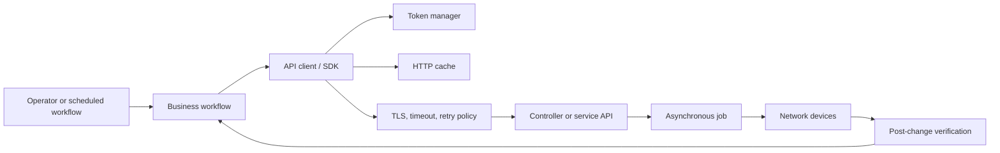
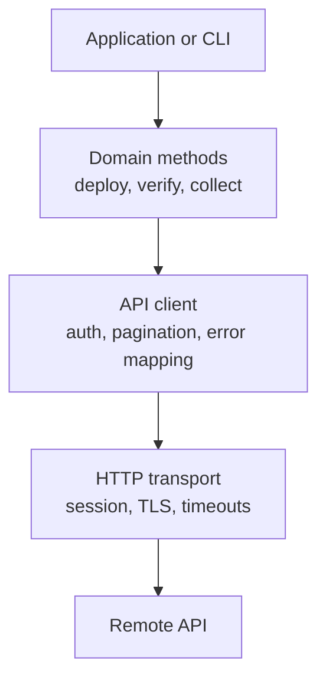
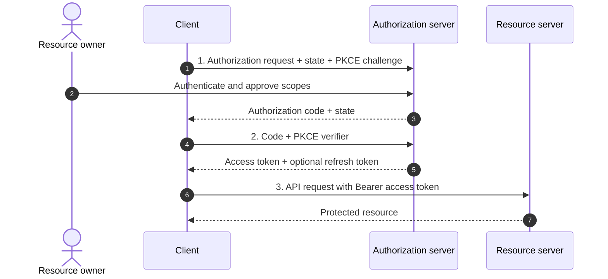
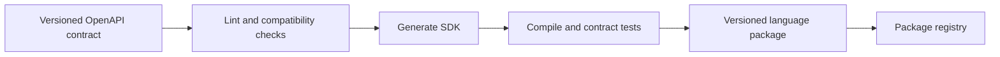
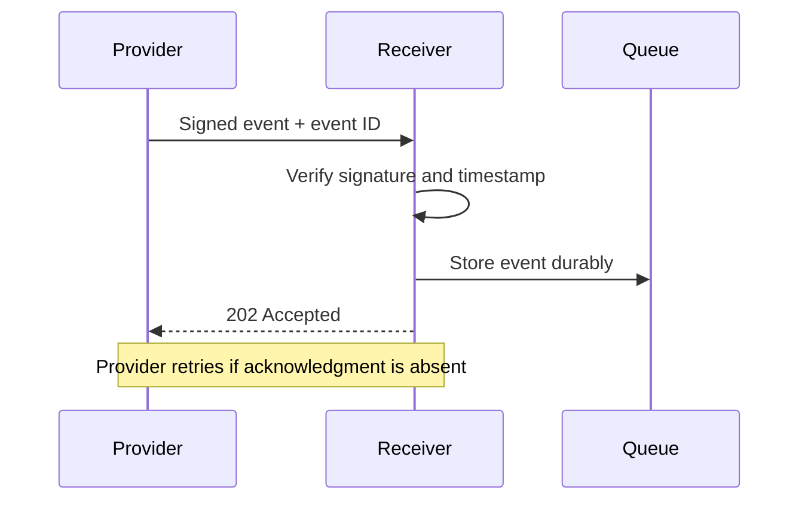

# Chapter 6: Resilient API Development

## Chapter Introduction

API development has two sides. Providers must publish a consistent, secure, and supportable contract. Consumers must call that contract responsibly, validate what comes back, respect limits, and stop safely when continuing would create more damage.

This chapter approaches API development from the perspective of a network automation engineer. The important question is not simply, “Did the HTTP request work?” It is, “Does the application know what happened, and can it make the next decision safely?” A timeout after a GET is inconvenient. A timeout after a configuration POST may leave the client uncertain whether the device change already started.

This chapter develops API clients and services around four operational concerns:

- Authentication and the three-step OAuth 2 authorization flow
- Pagination, webhooks, and streaming
- Python handling for timeouts and rate limits
- Explicit flow control for unrecoverable REST API errors

### A Resilient Client in Context



The SDK handles protocol mechanics, but the business workflow decides whether to retry, continue with other devices, compensate for partial success, or stop the entire operation.

## 1. API Clients and SDKs

An API client wraps protocol details in functions and data types that are easier for application developers to use. A software development kit (SDK) may add models, authentication, pagination, retries, documentation, and command-line integration.

Instead of repeating raw HTTP logic throughout an application:

```python
response = session.get(f"{base_url}/devices/{device_id}")
```

the application can use a purpose-specific method:

```python
device = controller.devices.get(device_id)
```

The wrapper creates one place to enforce headers, timeouts, error mapping, token refresh, and telemetry.

### 1.1 Client Design Principles

- Generate baseline models and methods from an OpenAPI contract where useful.
- Keep generated code separate from hand-written policy.
- Require explicit connect and read timeouts.
- Use a reusable connection session.
- Validate response status and media type.
- Convert transport failures into documented client exceptions.
- Make retry behavior visible and configurable.
- Expose pagination without forcing callers to manage raw links.
- Avoid hiding destructive or expensive actions behind surprising defaults.
- Never place secrets in source code or debug logs.

### 1.2 Client Layers



User code should decide business flow, such as whether one failed device stops a site deployment. The transport layer should not make that policy decision.

## 2. API Design Considerations

A consumable API uses consistent names, representations, status codes, and errors. Resource paths normally contain plural nouns:

```text
GET  /v1/devices
GET  /v1/devices/{deviceId}
POST /v1/change-jobs
GET  /v1/change-jobs/{jobId}
```

An action that cannot be expressed as normal resource state can create an operation resource. Starting a configuration deployment with `POST /change-jobs` is easier to track and retry safely than an endpoint named `/runConfigurationNow`.

### 2.1 Compatibility

Prefer additive changes:

- Add optional response fields.
- Add optional request parameters with safe defaults.
- Preserve existing meaning.
- Announce deprecation before removal.
- Test old clients against new server versions.

Changing a field type, removing an enum value, or altering error meaning can break clients even if the path remains unchanged.

### 2.2 Error Representation

An error response should be machine-readable and useful to humans:

```json
{
  "type": "https://api.example.net/problems/device-unreachable",
  "title": "Device is unreachable",
  "status": 503,
  "detail": "No management connection to branch-17-r1",
  "instance": "/v1/change-jobs/789",
  "requestId": "req-6db2b5"
}
```

The client should branch on status and a stable error type, not parse changing prose in `detail`.

## 3. Authentication and Authorization

Authentication establishes identity. Authorization determines what that identity may do.

### 3.1 Basic Authentication

Basic authentication sends a Base64-encoded username and password. Base64 is encoding, not encryption, so TLS is mandatory. Long-lived passwords are exposed on every request and are difficult to scope, making Basic authentication a weak choice for modern external APIs.

### 3.2 API Keys

API keys identify a client project and can support quota and usage tracking. They should be transmitted in a header, stored as secrets, scoped where possible, rotated, and revocable. A key does not inherently represent an end user or provide delegated authorization.

### 3.3 Bearer Tokens

A bearer token grants access to whoever possesses it. The client sends it in the authorization header:

```http
Authorization: Bearer <access-token>
```

Tokens should have limited lifetime and scope. TLS, secure storage, log redaction, and audience validation protect against theft and misuse.

### 3.4 Cookie Authentication

Browser applications may maintain a session with a secure cookie. Cookies should use `Secure`, `HttpOnly`, and an appropriate `SameSite` policy. State-changing requests need cross-site request forgery protection when cookie behavior allows cross-site submission.

## 4. Three-Step OAuth 2 Authorization Flow

OAuth 2 allows a client to access protected resources on behalf of a resource owner without receiving the owner's password.

The participants are:

- **Resource owner:** The user who grants access
- **Client:** The application requesting delegated access
- **Authorization server:** The service that authenticates the user and issues tokens
- **Resource server:** The API hosting protected data or operations

The authorization code flow can be understood in three steps.

### Step 1: Request Authorization and Receive a Code

The client redirects the resource owner to the authorization server with its client identifier, redirect URI, requested scopes, state value, and a PKCE code challenge. The user authenticates and approves access. The authorization server redirects the browser back to the registered URI with a short-lived authorization code and the original state.

```text
GET /authorize?
    response_type=code&
    client_id=network-portal&
    redirect_uri=https%3A%2F%2Fportal.example.net%2Fcallback&
    scope=inventory.read%20changes.create&
    state=<random-value>&
    code_challenge=<pkce-challenge>&
    code_challenge_method=S256
```

The client verifies `state` before proceeding. PKCE binds the authorization request to the client instance and protects the code if it is intercepted.

### Step 2: Exchange the Code for Tokens

The client sends the authorization code and PKCE verifier to the token endpoint. A confidential client also authenticates according to its registered method.

```http
POST /oauth2/token HTTP/1.1
Content-Type: application/x-www-form-urlencoded

grant_type=authorization_code&
code=<authorization-code>&
redirect_uri=https%3A%2F%2Fportal.example.net%2Fcallback&
client_id=network-portal&
code_verifier=<pkce-verifier>
```

The authorization server validates the code, redirect URI, client, and verifier, then returns a short-lived access token and optionally a refresh token.

### Step 3: Call the Resource API

The client presents the access token to the resource server:

```http
GET /v1/devices HTTP/1.1
Authorization: Bearer <access-token>
Accept: application/json
```

The resource server validates signature or introspection state, issuer, audience, expiry, and scope before returning data.



When the access token expires, a refresh token may obtain another access token without repeating user authorization. Refresh tokens require stronger storage protection, rotation, revocation, and lifetime controls.

OAuth is an authorization framework. OpenID Connect adds standardized user authentication and identity claims on top of OAuth 2.

## 5. Pagination and Flow of Large Results

APIs should not return an unbounded collection. Pagination protects server memory, client memory, bandwidth, and response time.

### 5.1 Offset Pagination

Offset pagination selects a numbered page or starting position:

```text
GET /v1/devices?offset=200&limit=100
```

It supports navigation to a specific location but can produce duplicates or omissions when records are inserted or deleted during traversal.

### 5.2 Cursor Pagination

Cursor pagination returns an opaque pointer to continue after a stable record:

```json
{
  "items": [...],
  "nextCursor": "eyJsYXN0SWQiOiIxMjM0NSJ9"
}
```

It is well suited to frequently changing data and large datasets, although clients cannot normally jump directly to page 20.

```python
def iter_devices(session, base_url):
    cursor = None

    while True:
        params = {"limit": 200}
        if cursor:
            params["cursor"] = cursor

        response = session.get(
            f"{base_url}/devices",
            params=params,
            timeout=(3.05, 20),
        )
        response.raise_for_status()
        page = response.json()

        yield from page["items"]
        cursor = page.get("nextCursor")
        if not cursor:
            return
```

The generator streams records into user code rather than building one large in-memory list.

## 6. Polling, Webhooks, and Streaming

Polling repeatedly requests state. It is simple but consumes quota and discovers events only after the next poll. Cache validation can make unchanged polls cheaper, but it does not remove the delay.

A webhook lets the provider send an HTTP request to a registered callback when an event occurs. The receiver should authenticate the sender, validate signatures and timestamps, acknowledge quickly, and process work asynchronously. Duplicate delivery must be expected.

WebSocket and streaming APIs maintain a connection through which messages can arrive continuously. They reduce polling delay and protocol setup but require connection lifecycle, heartbeat, reconnection, ordering, and backpressure design.

Network telemetry is naturally stream-oriented. Interface counters and route events can be delivered as changes rather than repeatedly polling every device for a complete snapshot.

## 7. HTTP Status and Error Classification

| Class | Meaning | Client direction |
|---|---|---|
| 1xx | Informational | Continue protocol behavior |
| 2xx | Success | Process result |
| 3xx | Redirection or cache validation | Follow documented semantics |
| 4xx | Request or client condition | Usually correct request or authorization |
| 5xx | Server or upstream failure | May be transient |

Important statuses include:

- `400 Bad Request`: invalid syntax or parameters
- `401 Unauthorized`: authentication missing or invalid
- `403 Forbidden`: identity lacks permission
- `404 Not Found`: resource absent or hidden
- `408 Request Timeout`: request not completed in the server's allowed time
- `409 Conflict`: request conflicts with current state
- `412 Precondition Failed`: conditional write validation failed
- `422 Unprocessable Content`: valid syntax but invalid domain content
- `429 Too Many Requests`: frequency or quota limit reached
- `500 Internal Server Error`: unexpected provider failure
- `502 Bad Gateway`: invalid upstream response
- `503 Service Unavailable`: temporary unavailability
- `504 Gateway Timeout`: upstream did not respond in time

Some libraries or proxies use nonstandard codes such as 599 for network connection timeout. Clients should also handle transport exceptions because no HTTP response exists when DNS, TLS, or connection establishment fails.

## 8. Python Handling for Timeouts and Frequency Limits

Retries should be limited to transient conditions and safe operations. The following client handles connection/read timeouts, `408`, `429`, and selected `5xx` responses. It honors `Retry-After`, uses exponential backoff with jitter otherwise, and requires the caller to declare whether the operation is retry-safe.

```python
from __future__ import annotations

import random
import time
from dataclasses import dataclass
from datetime import datetime, timezone
from email.utils import parsedate_to_datetime

import requests


class ApiError(RuntimeError):
    """Base error for the API client."""


class RetryExhausted(ApiError):
    pass


class UnrecoverableApiError(ApiError):
    def __init__(self, status: int, message: str, request_id: str | None):
        super().__init__(f"HTTP {status}: {message}; request_id={request_id}")
        self.status = status
        self.request_id = request_id


@dataclass(frozen=True)
class RetryPolicy:
    max_attempts: int = 4
    base_delay: float = 0.5
    max_delay: float = 20.0


def retry_after_seconds(response: requests.Response) -> float | None:
    value = response.headers.get("Retry-After")
    if not value:
        return None

    if value.isdigit():
        return max(0.0, float(value))

    try:
        retry_time = parsedate_to_datetime(value)
        if retry_time.tzinfo is None:
            retry_time = retry_time.replace(tzinfo=timezone.utc)
        return max(0.0, (retry_time - datetime.now(timezone.utc)).total_seconds())
    except (TypeError, ValueError, OverflowError):
        return None


def response_message(response: requests.Response) -> str:
    try:
        body = response.json()
        return body.get("detail") or body.get("message") or response.reason
    except (ValueError, AttributeError):
        return response.text[:300] or response.reason


def request_json(
    session: requests.Session,
    method: str,
    url: str,
    *,
    retry_safe: bool,
    policy: RetryPolicy = RetryPolicy(),
    **kwargs,
):
    kwargs.setdefault("timeout", (3.05, 20))
    transient_statuses = {408, 429, 500, 502, 503, 504}

    for attempt in range(1, policy.max_attempts + 1):
        try:
            response = session.request(method, url, **kwargs)
        except (requests.ConnectTimeout, requests.ReadTimeout,
                requests.ConnectionError) as exc:
            if not retry_safe or attempt == policy.max_attempts:
                raise RetryExhausted(f"Transport failure for {method} {url}") from exc
        else:
            if 200 <= response.status_code < 300:
                if response.status_code == 204:
                    return None
                return response.json()

            if response.status_code not in transient_statuses:
                raise UnrecoverableApiError(
                    response.status_code,
                    response_message(response),
                    response.headers.get("X-Request-ID"),
                )

            if not retry_safe or attempt == policy.max_attempts:
                raise RetryExhausted(
                    f"Transient HTTP {response.status_code} persisted for {url}"
                )

            server_delay = retry_after_seconds(response)
            if server_delay is not None:
                time.sleep(min(server_delay, policy.max_delay))
                continue

        delay = min(policy.max_delay, policy.base_delay * (2 ** (attempt - 1)))
        time.sleep(delay + random.uniform(0, delay * 0.25))

    raise AssertionError("retry loop exited unexpectedly")
```

The client can safely retry GET. A POST should set `retry_safe=True` only when the API supports an idempotency key or the operation otherwise guarantees duplicate suppression:

```python
session = requests.Session()
session.headers.update({
    "Accept": "application/json",
    "Authorization": "Bearer <token>",
})

devices = request_json(
    session,
    "GET",
    "https://controller.example.net/api/v1/devices",
    retry_safe=True,
)

job = request_json(
    session,
    "POST",
    "https://controller.example.net/api/v1/change-jobs",
    retry_safe=True,
    headers={"Idempotency-Key": "change-2026-0042"},
    json={"siteId": "branch-17", "templateId": "ntp-standard-v3"},
)
```

Blind retry middleware can duplicate changes, amplify overload, and consume the entire rate limit. Retry decisions belong to the operation contract.

## 9. User-Code Flow Control for Unrecoverable Errors

An unrecoverable error means repeating the same request without changing input, credentials, authorization, or system state will not succeed. Common terminal conditions include malformed input, invalid credentials, forbidden scope, unsupported resource, or a failed precondition.

User code should make termination behavior explicit:

```python
import logging
import sys

log = logging.getLogger(__name__)


def run_site_change(session, site_id, template_id) -> int:
    try:
        job = request_json(
            session,
            "POST",
            "https://controller.example.net/api/v1/change-jobs",
            retry_safe=True,
            headers={"Idempotency-Key": f"{site_id}-{template_id}"},
            json={"siteId": site_id, "templateId": template_id},
        )
    except UnrecoverableApiError as exc:
        if exc.status in {401, 403}:
            log.critical("Authorization prevents all further changes: %s", exc)
            return 20  # abort the whole run; user or credentials must change

        if exc.status in {400, 404, 409, 412, 422}:
            log.error("This change request cannot proceed: %s", exc)
            return 10  # reject this requested workflow without retry

        log.exception("Unclassified terminal API response")
        return 30
    except RetryExhausted as exc:
        log.error("Remote service remained unavailable: %s", exc)
        return 40  # safe stop; operator may rerun after service recovery

    log.info("Change job accepted: %s", job["id"])
    return 0


if __name__ == "__main__":
    exit_code = run_site_change(session, "branch-17", "ntp-standard-v3")
    sys.exit(exit_code)
```

The return codes distinguish invalid user intent, authorization failure, unexpected terminal behavior, and exhausted transient recovery. An orchestrator can route each outcome differently.

Batch workflows need two levels of flow control. A device-specific `404` may fail one item and allow independent devices to continue. A `401` or `403` generally invalidates the identity used for every remaining item and should stop the batch.

```python
def collect_inventory(session, device_ids):
    collected = {}
    failed = {}

    for device_id in device_ids:
        try:
            collected[device_id] = request_json(
                session,
                "GET",
                f"https://controller.example.net/api/v1/devices/{device_id}",
                retry_safe=True,
            )
        except UnrecoverableApiError as exc:
            if exc.status in {401, 403}:
                raise  # global identity failure: abort remaining requests
            failed[device_id] = str(exc)  # item failure: preserve and continue
        except RetryExhausted as exc:
            failed[device_id] = str(exc)

    return collected, failed
```

Continuing after a terminal write failure can violate workflow ordering. If step two depends on step one, the code must stop, record partial state, and invoke a documented compensation or rollback rather than continue blindly.

## 10. Rate-Limit Design

Providers use rate limits to protect capacity, fairness, and cost.

| Algorithm | Behavior |
|---|---|
| Token bucket | Accumulated tokens permit controlled bursts |
| Leaky bucket | Work drains at a steady rate, smoothing bursts |
| Fixed window | Counts requests in fixed time intervals |
| Sliding window | Calculates usage across a rolling interval |

A `429 Too Many Requests` response should include `Retry-After` and, where supported, quota headers. Clients should slow down, avoid synchronized retries, cache stable results, paginate efficiently, and eliminate duplicate calls.

Client-side concurrency limits can prevent rate limits before they occur. A worker pool may allow ten controller requests in parallel while permitting only one configuration session per device.

## 11. Cache-Aware Client Development

Chapter 5 introduced `Cache-Control` and validators. A client can preserve an ETag and avoid downloading unchanged content:

```python
def get_with_etag(session, url, cached=None):
    headers = {}
    if cached and cached.get("etag"):
        headers["If-None-Match"] = cached["etag"]

    response = session.get(url, headers=headers, timeout=(3.05, 20))

    if response.status_code == 304 and cached:
        return cached

    response.raise_for_status()
    return {
        "etag": response.headers.get("ETag"),
        "body": response.json(),
    }
```

Device platform capabilities and software catalogs are strong cache candidates. Current reachability, active alarms, and authorization-sensitive data require shorter freshness or mandatory revalidation.

Caching optimizes frequency limits only when semantics allow reuse. A stale cached response must not be mistaken for confirmation that a change completed or that a device remains healthy.

## 12. API Development Checklist

- Is the interface defined before implementation?
- Are resource names and methods consistent?
- Are schemas and errors machine-readable?
- Are authentication and authorization separate and scoped?
- Does the OAuth client validate state and use PKCE?
- Are collections bounded with pagination?
- Would webhooks or streaming reduce wasteful polling?
- Do clients set connection and read timeouts?
- Are retries limited to transient, retry-safe operations?
- Is `Retry-After` honored for rate limits?
- Do terminal failures stop or continue according to business scope?
- Are stable GET responses cacheable and conditionally validated?
- Are secrets and sensitive responses excluded from logs and shared caches?

## 13. Generating and Maintaining Client SDKs

OpenAPI generators can create models, endpoint methods, packaging files, and documentation for multiple languages. Generation reduces repetitive work and helps clients remain aligned with the contract.

The generated SDK should be reproducible from a versioned specification and generator configuration. Manual edits inside generated files will be lost on regeneration. Hand-written behavior belongs in a wrapper layer or supported extension point.



An SDK release should state which API versions it supports. Semantic versioning communicates SDK interface changes, while the dependency lock records exact runtime packages.

### 13.1 SDK Usability

The client should accept configuration rather than embed environment assumptions:

```python
from dataclasses import dataclass


@dataclass(frozen=True)
class ClientConfig:
    base_url: str
    connect_timeout: float = 3.05
    read_timeout: float = 20.0
    user_agent: str = "network-sdk/1.0"
```

Public methods should use domain names and typed inputs, provide useful docstrings, and raise a small documented exception hierarchy. Returning raw `requests.Response` everywhere leaks transport details and forces every caller to repeat parsing.

### 13.2 Package Contents

A Python package typically includes source modules, metadata, dependency declarations, tests, README usage, license, change log, and typed interface information. Publishing should occur only from CI after tests and provenance checks.

## 14. Command-Line Interfaces over SDKs

A CLI makes the client accessible to operators and scripts while reusing the same SDK behavior.

```python
import json
import click


@click.group()
def cli():
    """Network controller client."""


@cli.command("get-device")
@click.argument("device_id")
@click.option("--output", type=click.Choice(["json", "table"]), default="table")
def get_device(device_id, output):
    device = controller.devices.get(device_id)
    if output == "json":
        click.echo(json.dumps(device, indent=2))
    else:
        click.echo(f"{device['hostname']}\t{device['status']}")


if __name__ == "__main__":
    cli()
```

Exit codes should distinguish success, invalid input, authentication failure, unavailable dependency, and partial completion. Human-readable messages go to standard error, while machine output remains stable on standard output.

Destructive commands should require explicit target and intent. An interactive confirmation is useful for humans but unsuitable as the only safety control because automation may bypass it. Server-side authorization, approval, idempotency, and validation remain necessary.

## 15. Provider-Side Error Design

The provider should return the most specific stable status that represents the outcome. A `500` response for every failure prevents clients from deciding whether to correct input, refresh credentials, wait, or escalate.

### 15.1 Error Schema

Use a consistent media type and schema. Include a stable type, title, status, human detail, affected instance, and correlation identifier. Field validation can include a structured list:

```json
{
  "type": "https://api.example.net/problems/validation",
  "title": "Request validation failed",
  "status": 422,
  "errors": [
    {"field": "siteId", "code": "unknown_site"},
    {"field": "templateId", "code": "unsupported_platform"}
  ],
  "requestId": "req-e8b16a"
}
```

Do not reveal stack traces, queries, internal hostnames, or secrets to clients. Store detailed diagnostics in protected logs linked by request ID.

### 15.2 Timeout Boundaries

Every layer should have a timeout shorter than its caller's remaining budget. If a gateway waits 30 seconds, the service cannot safely assign 30 seconds to its database and another 30 to a controller.

Cancellation should propagate when possible. Continuing expensive work after the caller has abandoned the request wastes resources. For operations that must finish, move the work to a durable asynchronous job and return `202`.

### 15.3 Retry Hints

Transient responses can include `Retry-After`. Error bodies may state whether the operation is safe to repeat, but clients still need the operation contract and idempotency protection.

## 16. Authentication Lifecycle and Token Safety

Authentication design covers credential issuance, storage, use, rotation, revocation, and audit.

### 16.1 Token Validation

A resource server validates:

- Signature or authorization-server introspection
- Issuer
- Intended audience
- Expiration and not-before time
- Required scopes or roles
- Revocation or session state when applicable

Accepting a correctly signed token for the wrong audience can expose one API to a token issued for another.

### 16.2 Scope Design

Scopes should represent useful least-privilege capabilities such as `inventory.read`, `changes.create`, and `changes.approve`. One broad `admin` scope makes delegation and audit less effective.

OAuth user delegation is not always appropriate for machine-to-machine automation. A workload may use a client-credentials flow or platform workload identity. The three-step authorization code flow remains appropriate when a user authorizes a client to act on the user's behalf.

### 16.3 Refresh Tokens

Refresh tokens should be stored more securely than access tokens because they can obtain new access. Rotation invalidates the previous refresh token when it is used, helping detect replay. Revocation and session termination should invalidate future use.

## 17. Pagination Correctness

Pagination is part of consistency semantics. Offset pagination over a changing dataset can skip or duplicate records. Stable sorting reduces but does not eliminate the problem.

Cursor pagination should bind the cursor to the filter, sort order, and tenant. Cursors should be opaque so clients do not depend on internal storage keys. Expiration should return a clear error that tells the client to restart traversal.

For an inventory export requiring a consistent point-in-time view, the API may create an export job or snapshot instead of paginating live data. This trades freshness for consistency and repeatability.

## 18. Webhook Reliability and Security

Webhook delivery is normally at least once. Receivers should expect duplicates and process an event ID idempotently.



The receiver should acknowledge after durable acceptance, not after lengthy business processing. Signatures protect integrity and authenticity; timestamps and nonce or event-ID tracking reduce replay risk. Endpoint rotation and secret rotation need overlap so delivery continues during change.

## 19. Testing API Failure Behavior

Client tests should simulate:

- DNS and connection failure
- Connect and read timeout
- TLS validation failure
- Invalid JSON and unexpected media type
- `401`, `403`, `404`, `409`, `412`, `422`, and `429`
- `500`, `502`, `503`, and `504`
- Missing and malformed `Retry-After`
- Pagination loops and expired cursors
- Duplicate webhook delivery
- Token expiry during a multi-page operation

Use a fake server or transport adapter to control timing and responses. Tests should verify not only the returned value but also number of attempts, delay selection, idempotency headers, termination behavior, and redaction of secrets.

Provider tests should validate the OpenAPI contract, authorization matrix, quota enforcement, cache directives, and backward compatibility. Performance tests should include expensive filters and worst-case page sizes, not only the default path.

## 20. Designing Retry Policy by Operation

Retry policy should be derived from failure type, method semantics, and server contract.

| Operation | Failure | Default decision |
|---|---|---|
| GET inventory | connection timeout | retry with bounded backoff |
| GET inventory | `401` | refresh once if permitted, otherwise stop |
| POST job with idempotency key | read timeout | query by key or retry safely |
| POST job without duplicate protection | read timeout | do not repeat blindly; reconcile state |
| PUT full resource | `503` | retry if body and preconditions remain valid |
| PATCH relative increment | timeout | do not assume idempotency |
| DELETE known resource | `404` | may represent desired terminal state |
| Any operation | `429` | honor `Retry-After` and reduce frequency |

A retry budget limits the total additional load one user operation can create. Per-attempt timeout, maximum attempts, and overall deadline should work together. Four 20-second attempts do not fit a 30-second user deadline.

Hedged requests, in which a second request is sent before the first finishes, can reduce tail latency for read-only distributed systems but increase load and must not be used casually for network changes.

## 21. Token Refresh in a Client

An access token can expire during a long pagination or job-monitoring workflow. A client can refresh once and repeat a safe request, while preventing multiple threads from refreshing simultaneously.

```python
import threading


class TokenManager:
    def __init__(self, refresh_function):
        self._refresh_function = refresh_function
        self._lock = threading.Lock()
        self._token = None

    def current(self):
        if self._token is None:
            with self._lock:
                if self._token is None:
                    self._token = self._refresh_function()
        return self._token

    def refresh_after_unauthorized(self, failed_token):
        with self._lock:
            if self._token == failed_token:
                self._token = self._refresh_function()
            return self._token
```

The refresh function protects the refresh token, verifies the token response, and does not log token values. A repeated `401` after refresh is terminal; continuing refresh attempts can lock accounts or conceal an authorization problem.

## 22. Partial Success and Compensation

Bulk operations often produce mixed outcomes. The API should not return a simple success if five of one hundred devices failed.

```json
{
  "jobId": "job-789",
  "state": "completed-with-errors",
  "summary": {"succeeded": 95, "failed": 5},
  "failures": [
    {"deviceId": "r17", "code": "precheck_failed"},
    {"deviceId": "r22", "code": "connection_timeout"}
  ]
}
```

User code decides whether successful independent items remain committed. If the workflow requires all-or-nothing behavior but the underlying devices lack distributed transactions, the application uses compensation: record completed actions, attempt rollback in reverse order, and report any rollback failure explicitly.

Compensation is not equivalent to database rollback. External state may have changed again, and a reverse command may not restore the original condition. Pre-change snapshots and conditional checks reduce this risk.

## 23. Server-Side Rate Limiting

The provider chooses a limit key, capacity, refill behavior, and response. Keys may combine tenant, client, user, endpoint, and cost class. One expensive report request may consume more quota than a small device lookup.

A token-bucket decision can be represented as:

```python
def allow_request(bucket, cost, now):
    elapsed = max(0, now - bucket.updated_at)
    bucket.tokens = min(
        bucket.capacity,
        bucket.tokens + elapsed * bucket.refill_per_second,
    )
    bucket.updated_at = now

    if bucket.tokens < cost:
        return False

    bucket.tokens -= cost
    return True
```

Distributed gateways need consistent or acceptably approximate counters. Strict global limits cost more coordination than regional approximate limits. The business goal determines whether occasional small overage is acceptable.

Rate-limit responses should identify retry timing without exposing other tenants. Metrics should show rejected requests, active keys, and endpoint cost so operators can tune policy.

## 24. Cache Invalidation After Mutation

A successful mutation can invalidate related cached resources. Updating one device may affect its representation, site summary, compliance count, and search results.

The provider can use versioned cache keys and publish an invalidation event after commit. Clients relying on freshness limits eventually recover even if the event is lost.

Write responses can return the new representation and ETag, allowing the client to update its private cache without an immediate GET. Conditional writes prevent a stale client from overwriting a newer version.

Sensitive authentication and token responses use `Cache-Control: no-store`. Public documentation and stable capability catalogs can use long freshness with versioned URLs.

## 25. API Client Observability

Client telemetry should record method, normalized endpoint, status class, duration, attempt count, rate-limit delay, and request ID. It should not use complete URLs when path or query values contain sensitive identifiers.

Metrics distinguish original calls from retries. Otherwise, a retry storm can look like legitimate demand. Traces create one parent span for the user operation and child spans for each attempt.

An error log should retain provider request ID and local trace ID. These identifiers allow consumer and provider teams to correlate evidence without exchanging credentials or complete payloads.

> **Study guide takeaway:** A production client is a decision-making component. It knows which failures are transient, which operations are safe to repeat, when one item may fail independently, and when the entire workflow must stop.

## Key Takeaways

- Authentication establishes identity, authorization controls permitted actions, and OAuth obtains delegated access without sharing user passwords.
- Pagination, webhooks, streaming, and cache-aware requests improve performance and reduce unnecessary API traffic.
- Resilient clients use explicit timeouts, bounded retries, `Retry-After`, idempotency protection, and decisive handling of unrecoverable errors.

Chapter 7 follows the completed application into CI/CD, packaging, container deployment, GitOps, and production operations.

## Further Reading and References

- [OAuth 2.0 - RFC 6749](https://www.rfc-editor.org/rfc/rfc6749) - authorization roles and grant flows.
- [Requests documentation](https://requests.readthedocs.io/en/latest/) - Python HTTP client behavior.
- [Additional HTTP Status Codes - RFC 6585](https://www.rfc-editor.org/rfc/rfc6585) - includes HTTP 429 rate limiting.
