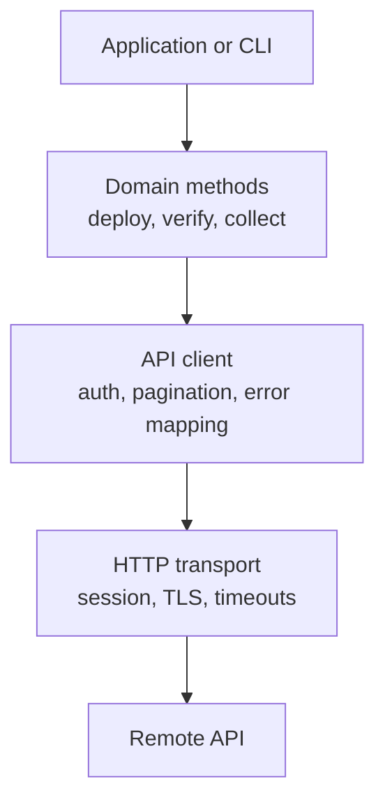
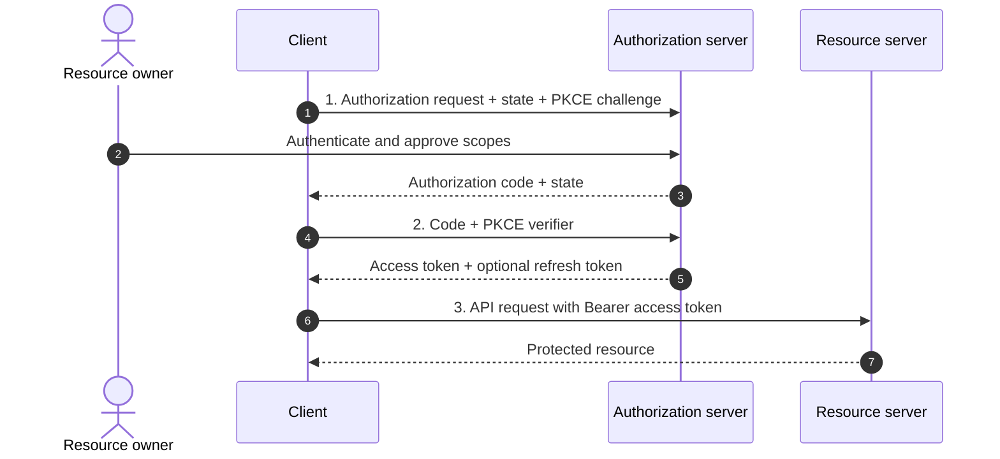

# Chapter 6: API Development

## Chapter Purpose

API development includes both provider and consumer responsibilities. Providers must design consistent resources, authentication, pagination, limits, and errors. Consumers must validate responses, control retries, preserve user intent, and stop safely when continued execution would be harmful.

This chapter develops API clients and services around four operational concerns:

- Authentication and the three-step OAuth 2 authorization flow
- Pagination, webhooks, and streaming
- Python handling for timeouts and rate limits
- Explicit flow control for unrecoverable REST API errors

## 1. API Clients and SDKs

An API client wraps protocol details in functions and data types that are easier for application developers to use. A software development kit (SDK) may add models, authentication, pagination, retries, documentation, and command-line integration.

Instead of repeating raw HTTP logic throughout an application:

```python
response = session.get(f"{base_url}/devices/{device_id}")
```

the application can use a purpose-specific method:

```python
device = controller.devices.get(device_id)
```

The wrapper creates one place to enforce headers, timeouts, error mapping, token refresh, and telemetry.

### 1.1 Client Design Principles

- Generate baseline models and methods from an OpenAPI contract where useful.
- Keep generated code separate from hand-written policy.
- Require explicit connect and read timeouts.
- Use a reusable connection session.
- Validate response status and media type.
- Convert transport failures into documented client exceptions.
- Make retry behavior visible and configurable.
- Expose pagination without forcing callers to manage raw links.
- Avoid hiding destructive or expensive actions behind surprising defaults.
- Never place secrets in source code or debug logs.

### 1.2 Client Layers



User code should decide business flow, such as whether one failed device stops a site deployment. The transport layer should not make that policy decision.

## 2. API Design Considerations

A consumable API uses consistent names, representations, status codes, and errors. Resource paths normally contain plural nouns:

```text
GET  /v1/devices
GET  /v1/devices/{deviceId}
POST /v1/change-jobs
GET  /v1/change-jobs/{jobId}
```

An action that cannot be expressed as normal resource state can create an operation resource. Starting a configuration deployment with `POST /change-jobs` is easier to track and retry safely than an endpoint named `/runConfigurationNow`.

### 2.1 Compatibility

Prefer additive changes:

- Add optional response fields.
- Add optional request parameters with safe defaults.
- Preserve existing meaning.
- Announce deprecation before removal.
- Test old clients against new server versions.

Changing a field type, removing an enum value, or altering error meaning can break clients even if the path remains unchanged.

### 2.2 Error Representation

An error response should be machine-readable and useful to humans:

```json
{
  "type": "https://api.example.net/problems/device-unreachable",
  "title": "Device is unreachable",
  "status": 503,
  "detail": "No management connection to branch-17-r1",
  "instance": "/v1/change-jobs/789",
  "requestId": "req-6db2b5"
}
```

The client should branch on status and a stable error type, not parse changing prose in `detail`.

## 3. Authentication and Authorization

Authentication establishes identity. Authorization determines what that identity may do.

### 3.1 Basic Authentication

Basic authentication sends a Base64-encoded username and password. Base64 is encoding, not encryption, so TLS is mandatory. Long-lived passwords are exposed on every request and are difficult to scope, making Basic authentication a weak choice for modern external APIs.

### 3.2 API Keys

API keys identify a client project and can support quota and usage tracking. They should be transmitted in a header, stored as secrets, scoped where possible, rotated, and revocable. A key does not inherently represent an end user or provide delegated authorization.

### 3.3 Bearer Tokens

A bearer token grants access to whoever possesses it. The client sends it in the authorization header:

```http
Authorization: Bearer <access-token>
```

Tokens should have limited lifetime and scope. TLS, secure storage, log redaction, and audience validation protect against theft and misuse.

### 3.4 Cookie Authentication

Browser applications may maintain a session with a secure cookie. Cookies should use `Secure`, `HttpOnly`, and an appropriate `SameSite` policy. State-changing requests need cross-site request forgery protection when cookie behavior allows cross-site submission.

## 4. Three-Step OAuth 2 Authorization Flow

OAuth 2 allows a client to access protected resources on behalf of a resource owner without receiving the owner's password.

The participants are:

- **Resource owner:** The user who grants access
- **Client:** The application requesting delegated access
- **Authorization server:** The service that authenticates the user and issues tokens
- **Resource server:** The API hosting protected data or operations

The authorization code flow can be understood in three steps.

### Step 1: Request Authorization and Receive a Code

The client redirects the resource owner to the authorization server with its client identifier, redirect URI, requested scopes, state value, and a PKCE code challenge. The user authenticates and approves access. The authorization server redirects the browser back to the registered URI with a short-lived authorization code and the original state.

```text
GET /authorize?
    response_type=code&
    client_id=network-portal&
    redirect_uri=https%3A%2F%2Fportal.example.net%2Fcallback&
    scope=inventory.read%20changes.create&
    state=<random-value>&
    code_challenge=<pkce-challenge>&
    code_challenge_method=S256
```

The client verifies `state` before proceeding. PKCE binds the authorization request to the client instance and protects the code if it is intercepted.

### Step 2: Exchange the Code for Tokens

The client sends the authorization code and PKCE verifier to the token endpoint. A confidential client also authenticates according to its registered method.

```http
POST /oauth2/token HTTP/1.1
Content-Type: application/x-www-form-urlencoded

grant_type=authorization_code&
code=<authorization-code>&
redirect_uri=https%3A%2F%2Fportal.example.net%2Fcallback&
client_id=network-portal&
code_verifier=<pkce-verifier>
```

The authorization server validates the code, redirect URI, client, and verifier, then returns a short-lived access token and optionally a refresh token.

### Step 3: Call the Resource API

The client presents the access token to the resource server:

```http
GET /v1/devices HTTP/1.1
Authorization: Bearer <access-token>
Accept: application/json
```

The resource server validates signature or introspection state, issuer, audience, expiry, and scope before returning data.



When the access token expires, a refresh token may obtain another access token without repeating user authorization. Refresh tokens require stronger storage protection, rotation, revocation, and lifetime controls.

OAuth is an authorization framework. OpenID Connect adds standardized user authentication and identity claims on top of OAuth 2.

## 5. Pagination and Flow of Large Results

APIs should not return an unbounded collection. Pagination protects server memory, client memory, bandwidth, and response time.

### 5.1 Offset Pagination

Offset pagination selects a numbered page or starting position:

```text
GET /v1/devices?offset=200&limit=100
```

It supports navigation to a specific location but can produce duplicates or omissions when records are inserted or deleted during traversal.

### 5.2 Cursor Pagination

Cursor pagination returns an opaque pointer to continue after a stable record:

```json
{
  "items": [...],
  "nextCursor": "eyJsYXN0SWQiOiIxMjM0NSJ9"
}
```

It is well suited to frequently changing data and large datasets, although clients cannot normally jump directly to page 20.

```python
def iter_devices(session, base_url):
    cursor = None

    while True:
        params = {"limit": 200}
        if cursor:
            params["cursor"] = cursor

        response = session.get(
            f"{base_url}/devices",
            params=params,
            timeout=(3.05, 20),
        )
        response.raise_for_status()
        page = response.json()

        yield from page["items"]
        cursor = page.get("nextCursor")
        if not cursor:
            return
```

The generator streams records into user code rather than building one large in-memory list.

## 6. Polling, Webhooks, and Streaming

Polling repeatedly requests state. It is simple but consumes quota and discovers events only after the next poll. Cache validation can make unchanged polls cheaper, but it does not remove the delay.

A webhook lets the provider send an HTTP request to a registered callback when an event occurs. The receiver should authenticate the sender, validate signatures and timestamps, acknowledge quickly, and process work asynchronously. Duplicate delivery must be expected.

WebSocket and streaming APIs maintain a connection through which messages can arrive continuously. They reduce polling delay and protocol setup but require connection lifecycle, heartbeat, reconnection, ordering, and backpressure design.

Network telemetry is naturally stream-oriented. Interface counters and route events can be delivered as changes rather than repeatedly polling every device for a complete snapshot.

## 7. HTTP Status and Error Classification

| Class | Meaning | Client direction |
|---|---|---|
| 1xx | Informational | Continue protocol behavior |
| 2xx | Success | Process result |
| 3xx | Redirection or cache validation | Follow documented semantics |
| 4xx | Request or client condition | Usually correct request or authorization |
| 5xx | Server or upstream failure | May be transient |

Important statuses include:

- `400 Bad Request`: invalid syntax or parameters
- `401 Unauthorized`: authentication missing or invalid
- `403 Forbidden`: identity lacks permission
- `404 Not Found`: resource absent or hidden
- `408 Request Timeout`: request not completed in the server's allowed time
- `409 Conflict`: request conflicts with current state
- `412 Precondition Failed`: conditional write validation failed
- `422 Unprocessable Content`: valid syntax but invalid domain content
- `429 Too Many Requests`: frequency or quota limit reached
- `500 Internal Server Error`: unexpected provider failure
- `502 Bad Gateway`: invalid upstream response
- `503 Service Unavailable`: temporary unavailability
- `504 Gateway Timeout`: upstream did not respond in time

Some libraries or proxies use nonstandard codes such as 599 for network connection timeout. Clients should also handle transport exceptions because no HTTP response exists when DNS, TLS, or connection establishment fails.

## 8. Python Handling for Timeouts and Frequency Limits

Retries should be limited to transient conditions and safe operations. The following client handles connection/read timeouts, `408`, `429`, and selected `5xx` responses. It honors `Retry-After`, uses exponential backoff with jitter otherwise, and requires the caller to declare whether the operation is retry-safe.

```python
from __future__ import annotations

import random
import time
from dataclasses import dataclass
from datetime import datetime, timezone
from email.utils import parsedate_to_datetime

import requests


class ApiError(RuntimeError):
    """Base error for the API client."""


class RetryExhausted(ApiError):
    pass


class UnrecoverableApiError(ApiError):
    def __init__(self, status: int, message: str, request_id: str | None):
        super().__init__(f"HTTP {status}: {message}; request_id={request_id}")
        self.status = status
        self.request_id = request_id


@dataclass(frozen=True)
class RetryPolicy:
    max_attempts: int = 4
    base_delay: float = 0.5
    max_delay: float = 20.0


def retry_after_seconds(response: requests.Response) -> float | None:
    value = response.headers.get("Retry-After")
    if not value:
        return None

    if value.isdigit():
        return max(0.0, float(value))

    try:
        retry_time = parsedate_to_datetime(value)
        if retry_time.tzinfo is None:
            retry_time = retry_time.replace(tzinfo=timezone.utc)
        return max(0.0, (retry_time - datetime.now(timezone.utc)).total_seconds())
    except (TypeError, ValueError, OverflowError):
        return None


def response_message(response: requests.Response) -> str:
    try:
        body = response.json()
        return body.get("detail") or body.get("message") or response.reason
    except (ValueError, AttributeError):
        return response.text[:300] or response.reason


def request_json(
    session: requests.Session,
    method: str,
    url: str,
    *,
    retry_safe: bool,
    policy: RetryPolicy = RetryPolicy(),
    **kwargs,
):
    kwargs.setdefault("timeout", (3.05, 20))
    transient_statuses = {408, 429, 500, 502, 503, 504}

    for attempt in range(1, policy.max_attempts + 1):
        try:
            response = session.request(method, url, **kwargs)
        except (requests.ConnectTimeout, requests.ReadTimeout,
                requests.ConnectionError) as exc:
            if not retry_safe or attempt == policy.max_attempts:
                raise RetryExhausted(f"Transport failure for {method} {url}") from exc
        else:
            if 200 <= response.status_code < 300:
                if response.status_code == 204:
                    return None
                return response.json()

            if response.status_code not in transient_statuses:
                raise UnrecoverableApiError(
                    response.status_code,
                    response_message(response),
                    response.headers.get("X-Request-ID"),
                )

            if not retry_safe or attempt == policy.max_attempts:
                raise RetryExhausted(
                    f"Transient HTTP {response.status_code} persisted for {url}"
                )

            server_delay = retry_after_seconds(response)
            if server_delay is not None:
                time.sleep(min(server_delay, policy.max_delay))
                continue

        delay = min(policy.max_delay, policy.base_delay * (2 ** (attempt - 1)))
        time.sleep(delay + random.uniform(0, delay * 0.25))

    raise AssertionError("retry loop exited unexpectedly")
```

The client can safely retry GET. A POST should set `retry_safe=True` only when the API supports an idempotency key or the operation otherwise guarantees duplicate suppression:

```python
session = requests.Session()
session.headers.update({
    "Accept": "application/json",
    "Authorization": "Bearer <token>",
})

devices = request_json(
    session,
    "GET",
    "https://controller.example.net/api/v1/devices",
    retry_safe=True,
)

job = request_json(
    session,
    "POST",
    "https://controller.example.net/api/v1/change-jobs",
    retry_safe=True,
    headers={"Idempotency-Key": "change-2026-0042"},
    json={"siteId": "branch-17", "templateId": "ntp-standard-v3"},
)
```

Blind retry middleware can duplicate changes, amplify overload, and consume the entire rate limit. Retry decisions belong to the operation contract.

## 9. User-Code Flow Control for Unrecoverable Errors

An unrecoverable error means repeating the same request without changing input, credentials, authorization, or system state will not succeed. Common terminal conditions include malformed input, invalid credentials, forbidden scope, unsupported resource, or a failed precondition.

User code should make termination behavior explicit:

```python
import logging
import sys

log = logging.getLogger(__name__)


def run_site_change(session, site_id, template_id) -> int:
    try:
        job = request_json(
            session,
            "POST",
            "https://controller.example.net/api/v1/change-jobs",
            retry_safe=True,
            headers={"Idempotency-Key": f"{site_id}-{template_id}"},
            json={"siteId": site_id, "templateId": template_id},
        )
    except UnrecoverableApiError as exc:
        if exc.status in {401, 403}:
            log.critical("Authorization prevents all further changes: %s", exc)
            return 20  # abort the whole run; user or credentials must change

        if exc.status in {400, 404, 409, 412, 422}:
            log.error("This change request cannot proceed: %s", exc)
            return 10  # reject this requested workflow without retry

        log.exception("Unclassified terminal API response")
        return 30
    except RetryExhausted as exc:
        log.error("Remote service remained unavailable: %s", exc)
        return 40  # safe stop; operator may rerun after service recovery

    log.info("Change job accepted: %s", job["id"])
    return 0


if __name__ == "__main__":
    exit_code = run_site_change(session, "branch-17", "ntp-standard-v3")
    sys.exit(exit_code)
```

The return codes distinguish invalid user intent, authorization failure, unexpected terminal behavior, and exhausted transient recovery. An orchestrator can route each outcome differently.

Batch workflows need two levels of flow control. A device-specific `404` may fail one item and allow independent devices to continue. A `401` or `403` generally invalidates the identity used for every remaining item and should stop the batch.

```python
def collect_inventory(session, device_ids):
    collected = {}
    failed = {}

    for device_id in device_ids:
        try:
            collected[device_id] = request_json(
                session,
                "GET",
                f"https://controller.example.net/api/v1/devices/{device_id}",
                retry_safe=True,
            )
        except UnrecoverableApiError as exc:
            if exc.status in {401, 403}:
                raise  # global identity failure: abort remaining requests
            failed[device_id] = str(exc)  # item failure: preserve and continue
        except RetryExhausted as exc:
            failed[device_id] = str(exc)

    return collected, failed
```

Continuing after a terminal write failure can violate workflow ordering. If step two depends on step one, the code must stop, record partial state, and invoke a documented compensation or rollback rather than continue blindly.

## 10. Rate-Limit Design

Providers use rate limits to protect capacity, fairness, and cost.

| Algorithm | Behavior |
|---|---|
| Token bucket | Accumulated tokens permit controlled bursts |
| Leaky bucket | Work drains at a steady rate, smoothing bursts |
| Fixed window | Counts requests in fixed time intervals |
| Sliding window | Calculates usage across a rolling interval |

A `429 Too Many Requests` response should include `Retry-After` and, where supported, quota headers. Clients should slow down, avoid synchronized retries, cache stable results, paginate efficiently, and eliminate duplicate calls.

Client-side concurrency limits can prevent rate limits before they occur. A worker pool may allow ten controller requests in parallel while permitting only one configuration session per device.

## 11. Cache-Aware Client Development

Chapter 5 introduced `Cache-Control` and validators. A client can preserve an ETag and avoid downloading unchanged content:

```python
def get_with_etag(session, url, cached=None):
    headers = {}
    if cached and cached.get("etag"):
        headers["If-None-Match"] = cached["etag"]

    response = session.get(url, headers=headers, timeout=(3.05, 20))

    if response.status_code == 304 and cached:
        return cached

    response.raise_for_status()
    return {
        "etag": response.headers.get("ETag"),
        "body": response.json(),
    }
```

Device platform capabilities and software catalogs are strong cache candidates. Current reachability, active alarms, and authorization-sensitive data require shorter freshness or mandatory revalidation.

Caching optimizes frequency limits only when semantics allow reuse. A stale cached response must not be mistaken for confirmation that a change completed or that a device remains healthy.

## 12. API Development Checklist

- Is the interface defined before implementation?
- Are resource names and methods consistent?
- Are schemas and errors machine-readable?
- Are authentication and authorization separate and scoped?
- Does the OAuth client validate state and use PKCE?
- Are collections bounded with pagination?
- Would webhooks or streaming reduce wasteful polling?
- Do clients set connection and read timeouts?
- Are retries limited to transient, retry-safe operations?
- Is `Retry-After` honored for rate limits?
- Do terminal failures stop or continue according to business scope?
- Are stable GET responses cacheable and conditionally validated?
- Are secrets and sensitive responses excluded from logs and shared caches?

## Chapter Summary

Well-designed clients hide repetitive protocol mechanics without hiding important behavior. Authentication establishes identity, authorization controls access, and the three-step OAuth 2 authorization code flow obtains delegated access through authorization, token exchange, and protected-resource access.

Pagination controls large collections, while webhooks and streaming reduce polling delay. Resilient clients distinguish transport failure, transient HTTP status, rate limiting, and unrecoverable request conditions. Python code should use explicit timeouts, bounded backoff, `Retry-After`, idempotency protection, and clear user-flow outcomes. Cache-aware requests further reduce bandwidth and quota consumption when resource freshness permits safe reuse.
