# Chapter 7: Application Deployment

## Chapter Purpose

Writing an application is only half the job. The other half is delivering it to an environment where users can depend on it, updating it without unnecessary disruption, and operating it when something goes wrong.

For a network automation engineer, deployment may involve more than an application server. The release can include Python packages, containers, Kubernetes manifests, Terraform plans, Ansible playbooks, controller integrations, secrets, and network policy. All of those pieces must move through a controlled process.

This chapter explains how application responsibility evolved from separate development and operations teams into DevOps and site reliability engineering (SRE). It then develops CI/CD, GitOps, infrastructure as code, deployment strategies, cloud execution models, and the 12-factor application method.

### How to Study This Chapter

Follow one change from commit to production. Ask who owns each stage, what evidence is produced, what can fail, and how the team can roll back. A pipeline is not merely a chain of tools; it is the technical expression of the organization's delivery and risk policy.

## 1. The Evolution of Application Responsibility

Traditional software organizations separated development and operations. Developers wrote code and handed a release package to an operations team. Operations installed the package, configured the environment, monitored it, and responded to incidents.

The separation created specialized skills, but it also created friction. Developers were rewarded for delivering features, while operations teams were rewarded for preserving stability. A release that looked complete to development could arrive without installation instructions, monitoring, capacity requirements, or a safe rollback procedure.

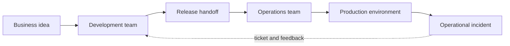

The long feedback loop made defects expensive. A problem discovered during production installation returned to a team that had already moved to other work.

### 1.1 Hybridizing Development and Operations

Modern applications depend on infrastructure, networks, identity, data, and external services. Delivery decisions affect architecture, and architectural decisions affect operations. The two disciplines can no longer work effectively as isolated phases.

The goal is not to make every developer a network engineer or every operator an application developer. The goal is shared responsibility supported by automation, common evidence, and short feedback cycles.

## 2. The Journey to DevOps

DevOps combines cultural and technical practices that help development and operations deliver changes together. It favors small changes, automated verification, shared ownership, and rapid feedback.

Important capabilities include:

- Version control for application and infrastructure definitions
- Automated build, test, and security checks
- Repeatable artifact creation
- Automated delivery and deployment
- Infrastructure lifecycle automation
- Logs, metrics, traces, and service-level objectives
- Real-time communication and incident collaboration

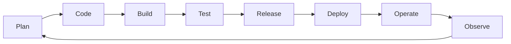

The loop matters more than any single tool. A team can use Git, containers, and Kubernetes while preserving slow handoffs and unclear ownership. That is modern tooling without a DevOps operating model.

### 2.1 The Cultural Shift

DevOps asks teams to treat production outcomes as shared outcomes. Developers need visibility into how their services behave after release. Operations teams need a voice in design, testability, observability, and deployment.

Blameless incident review does not remove accountability. It changes the question from “Who made the mistake?” to “Which technical and process conditions allowed one mistake to reach users?”

## 3. Site Reliability Engineering

Site reliability engineering applies software engineering to operational reliability. An SRE team automates repetitive operational work, defines reliability objectives, and improves the systems that deliver and operate applications.

Common SRE responsibilities include:

- Service-level indicators (SLIs), objectives (SLOs), and error budgets
- Capacity and performance engineering
- Automation of deployment and infrastructure lifecycle
- Incident response and post-incident review
- Observability and alert quality
- Reduction of repetitive manual work, often called toil
- Reliability review during application design

### 3.1 SRE and DevOps

DevOps is a broad culture and delivery philosophy. SRE is a practical engineering model for implementing reliability within that culture.

| DevOps emphasis | SRE emphasis |
|---|---|
| Shared development and operations responsibility | Reliability as an engineering discipline |
| Fast, automated delivery | Delivery balanced against an error budget |
| Collaboration and feedback | Measurable SLOs and operational automation |
| Continuous improvement | Reduction of toil and failure risk |

An organization may embed SREs in product teams, maintain a central reliability team, or use a hybrid model. The structure matters less than clear responsibility and measurable service outcomes.

## 4. Continuous Integration, Delivery, and Deployment

Continuous integration (CI) validates code changes as they are combined. Continuous delivery keeps validated software ready for production. Continuous deployment automatically releases every change that passes required controls.

These terms are related but not interchangeable:

- **Continuous integration:** Merge frequently and verify automatically.
- **Continuous delivery:** Produce a releasable artifact and make deployment a controlled decision.
- **Continuous deployment:** Deploy automatically after all gates pass.

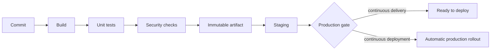

Continuous deployment is not always appropriate. A bank, hospital, or service-provider network may require change approval. The pipeline should automate evidence and execution without bypassing governance.

## 5. CI/CD Pipeline Architecture

A pipeline is a directed workflow. Some stages run serially because they depend on earlier output. Independent tests can run in parallel to shorten feedback time.

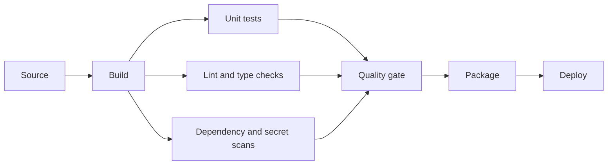

### 5.1 Build

The build stage converts source into a deployable artifact. The output may be a Python package, binary, container image, Helm chart, or infrastructure plan.

Good builds are reproducible. The same source revision and dependency definitions should produce the same functional artifact. Build metadata should record the Git commit, dependency lock, toolchain, and artifact digest.

### 5.2 Test

Testing can include:

- Unit tests
- API and schema contract tests
- Integration tests
- Device-simulator tests
- Infrastructure syntax and policy validation
- Security scanning
- Performance and capacity tests

Network automation tests should validate rendered configuration and failure behavior, not just Python syntax. A parser should be tested with malformed or incomplete device output. A deployment workflow should be tested when a device times out after committing a change.

### 5.3 Release and Deliver

After verification, the artifact is signed or attested and stored in an artifact repository. Containers go to an image registry. Language packages go to a package registry. Infrastructure plans and manifests remain linked to the source revision.

Build once and promote the same artifact. Rebuilding separately for production can introduce different dependencies or content.

### 5.4 Deploy

Deployment moves an approved artifact into an environment and verifies it. The deployment stage manages configuration, secrets, database compatibility, health checks, traffic, and rollback.

## 6. Deployment Strategies

### 6.1 Rolling Deployment

A rolling deployment replaces instances gradually. Capacity remains available while old and new versions coexist.

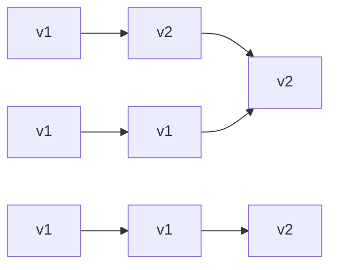

Rolling deployment uses less duplicate capacity than blue-green, but rollback takes time and both versions must remain compatible during transition.

### 6.2 Blue-Green Deployment

Blue-green maintains two complete environments. Blue serves production while green receives the new release and validation. Traffic switches only after green is ready.

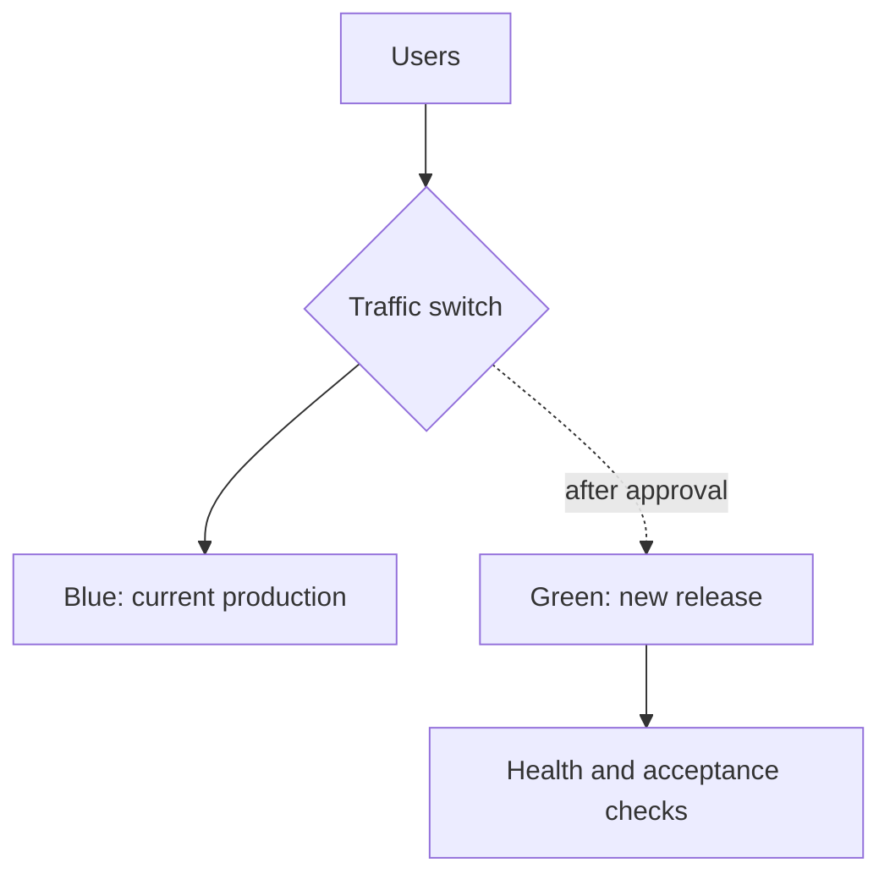

Rollback can be fast if the previous environment and data remain compatible. The cost is duplicate capacity and more complex data migration.

### 6.3 Canary Deployment

A canary sends a small percentage of traffic or workload to the new version. The team compares error rate, latency, and business outcomes before expanding.

For a Cisco network automation service, the canary may begin with read-only inventory jobs, then lab devices, then a low-risk site, and finally production write operations.

## 7. Infrastructure as Code

Infrastructure as code (IaC) represents desired infrastructure in version-controlled files. The same review and pipeline practices used for applications can therefore apply to networks, compute, identity, and cloud resources.

Terraform is declarative: configuration describes the desired end state, while a provider translates that state into API operations.

```hcl
terraform {
  required_providers {
    aci = {
      source = "CiscoDevNet/aci"
    }
  }
}

provider "aci" {
  username = var.apic_username
  password = var.apic_password
  url      = var.apic_url
}
```

Credentials belong in a secret service or protected pipeline variable, not in the Terraform file.

### 7.1 Terraform State

Terraform state maps configuration resources to deployed infrastructure. It can contain sensitive data and must be protected, locked, backed up, and shared through an approved remote backend.

State enables Terraform to calculate the difference between current and desired infrastructure. If multiple users modify the same state without locking, they can create conflicting or destructive plans.

## 8. Terraform and Atlantis

Atlantis connects Git pull requests to Terraform. A webhook notifies Atlantis when a pull request changes. Atlantis runs `terraform plan`, posts the result for review, and can apply the approved plan.

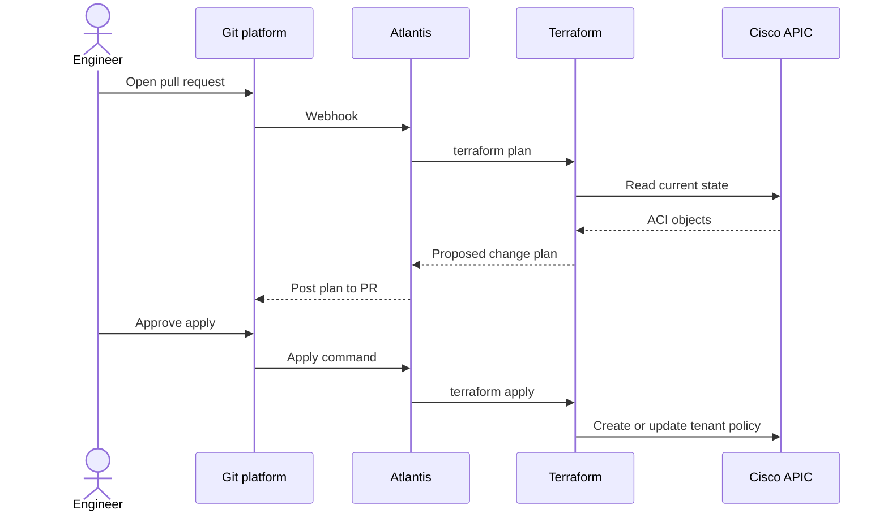

The pull request becomes the review and audit surface. Engineers can see exactly which Cisco ACI resources will be created, modified, or destroyed before the change is applied.

## 9. GitOps

GitOps treats a Git repository as the source of truth for the desired deployed state. An agent continuously compares the repository with the runtime environment and reconciles drift.

Traditional push deployment asks a pipeline to connect to the environment and push a change. GitOps often uses a pull model: the in-cluster agent reads approved configuration and applies it.

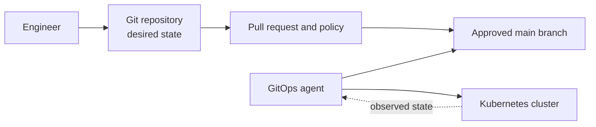

The pull model reduces the number of external systems that need cluster credentials. It also creates automatic drift correction, which is useful only when Git truly represents the approved state.

## 10. Flux and Kubernetes

Flux is a GitOps continuous-delivery tool for Kubernetes. It watches repositories and reconciles Kubernetes manifests or Helm releases.

A Flux deployment normally includes:

- A Git source definition
- A Kubernetes manifest or Helm repository
- A release definition
- Reconciliation interval and health behavior
- Credentials that allow Flux to read the repository

```yaml
apiVersion: source.toolkit.fluxcd.io/v1
kind: GitRepository
metadata:
  name: network-portal
spec:
  interval: 1m
  url: https://github.com/example/network-portal
  ref:
    branch: main
```

When the approved manifest changes, Flux applies the new desired state. If an operator changes the cluster manually, Flux can restore the Git-defined state.

### 10.1 Kubernetes Deployment View

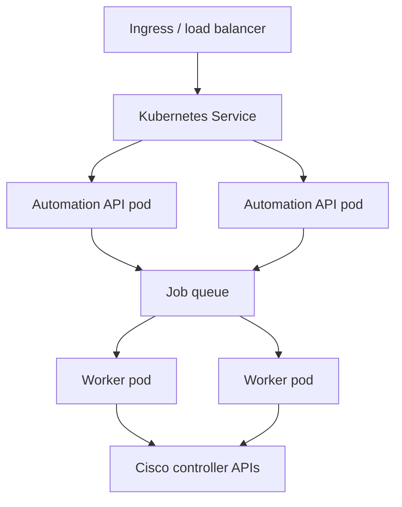

Kubernetes provides scheduling and replacement, but the application still needs correct health checks, stateless compute, externalized state, bounded retries, and observability.

## 11. The Evolution of Deployment Methods

### 11.1 Manual Deployment

Early distributed applications were often copied to servers through SSH and built locally. Differences in packages, compilers, and operating systems made deployments fragile. Success depended heavily on individual knowledge.

### 11.2 Configuration Management

Tools such as Puppet, Chef, SaltStack, and Ansible made server configuration repeatable. They described packages, files, services, and users as code.

Ansible became especially useful for network automation because it is agentless and provides modules for Cisco platforms.

```yaml
---
- name: Collect IOS XE facts
  hosts: campus_switches
  gather_facts: false
  tasks:
    - name: Gather network facts
      cisco.ios.ios_facts:
        gather_subset:
          - min
```

The playbook is readable, version controlled, and repeatable. Inventory, credentials, and environment-specific variables remain external.

### 11.3 Containers and Orchestration

Containers package an application with its runtime dependencies. The artifact can move between environments that support the container runtime. Kubernetes then schedules, scales, and replaces containers across a cluster.

Containers improve consistency but do not remove operations. Teams still manage images, vulnerabilities, networking, storage, identity, resource limits, and cluster behavior.

## 12. Cloud Deployment Models

Cloud platforms offer several levels of abstraction.

| Model | Team manages | Provider manages |
|---|---|---|
| Virtual machines | OS, runtime, application | Physical infrastructure |
| Managed Kubernetes | Workloads and cluster configuration | Much of control-plane infrastructure |
| Serverless containers | Container and resource request | Hosts, scheduling, and scaling |
| Functions as a service | Function code and configuration | Runtime, hosts, and scaling |

More abstraction reduces infrastructure work but also reduces control and portability.

### 12.1 Managed Kubernetes

Managed Kubernetes services operate the control plane and often provide node management, load balancing, logging, upgrades, and autoscaling. The application team focuses on workloads and Kubernetes APIs.

Cisco-oriented applications may run beside controllers or use secure connectivity to Cisco Catalyst Center, Meraki Dashboard, Cisco SD-WAN Manager, or APIC APIs.

### 12.2 Serverless Containers

Serverless container platforms run a supplied image without requiring the team to manage cluster nodes. The team defines CPU, memory, network, identity, and scaling behavior.

This model fits HTTP services and background workers with standard runtime needs. Specialized networking, persistent local state, or privileged operations may require a less abstract platform.

### 12.3 Functions as a Service

Functions execute code in response to an event such as an API call, timer, queue message, or object upload.

A network workflow might use a function to receive a Meraki webhook, normalize the event, and publish it to an incident queue. The function should acknowledge quickly and leave long processing to a durable worker.

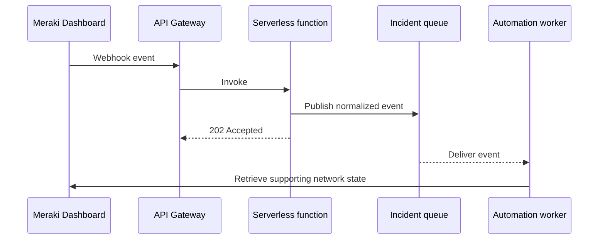

## 13. The Twelve-Factor Application

The 12-factor method describes practices that make applications easier to deploy, scale, and operate.

### Factor 1: Codebase

One codebase is tracked in version control and supports many deployments. Development, test, and production may run different versions, but they come from the same source history.

### Factor 2: Dependencies

Declare dependencies explicitly and isolate them. A Python application uses a lock or requirements file and a virtual environment instead of depending on undocumented system packages.

### Factor 3: Configuration

Store environment-specific configuration outside code. URLs, credentials, feature settings, and environment names should be injected securely at runtime.

### Factor 4: Backing Services

Treat databases, queues, caches, and external APIs as attached resources. Their connection details can change without rewriting application logic.

### Factor 5: Build, Release, Run

Separate build, release, and execution. The build creates an artifact. The release combines the artifact with configuration. The runtime executes that immutable release.

### Factor 6: Processes

Run the application as stateless processes. Persistent state belongs in backing services designed to protect it.

### Factor 7: Port Binding

Export services through a defined port rather than depending on manual installation inside a web server.

### Factor 8: Concurrency

Scale by adding process instances. API and worker roles can scale independently according to workload.

### Factor 9: Disposability

Start quickly and shut down gracefully. A worker should stop accepting work, finish or safely release its current task, and exit within a bounded time.

### Factor 10: Development and Production Parity

Keep environments similar enough that important behavior is tested before production. The scale may differ, but protocols, backing-service features, and deployment mechanics should be representative.

### Factor 11: Logs

Treat logs as event streams. The application writes structured events; the platform collects, stores, and analyzes them.

### Factor 12: Administrative Processes

Run one-off tasks, such as migrations, with the same code, dependencies, configuration, and release controls as the application.

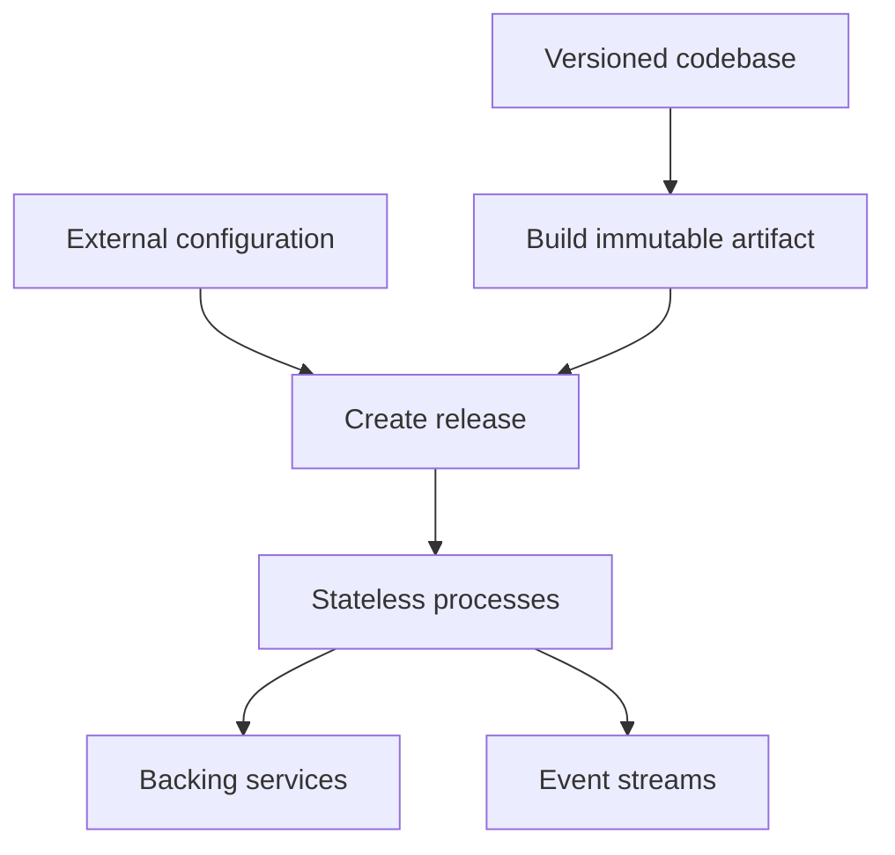

## 14. Deployment Readiness Checklist

- Is the deployable artifact immutable and traceable to a Git commit?
- Are dependencies pinned and scanned?
- Is configuration external and validated?
- Are secrets retrieved from an approved service?
- Are liveness, readiness, and startup checks distinct?
- Does the deployment preserve sufficient capacity?
- Are database and event formats backward compatible?
- Is rollback tested?
- Are logs, metrics, traces, and SLOs available?
- Can the infrastructure plan be reviewed before application?
- Does the deployment method fit operational and compliance requirements?

> **Study guide takeaway:** A deployment pipeline should make the safe path the easy path. It converts source into one verified artifact, promotes that artifact through controlled environments, and produces enough evidence to explain what reached production and how it behaved.

## Chapter Summary

Application delivery evolved from manual handoffs to shared DevOps responsibility and SRE practices. CI validates integrated changes, continuous delivery creates deployable releases, and continuous deployment automates production rollout when policy allows.

Deployment strategies trade capacity, speed, and risk. Infrastructure as code and GitOps bring review, history, and reconciliation to infrastructure and Kubernetes. Terraform and Atlantis can place Cisco ACI changes inside a pull-request workflow, while Flux continuously reconciles approved Kubernetes state.

Cloud platforms offer increasing abstraction through managed Kubernetes, serverless containers, and functions. Regardless of platform, 12-factor principles help applications remain portable, scalable, observable, and operationally predictable.
