# Chapter 8: Secure Application Design

## Chapter Introduction

Security is not a feature that can be added just before release. It influences requirements, architecture, coding, testing, deployment, and operations. A secure application protects information, preserves trustworthy behavior, remains available to authorized users, and produces evidence when something unusual happens.

This chapter explains privacy, secrets, public key infrastructure (PKI), TLS, browser and mobile security, common web vulnerabilities, and OAuth. Cisco-oriented scenarios connect these ideas to controllers, network automation services, CI/CD systems, and device credentials.

### How to Study This Chapter

For every control, identify the asset and threat it addresses. Encryption protects confidentiality, but it does not decide who is authorized. Authentication proves identity, but it does not make input safe. Logging creates evidence, but it does not prevent an attack. Secure design uses several controls together.

## 1. Security Foundations

The CIA triad provides a useful starting point:

- **Confidentiality:** Prevent unauthorized disclosure.
- **Integrity:** Prevent or detect unauthorized modification.
- **Availability:** Keep information and services accessible to authorized users.

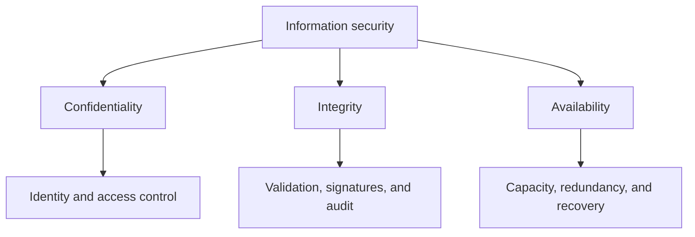

Supporting security functions include authentication, authorization, identity management, auditing, anomaly detection, and incident response.

### 1.1 Security by Design

Security used to be treated as an external review at the end of development. That model finds problems after architecture and code have become expensive to change.

DevSecOps integrates security into the normal delivery workflow:

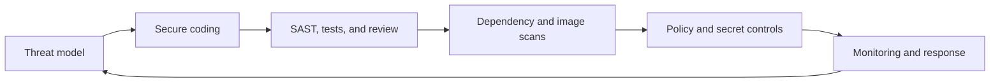

Security gates should provide fast, useful feedback. A scan that produces hundreds of unexplained warnings will eventually be ignored.

## 2. Protecting Privacy

Privacy concerns how information about people is collected, processed, shared, retained, and deleted. Security protects the data, while privacy determines whether the organization should collect and use it in the first place.

### 2.1 Personally Identifiable Information

Personally identifiable information (PII) can identify an individual directly or when combined with other data. It may include:

- Name and address
- Government or tax identifier
- Account and payment information
- Photographs and biometric data
- Email address and phone number
- Location and device identifiers

Context matters. An IP address or device identifier may become personal information when connected to an employee or customer account.

### 2.2 Data Minimization

Collect only what the business function needs. If a network portal requires an email address for notifications, it may not need a home address or date of birth. Less collected data means less breach impact, lower storage cost, and simpler compliance.

Retention should also be limited. Diagnostic logs containing user identifiers may be useful for days or weeks, while audit records may have a longer legal requirement. The policy should state when data is archived, anonymized, or deleted.

## 3. Data States

Data requires different protection depending on where it is.

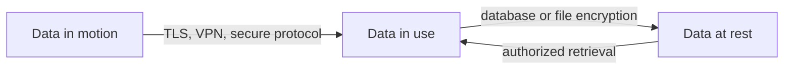

### 3.1 Data in Motion

Data in motion travels between systems. TLS protects application traffic over untrusted or shared networks. SSH protects administrative sessions. IPsec can protect network-layer communication.

Encryption without certificate or identity validation is incomplete. A client must verify that it connected to the intended server, not merely that the channel is encrypted.

### 3.2 Data at Rest

Data at rest includes databases, files, backups, container volumes, and object storage. Protection may use disk encryption, database encryption, file encryption, and strict access control.

Encryption keys must be managed separately from encrypted data. Storing the key beside the data removes much of the protection.

### 3.3 Data in Use

Data in use is available to a running process. Access control, process isolation, least privilege, secure memory handling, and application design protect it. An application normally needs plaintext at some stage, so operating-system and runtime security remain important.

## 4. Privacy Regulation and Data Location

Regulation depends on jurisdiction and industry. Engineers should understand three related ideas:

- **Data privacy:** Who may access and use the data.
- **Data sovereignty:** Which legal authority governs the data.
- **Data localization:** Where data must physically or logically remain.

Common regulatory frameworks include GDPR, HIPAA, and PCI DSS. Requirements can affect cloud-region selection, backup location, logging, deletion, breach response, and third-party processing.

The development team should not interpret legal requirements alone. Security, privacy, compliance, and legal teams translate them into testable technical controls.

## 5. Storing IT Secrets

Secrets include passwords, API keys, private keys, database credentials, OAuth client secrets, controller tokens, and device credentials.

A secret lifecycle includes creation, distribution, storage, use, rotation, revocation, and audit.

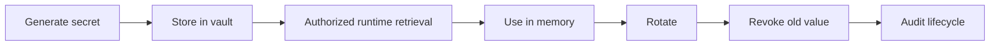

### 5.1 Unsafe Secret Storage

Secrets should not be embedded in source code, committed to Git, placed in container images, or printed to logs. Removing a credential from the latest commit does not remove it from Git history. The exposed value must be rotated.

Environment variables are better than source code but are not a complete secret-management solution. They may be visible to child processes, diagnostics, or platform administrators.

### 5.2 Secret Management Services

A dedicated secret service provides:

- Central access policy
- Encryption and key management
- Audit logging
- Versioning and rotation
- Short-lived dynamic credentials
- Integration with cloud and workload identity

Applications should retrieve secrets at runtime through a workload identity. Long-lived static credentials create larger exposure and more difficult rotation.

### 5.3 Cisco Automation Scenario

A worker that connects to Cisco IOS XE devices needs credentials. The worker should not receive one universal administrator password. A stronger design uses a workload identity to retrieve a scoped secret, limits which device groups it can access, rotates the credential, and records each retrieval.

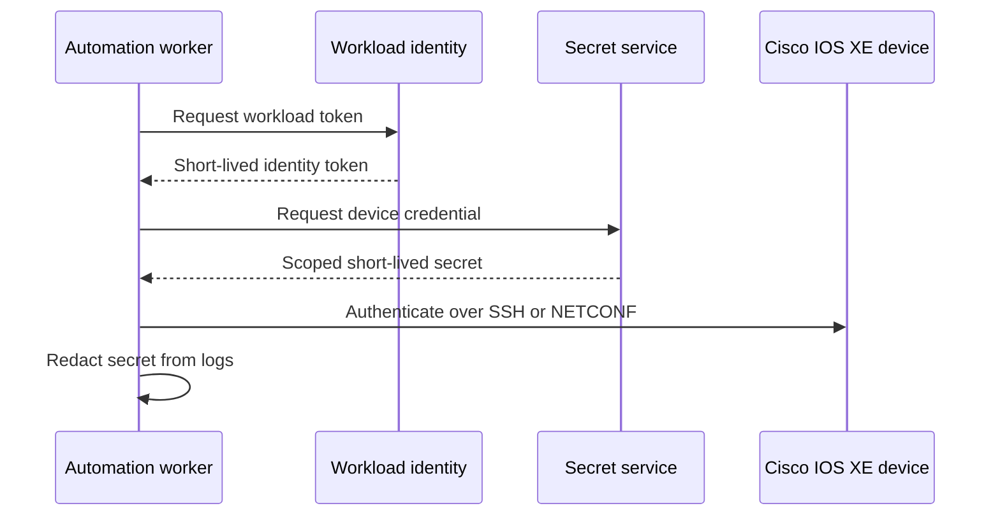

## 6. Public Key Infrastructure

Public key cryptography uses a key pair. The public key may be shared; the private key must remain protected. Data encrypted or verified with one key relates mathematically to the other.

PKI connects public keys to verified identities through digital certificates.

### 6.1 Certificate Authority

A certificate authority (CA) signs certificates after validating identity. Clients trust the certificate when they trust the issuing CA and can build a valid chain to a trusted root.

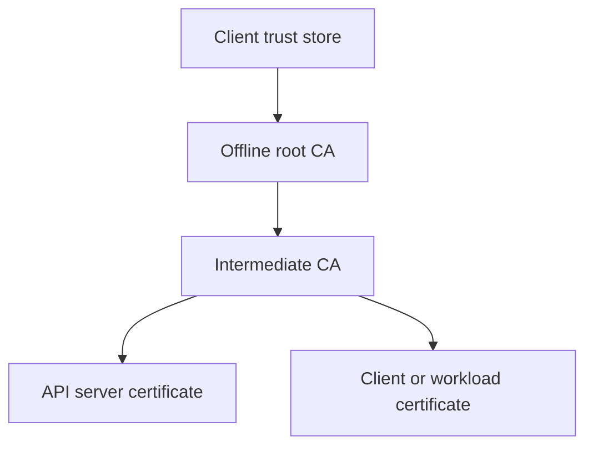

Keeping the root CA offline reduces exposure. Intermediate CAs issue operational certificates and can be replaced without changing the root trust anchor.

### 6.2 X.509 Certificate Content

An X.509 certificate includes:

- Version and serial number
- Issuer
- Subject
- Validity period
- Subject public key
- Signature algorithm and CA signature
- Extensions such as key usage and subject alternative names

The subject alternative name identifies valid DNS names or IP addresses. Modern clients use it for hostname validation.

### 6.3 Certificate Revocation

A certificate may need revocation after key compromise, identity change, or administrative error. Clients can check a certificate revocation list (CRL) or use the Online Certificate Status Protocol (OCSP).

Short-lived certificates reduce dependence on revocation because exposure naturally expires sooner.

## 7. TLS and Web Application Security

TLS provides confidentiality and integrity for network communication and authenticates the server through PKI. Mutual TLS can authenticate the client as well.

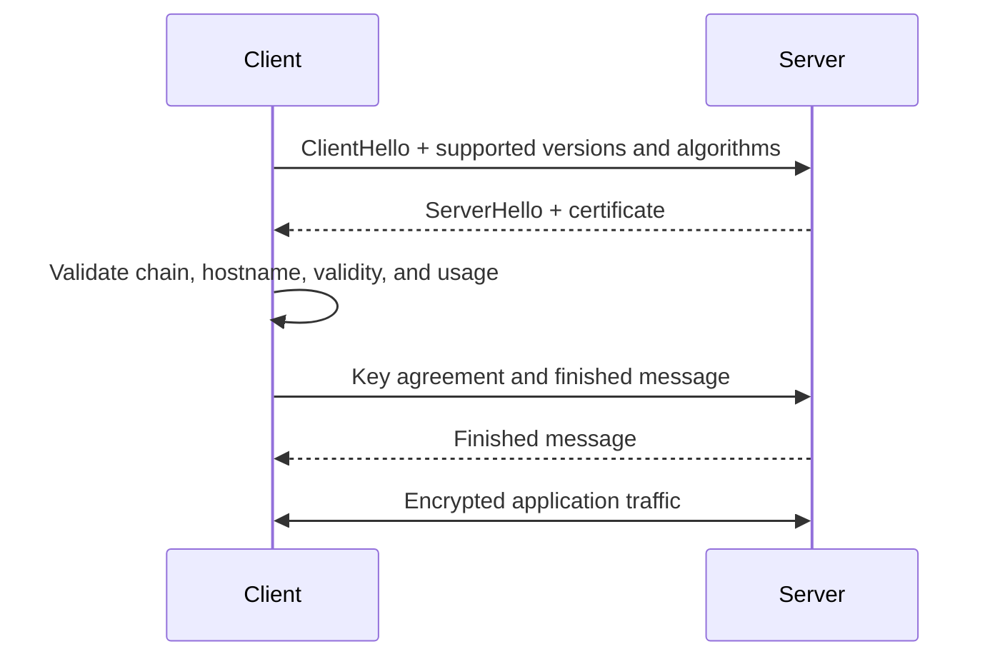

### 7.1 Certificate Validation Failures

Common failures include:

- Hostname does not match the certificate
- Certificate is expired or not yet valid
- Issuing CA is not trusted
- Certificate chain is incomplete
- Signature validation fails
- Certificate was revoked

Do not solve these failures by disabling TLS verification. Install the correct CA chain, correct DNS, renew the certificate, or repair the application configuration.

### 7.2 Network Automation and TLS

Controller APIs such as Cisco Catalyst Center, Meraki Dashboard, Cisco SD-WAN Manager, and APIC should be accessed with certificate verification enabled. Enterprise private CAs can be added to the client's trust store.

## 8. Securing Web and Mobile Applications

OWASP publishes common application risks that help teams structure threat modeling and testing. The categories include broken access control, cryptographic failures, injection, insecure design, security misconfiguration, vulnerable components, authentication failures, integrity failures, logging failures, and server-side request forgery.

The list is not a substitute for a threat model. It is a reminder of failure patterns seen repeatedly across applications.

### 8.1 Broken Access Control

The server must enforce authorization for every protected operation. Hiding a button in the UI does not prevent an attacker from calling the API directly.

A network operator with read-only access may retrieve device health but must not create a configuration job. Resource ownership and tenant boundaries must also be enforced.

### 8.2 Security Misconfiguration

Misconfiguration includes default credentials, unnecessary services, verbose error messages, permissive cloud security groups, missing security headers, and disabled TLS validation.

Configuration should be version controlled, validated, reviewed, and scanned. Secure defaults reduce dependence on every deployer remembering every setting.

### 8.3 Vulnerable Components

Applications inherit risk from libraries, base images, build actions, and operating-system packages. Dependency scanning identifies known vulnerabilities, but the team still needs ownership, prioritization, and an update process.

## 9. Injection Attacks

Injection occurs when untrusted input is interpreted as part of a command or query.

Common targets include SQL, NoSQL, LDAP, operating-system commands, templates, and headers.

### 9.1 SQL Injection

Unsafe code builds a query by combining strings:

```python
# Unsafe: user input changes query structure
query = "SELECT * FROM devices WHERE hostname = '" + hostname + "'"
cursor.execute(query)
```

Parameterized queries keep code and data separate:

```python
query = "SELECT * FROM devices WHERE hostname = %s"
cursor.execute(query, (hostname,))
```

Validation still matters, but escaping alone is not a reliable substitute for parameterization.

### 9.2 Command Injection in Automation

An automation service should not concatenate user input into a shell command:

```python
# Unsafe
subprocess.run(f"ping -c 3 {user_target}", shell=True)
```

Use structured arguments, an allowlist, and no shell interpretation:

```python
import ipaddress
import subprocess

target = str(ipaddress.ip_address(user_target))
subprocess.run(["ping", "-c", "3", target], check=True)
```

For network configuration, prefer structured intent and modeled APIs over accepting arbitrary CLI text from users.

## 10. Cross-Site Scripting

Cross-site scripting (XSS) causes attacker-controlled script to run in another user's browser.

- **Stored XSS:** Malicious content is stored and later rendered.
- **Reflected XSS:** Malicious content is returned immediately from a request.
- **DOM-based XSS:** Client-side code inserts untrusted data into a dangerous browser context.

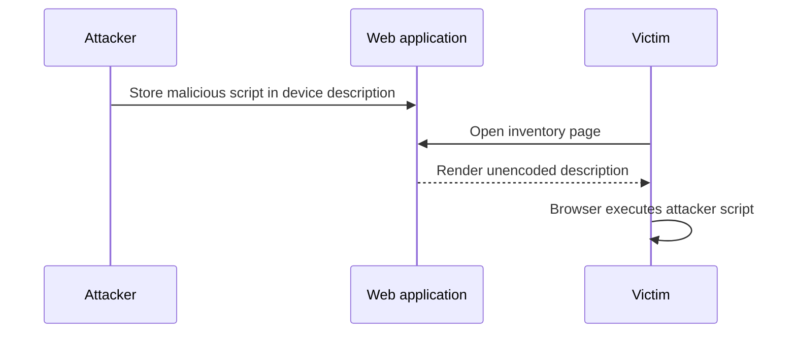

Defenses include contextual output encoding, safe framework templates, content security policy, input validation, and avoiding dangerous DOM APIs.

## 11. Authentication and Authorization

Authentication proves identity. Authorization decides which resources and actions that identity may access.

Strong application security uses:

- Multifactor authentication for sensitive users
- Single sign-on where appropriate
- Short-lived sessions and tokens
- Secure password storage
- Least-privilege roles and scopes
- Server-side authorization
- Audit of privileged activity

Authorization should be evaluated at the resource level. A user allowed to create a change in one tenant should not automatically access another tenant.

## 12. OAuth Authorization Framework

OAuth 2 allows a client application to obtain limited access to a protected resource without receiving the user's password.

OAuth defines four roles:

- **Resource owner:** The user or entity granting access
- **Client:** The application requesting access
- **Authorization server:** The service issuing tokens
- **Resource server:** The API hosting protected resources

### 12.1 Authorization Code Flow

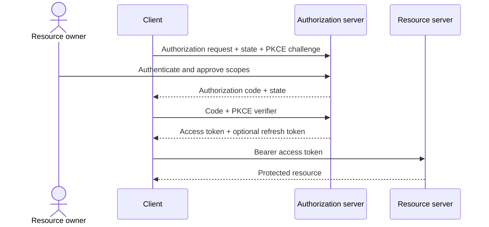

The client validates `state` to reduce request-forgery risk. PKCE binds the authorization code to the client instance. The resource server validates token issuer, audience, expiry, and scope.

### 12.2 Two-Legged and Three-Legged OAuth

Two-legged OAuth is machine-to-machine access without an interactive resource owner. The client-credentials grant is commonly used for service identities.

Three-legged OAuth includes the user, client, and service infrastructure. The user grants the client limited access to the user's resources.

| Flow | Appropriate use |
|---|---|
| Authorization code with PKCE | User-facing web, mobile, or native application |
| Client credentials | Service-to-service access owned by the client |
| Refresh token | Obtain a new access token without prompting the user again |

The implicit and resource-owner-password flows are legacy patterns and should not be selected for new designs when safer alternatives are available.

## 13. Secure CI/CD and Software Supply Chain

The delivery pipeline is part of the security boundary. It has access to source code, signing systems, registries, cloud accounts, and production environments.

Controls include:

- Protected branches and required review
- Restricted pipeline credentials
- Secret scanning
- Static application security testing
- Dependency and container scanning
- SBOM generation
- Signed artifacts and provenance
- Isolated build workers
- Approval for high-risk deployment

Pull requests from untrusted forks should not automatically receive production secrets. Build actions and third-party pipeline components are dependencies and should be pinned and reviewed.

## 14. Logging, Monitoring, and Incident Evidence

Security logs should answer who performed an action, what resource was affected, when it occurred, where it originated, and whether it succeeded.

Do not log passwords, access tokens, private keys, or complete sensitive configuration. Use request IDs, job IDs, device IDs, and trace IDs for correlation.

Useful security events include:

- Authentication success and failure
- Authorization denial
- Secret retrieval and rotation
- Privileged configuration action
- Policy or role change
- Certificate validation failure
- Rate-limit or anomaly trigger
- Artifact verification failure

Alerts should reflect risk and impact. One failed login may be normal; a high-rate pattern across many accounts may indicate credential stuffing.

## 15. Cisco-Oriented Secure Application Architecture

The following architecture separates user access, application logic, secret management, controller access, and audit evidence.

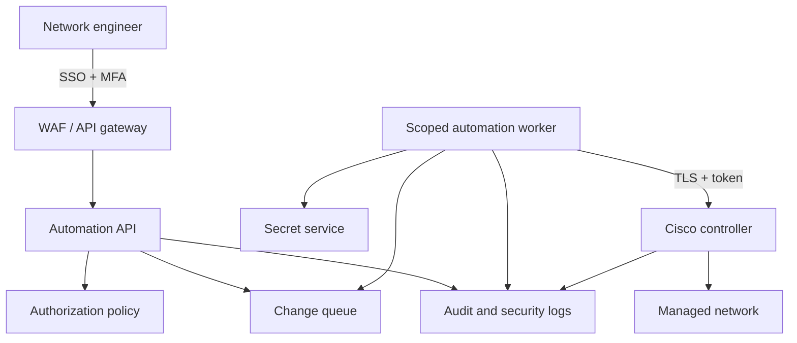

The gateway handles coarse authentication and rate limits. The API enforces resource-level authorization. The worker retrieves a scoped secret only when needed. The controller remains the policy-aware path to the infrastructure. Every stage produces correlated evidence.

## 16. Cross-Site Request Forgery

Cross-site request forgery (CSRF) occurs when a browser automatically includes a user's authenticated cookie with a state-changing request initiated from an untrusted site. The vulnerable application may see a valid session but cannot tell that the user did not intend the action. Network automation portals are high-value targets because a forged request might approve a change, create an API credential, or alter policy.

Mitigation begins by avoiding state changes through `GET`. Cookie-authenticated applications should use unpredictable anti-CSRF tokens bound to the user session and validate them on every state-changing request. Cookies should use `Secure`, `HttpOnly`, and an appropriate `SameSite` setting. Applications should also validate `Origin` or `Referer` where practical and require reauthentication for highly sensitive operations. CORS is not a complete CSRF defense because submitting a simple cross-site request and reading its response are different browser capabilities.

```mermaid
sequenceDiagram
    participant U as User browser
    participant A as Trusted automation portal
    participant M as Malicious site
    U->>A: Authenticate; receive secure session cookie and CSRF token
    U->>M: Visit malicious page
    M-->>U: Attempt forged policy-change request
    U->>A: Cookie included, but token missing or incorrect
    A-->>U: Reject request with 403
```

Bearer-token APIs used by nonbrowser clients are not normally vulnerable in the same cookie-driven manner, but token theft, XSS, and overly broad scopes remain serious risks.

## 17. Configuring Application-Specific TLS Certificates

An application certificate binds a public key to an identity such as `automation.example.com`. Begin by selecting the DNS names the service will present, generating a private key with an approved algorithm and size, and creating a certificate signing request (CSR) containing the correct subject alternative names. Submit the CSR to the enterprise or public certificate authority, then install the issued server certificate together with the required intermediate chain. The private key must remain restricted to the application workload or approved key service.

```text
Generate protected private key
        -> create CSR with DNS SANs
        -> CA validates and signs
        -> install leaf certificate and intermediate chain
        -> configure HTTPS listener
        -> validate hostname, chain, expiry, and revocation behavior
        -> monitor and renew before expiration
```

In Kubernetes, a TLS secret can supply the key and certificate to an Ingress controller, while a certificate-management operator can automate issuance and renewal. In a traditional deployment, the web server or reverse proxy references protected key and certificate files. Do not place private keys in Git, container images, or general-purpose configuration maps. Test the complete trust chain from an external client because a server may appear correct locally while omitting an intermediate certificate.

Mutual TLS adds client authentication. The server validates a client certificate issued by a trusted CA, and the client still validates the server. This is useful for service-to-service calls and selected network-controller integrations, but it requires client-certificate issuance, rotation, revocation, and mapping to application authorization.

## 18. Encryption Applied to APIs

Encryption in transit uses TLS to negotiate algorithms, authenticate the server, establish session keys, and protect confidentiality and integrity. Asymmetric cryptography supports identity and key establishment, while efficient symmetric encryption protects application data after the handshake. A certificate does not authorize an API operation; the application must still authenticate the client and enforce scopes or roles.

Sensitive data at rest should use storage or database encryption, with keys protected separately in a key-management service or hardware security module. Highly sensitive fields may require application-level encryption so database administrators cannot read plaintext. Passwords are not decrypted at all; they should be processed with a salted, adaptive password-hashing algorithm.

Application payload signing serves a different purpose from encryption. A webhook signature can prove integrity and origin even though the webhook is also sent over TLS. For Cisco API integrations, validate TLS, use secure token or certificate authentication, protect stored secrets, and avoid including confidential values in URLs where proxies and logs may record them.

## 19. Security Design Checklist

The following checklist should be applied after these controls are designed.

- Have assets, threats, trust boundaries, and abuse cases been documented?
- Is sensitive data minimized and classified?
- Is data protected in motion, at rest, and in use?
- Are secrets absent from source, images, and logs?
- Are certificates and private keys rotated and revocable?
- Is TLS verification enabled?
- Does the server enforce least-privilege authorization?
- Are queries and commands parameterized?
- Is output encoded for its destination context?
- Are dependencies, images, and pipeline actions scanned?
- Are OAuth tokens validated for issuer, audience, expiry, and scope?
- Are security events observable without exposing secrets?
- Is incident response and credential revocation tested?

> **Study guide takeaway:** Security controls work as a system. Identity, authorization, encryption, secret management, input validation, secure delivery, and monitoring reinforce one another. If one control fails, another should still limit the impact.

## 20. Security Risks in AI Network Automation

The controls discussed earlier in this chapter also apply to AI-enabled automation, but the introduction of models, retrieval, and tool use creates additional trust boundaries. ML and GenAI systems expand the attack surface through training data, model artifacts, prompts, retrieval sources, plugins, and tool calls. Therefore, an agent must never treat model-generated instructions as authorization. Tools should use least privilege, outputs should be validated before execution, untrusted content should be isolated, and consequential actions should retain a reliable human override.

### 20.1 Interpreting Risk in an AI Network-Automation Solution

Consider a conversational assistant that reads network telemetry and configurations, uses a retrieval system for runbooks, and can call Catalyst Center and RESTCONF tools. The assistant proposes a remediation and, after user confirmation, applies it. A security review should trace data and trust boundaries rather than focus only on the model.

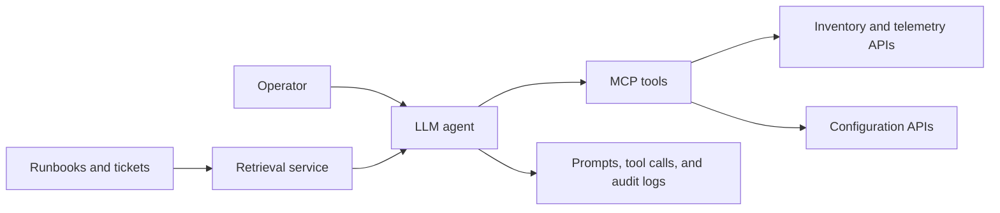

Following the data flow reveals several distinct risks:

- **Prompt injection:** A retrieved ticket, interface description, or runbook can contain instructions that attempt to override policy. Treat retrieved content as untrusted data, separate it from system instructions, and never let it grant permissions.
- **Excessive agency:** A broadly privileged configuration tool can turn one mistaken recommendation into a network-wide outage. Separate read and write tools, restrict target scope, require change plans and approval, and impose rate and blast-radius limits.
- **Sensitive-data disclosure:** Prompts and logs may contain credentials, configurations, customer identifiers, or vulnerabilities. Redact inputs, use approved model endpoints, restrict retention, and encrypt stored conversations.
- **Tool and supply-chain compromise:** A malicious MCP server, plugin, model, or Python dependency can alter tool descriptions or results. Pin and verify dependencies, authenticate servers, approve tool catalogs, and validate returned schemas.
- **Insecure output handling:** Generated CLI, JSON, SQL, or Markdown can become an injection vector when executed or rendered. Parse against a schema and encode output for its destination.
- **Hallucination and stale knowledge:** The model may invent a command or use an obsolete API. Ground recommendations in live state and current documentation, then verify deterministically.
- **Denial of service and cost abuse:** Recursive agent loops and oversized context can consume tokens, controller quota, and device resources. Limit turns, tool calls, request size, concurrency, and total budget.

A high-risk design gives the same agent unrestricted read/write credentials and allows it to approve its own plan. A safer design uses read-only discovery by default, generates an explicit proposed difference, evaluates policy outside the LLM, requires an authorized person or trusted workflow to approve, executes through a narrowly scoped identity, and verifies the service afterward. Logs should preserve the user request, model and prompt version, retrieved evidence, tool arguments, approval, result, and rollback decision.

## Key Takeaways

- Confidentiality, integrity, availability, privacy, identity, authorization, and auditing must be designed as complementary controls.
- Secret management, PKI, TLS certificates, encryption, and OAuth protect application and API communications.
- Secure applications mitigate access-control failures, injection, XSS, CSRF, misconfiguration, vulnerable dependencies, and supply-chain threats.
- AI network solutions must address prompt injection, excessive agency, data leakage, insecure tools and outputs, hallucination, cost abuse, and auditable human approval.

Chapter 9 shifts from application concerns to the infrastructure lifecycle, showing how modern networks are provisioned, managed, and assured.

## Further Reading and References

- [OWASP Top 10](https://owasp.org/www-project-top-ten/) - major web-application security risks.
- [OWASP Top 10 for LLM Applications](https://owasp.org/www-project-top-10-for-large-language-model-applications/) - GenAI-specific risks.
- [TLS 1.3 - RFC 8446](https://www.rfc-editor.org/rfc/rfc8446) - current TLS protocol definition.

**Next chapter:** [Chapter 9: Network Infrastructure Management](../Part4/Chapter9.md)
