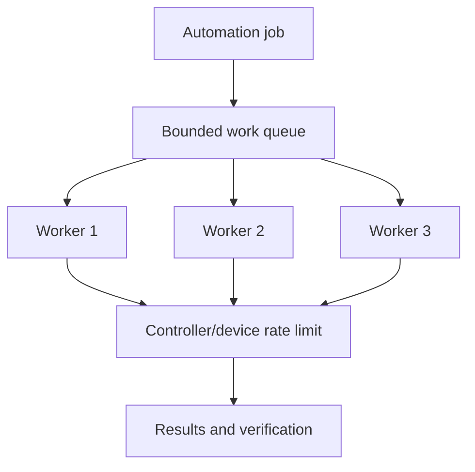
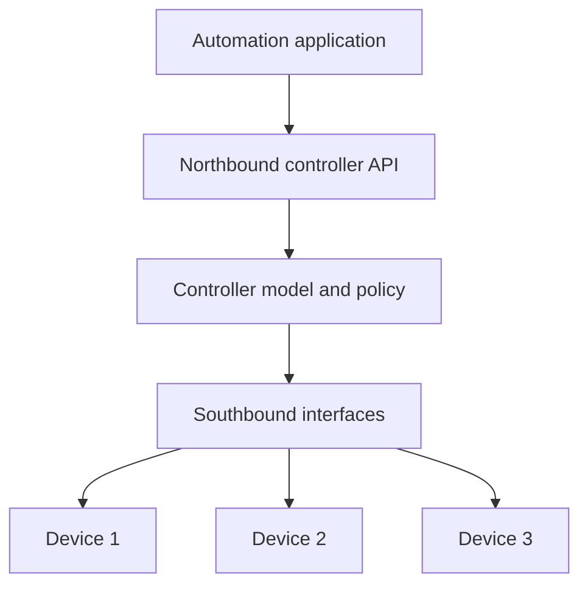
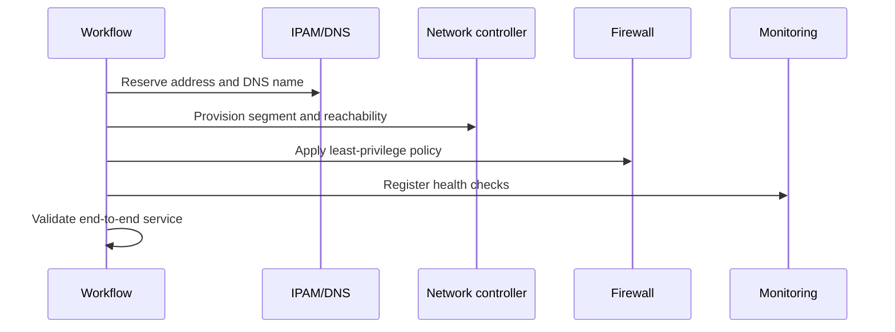
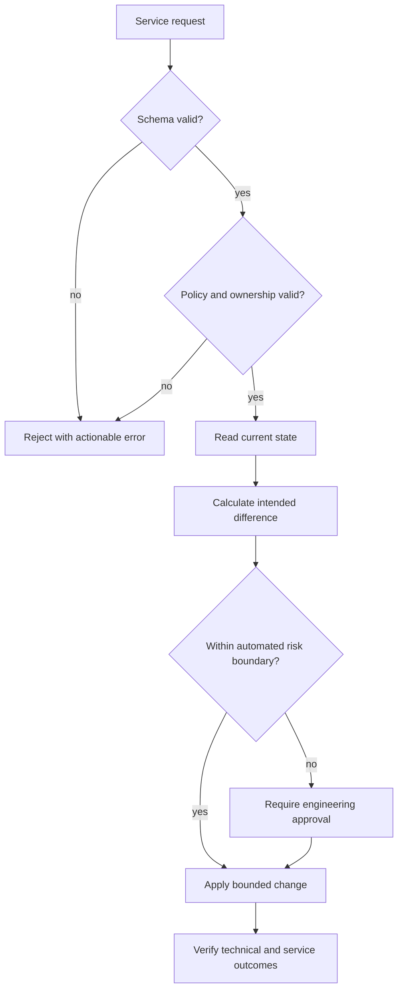
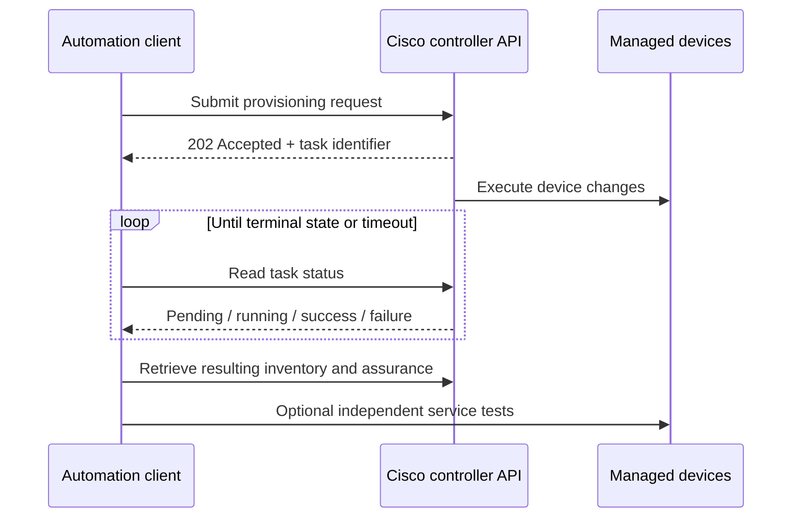

# Chapter 10: Network Automation

## Chapter Introduction

Automation is more than running commands quickly. It converts operational intent into repeatable, tested, and observable actions. This chapter explains why networks need automation, how SDN and APIs enable it, and how to design workflows that remain safe at enterprise scale.

## 1. Why Automate?

Manual work becomes unreliable as device count, change frequency, and service complexity grow. Common problems include inconsistent configurations, slow deployment, undocumented emergency changes, fragile handoffs, and engineers spending time on repetitive tasks.


Good automation improves consistency and speed while reducing human error. Poor automation merely creates mistakes faster. Guardrails, testing, scope control, and rollback are therefore part of the design.

## 2. From Scripts to Automation Systems

A one-off script usually assumes a known input and happy path. An automation system manages inventory, credentials, concurrency, retries, state, logging, approvals, and partial failure.

| Maturity | Typical behavior |
|---|---|
| Manual | Engineer enters commands per device |
| Scripted | Code repeats a task for a list of devices |
| Workflow | Validated stages, approvals, and evidence |
| Orchestrated | Coordinates controllers and technology domains |
| Closed loop | Observes state and safely reconciles deviation |

An inventory should identify devices by stable attributes such as site, role, platform, and software release. Code can then select policy by intent rather than embedding long lists of hostnames.

## 3. Agile, DevOps, and SRE Influence

Agile favors short feedback cycles and incremental delivery. DevOps creates shared responsibility between builders and operators. SRE applies software engineering to reliability and uses service-level objectives to balance change velocity with operational risk.

For a campus change, a small pull request might update one site, run syntax and policy tests, deploy during an approved window, and validate client connectivity. Results feed the next iteration instead of waiting for a large annual migration.

## 4. Concurrency and Parallelism

Network tools spend much of their time waiting on connections and API responses. **Concurrency** allows several tasks to make progress; **parallelism** executes work simultaneously on multiple CPU cores or workers.



Unlimited concurrency can overload a controller, consume device VTY lines, or trigger API limits. Use bounded worker pools, timeouts, retries with exponential backoff and jitter, and per-domain limits.

## 5. SDN as an Automation Foundation

SDN introduces centralized abstraction and programmable interfaces. An application requests policy from the controller; the controller computes and deploys device-level state. Cisco ACI expresses application connectivity through tenants, VRFs, bridge domains, endpoint groups, and contracts. Cisco Catalyst Center exposes campus inventory, provisioning, assurance, and policy workflows.



## 6. API Design for Automation

An API is a contract. Before writing code, inspect authentication, resources, methods, schemas, pagination, filtering, asynchronous task behavior, rate limits, and error responses. OpenAPI documents REST interfaces in a machine-readable form and can support documentation, validation, and client generation.

REST commonly uses:

- `GET` to retrieve state without changing it.
- `POST` to create a resource or launch a non-idempotent action.
- `PUT` to replace a resource at a known URI.
- `PATCH` to modify part of a resource.
- `DELETE` to remove a resource.

`GET`, `PUT`, and `DELETE` are intended to be idempotent. Repeating a request should have the same intended effect, although response codes may differ.

```python
import requests

def get_devices(base_url, token):
    response = requests.get(
        f"{base_url}/dna/intent/api/v1/network-device",
        headers={"X-Auth-Token": token, "Accept": "application/json"},
        timeout=(3, 20),
    )
    response.raise_for_status()
    return response.json()["response"]
```

Always set connection and read timeouts. Validate the response structure instead of assuming every HTTP 200 body contains expected data.

## 7. Data Formats and Authentication

JSON maps naturally to dictionaries, lists, strings, numbers, booleans, and null. XML represents hierarchical data with elements and attributes and is central to NETCONF. YAML is readable and common in configuration files, but indentation and implicit types require care.

Basic authentication sends an encoded username and password, not encrypted credentials; it must be protected by TLS. Tokens reduce repeated password exposure and can carry narrower scope and expiration. OAuth delegates authorization. Mutual TLS can authenticate both client and server. Credentials should come from a secret manager rather than source code.

## 8. Cross-Domain Orchestration

A service may require changes to IPAM, DNS, firewall, load balancer, campus, data center, cloud, and monitoring systems. Orchestration coordinates these dependencies and compensates for partial failure.



A transaction across independent systems may not support a true rollback. Design compensating actions, preserve correlation IDs, and stop safely when the next step would increase inconsistency.

## 9. Governance and Security

Automation should follow change policy without recreating slow manual bureaucracy. Pull requests, automated tests, protected branches, signed artifacts, approvals for high-risk scopes, and immutable logs create useful controls. Least-privilege service accounts should be separated by environment and function.

AI-assisted development can explain APIs, generate tests, and identify patterns in failures. Treat generated code as untrusted until reviewed and tested; never send production secrets or sensitive configurations to an unapproved model.

## 10. Designing Reliable Automation Logic

Reliable automation begins by separating intent from execution. Intent describes the outcome, such as “all access switches at Site 21 must provide the voice VLAN on authenticated phone ports.” Execution determines which controller or device APIs are required. When these concerns are mixed, a change in platform syntax forces business logic to be rewritten. A cleaner design validates the request, resolves inventory and policy, creates a normalized desired state, and then delegates platform-specific translation to adapters.

Input validation must occur before a connection is opened to a device. Validate IP prefixes, VLAN ranges, interface identities, site ownership, allowed software versions, and mutually exclusive options. Schema tools can verify shape and type, while policy checks verify meaning. A syntactically valid request for VLAN 1 on every trunk may still violate organizational policy. Validation errors are unrecoverable until input changes, whereas a controller returning HTTP 503 may be transient. This distinction controls whether the workflow stops, retries, or requests human action.



Idempotency is particularly important when a worker crashes after sending a request but before recording the response. If an API supports client-generated idempotency keys, use them. Otherwise, read current state before retrying and determine whether the resource already exists. For a non-idempotent operation such as triggering a software upgrade, a blind retry may start a second job or collide with the first. Persist the remote task identifier and poll its documented status endpoint.

## 11. Error Classification and Recovery

Automation should produce an error taxonomy rather than one generic “failed” result. Authentication failures normally require credential or identity correction. Authorization failures require scope or role review. Validation failures require new input. Rate-limit responses require waiting for `Retry-After` or applying exponential backoff. Server errors may be transient, but repeated errors should open a circuit breaker so the workflow does not overwhelm a degraded controller.

Partial failure is the harder case. Imagine an orchestration workflow that reserves an address, creates a fabric segment, and then fails to create firewall policy. Deleting the segment may be safe if no endpoint has attached, but releasing the address while a delayed controller task still references it may be unsafe. Each stage should therefore define a compensating action and the conditions under which it is permitted. When safe rollback cannot be proven, stop, preserve evidence, and escalate rather than attempting increasingly speculative repairs.

```python
from dataclasses import dataclass
from enum import Enum

class ResultType(Enum):
    SUCCESS = "success"
    RETRYABLE = "retryable"
    INPUT_ERROR = "input_error"
    AUTH_ERROR = "auth_error"
    PARTIAL = "partial"

@dataclass
class StepResult:
    kind: ResultType
    message: str
    remote_task_id: str | None = None
```

Structured results make pipeline decisions explicit and testable. They also improve operational reporting because engineers can distinguish a malformed request from infrastructure unavailability.

## 12. Testing Network Automation

Unit tests should cover transformations, validation, and error decisions without connecting to equipment. Contract tests confirm that code still understands the API schema. Integration tests exercise a sandbox controller or virtual lab. Finally, pre- and post-change tests verify behavior on the target scope. For a routing change, checking that the configuration line exists is insufficient; validate adjacency state, route installation, path selection, and representative reachability.

Mocks are useful but can make tests unrealistically successful. Record sanitized API responses for important edge cases, and deliberately test timeouts, malformed bodies, empty result sets, pagination, duplicate resources, asynchronous failures, and rollback. A canary deployment to one noncritical site provides another feedback layer before a broad rollout.

Observability should use correlation identifiers carried from the originating request through API calls, device jobs, and verification. Logs must avoid tokens and passwords but include resource IDs, controller task IDs, timing, retry count, and the decision that caused a workflow to stop. Metrics such as success rate, change duration, retry frequency, rollback rate, and verification failure reveal whether the automation system is genuinely improving operations.

## 13. REST API Implementation Patterns

Production API clients should centralize session configuration instead of repeating authentication and error handling in every function. A `requests.Session` reuses connections and supplies common headers. The client should set separate connection and read timeouts, because failure to reach a controller is operationally different from a controller accepting a connection but taking too long to return a result. TLS verification should use the enterprise CA bundle, and credentials should come from a secret service or workload identity.

```python
import random
import time
import requests

class ControllerClient:
    def __init__(self, base_url: str, token: str, ca_bundle: str):
        self.base_url = base_url.rstrip("/")
        self.session = requests.Session()
        self.session.headers.update({
            "Accept": "application/json",
            "Content-Type": "application/json",
            "X-Auth-Token": token,
        })
        self.session.verify = ca_bundle

    def request(self, method: str, path: str, **kwargs):
        for attempt in range(5):
            response = self.session.request(
                method, f"{self.base_url}{path}",
                timeout=(3.05, 30), **kwargs,
            )
            if response.status_code not in {429, 502, 503, 504}:
                response.raise_for_status()
                return response

            retry_after = response.headers.get("Retry-After")
            delay = float(retry_after) if retry_after else min(2 ** attempt, 20)
            time.sleep(delay + random.uniform(0, 0.5))
        raise RuntimeError("Controller remained unavailable after bounded retries")
```

Retries are appropriate only for operations known to be safe. A `GET` can normally be retried, and an idempotent `PUT` may be retried if the representation and target URI are unchanged. A `POST` that launches a discovery or upgrade task may not be safe unless the API supports an idempotency key or the application can search for the existing task. The client must also bound total elapsed time so that exponential backoff does not leave a business workflow hanging indefinitely.

Pagination is another common source of incomplete automation. An API that returns the first 500 devices successfully has not necessarily returned all devices. The client must follow documented offset, limit, cursor, or continuation links and protect against repeated cursors. Filtering at the server reduces bandwidth, but the application should still verify that the filter semantics match the intended scope.

## 14. Asynchronous Tasks and Eventual Consistency

Cisco controller APIs frequently acknowledge a request before the underlying network operation completes. The initial response may contain a task ID or execution URL. Treating the HTTP acknowledgement as completion creates false success. The client should poll task state at a reasonable interval, recognize terminal success and failure states, extract device-level errors, and then verify the resulting network state independently.



Controller state may be eventually consistent. A completed task can be followed by a brief period before inventory, topology, or assurance APIs reflect the new state. Verification should use a bounded convergence window rather than one immediate read. However, the workflow must distinguish normal convergence from a missing outcome; repeated absence after the defined window is a failure.

## 15. Data Modeling and Transformation

Network automation routinely transforms data among business requests, source-of-truth records, controller schemas, device models, and operational reports. A canonical internal model reduces coupling. For example, an application can represent an interface with normalized name, role, enabled state, description, addresses, and policy references. Adapters then translate the canonical object into Catalyst Center, Meraki, NETCONF, or CLI-specific requests.

Schema validation protects boundaries. JSON Schema, Pydantic, or equivalent tools can reject missing fields, unexpected types, and invalid formats. Semantic validation checks relationships: a prefix must fit inside the assigned site block, a VLAN must not be reserved, and a requested VRF must be authorized for the tenant. Output validation is equally important because an API may change or return a partial body during an error.

XML requires namespace-aware parsing. JSON requires care with absent keys versus explicit `null`, and with numbers that may arrive as strings. YAML should be loaded with a safe parser, and untrusted YAML must never be allowed to instantiate arbitrary objects. Data received from an API or repository remains untrusted until validated, even when the source is internal.

## 16. Orchestration Across Cisco Domains

A hybrid service can span campus access, SD-WAN, ACI, security, DNS, cloud networking, and observability. The orchestrator should not reproduce the internal logic of each controller. Instead, it should call domain-level intent APIs, track dependencies, and maintain an overall service state. Each domain adapter reports whether its portion is planned, applying, ready, failed, or compensating.

For a new application branch, IPAM first reserves prefixes, ACI creates the application connectivity, a firewall platform permits only required flows, SD-WAN advertises the branch segment, DNS publishes service names, and monitoring registers health checks. Some steps can run concurrently, while others require a completed dependency. A directed acyclic graph captures these relationships more safely than one long script.

The workflow should support resume. If five of seven domains succeed and a temporary cloud API outage stops the sixth, an operator should not have to restart from the beginning. Persist completed step outputs and validate them before continuation. Resumption logic, like rollback logic, must account for changes that occurred outside the workflow while it was paused.

## 17. Measuring Automation Value

Counting executed scripts says little about business value. Useful measures include request lead time, percentage of changes completed without manual intervention, deployment failure rate, mean recovery time, policy compliance, drift, and engineering hours returned to higher-value work. Reliability measures should be segmented by workflow and platform so one noisy integration does not hide behind an overall average.

Automation can also create toil if users must repeatedly correct unclear input errors or operators must manually reconcile partial state. Track rejection reasons, retries, abandoned requests, and human touch points. Improving the request schema or source data may produce more value than adding another execution feature. The best automation removes uncertainty and creates a trustworthy path from intent to verified outcome.

> **Study guide takeaway:** Enterprise automation combines APIs, reliable software practices, and operational safeguards. The goal is not maximum change speed; it is predictable change with fast feedback and controlled risk.

## Key Takeaways

- Automation improves scale and consistency but must manage concurrency, state, errors, security, and partial failure.
- SDN controllers and APIs expose programmable abstractions, while orchestration coordinates dependent technology domains.
- Reliable workflows validate intent, limit blast radius, verify service outcomes, and preserve operational evidence.

Chapter 11 introduces NETCONF, RESTCONF, and YANG as structured mechanisms for applying those workflows directly to network devices.
