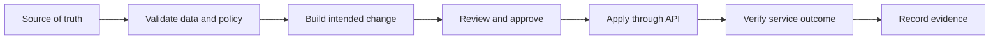
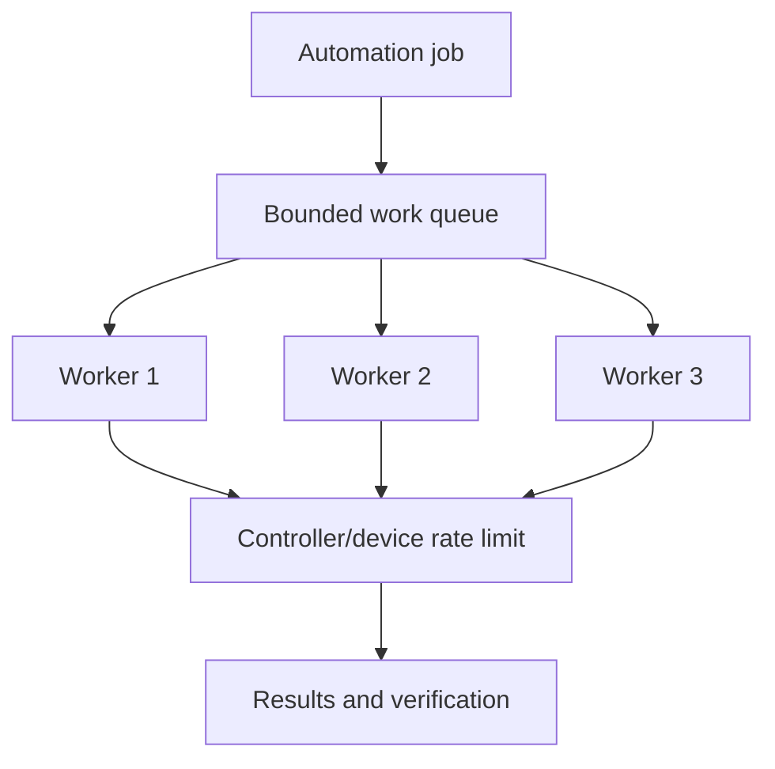
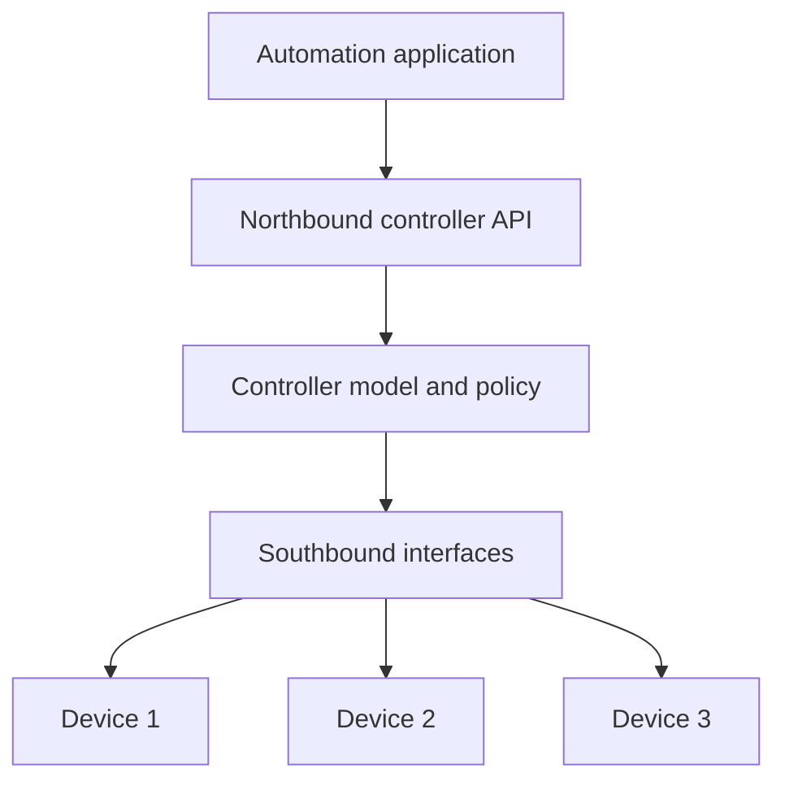
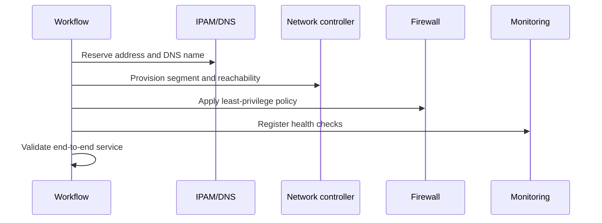

# Chapter 10: Network Automation

## Chapter Purpose

Automation is more than running commands quickly. It converts operational intent into repeatable, tested, and observable actions. This chapter explains why networks need automation, how SDN and APIs enable it, and how to design workflows that remain safe at enterprise scale.

## 1. Why Automate?

Manual work becomes unreliable as device count, change frequency, and service complexity grow. Common problems include inconsistent configurations, slow deployment, undocumented emergency changes, fragile handoffs, and engineers spending time on repetitive tasks.



Good automation improves consistency and speed while reducing human error. Poor automation merely creates mistakes faster. Guardrails, testing, scope control, and rollback are therefore part of the design.

## 2. From Scripts to Automation Systems

A one-off script usually assumes a known input and happy path. An automation system manages inventory, credentials, concurrency, retries, state, logging, approvals, and partial failure.

| Maturity | Typical behavior |
|---|---|
| Manual | Engineer enters commands per device |
| Scripted | Code repeats a task for a list of devices |
| Workflow | Validated stages, approvals, and evidence |
| Orchestrated | Coordinates controllers and technology domains |
| Closed loop | Observes state and safely reconciles deviation |

An inventory should identify devices by stable attributes such as site, role, platform, and software release. Code can then select policy by intent rather than embedding long lists of hostnames.

## 3. Agile, DevOps, and SRE Influence

Agile favors short feedback cycles and incremental delivery. DevOps creates shared responsibility between builders and operators. SRE applies software engineering to reliability and uses service-level objectives to balance change velocity with operational risk.

For a campus change, a small pull request might update one site, run syntax and policy tests, deploy during an approved window, and validate client connectivity. Results feed the next iteration instead of waiting for a large annual migration.

## 4. Concurrency and Parallelism

Network tools spend much of their time waiting on connections and API responses. **Concurrency** allows several tasks to make progress; **parallelism** executes work simultaneously on multiple CPU cores or workers.



Unlimited concurrency can overload a controller, consume device VTY lines, or trigger API limits. Use bounded worker pools, timeouts, retries with exponential backoff and jitter, and per-domain limits.

## 5. SDN as an Automation Foundation

SDN introduces centralized abstraction and programmable interfaces. An application requests policy from the controller; the controller computes and deploys device-level state. Cisco ACI expresses application connectivity through tenants, VRFs, bridge domains, endpoint groups, and contracts. Cisco Catalyst Center exposes campus inventory, provisioning, assurance, and policy workflows.



## 6. API Design for Automation

An API is a contract. Before writing code, inspect authentication, resources, methods, schemas, pagination, filtering, asynchronous task behavior, rate limits, and error responses. OpenAPI documents REST interfaces in a machine-readable form and can support documentation, validation, and client generation.

REST commonly uses:

- `GET` to retrieve state without changing it.
- `POST` to create a resource or launch a non-idempotent action.
- `PUT` to replace a resource at a known URI.
- `PATCH` to modify part of a resource.
- `DELETE` to remove a resource.

`GET`, `PUT`, and `DELETE` are intended to be idempotent. Repeating a request should have the same intended effect, although response codes may differ.

```python
import requests

def get_devices(base_url, token):
    response = requests.get(
        f"{base_url}/dna/intent/api/v1/network-device",
        headers={"X-Auth-Token": token, "Accept": "application/json"},
        timeout=(3, 20),
    )
    response.raise_for_status()
    return response.json()["response"]
```

Always set connection and read timeouts. Validate the response structure instead of assuming every HTTP 200 body contains expected data.

## 7. Data Formats and Authentication

JSON maps naturally to dictionaries, lists, strings, numbers, booleans, and null. XML represents hierarchical data with elements and attributes and is central to NETCONF. YAML is readable and common in configuration files, but indentation and implicit types require care.

Basic authentication sends an encoded username and password, not encrypted credentials; it must be protected by TLS. Tokens reduce repeated password exposure and can carry narrower scope and expiration. OAuth delegates authorization. Mutual TLS can authenticate both client and server. Credentials should come from a secret manager rather than source code.

## 8. Cross-Domain Orchestration

A service may require changes to IPAM, DNS, firewall, load balancer, campus, data center, cloud, and monitoring systems. Orchestration coordinates these dependencies and compensates for partial failure.



A transaction across independent systems may not support a true rollback. Design compensating actions, preserve correlation IDs, and stop safely when the next step would increase inconsistency.

## 9. Governance and Security

Automation should follow change policy without recreating slow manual bureaucracy. Pull requests, automated tests, protected branches, signed artifacts, approvals for high-risk scopes, and immutable logs create useful controls. Least-privilege service accounts should be separated by environment and function.

AI-assisted development can explain APIs, generate tests, and identify patterns in failures. Treat generated code as untrusted until reviewed and tested; never send production secrets or sensitive configurations to an unapproved model.

> **Study guide takeaway:** Enterprise automation combines APIs, reliable software practices, and operational safeguards. The goal is not maximum change speed; it is predictable change with fast feedback and controlled risk.

## Chapter Summary

Automation addresses scale and consistency but introduces software-system concerns such as concurrency, state, errors, and security. SDN controllers provide abstractions, REST APIs provide contracts, and orchestration coordinates multiple domains. Verification and evidence complete every workflow.
