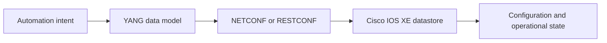
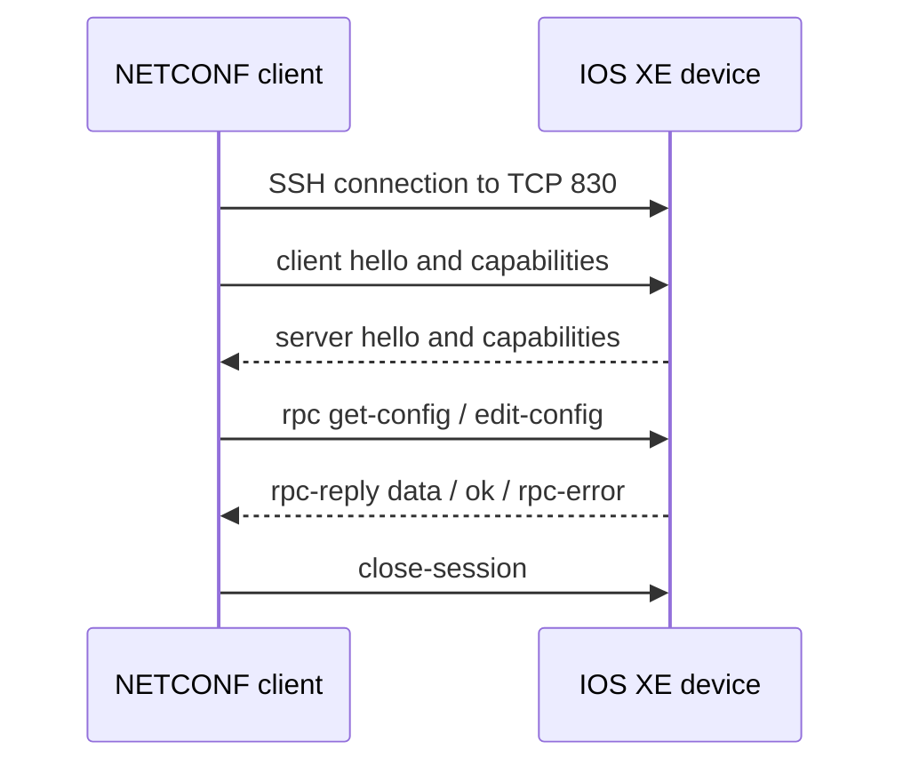
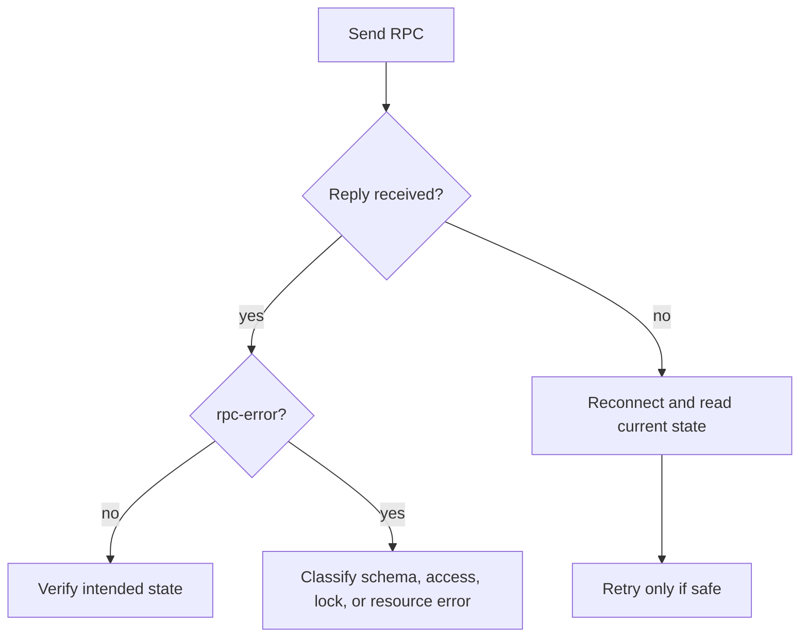
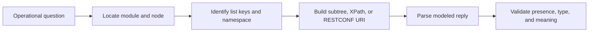

# Chapter 11: NETCONF and RESTCONF

## Chapter Purpose

NETCONF and RESTCONF replace fragile screen scraping with structured, model-driven network management. Both use YANG models to describe valid data, but they differ in transport and operations. This chapter develops the protocols through Cisco IOS XE configuration scenarios.

## 1. Why Model-Driven Management?

CLI syntax varies across platforms and releases. A model describes data independently of screen layout, including hierarchy, type, constraints, configuration, and operational state.



Model-driven management enables schema validation before a device accepts a change and makes data easier for software to process.

## 2. YANG Fundamentals

YANG is a data modeling language maintained through the IETF NETMOD work. A **module** has a namespace and prefix. Common nodes include:

- `container`: groups related nodes.
- `list`: repeatable entries identified by one or more keys.
- `leaf`: one typed value.
- `leaf-list`: repeated scalar values.
- `choice` and `case`: mutually exclusive structures.
- `rpc` and `action`: operations defined by a model.
- `notification`: asynchronous event data.

Cisco IOS XE exposes native Cisco models and standards-based OpenConfig or IETF models where supported. Check the device's YANG library because platform and release determine availability.

## 3. NETCONF Architecture

NETCONF, currently defined by RFC 6241, normally runs over SSH on TCP port 830. Client and server exchange `<hello>` messages to advertise capabilities. The client then sends XML RPC requests and receives `<rpc-reply>` responses.



NETCONF datastores can include `running`, `candidate`, and `startup`, depending on advertised capabilities. Candidate configuration permits staging and validation before commit. Locking prevents competing clients from changing the same datastore during a transaction.

Key operations include `<get>`, `<get-config>`, `<edit-config>`, `<copy-config>`, `<delete-config>`, `<lock>`, `<unlock>`, `<commit>`, and `<close-session>`.

## 4. Reading and Changing Configuration

On IOS XE, `netconf-yang` enables the service. A filtered read avoids retrieving an entire datastore.

```python
from ncclient import manager

with manager.connect(
    host="10.10.20.48", port=830,
    username="automation", password="secret",
    hostkey_verify=True, device_params={"name": "iosxe"},
) as session:
    reply = session.get_config(
        source="running",
        filter=("subtree", """
          <interfaces xmlns="urn:ietf:params:xml:ns:yang:ietf-interfaces">
            <interface><name>GigabitEthernet2</name></interface>
          </interfaces>"""),
    )
    print(reply.xml)
```

An `<edit-config>` payload must use the correct namespace and hierarchy. The `default-operation` can be `merge`, `replace`, or `none`; node-level operations can create, merge, replace, delete, or remove data. Use precise edits because replacing a parent container may remove sibling configuration.

## 5. NETCONF Error Handling

An `<rpc-error>` can include error type, tag, severity, path, message, and vendor information. Treat schema violations differently from temporary transport failures. Retrying malformed configuration will not help; a timeout may be retried only after determining whether the original operation took effect.



## 6. RESTCONF Architecture

RESTCONF, defined by RFC 8040, maps YANG data to HTTP resources. It commonly uses HTTPS on TCP 443. The API root is typically `/restconf`; data resources appear below `/restconf/data`, while model-defined operations appear below `/restconf/operations`.

Use these media types:

- `application/yang-data+json`
- `application/yang-data+xml`

`Accept` requests a response representation. `Content-Type` describes the request body.

## 7. RESTCONF Operations

```python
import requests

url = "https://10.10.20.48/restconf/data/ietf-interfaces:interfaces"
headers = {"Accept": "application/yang-data+json"}
r = requests.get(url, headers=headers, auth=("automation", "secret"), timeout=15)
r.raise_for_status()
interfaces = r.json()["ietf-interfaces:interfaces"]["interface"]
```

`GET` retrieves data, `POST` creates a child resource, `PUT` creates or replaces a resource at a specific URI, `PATCH` changes selected content, and `DELETE` removes a resource. A RESTCONF URI uses module-qualified names where needed and URL-encoded list keys.

To configure a loopback, send a JSON body whose top-level member matches the target resource. After the write, retrieve the interface and verify both configuration and operational state.

## 8. NETCONF or RESTCONF?

| Consideration | NETCONF | RESTCONF |
|---|---|---|
| Encoding | XML | JSON or XML |
| Transport | SSH, usually 830 | HTTPS, usually 443 |
| Transactions | Rich datastore, lock, and commit capabilities | Familiar HTTP resource operations |
| Best fit | Configuration workflows needing transaction control | Web-style integration and simple resource access |

Both protocols are only as portable as the selected YANG model and device support. Standards-based models improve consistency, while native models often expose deeper platform features.

## 9. Datastores, Transactions, and Safe Changes

NETCONF's datastore model is one of its strongest advantages. The `running` datastore represents active configuration. A device that supports `candidate` allows a client to stage several related edits without exposing an incomplete configuration. The client can validate the candidate and commit it as one logical change. If the device advertises confirmed-commit capability, a commit can automatically revert unless the client confirms it before a timer expires. This pattern is valuable for remote changes that could break management connectivity.

Capabilities must be discovered rather than assumed. They are advertised in the server `<hello>` and may indicate writable running configuration, candidate, startup, URL support, validation, rollback-on-error, notifications, or XPath filtering. An application intended for multiple IOS XE releases should inspect these capabilities and select a safe workflow. If candidate is absent, edits to running require smaller changes and stronger post-change verification.

Locking protects a datastore from concurrent NETCONF edits, but it does not necessarily prevent changes made through CLI or another management system. Broader operational ownership is still required. A controller, an Ansible job, and an engineer should not independently manage the same interface fields. When a lock cannot be acquired, the client should report contention and retry within policy instead of forcing its change.

## 10. Filtering and Data Retrieval

Retrieving the complete operational tree wastes device CPU, bandwidth, and application memory. A subtree filter supplies a partial XML hierarchy, while an XPath filter expresses a path when the server advertises XPath capability. The filter namespace is not cosmetic: it tells the server which YANG module defines each node. A structurally correct filter using the wrong namespace can return no data without being an obvious syntax error.

NETCONF `<get-config>` reads configuration from a datastore. `<get>` can return configuration and operational state. RESTCONF distinguishes content through resource paths and query parameters supported by the implementation. The application should retrieve only the fields needed for its decision and account for list keys. For interfaces, the interface name identifies the list entry; for a static route, address-family, prefix, and next-hop structure may determine the modeled identity.



## 11. IOS XE Configuration Scenarios

An interface workflow typically creates or updates the interface description, administrative state, and IPv4 configuration using `ietf-interfaces`, `ietf-ip`, or an IOS XE native model. These models do not always provide identical features. Standards-based models are preferable when the required function exists across vendors; native models are appropriate when Cisco-specific capability is needed. The application should never combine fields from unrelated model trees without understanding how IOS XE reconciles them internally.

VLAN configuration follows the same principle. First discover the supported VLAN model and exact resource hierarchy, then create the VLAN resource and separately associate switchports if the model requires it. A successful VLAN creation does not prove that an access port has joined it or that the VLAN is forwarding. Verification should retrieve both intended configuration and operational state.

Static routes require special care because a route is a structured object, not merely a command string. The address family, destination prefix, next-hop choice, interface, administrative distance, and VRF all contribute meaning. After using RESTCONF or NETCONF to create the route, verify that it appears in configuration and determine whether it entered the routing table. A route whose next hop is unreachable may be correctly configured but operationally inactive.

## 12. RESTCONF Responses and Errors

HTTP status codes provide the first result classification. A successful read normally returns 200, creation may return 201, and a successful operation with no response body may return 204. A 400 response indicates malformed input, 401 means authentication is required or failed, 403 means the identity lacks permission, 404 means the resource or data does not exist, 409 can represent a resource conflict, and 412 can indicate a failed conditional request. Server errors in the 500 range may be transient but still require bounded retry behavior.

RESTCONF error bodies use a modeled `errors` container and can report error type, tag, path, message, and additional information. Preserve this detail in sanitized logs. Do not reduce a useful message such as “data-missing at interface list key” to “request failed.” At the same time, avoid exposing credentials, full configurations, or sensitive topology in user-facing output.

TLS certificate verification should remain enabled. In a lab, it is tempting to use `verify=False`, but production automation should trust an enterprise CA or a pinned certificate chain. The connection identity, RESTCONF authorization, and YANG validation solve different security problems and all are required.

> **Study guide takeaway:** YANG defines the contract; NETCONF and RESTCONF carry requests against that contract. Reliable automation discovers capabilities, sends minimal validated changes, interprets structured errors, and verifies resulting state.

## Chapter Summary

NETCONF offers XML RPC operations, datastores, locks, and commit behavior over SSH. RESTCONF presents YANG-modeled data as HTTP resources using JSON or XML. Cisco IOS XE supports both, allowing applications to configure interfaces, VLANs, routes, and other modeled functions without parsing CLI output.
