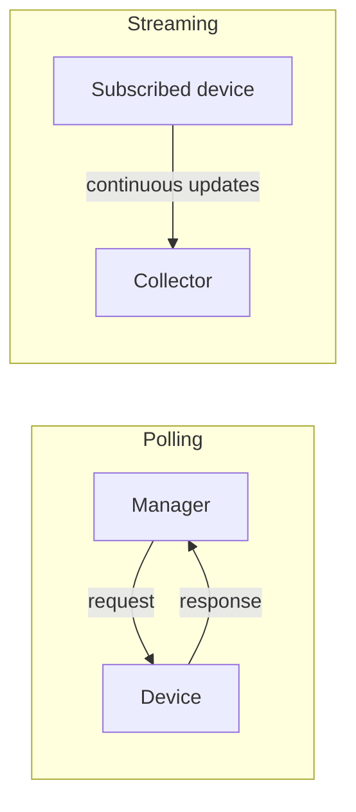
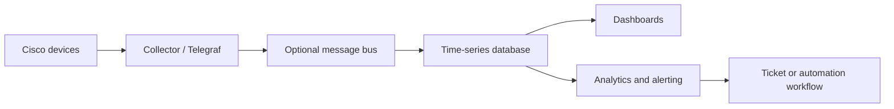
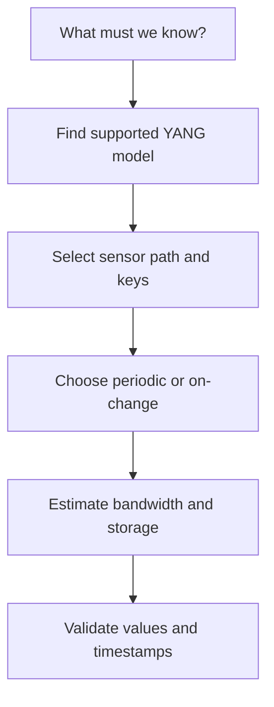
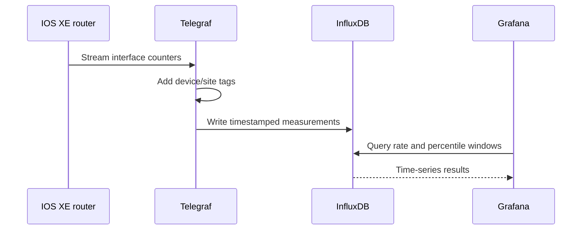
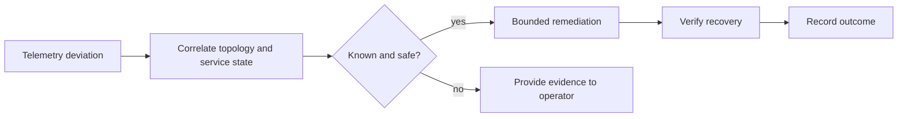
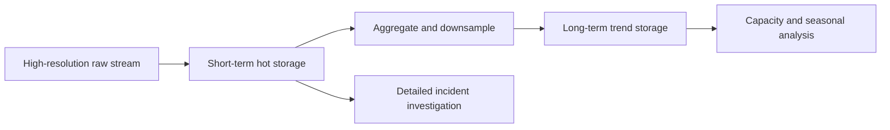
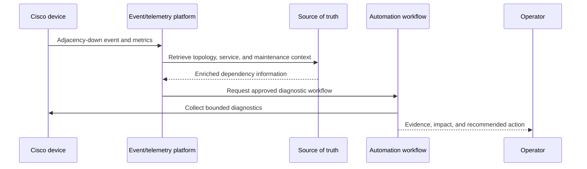

# Chapter 12: Model-Driven Telemetry

## Chapter Purpose

Automation needs timely evidence about network state. Model-driven telemetry (MDT) streams structured measurements from devices to collectors, replacing much repetitive polling with efficient subscriptions. This chapter covers push models, sensor paths, transport, storage, visualization, and event-driven operations.

## 1. From Polling to Streaming

SNMP managers traditionally poll MIB objects at intervals. Polling is widely supported, but a short event can occur between polls and large environments generate repeated requests even when nothing changes.



MDT uses YANG-modeled paths, precise subscription behavior, and efficient encodings. It complements rather than automatically replaces SNMP, syslog, and flow data.

## 2. Telemetry Architecture



The collection tier terminates subscriptions and normalizes data. A message bus decouples producers from consumers. A time-series database stores timestamped measurements efficiently. Dashboards support investigation, while alert rules turn measurements into action.

## 3. Dial-Out and Dial-In

In **dial-out**, the network device initiates a connection to configured collectors and pushes a configured subscription. In **dial-in**, a collector connects to the device and creates a dynamic subscription.

| Mode | Advantage | Operational concern |
|---|---|---|
| Dial-out | Device automatically exports required streams | Subscription and destination configured on every device or controller |
| Dial-in | Collector centrally controls dynamic subscriptions | Collector must reach and authenticate to each device |

Dial-out is useful through restrictive inbound policies. Dial-in gives the collector greater subscription flexibility. High availability may require multiple collectors and careful duplicate handling.

## 4. Subscription Modes

- **Periodic:** send values at a defined sample interval.
- **On-change:** send an update when supported data changes, often with heartbeat behavior.
- **Event-driven:** publish meaningful events rather than raw periodic samples.

Periodic updates make rates and trends predictable but consume bandwidth and storage even when values are stable. On-change is efficient for configuration or state transitions, though not every sensor supports it. Choose the interval according to the phenomenon: interface counters may need seconds, inventory may need hours.

## 5. Sensor Paths and YANG

A sensor path identifies data in a YANG tree. Selection should begin with an operational question, not with every available metric. To detect congestion, collect interface octets, utilization, discards, queue depth, and errors at an interval that reveals the condition.



Use device capabilities, Cisco YANG Suite, YANG Catalog, or repository models to inspect paths. Verify units, counter width, update behavior, platform release, and whether the path represents configuration or operational state.

## 6. Transport and Encoding

Cisco platforms may support gRPC-based MDT, gNMI, or platform-specific transports. gRPC uses HTTP/2 and can carry Google Protocol Buffers (GPB). GPB is compact and strongly structured. JSON is easier to inspect but usually larger. GPB key-value offers self-describing fields, while compact GPB may require the consumer to know the schema.

TLS protects data in transit and authenticates endpoints. Do not treat an internal telemetry network as automatically trusted; telemetry can reveal topology, addressing, software versions, and usage patterns.

## 7. Practical TIG Pipeline

The TIG stack combines **Telegraf**, **InfluxDB**, and **Grafana**. Telegraf receives and transforms metrics, InfluxDB stores time-series data, and Grafana queries and visualizes it.



Tags such as site, role, device, and interface support filtering, but excessive high-cardinality labels increase database cost. Retention policies should keep high-resolution data briefly and downsample long-term trends.

## 8. Capacity and Reliability

Estimate volume as devices × sensor paths × update frequency × encoded record size. Then include replication, indexes, metadata, and retention. A thousand devices emitting 500 values every ten seconds produce 50,000 values per second before overhead.

Collectors need backpressure, buffering, health metrics, and clear behavior during database failure. Monitor the monitoring system: subscription status, dropped messages, queue depth, ingestion latency, storage health, and dashboard query latency.

## 9. From Telemetry to Action

An alert should express a service symptom rather than a noisy single threshold. Correlate interface loss with routing changes and application health before opening a critical incident.



AI can assist anomaly detection and correlation, but baselines must account for scheduled changes and normal seasonality. Automated remediation should be narrow, rate-limited, reversible, and disabled when evidence is incomplete.

## 10. Designing Subscriptions for Operational Questions

Telemetry design should begin with a decision the operations team must make. If the objective is capacity planning, five-minute aggregated utilization may be sufficient. If the objective is detecting microbursts or queue congestion, that interval hides the event, and hardware-specific queue measurements may be necessary. Conversely, collecting every available path every second creates expense without automatically creating insight. The engineer must connect the symptom, metric, sampling behavior, threshold, and response.

A useful interface subscription often combines counters with context. Octets alone cannot distinguish normal backup traffic from congestion. Interface speed permits utilization calculation, discards reveal pressure, errors suggest physical problems, and operational state shows transitions. Topology and service metadata identify whether the link is an access port, WAN circuit, fabric connection, or redundant member. Enrichment can occur at collection time, but stable labels should come from an authoritative inventory.

Counters require transformation. A cumulative octet counter becomes a rate by subtracting two samples and dividing by elapsed time. The consumer must handle counter rollover, device reload, interface reset, missing samples, and irregular timestamps. Device timestamps and collector arrival times should not be confused; reliable NTP is fundamental to event correlation.

## 11. Platform and Subscription Considerations

Cisco IOS XE, IOS XR, and NX-OS support telemetry through platform-specific configuration and overlapping protocols. The concepts remain consistent - destination, sensor path, subscription, encoding, and update policy - but syntax and path availability differ. Therefore, a cross-platform collector should normalize data after preserving the original device, path, timestamp, and subscription identifiers. Normalization that discards source context makes troubleshooting difficult.

Dial-out configuration usually binds a destination group and sensor group to a subscription. The destination defines collector address, port, protocol, encoding, and security. The sensor group defines one or more modeled paths. The subscription joins them and specifies an update policy. Before broad deployment, test that the receiver decodes the selected encoding and that the device reports the intended keys and values.

With gNMI, a collector can use `Get` for a snapshot and `Subscribe` for streaming updates. Subscription modes can include once, poll, or stream; stream behavior can further use sample or on-change semantics. gNMI paths are modeled and can carry JSON_IETF or protobuf representations depending on implementation. Do not assume that support for gNMI implies support for every OpenConfig path.

## 12. Storage, Retention, and Data Quality

Time-series storage must be planned as a lifecycle. High-resolution raw data supports immediate troubleshooting but becomes expensive over months. Downsampling can retain five-minute minimum, maximum, average, and percentile values after raw samples expire. Fault investigations may require longer retention for selected critical metrics, while privacy or regulatory policy may limit storage of user-associated telemetry.

Data quality should be observable. Record gaps, late arrivals, duplicates, schema changes, and decoding failures. When a device upgrade changes a path or field type, a dashboard should not silently become empty. Schema compatibility tests and canary upgrades can detect this condition before an entire fleet moves to the new release.



Alerting must account for missing data. “No updates received” can indicate a failed link, device reload, collector failure, certificate expiry, or a broken subscription. It is a separate signal from a healthy zero value. Monitoring the telemetry pipeline and attaching confidence to derived conclusions prevents false certainty.

## 13. Building a Production Telemetry Pipeline

A production pipeline separates reception, transport, processing, storage, and consumption so that each layer can scale and fail independently. Collectors should be placed close enough to devices to provide reliable sessions and should not perform expensive analytics in the ingestion path. Their first responsibility is to authenticate sources, decode messages, preserve timestamps and path metadata, and hand data to a durable next stage. When the database slows, buffering or a message bus prevents an immediate wave of device reconnections.

Redundancy must be designed carefully. Sending the same subscription to two collectors improves resilience but creates duplicate observations. The storage or processing layer needs a deduplication key based on device, path, keys, source timestamp, and sequence information where available. If devices are divided among collectors instead, a collector failure requires subscription reassignment. Both models are valid, but the recovery behavior should be tested rather than inferred.

Telegraf input plugins can receive Cisco telemetry or gNMI streams, processors can rename and transform fields, and outputs can write to InfluxDB or another backend. Configuration should be version-controlled and validated before deployment. Avoid transformations that lose the original YANG path or units. A normalized measurement called `utilization` is useful only if engineers can trace how it was calculated and from which counters.

```text
Device telemetry
    -> authenticated collector
    -> decode and normalize
    -> enrich with site/role metadata
    -> durable queue
    -> time-series and event stores
    -> dashboards, alerts, capacity jobs, and automation
```

## 14. Visualization and Alert Engineering

A dashboard should answer an operational question at a glance and support drill-down. A service overview may show availability, latency, loss, client health, and active changes by site. Selecting one site should reveal WAN circuits, routing state, device health, and affected applications. Raw metric panels without topology or service context force the operator to perform correlation mentally during an incident.

Rates, moving averages, percentiles, and histograms serve different purposes. Average latency can look healthy while a significant minority of transactions are slow; the 95th or 99th percentile reveals the tail. Maximum values detect peaks but are sensitive to one bad sample. Interface counter rates need correct derivative handling, while utilization requires interface speed. Dashboard queries should document these calculations.

An alert needs a condition, duration, scope, severity, ownership, and runbook. Requiring a condition to persist for several samples reduces noise, but excessive delay hides real faults. Multi-signal alerts are often stronger: high utilization plus queue drops plus application latency is more meaningful than utilization alone. Suppression should account for planned maintenance, dependent failures, and duplicate symptoms downstream from one root cause.

## 15. Event-Driven Telemetry and Closed-Loop Operations

Periodic telemetry answers “what is the value now?” Event-driven telemetry aims to communicate significant state transitions and context. A routing adjacency loss, configuration change, power-supply failure, or threshold crossing can trigger immediate processing without waiting for the next sample. Events and time-series measurements complement one another: the event identifies the transition, while surrounding measurements explain conditions before and after it.

An event pipeline can enrich a BGP-neighbor-down notification with topology, maintenance status, recent configuration changes, route impact, and service ownership. It may then open one incident instead of dozens of interface alerts. If the failure matches a known safe condition, a workflow might gather diagnostics or move traffic. However, remediation should be protected by rate limits, scope limits, approval policy, and a verification step.



## 16. Telemetry Security and Governance

Telemetry is sensitive operational data. Interface descriptions, neighbor identities, addresses, serial numbers, utilization patterns, and client data can expose network structure and business activity. Encrypt transport, authenticate device and collector identities, authorize subscriptions, restrict database queries, and record administrative access. Multi-tenant environments require explicit separation in collection, tags, storage, and dashboards.

Certificate rotation is a frequent operational failure point. A collector with an expired certificate can lose thousands of streams at once. Monitor certificate lifetime, stage trust-chain changes, and support overlapping old and new trust during rotation. Do not disable verification as a recovery shortcut; that converts an availability incident into a security weakness.

Schema and dashboard changes also require governance. A renamed field can invalidate alerts without producing an obvious error. Treat collectors, transformations, retention rules, dashboards, and alert definitions as code. Review and test them together with device software upgrades. A telemetry system is trustworthy only when its own configuration and data quality are controlled.

## 17. Selecting a Network Monitoring Model

The monitoring model should be selected from operational requirements rather than product familiarity. Begin with the decisions the data must support: immediate fault response, capacity planning, compliance, user-experience assurance, forensic investigation, or closed-loop automation. Then evaluate device support, measurement frequency, acceptable detection delay, bandwidth, collector scale, data cardinality, storage retention, security, and the team's ability to operate the pipeline.

| Consideration | Polling model | Streaming model | Event-driven model |
|---|---|---|---|
| Best suited to | Broad compatibility and periodic snapshots | High-frequency structured state and counters | Immediate meaningful transitions |
| Device interaction | Manager repeatedly requests data | Device sends subscribed data | Device or event system publishes on occurrence |
| Scaling pressure | Request load on manager and devices | Continuous ingestion, bandwidth, and storage | Burst handling and event correlation |
| Data gaps | Events may occur between polls | Gaps appear when stream or collector fails | Events may lack surrounding trend context |
| Typical Cisco use | SNMP inventory/counters | YANG-based MDT or gNMI | Syslog, notifications, assurance events |

A hybrid approach is normally strongest. SNMP can cover legacy devices, model-driven telemetry can provide interface and queue measurements, syslog can explain discrete failures, flow records can describe traffic behavior, and synthetic probes can test the service from a user's perspective. The systems must share time synchronization, device identity, topology, and correlation so that their evidence can be combined.

Before selecting a sample interval, estimate detection requirements and data volume. A 30-second poll cannot reliably explain a two-second microburst. Conversely, streaming slow-changing inventory every second wastes bandwidth and storage. Include encoding overhead, labels, replication, retention, and peak reconnect behavior in the capacity estimate. Finally, monitor subscription health and data freshness; stale monitoring data must never be displayed as if it were current.

> **Study guide takeaway:** MDT is an end-to-end data system, not merely a device feature. Valuable telemetry starts with an operational question and ends with trustworthy storage, visualization, alerting, and controlled action.

## Chapter Summary

Streaming telemetry uses subscriptions and YANG sensor paths to provide timely structured data. Dial-out and dial-in determine who initiates the session; periodic and on-change modes determine when data is sent. Collectors, time-series databases, and dashboards must be sized and monitored as production services.
