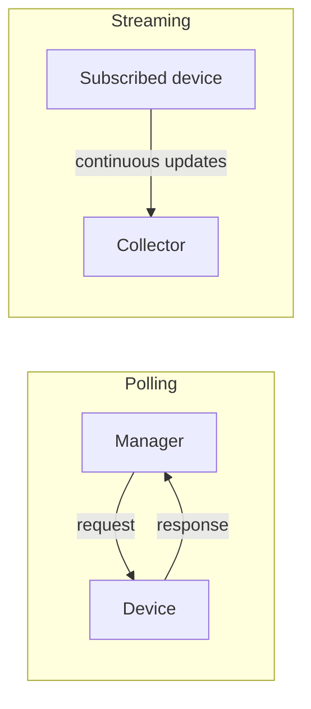
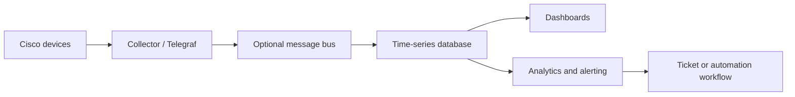
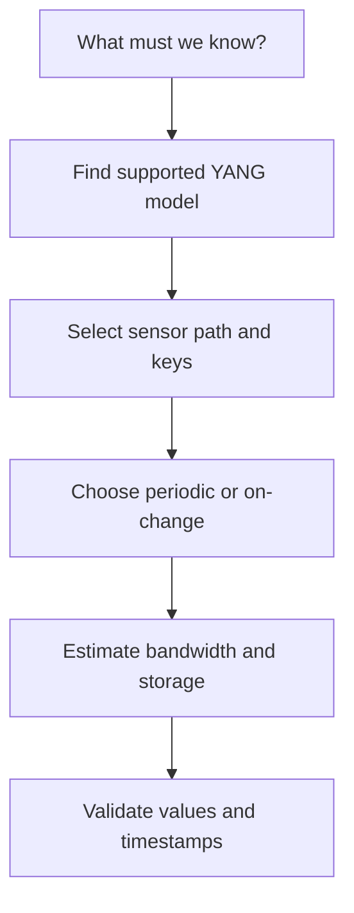
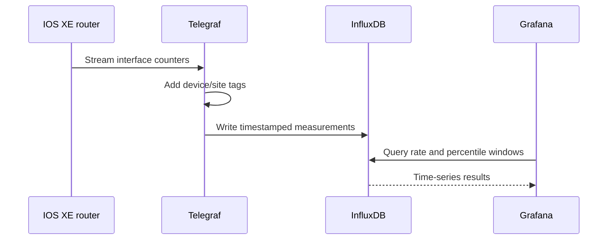
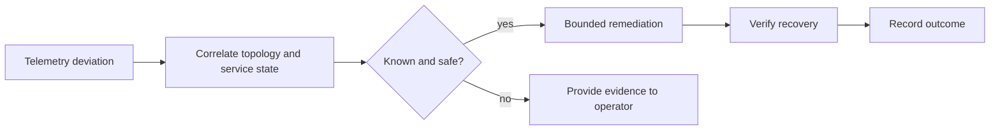

# Chapter 12: Model-Driven Telemetry

## Chapter Purpose

Automation needs timely evidence about network state. Model-driven telemetry (MDT) streams structured measurements from devices to collectors, replacing much repetitive polling with efficient subscriptions. This chapter covers push models, sensor paths, transport, storage, visualization, and event-driven operations.

## 1. From Polling to Streaming

SNMP managers traditionally poll MIB objects at intervals. Polling is widely supported, but a short event can occur between polls and large environments generate repeated requests even when nothing changes.

MDT uses YANG-modeled paths, precise subscription behavior, and efficient encodings. It complements rather than automatically replaces SNMP, syslog, and flow data.

## 2. Telemetry Architecture

The collection tier terminates subscriptions and normalizes data. A message bus decouples producers from consumers. A time-series database stores timestamped measurements efficiently. Dashboards support investigation, while alert rules turn measurements into action.

## 3. Dial-Out and Dial-In

In **dial-out**, the network device initiates a connection to configured collectors and pushes a configured subscription. In **dial-in**, a collector connects to the device and creates a dynamic subscription.

| Mode | Advantage | Operational concern |
|---|---|---|
| Dial-out | Device automatically exports required streams | Subscription and destination configured on every device or controller |
| Dial-in | Collector centrally controls dynamic subscriptions | Collector must reach and authenticate to each device |

Dial-out is useful through restrictive inbound policies. Dial-in gives the collector greater subscription flexibility. High availability may require multiple collectors and careful duplicate handling.

## 4. Subscription Modes

- **Periodic:** send values at a defined sample interval.
- **On-change:** send an update when supported data changes, often with heartbeat behavior.
- **Event-driven:** publish meaningful events rather than raw periodic samples.

Periodic updates make rates and trends predictable but consume bandwidth and storage even when values are stable. On-change is efficient for configuration or state transitions, though not every sensor supports it. Choose the interval according to the phenomenon: interface counters may need seconds, inventory may need hours.

## 5. Sensor Paths and YANG

A sensor path identifies data in a YANG tree. Selection should begin with an operational question, not with every available metric. To detect congestion, collect interface octets, utilization, discards, queue depth, and errors at an interval that reveals the condition.

Use device capabilities, Cisco YANG Suite, YANG Catalog, or repository models to inspect paths. Verify units, counter width, update behavior, platform release, and whether the path represents configuration or operational state.

## 6. Transport and Encoding

Cisco platforms may support gRPC-based MDT, gNMI, or platform-specific transports. gRPC uses HTTP/2 and can carry Google Protocol Buffers (GPB). GPB is compact and strongly structured. JSON is easier to inspect but usually larger. GPB key-value offers self-describing fields, while compact GPB may require the consumer to know the schema.

TLS protects data in transit and authenticates endpoints. Do not treat an internal telemetry network as automatically trusted; telemetry can reveal topology, addressing, software versions, and usage patterns.

## 7. Practical TIG Pipeline

The TIG stack combines **Telegraf**, **InfluxDB**, and **Grafana**. Telegraf receives and transforms metrics, InfluxDB stores time-series data, and Grafana queries and visualizes it.

Tags such as site, role, device, and interface support filtering, but excessive high-cardinality labels increase database cost. Retention policies should keep high-resolution data briefly and downsample long-term trends.

## 8. Capacity and Reliability

Estimate volume as devices × sensor paths × update frequency × encoded record size. Then include replication, indexes, metadata, and retention. A thousand devices emitting 500 values every ten seconds produce 50,000 values per second before overhead.

Collectors need backpressure, buffering, health metrics, and clear behavior during database failure. Monitor the monitoring system: subscription status, dropped messages, queue depth, ingestion latency, storage health, and dashboard query latency.

## 9. From Telemetry to Action

An alert should express a service symptom rather than a noisy single threshold. Correlate interface loss with routing changes and application health before opening a critical incident.

AI can assist anomaly detection and correlation, but baselines must account for scheduled changes and normal seasonality. Automated remediation should be narrow, rate-limited, reversible, and disabled when evidence is incomplete.

> **Study guide takeaway:** MDT is an end-to-end data system, not merely a device feature. Valuable telemetry starts with an operational question and ends with trustworthy storage, visualization, alerting, and controlled action.

## Chapter Summary

Streaming telemetry uses subscriptions and YANG sensor paths to provide timely structured data. Dial-out and dial-in determine who initiates the session; periodic and on-change modes determine when data is sent. Collectors, time-series databases, and dashboards must be sized and monitored as production services.
