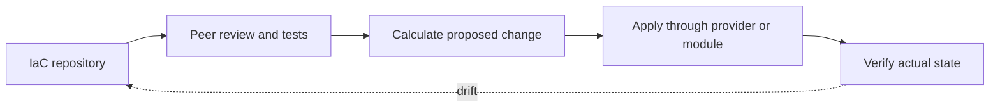
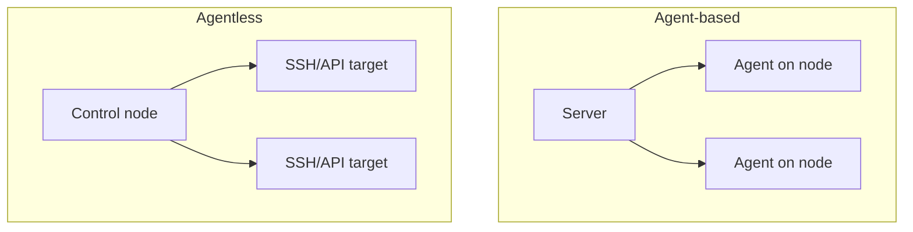
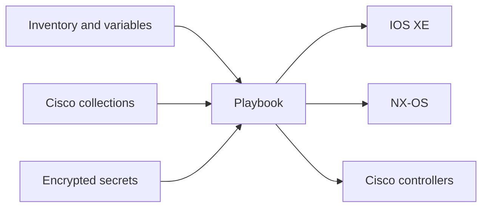

# Chapter 13: Open-Source Automation Solutions

## Chapter Purpose

Open-source tools make infrastructure definitions reviewable, repeatable, and extensible. This chapter compares infrastructure-as-code models, provisioning and configuration management, agent and agentless designs, and the roles of Puppet, Chef, Ansible, and Terraform in Cisco environments.

## 1. Infrastructure as Code

Infrastructure as code (IaC) represents desired infrastructure in files that can be versioned, tested, reviewed, and deployed by software.



An **imperative** definition specifies how to perform each step. A **declarative** definition describes the desired outcome and lets the tool determine the operations. Most real systems combine both: declarative resources may call imperative providers or modules.

## 2. Provisioning and Configuration Management

Provisioning creates or allocates resources: a VM, cloud network, ACI tenant, or DNS record. Configuration management brings operating systems and applications into a desired state. The boundary is not absolute, and several tools perform both.

IaC should be idempotent so repeated execution converges on the same result. It should also detect drift, protect secrets, and expose a plan before high-impact changes.

## 3. Agent-Based and Agentless Models



Agents can continuously enforce state and report facts, but they require installation, upgrades, certificates, and resources on each managed node. Agentless systems use existing SSH or APIs and fit network devices that cannot run a general-purpose agent. They depend on reachable management interfaces and typically reconcile only when jobs run.

## 4. Puppet and Chef

Puppet commonly uses a declarative manifest and a server-agent model. Facter gathers node facts, which influence catalog compilation. A manifest can declare packages, files, services, and relationships.

```puppet
file { '/etc/automation/banner.txt':
  ensure  => file,
  content => "Managed by Puppet\n",
  owner   => 'root',
  mode    => '0644',
}
```

Chef recipes are written in a Ruby-based DSL and organized into cookbooks. A Chef client converges the node toward the desired recipe state. Both platforms are strong for servers; direct network support depends on device modules, proxies, and APIs.

## 5. Ansible Architecture

Ansible uses a control node, inventory, playbooks, modules or collections, and managed nodes. It is agentless and commonly reaches network devices over SSH, NETCONF, RESTCONF, or controller APIs.



```yaml
---
- name: Configure and verify an IOS XE interface
  hosts: campus_access
  gather_facts: false
  tasks:
    - name: Apply interface intent
      cisco.ios.ios_interfaces:
        config:
          - name: GigabitEthernet1/0/24
            description: AP-Uplink
            enabled: true
        state: merged

    - name: Collect interface facts
      cisco.ios.ios_facts:
        gather_subset: min
        gather_network_resources: interfaces
```

Prefer resource modules over raw CLI where available. Organize variables by role and site, use fully qualified collection names, pin tested collection versions, and keep secrets in Ansible Vault or an external secret manager.

## 6. Ansible Data and Execution

Inventory may use INI or YAML. YAML supports nested groups and variables clearly. Precedence matters: a variable defined at several levels may resolve differently than expected. Keep the hierarchy simple and document authoritative sources.

Use check mode carefully; not every network module can predict changes. `serial` limits the number of devices changed in a batch. Handlers can trigger dependent actions. Tags support selected phases, but should not bypass safety checks.

## 7. Terraform

Terraform declares resources in HCL and uses providers to call infrastructure APIs. Its normal workflow is `terraform init`, `terraform plan`, and `terraform apply`.

```hcl
terraform {
  required_providers {
    aci = {
      source = "CiscoDevNet/aci"
    }
  }
}

resource "aci_tenant" "automation" {
  name        = "TN-AUTOMATION"
  description = "Managed through reviewed Terraform"
}
```

Terraform state maps configuration addresses to remote objects. It can contain sensitive values and must be protected with encryption, access control, locking, and backups. Remote state supports team workflows. Never manually edit state unless following a controlled recovery process.

## 8. Selecting a Tool

| Requirement | Strong starting point |
|---|---|
| Repeated device configuration and validation | Ansible |
| Continuous server-state enforcement | Puppet or Chef |
| Declarative API resource lifecycle and dependency graph | Terraform |
| Complex multi-system service workflow | Orchestrator plus focused tools |

The best choice depends on APIs, state ownership, team skills, scale, failure behavior, community health, security, and support. “Open source” does not mean “no cost”; evaluate maintenance, vulnerabilities, upgrade compatibility, and operational ownership.

## 9. Cisco Ecosystem

Cisco-supported and community collections and providers cover IOS, IOS XE, NX-OS, IOS XR, ACI, Meraki, Intersight, and other platforms. Test compatibility against exact software and collection/provider versions. A lab or digital twin should exercise plans before production.

> **Study guide takeaway:** IaC makes infrastructure change reviewable and repeatable. Ansible excels at agentless network tasks, Terraform manages declarative API resources and state, while Puppet and Chef continuously converge agent-managed systems.

## Chapter Summary

Open-source automation spans imperative and declarative styles, provisioning and configuration, and agent or agentless execution. Operational success depends less on tool popularity than on clear state ownership, version pinning, secret protection, testing, and verification.
