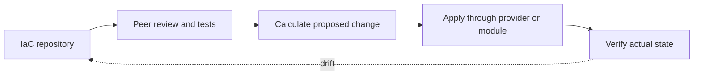
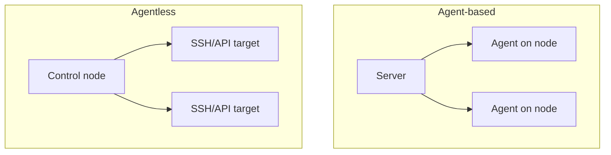
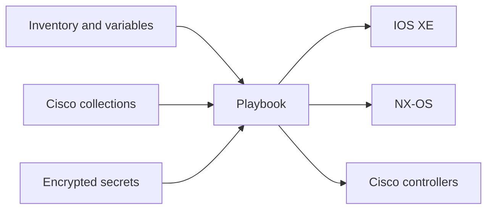
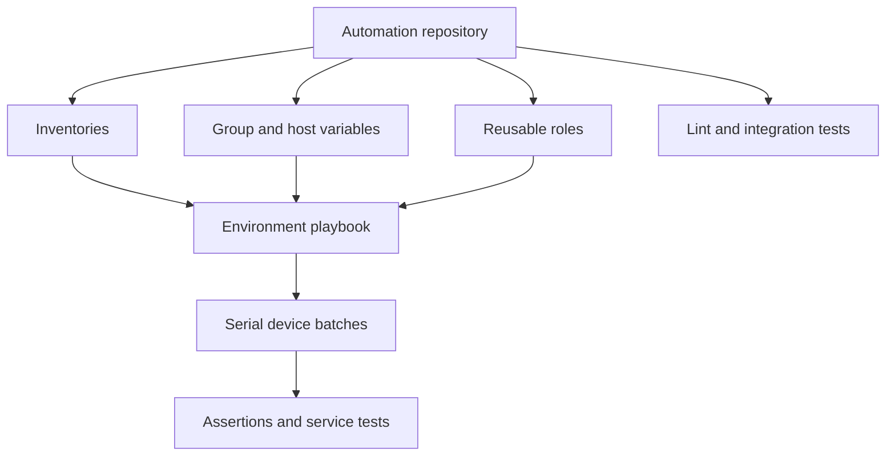

# Chapter 13: Open-Source Automation Solutions

## Chapter Purpose

Open-source tools make infrastructure definitions reviewable, repeatable, and extensible. This chapter compares infrastructure-as-code models, provisioning and configuration management, agent and agentless designs, and the roles of Puppet, Chef, Ansible, and Terraform in Cisco environments.

## 1. Infrastructure as Code

Infrastructure as code (IaC) represents desired infrastructure in files that can be versioned, tested, reviewed, and deployed by software.



An **imperative** definition specifies how to perform each step. A **declarative** definition describes the desired outcome and lets the tool determine the operations. Most real systems combine both: declarative resources may call imperative providers or modules.

## 2. Provisioning and Configuration Management

Provisioning creates or allocates resources: a VM, cloud network, ACI tenant, or DNS record. Configuration management brings operating systems and applications into a desired state. The boundary is not absolute, and several tools perform both.

IaC should be idempotent so repeated execution converges on the same result. It should also detect drift, protect secrets, and expose a plan before high-impact changes.

## 3. Agent-Based and Agentless Models



Agents can continuously enforce state and report facts, but they require installation, upgrades, certificates, and resources on each managed node. Agentless systems use existing SSH or APIs and fit network devices that cannot run a general-purpose agent. They depend on reachable management interfaces and typically reconcile only when jobs run.

## 4. Puppet and Chef

Puppet commonly uses a declarative manifest and a server-agent model. Facter gathers node facts, which influence catalog compilation. A manifest can declare packages, files, services, and relationships.

```puppet
file { '/etc/automation/banner.txt':
  ensure  => file,
  content => "Managed by Puppet\n",
  owner   => 'root',
  mode    => '0644',
}
```

Chef recipes are written in a Ruby-based DSL and organized into cookbooks. A Chef client converges the node toward the desired recipe state. Both platforms are strong for servers; direct network support depends on device modules, proxies, and APIs.

## 5. Ansible Architecture

Ansible uses a control node, inventory, playbooks, modules or collections, and managed nodes. It is agentless and commonly reaches network devices over SSH, NETCONF, RESTCONF, or controller APIs.



```yaml
---
- name: Configure and verify an IOS XE interface
  hosts: campus_access
  gather_facts: false
  tasks:
    - name: Apply interface intent
      cisco.ios.ios_interfaces:
        config:
          - name: GigabitEthernet1/0/24
            description: AP-Uplink
            enabled: true
        state: merged

    - name: Collect interface facts
      cisco.ios.ios_facts:
        gather_subset: min
        gather_network_resources: interfaces
```

Prefer resource modules over raw CLI where available. Organize variables by role and site, use fully qualified collection names, pin tested collection versions, and keep secrets in Ansible Vault or an external secret manager.

## 6. Ansible Data and Execution

Inventory may use INI or YAML. YAML supports nested groups and variables clearly. Precedence matters: a variable defined at several levels may resolve differently than expected. Keep the hierarchy simple and document authoritative sources.

Use check mode carefully; not every network module can predict changes. `serial` limits the number of devices changed in a batch. Handlers can trigger dependent actions. Tags support selected phases, but should not bypass safety checks.

## 7. Terraform

Terraform declares resources in HCL and uses providers to call infrastructure APIs. Its normal workflow is `terraform init`, `terraform plan`, and `terraform apply`.

```hcl
terraform {
  required_providers {
    aci = {
      source = "CiscoDevNet/aci"
    }
  }
}

resource "aci_tenant" "automation" {
  name        = "TN-AUTOMATION"
  description = "Managed through reviewed Terraform"
}
```

Terraform state maps configuration addresses to remote objects. It can contain sensitive values and must be protected with encryption, access control, locking, and backups. Remote state supports team workflows. Never manually edit state unless following a controlled recovery process.

## 8. Selecting a Tool

| Requirement | Strong starting point |
|---|---|
| Repeated device configuration and validation | Ansible |
| Continuous server-state enforcement | Puppet or Chef |
| Declarative API resource lifecycle and dependency graph | Terraform |
| Complex multi-system service workflow | Orchestrator plus focused tools |

The best choice depends on APIs, state ownership, team skills, scale, failure behavior, community health, security, and support. “Open source” does not mean “no cost”; evaluate maintenance, vulnerabilities, upgrade compatibility, and operational ownership.

## 9. Cisco Ecosystem

Cisco-supported and community collections and providers cover IOS, IOS XE, NX-OS, IOS XR, ACI, Meraki, Intersight, and other platforms. Test compatibility against exact software and collection/provider versions. A lab or digital twin should exercise plans before production.

## 10. Structuring an Ansible Network Project

A maintainable Ansible repository separates inventory, group variables, host exceptions, roles, playbooks, templates, and tests. Grouping devices only by platform is rarely enough. A switch may inherit values from its environment, region, site, role, and software family. The hierarchy should remain understandable so an engineer can explain the final value without tracing dozens of overrides.

Roles package related defaults, tasks, handlers, templates, and documentation. A campus-access role might manage AAA, NTP, logging, telemetry, interface defaults, and controller reachability. Site-specific data supplies server addresses and local prefixes, while the role supplies behavior. This separation allows the same tested implementation to serve many sites without copying playbooks.

Ansible network connections are persistent enough to execute modules efficiently but are not resident agents. `network_cli` interacts through the CLI, `netconf` uses structured NETCONF operations, and `httpapi` supports platform APIs. The collection and module determine the correct connection. Raw command modules are valuable for diagnostics or unsupported features, but structured resource modules provide stronger idempotency and parsed state.



Templates should contain presentation logic, not an undocumented policy engine. Calculate and validate intended values before rendering Jinja. Compare generated configuration with known examples, and make whitespace deterministic. If a template can remove configuration, show the proposed difference and require an appropriate approval boundary.

## 11. Puppet, Chef, and Convergence

Puppet compiles a catalog describing the resources a node should contain. The agent applies the catalog and reports changes to the server. This pull-oriented convergence is useful when nodes must continuously correct drift, even if an operator is not running a central job. Certificates establish trust between agents and the Puppet infrastructure, so certificate lifecycle and server availability become operational dependencies.

Chef uses cookbooks, recipes, resources, attributes, and node data to define convergence. Although recipe code looks imperative, resources aim to be idempotent. In both systems, custom extensions add power but also increase the testing and maintenance burden. A module downloaded from a public community should be reviewed, version-pinned, and scanned like any other software dependency.

Network equipment often favors agentless operation because the network OS exposes supported management interfaces but does not permit an arbitrary long-running agent. A proxy or controller can still integrate an agent-oriented platform with network APIs. The design question is not whether one model is universally better; it is where convergence logic runs, how it authenticates, and what happens when the control service is unreachable.

## 12. Terraform Planning and State Discipline

Terraform builds a dependency graph from resource references. During planning, it refreshes known remote state, compares it with configuration, and proposes create, update, replace, or destroy actions. Replacement deserves careful review because an apparently small attribute change may force recreation of a network resource and all dependent relationships.

Modules provide reusable abstractions. An ACI application-profile module can accept tenant, VRF, bridge-domain, EPG, and contract intent while hiding repeated resource wiring. However, a module should not hide destructive behavior or expose dozens of loosely related options. Version modules semantically and provide migration guidance when resource addresses change.

Import can bring an existing remote object under Terraform state, but importing does not automatically create complete configuration. The engineer must write configuration that matches the object and inspect the resulting plan until Terraform proposes no unintended change. Moving or renaming resource addresses should use supported state-move mechanisms rather than destroy and recreate.

Remote backends, state locking, encryption, narrow access, and separated environments are essential for teams. A production apply should use the reviewed plan artifact when the workflow supports it, ensuring that approval and execution refer to the same proposed changes. Secrets marked sensitive may be hidden from console output yet still exist in state, so the state store remains confidential.

## 13. Open-Source Governance

Tool selection should examine release cadence, maintainer activity, vulnerability response, documentation, test quality, license, extension ecosystem, and backward compatibility. Establish an internal ownership model even when community support is excellent. Someone must approve upgrades, test Cisco release compatibility, respond to security advisories, and maintain custom modules.

An internal registry or mirror can preserve approved Ansible collections, Terraform providers, Puppet modules, container images, and Python packages. Pinning versions makes builds reproducible, while a controlled update process prevents pinning from becoming permanent neglect. Software composition analysis and a software bill of materials help identify exposure when a dependency vulnerability is announced.

## 14. Ansible Workflow for a Cisco Change

Consider a requirement to standardize NTP, DNS, syslog, and telemetry on campus switches. Inventory groups devices by environment, region, site, role, and IOS XE release. Group variables define enterprise defaults; site variables select nearby services; host variables are reserved for justified exceptions. Before configuration, the playbook collects facts and asserts that the platform and software release are supported.

The change should use focused resource modules where available and templates only for unsupported portions. `check_mode` and diff output can support review, but they must be tested because network modules vary in prediction support. The deployment starts with a canary device, validates management reachability and clock synchronization, and then proceeds in serial batches. A failed batch stops the rollout while preserving successful devices for investigation.

```yaml
---
- name: Deploy management services safely
  hosts: campus_access
  gather_facts: false
  serial: 10
  max_fail_percentage: 10

  pre_tasks:
    - name: Gather minimum IOS facts
      cisco.ios.ios_facts:
        gather_subset: min

    - name: Require an approved IOS XE release
      ansible.builtin.assert:
        that: ansible_net_version in approved_iosxe_versions
        fail_msg: "Device release is outside the tested compatibility set"

  tasks:
    - name: Merge NTP server configuration
      cisco.ios.ios_ntp_global:
        config:
          servers: "{{ ntp_servers }}"
        state: merged

  post_tasks:
    - name: Collect NTP associations
      cisco.ios.ios_command:
        commands: show ntp associations
      register: ntp_result

    - name: Confirm at least one synchronized association
      ansible.builtin.assert:
        that: "'*' in ntp_result.stdout[0]"
```

The example uses a command for operational verification because a suitable structured fact may not be available, but it keeps configuration in a resource module. In production, parsing should account for platform output and should be covered by tests. A stronger verification can compare device time with an external reference or inspect a modeled operational path.

## 15. Secrets, Inventories, and Execution Environments

Ansible Vault encrypts variables at rest, but the vault password and decrypted values still require protection. CI systems should obtain the decryption secret from a credential manager, restrict it to the deployment job, and prevent verbose output from exposing sensitive data. Where possible, use short-lived controller tokens or dynamic credentials rather than long-lived device passwords.

Dynamic inventories can query a CMDB, cloud platform, or Cisco controller. They reduce manual duplication but make availability and filtering important. Cache behavior should be understood so a decommissioned device is not targeted from stale inventory. Inventory plugins and custom scripts are software dependencies; validate their returned groups and variables before allowing them to select production scope.

Execution environments package Ansible Core, Python libraries, collections, and supporting tools into a controlled container image. They reduce “works on my laptop” differences and make CI and automation-controller jobs reproducible. Sign and scan these images, pin dependency versions, and maintain separate release channels for development and production.

## 16. Terraform Team Workflow

A safe Terraform workflow begins with formatting and static validation, followed by provider initialization from approved sources. The pipeline creates a plan against a locked remote state and publishes the plan for review. Policy checks can reject prohibited resources, broad network exposure, destructive replacement, or missing metadata. Apply then uses the reviewed plan rather than recalculating against an unknown code revision.


Provider credentials should be supplied at runtime. Provider and module versions belong in constraints and lock files. Separate state by meaningful failure and ownership boundaries; one enormous state file increases contention and blast radius, while thousands of tiny states make dependencies difficult. Remote-state outputs can share necessary values, but excessive coupling creates fragile apply ordering.

Terraform is not automatically safe because it is declarative. A changed key or resource address can cause destroy-and-create behavior, and a provider defect can misinterpret remote state. Review action symbols, replacement reasons, unknown values, and sensitive outputs. Back up state and test recovery, but never treat state rollback alone as an infrastructure rollback because remote resources may already have changed.

## 17. Combining Tools Without Conflicting Ownership

An organization may use Terraform to create ACI tenants and bridge domains, Ansible to configure IOS XE edge devices, and Puppet to maintain Linux collectors. This division is reasonable when each attribute has one authoritative manager. Trouble begins when Terraform and Ansible both believe they own the same ACI contract or when an engineer changes a Puppet-managed file manually.

Document ownership at the resource and attribute level. If an emergency manual change is necessary, either update the source before the next reconciliation or record a temporary exception. Drift detection should inform an operator before correction when the impact is uncertain. Continuous convergence is valuable only when desired state is genuinely authoritative.

Open-source tools should be connected through an orchestrator or pipeline rather than one tool shelling out unpredictably to another. Exchange explicit inputs and outputs, preserve correlation IDs, and define failure and compensation. This produces a system whose behavior can be tested and explained.

## 18. Process for Configuring Network Parameters

A repeatable network-parameter process begins with validated intent, not a device template. The request identifies site, service, owner, addresses, VLAN, routing or security requirements, maintenance constraints, and acceptance criteria. The workflow retrieves authoritative inventory and IPAM data, checks policy and conflicts, calculates the intended difference, and presents a plan for review.


Ansible is well suited when parameters must be applied and verified across device inventories. Terraform is stronger when the target exposes resource lifecycle through an API and remote objects need declarative state. A controller API is preferable when it owns fabric-wide policy. The process may use several tools, but one system must own each attribute. Failure handling should stop the rollout, preserve successful and failed targets, and apply rollback only when the previous state remains safe.

## 19. Selecting a Configuration Management Solution

Technical requirements include target platforms, available APIs, scale, idempotency, transaction support, drift detection, offline behavior, performance, secret integration, and testing. Business requirements include support model, licensing, staff skills, auditability, regulatory controls, delivery speed, vendor strategy, and total operating cost. A tool that supports every device but cannot satisfy change evidence or team support requirements is not a complete solution.

Use a weighted decision matrix rather than selecting by popularity. For a heterogeneous enterprise network, Ansible may score highly for agentless reach and Cisco collections. Terraform may be selected for ACI, cloud, and Intersight resources with clear lifecycle ownership. Puppet or Chef can continuously converge server systems. Cisco NSO may be appropriate where transactional multi-vendor service orchestration and rollback are central requirements. A commercial controller may provide deeper assurance and lifecycle integration for its domain than a general-purpose tool.

Pilot the shortlisted solution with a representative workflow, including failure and recovery. Measure time to implement, plan clarity, idempotency, scale, debugging, upgrade compatibility, and operational handoff. The correct result can be a governed toolchain rather than one universal tool.

> **Study guide takeaway:** IaC makes infrastructure change reviewable and repeatable. Ansible excels at agentless network tasks, Terraform manages declarative API resources and state, while Puppet and Chef continuously converge agent-managed systems.

## Chapter Summary

Open-source automation spans imperative and declarative styles, provisioning and configuration, and agent or agentless execution. Operational success depends less on tool popularity than on clear state ownership, version pinning, secret protection, testing, and verification.
