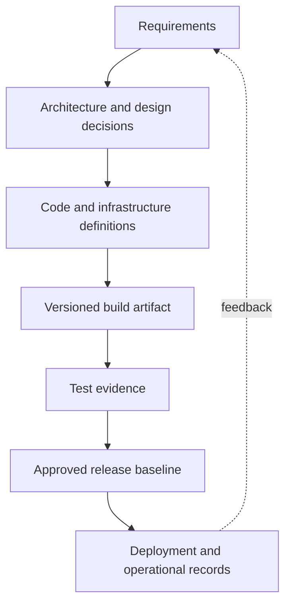
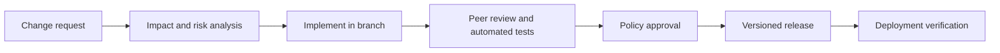
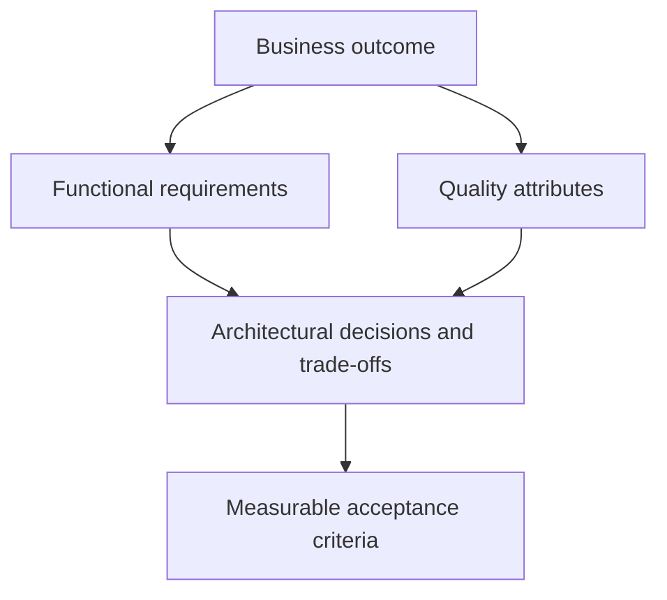
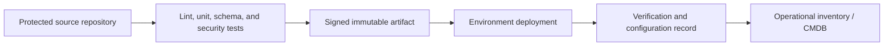
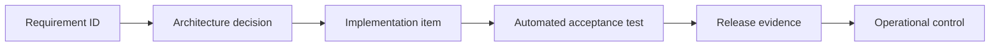
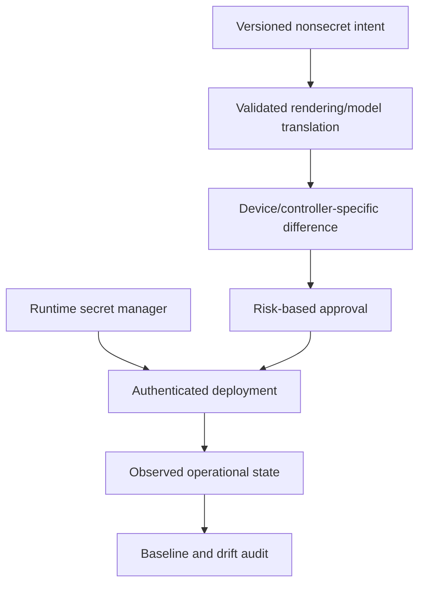

# Chapter 14: Configuration and Release Control

## Chapter Introduction

Software configuration management (SCM) controls the many artifacts and decisions that define a software or automation product. It connects requirements, architecture, code, dependencies, infrastructure, testing, releases, and support evidence so a team can explain and reproduce what it delivered.

## 1. What SCM Controls

A configuration item is any artifact that must be identified and governed. For a Cisco automation service, items can include:

- Business, functional, security, and operational requirements.
- Architecture diagrams, API contracts, YANG models, and data schemas.
- Application code, playbooks, Terraform modules, and device templates.
- Inventories, dependency lock files, container definitions, and pipeline code.
- Tests, release notes, runbooks, licenses, and support records.

SCM is broader than Git. Version control stores revisions; SCM defines identification, change control, status accounting, audits, baselines, and responsibilities across the product.

## 2. Baselines and Traceability

A **baseline** is an approved set of configuration items used as a reference. A release baseline might bind a Git commit, container digest, Python dependency lock, Ansible collection versions, Terraform provider versions, schemas, and test results.

Traceability connects a requirement to a design decision, implementation, test, and release. When a controller API changes, the team can identify affected code and tests rather than searching by memory.

## 3. Change Control

Not every change requires a meeting. Low-risk changes can follow policy-as-code and automated approval; high-risk network changes may require explicit review. Emergency paths should be fast but still record identity, reason, evidence, and follow-up reconciliation.

## 4. Status Accounting and Audits

Configuration status accounting answers: Which version is deployed? Which changes are approved? What defects remain? Which devices received the change? An audit confirms that the product matches its documentation and that required controls were followed.

A deployment record should capture artifact digest, environment, inventory scope, initiator, approvals, timestamps, results, and rollback. This evidence is essential when automation changes thousands of devices.

## 5. Requirements and Architecture

Functional requirements state behavior, such as “create a guest VLAN at a selected site.” Nonfunctional requirements define qualities such as availability, latency, security, scale, maintainability, and auditability.

“The workflow must be fast” is not testable. “For 95% of sites, a validated VLAN request completes within five minutes and leaves no partial configuration after failure” provides measurable performance and resilience criteria.

## 6. Technical Debt

Technical debt is the future cost created by a short-term decision. A script may embed credentials and device addresses to meet a deadline; later, every environment change requires editing code and rotating credentials becomes dangerous.

Debt is sometimes deliberate, but it should be visible. Record the reason, risk, owner, repayment trigger, and expected effort. Otherwise temporary compromises become invisible architecture.

| Short-term decision | Long-term consequence |
|---|---|
| Unpinned dependencies | A rebuild produces different behavior |
| Raw CLI parsing | Platform output changes break automation |
| Shared administrator account | Excess privilege and weak attribution |
| No integration environment | Failures discovered on production devices |
| Manual release notes | Deployed state cannot be reconstructed reliably |

## 7. Tool Choice as an Architectural Decision

Ansible and Terraform solve different state problems. Ansible commonly executes tasks and configuration modules against an inventory. Terraform tracks resource lifecycles in state and calculates a dependency plan. Using both can be appropriate if ownership is explicit. Two tools must not independently manage the same attribute.

Tool evaluation should consider API support, idempotency, transaction behavior, drift, secrets, scale, debugging, community or vendor support, and team capability. Record major choices in architecture decision records.

## 8. SCM in a Delivery Pipeline

Generated or externally sourced code and documentation become configuration items once accepted. They need the same review, attribution, license checks, security testing, and version control as other project material.

## 9. Configuration Identification and Naming

SCM starts by identifying exactly what is controlled. Ambiguous names such as `final-config-v2-new` cannot establish lineage. Repositories, modules, releases, artifacts, environments, and deployment targets need stable naming and version rules. Semantic versioning can communicate incompatible, compatible feature, and corrective changes for software libraries, although infrastructure modules may also require environment-specific release conventions.

Every release should be reconstructable from immutable identifiers. A Git tag alone is insufficient if dependency versions float or a container base image tag later points to different content. Record commit IDs, lock files, provider and collection versions, image digests, compiler or runtime versions, and build parameters. Reproducibility makes rollback and forensic investigation significantly more reliable.

Branching strategy should match team size and release cadence. Short-lived feature branches and frequent integration reduce merge risk. Protected main branches, required reviews, and status checks enforce policy. Long-lived environment branches can drift and accumulate difficult merges; promoting an immutable artifact through environment-specific configuration is generally clearer.

## 10. Requirements Traceability in Practice

Consider a requirement that only approved administrators may deploy a branch routing change and that every deployment must be attributable for one year. Architecture translates this into federated identity, role-based authorization, protected repositories, pipeline service identities, signed artifacts, and centralized audit retention. Tests confirm that unauthorized identities cannot deploy and that the record includes requester, approver, artifact, target, timestamp, and result.

This chain illustrates why requirements cannot remain in a forgotten document. A change from one-year to seven-year retention affects storage, access, cost, backup, and privacy. Traceability identifies the systems and tests that must change. It also prevents a developer from “simplifying” an audit field without understanding the compliance reason behind it.

## 11. Managing Environments and Variants

Development, test, staging, and production should use the same artifact wherever possible. Environment-specific values such as controller URLs, site inventories, certificates, capacity, and feature flags belong in governed configuration, not separate code copies. This reduces the possibility that production contains logic never tested elsewhere.

Network platforms also create variants by software release and hardware capability. A module may support IOS XE 17.9 but encounter a different YANG path or API response on another release. Compatibility matrices, automated lab tests, and explicit minimum versions become configuration items. Avoid silently detecting every variation at runtime; unsupported combinations should fail early with a clear explanation.

Configuration data needs schema validation and ownership. A YAML file can be valid YAML while containing an overlapping subnet, invalid ASN, or forbidden VLAN. Formal schemas catch types and ranges, while cross-resource policy checks catch semantic conflicts. Changes to the schema itself require versioning and migration planning.

## 12. Release and Operational Handoff

A release is not complete when a binary or playbook is produced. It should include deployment prerequisites, compatibility, configuration migration, security changes, observability, rollback, known limitations, and support ownership. Operational teams need dashboards and runbooks before the first incident, not after it.

A configuration audit compares the approved baseline with deployed reality. Differences may be authorized emergency changes, platform-generated state, or genuine drift. The process should classify the difference instead of automatically overwriting it. After an emergency, reconcile the approved source, verify the final state, and close the temporary exception.

SCM metrics should encourage quality rather than paperwork. Useful signals include lead time, deployment failure rate, rollback frequency, unplanned drift, time to reconstruct a release, dependency age, and percentage of requirements linked to tests. These measures reveal weaknesses in the system while leaving teams room to improve the process.

## 13. SCM Roles and Responsibilities

Effective SCM assigns ownership without isolating it in one “configuration manager.” Product owners clarify business priority and acceptance. Architects record important decisions and constraints. Developers and automation engineers maintain code, tests, and dependency declarations. Security specialists define controls and evaluate supply-chain risk. Operations engineers contribute deployability, observability, recovery, and support requirements. Release owners decide whether evidence satisfies promotion policy.

The repository makes collaboration visible, but a pull request is not a substitute for responsibility. Reviewers should understand the affected domain and the proposed behavior. A cosmetic approval from someone unfamiliar with BGP policy or ACI contracts provides little risk reduction. CODEOWNERS-style rules can request appropriate reviewers, while automated checks handle repeatable syntax, schema, security, and policy verification.

A RACI model can clarify who is responsible, accountable, consulted, and informed for baselines, emergency changes, dependency upgrades, and production releases. Avoid making every party an approver; excessive gates encourage bypass. The control should be proportionate to the blast radius and reversibility of the change.

## 14. Build and Dependency Configuration

Source code is only one build input. Python projects may depend on interpreter version, package indexes, lock files, native libraries, and environment variables. Ansible depends on Core, collections, Python modules, and execution-environment images. Terraform depends on CLI, providers, modules, backend configuration, and state schema. Each dependency can change behavior even when application code does not.

Lock files and internal artifact repositories improve reproducibility. Dependency updates should be deliberate, automated where possible, and tested against representative Cisco platforms. Security scanners identify known vulnerabilities, but an update can also introduce incompatible API behavior. The team must balance vulnerability remediation with functional validation rather than blindly accepting or indefinitely postponing upgrades.

Build outputs should be immutable and content-addressable where practical. A container digest, package checksum, or signed bundle proves which artifact moved through test and production. Rebuilding from the same commit during production deployment can produce different output if dependencies changed. Build once, test that artifact, and promote the identical artifact.

## 15. Configuration Control for Network Automation

Network automation has several configuration layers: application settings, environment endpoints, inventories, credentials, policy data, device templates, controller objects, and live device state. They should not all be stored or managed identically. Nonsecret desired state fits version control; secrets belong in a secret manager; high-volume operational state belongs in monitoring or inventory systems; Terraform resource bindings belong in protected state.

Templates require controlled inputs and rendered-output testing. A harmless-looking change to a Jinja default can alter thousands of interfaces. Store golden rendered examples for key platforms, perform semantic comparisons where available, and show device-specific differences before deployment. Tests should verify removal behavior as carefully as additions.

## 16. Managing Technical Debt Deliberately

Debt should be described in operational terms. “The script is old” is vague; “the script parses an undocumented CLI table and fails on IOS XE 17.12, preventing the approved upgrade” identifies impact and a repayment trigger. Estimate probability, consequence, affected scope, workaround, and cost. Link the debt item to architecture and release planning.

Some debt is prudent. A team may use a controlled CLI module for a feature not yet exposed through YANG, provided it adds parsing tests, restricts supported releases, and plans migration when a structured API becomes available. The problem is not imperfection; it is unacknowledged risk and indefinite dependence.

Regular debt review should consider incident history and change friction. If every release requires manual inventory repair, the source-of-truth design is imposing recurring interest. If a monolithic Terraform state makes teams wait hours for locks, state boundaries need redesign. Paying debt can improve delivery speed and reliability simultaneously.

## 17. Auditing a Release

A functional configuration audit asks whether every required component is present and correctly identified. A physical audit asks whether the delivered product matches its documented configuration. In software and automation, this includes confirming that the deployed digest, dependency set, schemas, infrastructure definitions, database migrations, and operational configuration match the approved baseline.

Audit evidence should be generated by the delivery process rather than reconstructed manually. A release manifest can list source commits, artifact digests, SBOM, tests, approvals, environment configuration versions, deployment targets, and verification results. Sign or otherwise protect the evidence from undetected alteration.

When an audit finds drift, classify it. Some differences are runtime-generated, some are approved local values, some are emergency changes awaiting reconciliation, and some are unauthorized. Immediate automated overwrite is not always safe. The SCM process supplies ownership and context so the organization can restore the correct state without erasing valuable evidence.

> **Study guide takeaway:** SCM creates confidence that a release is defined, reproducible, authorized, and traceable. It governs the full product, not just source code.

## Key Takeaways

- SCM identifies configuration items, establishes baselines, controls change, reports status, and audits delivered products.
- Traceability connects requirements and architecture decisions to implementation, tests, releases, and operational controls.
- Reproducible builds, immutable artifacts, controlled dependencies, documented technical debt, and clear ownership protect long-term maintainability.

Chapter 15 brings these lifecycle controls to edge computing by deploying and operating applications directly on supported Cisco network devices.

## Further Reading and References

- [NIST Secure Software Development Framework](https://csrc.nist.gov/Projects/ssdf) - secure development and configuration controls.
- [SLSA framework](https://slsa.dev/) - artifact provenance and supply-chain integrity.
- [Pro Git book](https://git-scm.com/book/en/v2) - version-control foundations for configuration items.
