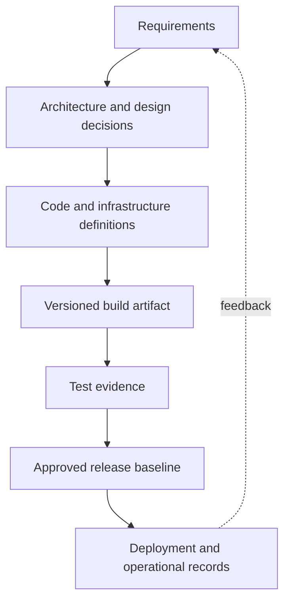
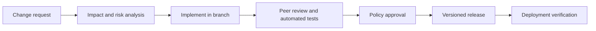
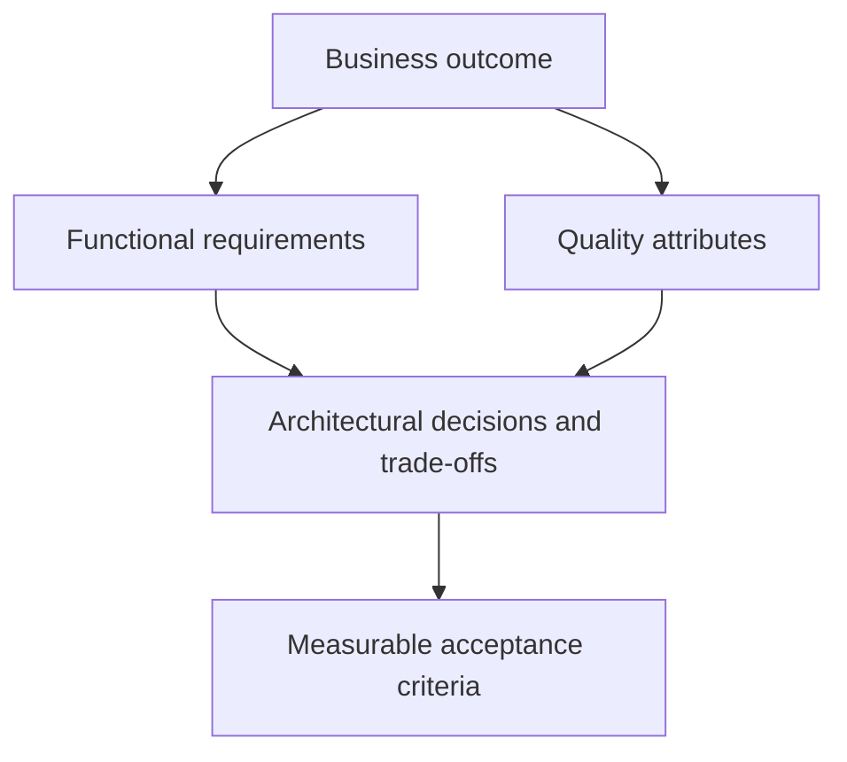
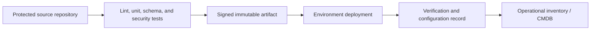

# Chapter 14: Software Configuration Management

## Chapter Purpose

Software configuration management (SCM) controls the many artifacts and decisions that define a software or automation product. It connects requirements, architecture, code, dependencies, infrastructure, testing, releases, and support evidence so a team can explain and reproduce what it delivered.

## 1. What SCM Controls

A configuration item is any artifact that must be identified and governed. For a Cisco automation service, items can include:

- Business, functional, security, and operational requirements.
- Architecture diagrams, API contracts, YANG models, and data schemas.
- Application code, playbooks, Terraform modules, and device templates.
- Inventories, dependency lock files, container definitions, and pipeline code.
- Tests, release notes, runbooks, licenses, and support records.

SCM is broader than Git. Version control stores revisions; SCM defines identification, change control, status accounting, audits, baselines, and responsibilities across the product.

## 2. Baselines and Traceability

A **baseline** is an approved set of configuration items used as a reference. A release baseline might bind a Git commit, container digest, Python dependency lock, Ansible collection versions, Terraform provider versions, schemas, and test results.

Traceability connects a requirement to a design decision, implementation, test, and release. When a controller API changes, the team can identify affected code and tests rather than searching by memory.

## 3. Change Control

Not every change requires a meeting. Low-risk changes can follow policy-as-code and automated approval; high-risk network changes may require explicit review. Emergency paths should be fast but still record identity, reason, evidence, and follow-up reconciliation.

## 4. Status Accounting and Audits

Configuration status accounting answers: Which version is deployed? Which changes are approved? What defects remain? Which devices received the change? An audit confirms that the product matches its documentation and that required controls were followed.

A deployment record should capture artifact digest, environment, inventory scope, initiator, approvals, timestamps, results, and rollback. This evidence is essential when automation changes thousands of devices.

## 5. Requirements and Architecture

Functional requirements state behavior, such as “create a guest VLAN at a selected site.” Nonfunctional requirements define qualities such as availability, latency, security, scale, maintainability, and auditability.

“The workflow must be fast” is not testable. “For 95% of sites, a validated VLAN request completes within five minutes and leaves no partial configuration after failure” provides measurable performance and resilience criteria.

## 6. Technical Debt

Technical debt is the future cost created by a short-term decision. A script may embed credentials and device addresses to meet a deadline; later, every environment change requires editing code and rotating credentials becomes dangerous.

Debt is sometimes deliberate, but it should be visible. Record the reason, risk, owner, repayment trigger, and expected effort. Otherwise temporary compromises become invisible architecture.

| Short-term decision | Long-term consequence |
|---|---|
| Unpinned dependencies | A rebuild produces different behavior |
| Raw CLI parsing | Platform output changes break automation |
| Shared administrator account | Excess privilege and weak attribution |
| No integration environment | Failures discovered on production devices |
| Manual release notes | Deployed state cannot be reconstructed reliably |

## 7. Tool Choice as an Architectural Decision

Ansible and Terraform solve different state problems. Ansible commonly executes tasks and configuration modules against an inventory. Terraform tracks resource lifecycles in state and calculates a dependency plan. Using both can be appropriate if ownership is explicit. Two tools must not independently manage the same attribute.

Tool evaluation should consider API support, idempotency, transaction behavior, drift, secrets, scale, debugging, community or vendor support, and team capability. Record major choices in architecture decision records.

## 8. SCM in a Delivery Pipeline

AI-generated code or documentation becomes a configuration item once accepted. It needs the same review, attribution, license checks, security testing, and version control as human-written material.

> **Study guide takeaway:** SCM creates confidence that a release is defined, reproducible, authorized, and traceable. It governs the full product, not just source code.

## Chapter Summary

SCM identifies configuration items, establishes baselines, controls change, reports status, and audits results. Clear requirements and measurable quality attributes guide architecture. Technical debt and tool decisions should be recorded so short-term delivery does not silently undermine long-term operation.
