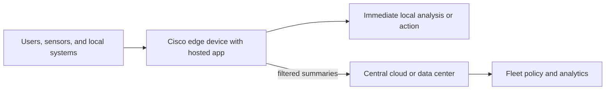
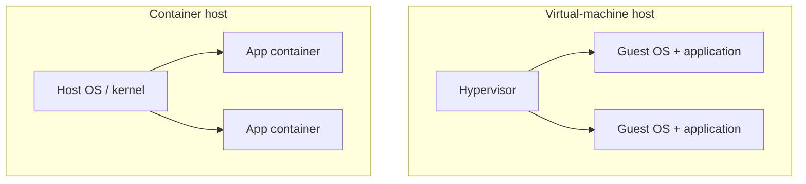
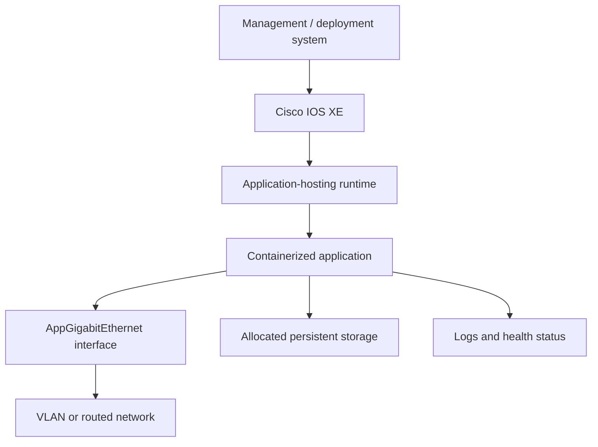
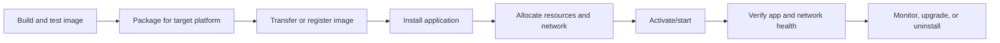
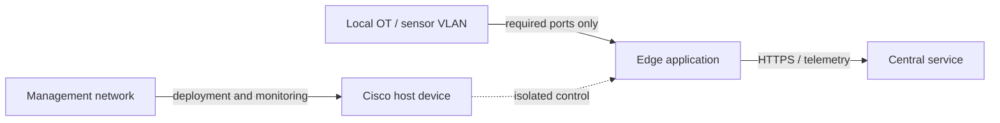
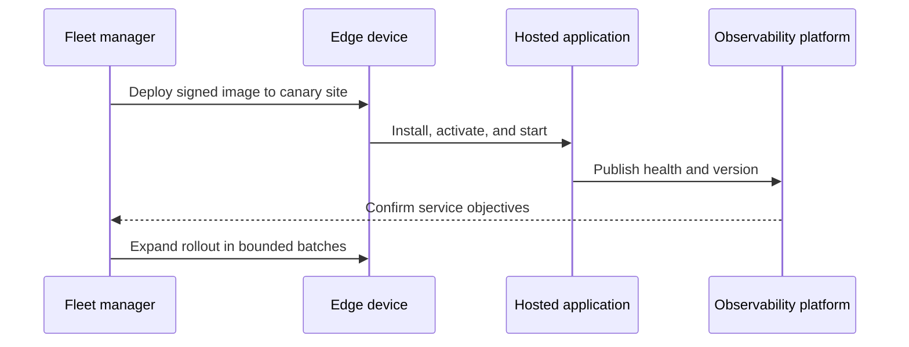
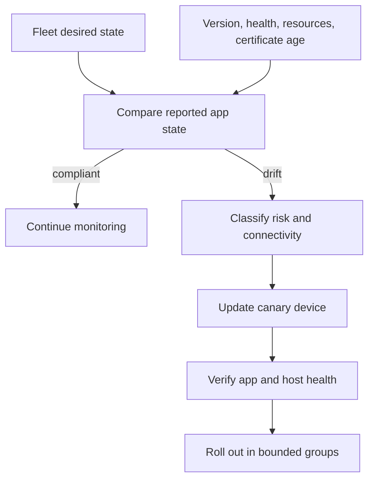

# Chapter 15: Hosting Applications on Network Devices

## Chapter Purpose

Edge computing places selected processing near users, devices, and data sources. Cisco application hosting allows containerized workloads to run on supported Catalyst 9000 and IOx-enabled platforms. This chapter explains the benefits, constraints, deployment workflow, networking, security, and lifecycle management of those applications.

## 1. Why Compute at the Edge?

Central cloud platforms offer elasticity and operational consistency, but sending every event to a distant data center can add latency, consume WAN bandwidth, and conflict with data-location requirements.



An edge application can normalize industrial data, filter telemetry, run a local protocol gateway, perform site health checks, or maintain limited function during WAN loss. It should not be placed on a network device merely because it can be. Protect the primary forwarding role and verify resource and support boundaries.

## 2. Virtual Machines and Containers

A virtual machine includes a guest operating system and virtual hardware. A container packages an application and dependencies while sharing the host kernel. Containers usually start faster and consume fewer resources, but kernel isolation is not identical to a VM boundary.



Type 1 hypervisors run directly on hardware; Type 2 hypervisors run on a host OS. Cisco edge platforms vary: some support containers, virtual machines, or IOx application packages. Always consult the exact platform and software release documentation.

## 3. Cisco Application-Hosting Platforms

Cisco IOx combines network operating capabilities with an application environment on supported industrial routers, gateways, and other edge products. Supported Catalyst 9000 switches can host applications through IOS XE application-hosting features. Some NX-OS platforms support container environments for appropriate operational use cases.

Capability is platform-, license-, architecture-, and release-specific. Confirm CPU architecture, memory, storage, container format, interfaces, orchestration support, and lifecycle commands before selecting a target.

## 4. Application Architecture



The hosted application receives explicitly allocated CPU, memory, storage, and network connectivity. On IOS XE, an AppGigabitEthernet interface links the application environment to the switch networking context. VLAN, addressing, routing, DNS, and access policy must be designed just like any other workload.

## 5. Building the Image

Build a minimal image for the target CPU architecture. Pin dependencies, run as a non-root user, include a health check, write logs to standard output where supported, and keep mutable data outside the image.

```dockerfile
FROM python:3.12-slim
WORKDIR /app
COPY requirements.txt .
RUN pip install --no-cache-dir -r requirements.txt
COPY edge_collector.py .
USER 10001
CMD ["python", "edge_collector.py"]
```

Scan the image for known vulnerabilities, produce a software bill of materials, sign the approved image, and record its digest. A tag such as `latest` is not a reproducible release identity.

## 6. Deployment Lifecycle



For IOS XE application hosting, the operational sequence generally includes defining the application ID, configuring resource and interface settings, installing the package, activating it, starting it, and inspecting status. Exact syntax changes by platform and release, so automation should discover or validate capabilities.

Image transfer can use a supported local or remote repository. Deployment may be performed through CLI, IOx Local Manager for a single device, Cisco Catalyst Center for supported fleet workflows, or IOx management APIs and tools.

## 7. Networking the Hosted Application

Plan whether the application needs management access, production data, local sensors, or internet services. Apply least-privilege ACLs and segmentation. Avoid bridging an untrusted sensor network directly into the management plane.



DNS, NTP, certificate validation, proxy behavior, MTU, and default routing are common sources of deployment failure. Test application traffic after host reload and WAN interruption.

## 8. Security and Resource Protection

Treat an edge container as a production workload:

- Use signed and scanned images from a controlled registry.
- Remove unnecessary packages and Linux capabilities.
- Run without root privileges and use read-only filesystems where possible.
- Inject short-lived secrets at runtime rather than baking them into the image.
- Restrict inbound and outbound connectivity.
- Cap CPU, memory, storage, and log growth.
- Patch the base image and application on a defined schedule.

The host's forwarding and control functions take priority. Load-test the application and define thresholds that stop or throttle it before it affects routing, switching, or controller responsiveness.

## 9. Fleet Operations

Operating one edge application is simple; operating hundreds requires inventory, staged rollout, health reporting, version visibility, certificate rotation, and rollback.



Monitor both application and host: process health, restarts, CPU, memory, disk, interface traffic, forwarding health, temperature, and WAN reachability. Preserve local buffering limits for disconnected operation and define what happens when storage fills.

## 10. Selecting an Edge Workload

A strong edge use case benefits from low latency, local autonomy, bandwidth reduction, protocol locality, or data sovereignty. A weak use case requires large elastic compute, depends on many cloud services, grows storage unpredictably, or risks competing with critical network functions.

AI inference at the edge can classify events without sending raw data centrally, but model size, accelerator availability, power, privacy, update integrity, and drift monitoring must be considered. Training generally belongs on centralized compute; the edge is better suited to bounded inference.

## 11. Edge Architecture and Failure Behavior

The main architectural advantage of edge computing is not simply geographical proximity; it is the ability to make a useful decision inside the local failure domain. A manufacturing gateway can continue translating sensor protocols and enforcing safe thresholds when the WAN is unavailable. A retail application can buffer transactions locally and synchronize when connectivity returns. The application must therefore define which operations are safe offline, how long data may be buffered, how conflicts are resolved, and what happens when local storage reaches its limit.

Local autonomy also creates distributed-state challenges. Hundreds of sites may run different application versions, certificate generations, or cached policy if fleet management is weak. Desired state should identify the image digest, configuration version, resource allocation, and certificate profile for every deployment group. Devices report actual state, allowing the manager to detect drift and stage remediation.



## 12. Packaging and Platform Compatibility

Container portability has limits. An image built for x86-64 will not run on an ARM target unless a corresponding image is built. Kernel features, device access, storage drivers, and runtime versions also differ. Multi-architecture build pipelines can produce platform-specific images under one manifest, but each target still requires testing.

IOx applications may use Cisco packaging metadata to declare resources, startup behavior, networking, and application properties. Docker images for supported Catalyst application hosting must comply with platform requirements and be transferred in a supported form. The exact workflow varies across IOS XE releases, which is why a deployment system should maintain a platform compatibility matrix rather than assume one package works everywhere.

Persistent data must be treated separately from the replaceable image. An upgrade should not unexpectedly destroy buffered telemetry, databases, or locally issued certificates. At the same time, unlimited persistent data can fill device storage and affect the host. Define quotas, retention, export, backup, and cleanup behavior explicitly.

## 13. Operational Troubleshooting

Troubleshooting proceeds from host to runtime to application to network. First confirm that the platform supports application hosting and has sufficient resources. Then inspect installation, activation, and running state. Review application logs and exit status. Finally, test the AppGigabitEthernet path, VLAN or routing, DNS, NTP, TLS trust, firewall policy, and remote-service reachability.

A container can be running while the service is unusable. Health checks should verify meaningful dependencies without becoming destructive or overly expensive. A liveness check determines whether the process should restart. A readiness check determines whether it should receive traffic. If the application depends on a central API, decide whether temporary API failure should make the local application unready or whether degraded offline behavior remains useful.

Resource exhaustion requires correlation. High application CPU may be legitimate processing, an application defect, or hostile input. Storage growth may come from buffered events or uncontrolled logs. Monitor the network device control plane and forwarding health alongside the container so operators can stop the workload before it threatens the primary network function.

## 14. Secure Fleet Lifecycle

Supply-chain controls begin before deployment. The pipeline should build from approved base images, pin dependencies, scan code and packages, generate an SBOM, sign the image, and publish it to a controlled registry. The deployment platform verifies provenance and digest before installation. Runtime configuration supplies environment-specific endpoints and short-lived secrets.

Patch policy must account for intermittently connected sites. Critical updates may need staged distribution and local scheduling. Certificate rotation should begin well before expiration and tolerate temporary clock or WAN issues without disabling identity validation. When a device or application is retired, revoke credentials, remove it from fleet inventory, export required evidence, and securely erase sensitive data.

Rollbacks should use a previously approved immutable image and compatible configuration. Database or data-format migrations can make rollback impossible unless the application supports backward compatibility or preserves a recovery snapshot. This is another reason to test upgrade and rollback as a pair rather than treating rollback as a line in a runbook.

> **Study guide takeaway:** Application hosting turns a network platform into a carefully shared edge-compute environment. Success depends on selecting the right workload and protecting the device's primary networking responsibility through isolation, resource limits, secure images, and fleet lifecycle management.

## Chapter Summary

Edge computing reduces latency and WAN dependence while supporting local autonomy and data-location needs. Containers package applications efficiently, and Cisco IOx and supported Catalyst platforms provide hosting capabilities. Deployment must address image integrity, networking, resources, observability, upgrades, and rollback across the fleet.
