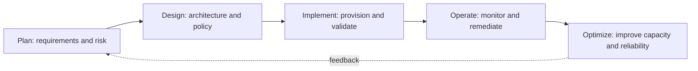
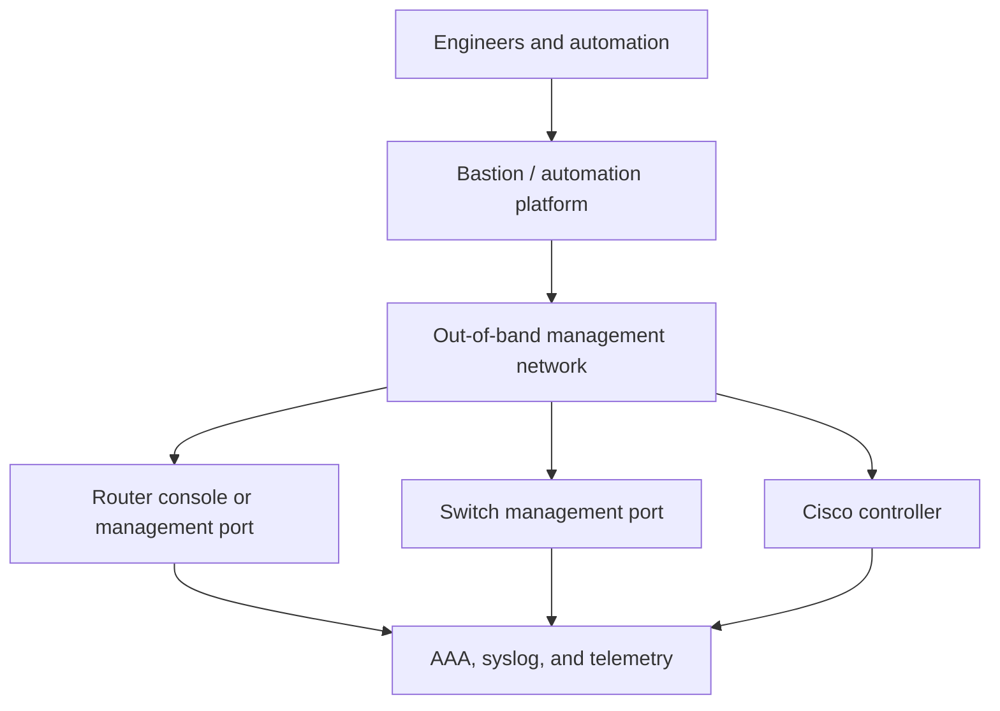
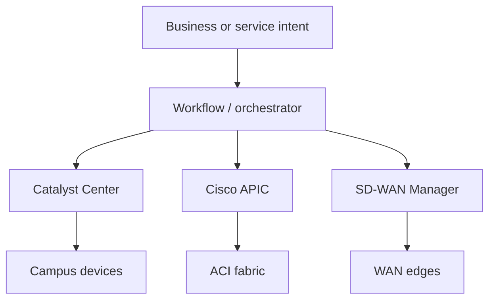
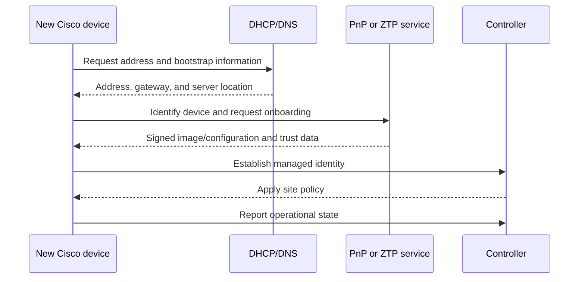
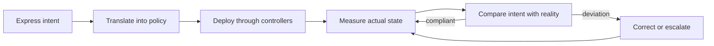

# Chapter 9: Infrastructure and Network Management

## Chapter Purpose

Infrastructure automation begins with a clear understanding of the network lifecycle. A script that changes a device is useful, but an operational system must also plan, validate, observe, secure, and eventually retire that device. This chapter connects traditional network management with zero-touch provisioning, controller-based networking, and intent-based operations.

## 1. The Infrastructure Lifecycle

Cisco's PDIOO model organizes work into **plan, design, implement, operate, and optimize**. Automation belongs in every phase, not only implementation.

Planning establishes business outcomes, compliance boundaries, address space, capacity, and ownership. Design converts those requirements into topology, routing, segmentation, management, and failure-domain decisions. Implementation should use repeatable templates and pre/post-change tests. Operations collects state, events, and performance data. Optimization turns that evidence into better policy, code, and architecture.

## 2. Management Planes and Access

The management plane carries administrative traffic such as SSH, NETCONF, RESTCONF, SNMP, telemetry, AAA, logging, and image transfer. It should be isolated from user traffic and protected by explicit policy.

An **out-of-band (OOB)** network remains reachable when the production data plane fails. An in-band management path is cheaper but shares fate with production. Mature designs often use both: in-band access for routine automation and OOB access for recovery. AAA should identify each operator or workload; shared accounts weaken auditability.

## 3. Provisioning Methods

Network provisioning evolved through several interfaces:

| Method | Strength | Limitation |
|---|---|---|
| Console/CLI | Universal troubleshooting access | Manual, text-oriented, difficult to scale |
| SSH scripting | Easy transition from CLI | Prompt and output parsing can be fragile |
| File transfer | Efficient for images and complete configurations | Coarse-grained and requires activation logic |
| SNMP | Broad monitoring and limited write support | Awkward for complex configuration transactions |
| NETCONF/RESTCONF | Structured, model-driven configuration | Requires YANG knowledge and platform support |
| Controller API | Network-wide policy and abstraction | Controller becomes an architectural dependency |

CLI automation remains useful, but structured APIs are safer because data has known types and hierarchy. Before a change, an automation workflow should retrieve current state, compute the difference, validate constraints, apply the smallest safe update, and verify the result.

## 4. Management Systems and Controllers

An element management system manages a product or technology domain. A controller maintains a broader model and translates policy into device behavior. Cisco Catalyst Center, Meraki Dashboard, Cisco ACI APIC, SD-WAN Manager, and NSO provide different scopes and abstractions.

Controllers reduce repeated device-by-device work, but automation still needs error handling, version awareness, authentication, rate-limit control, and reconciliation when actual state diverges from intended state.

## 5. Zero-Touch Provisioning

Zero-touch provisioning (ZTP) bootstraps a device without a technician entering its complete configuration. The device obtains basic connectivity, identifies a provisioning service, downloads trusted instructions or software, and registers with its controller.

Cisco Plug and Play can associate device identity with a site and configuration in Catalyst Center. Security is essential: validate server identity, protect enrollment tokens, restrict the bootstrap network, sign artifacts, and ensure a failed onboarding cannot leave a device broadly exposed.

## 6. SDN and Intent-Based Networking

Software-defined networking separates policy and control decisions from individual forwarding elements. This separation is logical rather than absolute: devices still run local protocols, but a controller supplies consistent network-wide policy.

Intent-based networking adds a closed loop:

For example, the intent “guest users may reach the internet but not corporate services” can become identity groups, segmentation, access policy, and continuous assurance tests. AI can help correlate anomalies or propose remediation, but policy limits, explainability, human approval, and deterministic rollback remain important when network reachability is at stake.

## 7. Operational Design

Infrastructure automation should be idempotent, observable, and reversible. Store intended state in version control, separate credentials from code, test against representative labs, limit blast radius, and record who changed what. A successful API response is not proof of a successful network outcome; verify routing, reachability, policy, and service health after deployment.

> **Study guide takeaway:** Modern network management moves from isolated commands toward lifecycle automation and closed-loop assurance. ZTP establishes devices, controllers translate policy, and telemetry confirms whether the network continues to satisfy intent.

## Chapter Summary

PDIOO gives infrastructure work a lifecycle. Secure management networks and structured APIs make operations safer and more scalable. ZTP reduces manual onboarding, while SDN and intent-based systems shift engineering toward network-wide policy, assurance, and controlled remediation.
