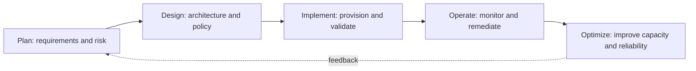
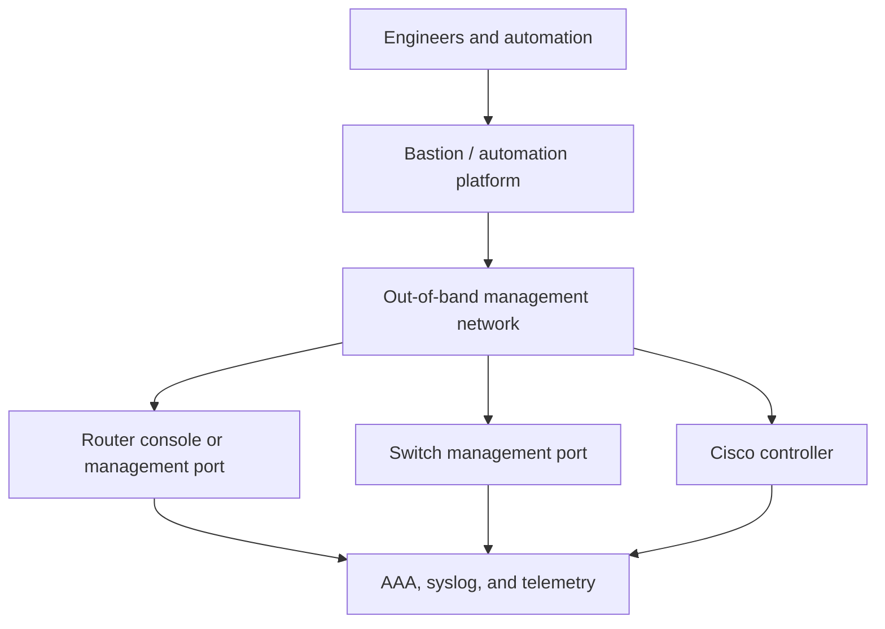
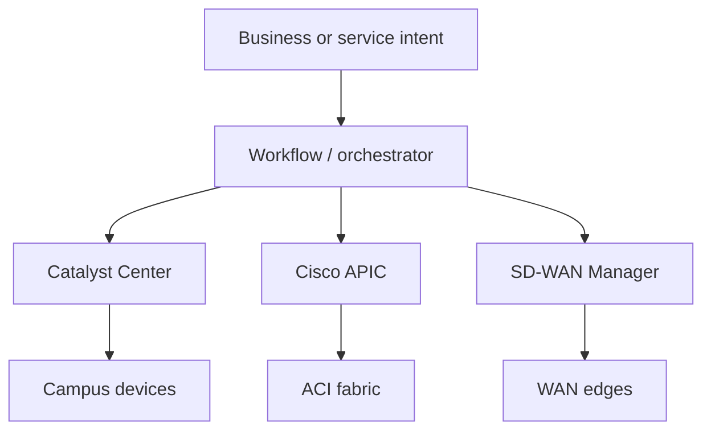
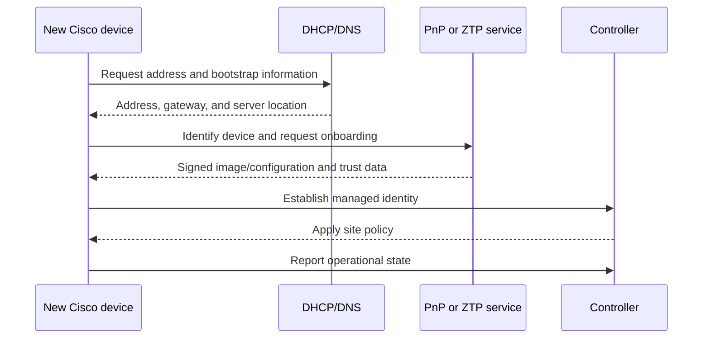
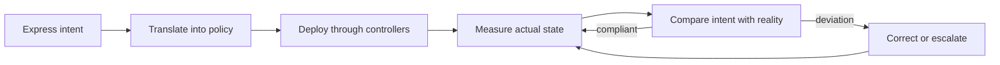
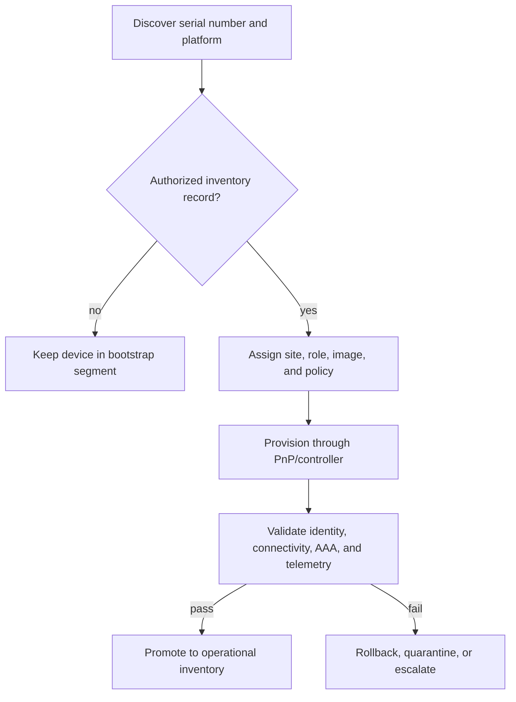
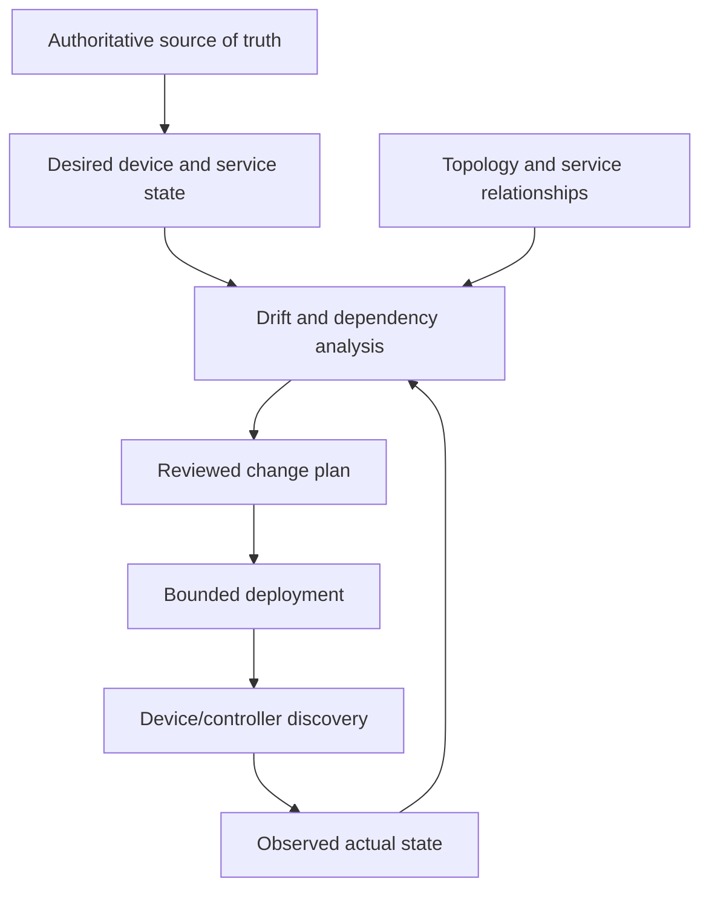

# Chapter 9: Network Infrastructure Management

## Chapter Introduction

Infrastructure automation begins with a clear understanding of the network lifecycle. A script that changes a device is useful, but an operational system must also plan, validate, observe, secure, and eventually retire that device. This chapter connects traditional network management with zero-touch provisioning, controller-based networking, and intent-based operations.

Consider a retailer preparing to open twenty branches in one month. Shipping configured switches from a central office may work for the first few sites, but it soon creates delays, inconsistent software, and difficult recovery when a device is replaced. A lifecycle-based approach instead records device identity before shipment, uses zero-touch onboarding, applies site policy through a controller, verifies service health, and retains a recovery path. That situation provides the practical thread for the management methods that follow.

## 1. The Infrastructure Lifecycle

Cisco's PDIOO model organizes work into **plan, design, implement, operate, and optimize**. Automation belongs in every phase, not only implementation.

Planning establishes business outcomes, compliance boundaries, address space, capacity, and ownership. Design converts those requirements into topology, routing, segmentation, management, and failure-domain decisions. Implementation should use repeatable templates and pre/post-change tests. Operations collects state, events, and performance data. Optimization turns that evidence into better policy, code, and architecture.

## 2. Management Planes and Access

The management plane carries administrative traffic such as SSH, NETCONF, RESTCONF, SNMP, telemetry, AAA, logging, and image transfer. It should be isolated from user traffic and protected by explicit policy.

An **out-of-band (OOB)** network remains reachable when the production data plane fails. An in-band management path is cheaper but shares fate with production. Mature designs often use both: in-band access for routine automation and OOB access for recovery. AAA should identify each operator or workload; shared accounts weaken auditability.

## 3. Provisioning Methods

Network provisioning evolved through several interfaces:

| Method | Strength | Limitation |
|---|---|---|
| Console/CLI | Universal troubleshooting access | Manual, text-oriented, difficult to scale |
| SSH scripting | Easy transition from CLI | Prompt and output parsing can be fragile |
| File transfer | Efficient for images and complete configurations | Coarse-grained and requires activation logic |
| SNMP | Broad monitoring and limited write support | Awkward for complex configuration transactions |
| NETCONF/RESTCONF | Structured, model-driven configuration | Requires YANG knowledge and platform support |
| Controller API | Network-wide policy and abstraction | Controller becomes an architectural dependency |

CLI automation remains useful, but structured APIs are safer because data has known types and hierarchy. Before a change, an automation workflow should retrieve current state, compute the difference, validate constraints, apply the smallest safe update, and verify the result.

## 4. Management Systems and Controllers

An element management system manages a product or technology domain. A controller maintains a broader model and translates policy into device behavior. Cisco Catalyst Center, Meraki Dashboard, Cisco ACI APIC, SD-WAN Manager, and NSO provide different scopes and abstractions.

Controllers reduce repeated device-by-device work, but automation still needs error handling, version awareness, authentication, rate-limit control, and reconciliation when actual state diverges from intended state.

## 5. Zero-Touch Provisioning

Zero-touch provisioning (ZTP) bootstraps a device without a technician entering its complete configuration. The device obtains basic connectivity, identifies a provisioning service, downloads trusted instructions or software, and registers with its controller.

Cisco Plug and Play can associate device identity with a site and configuration in Catalyst Center. Security is essential: validate server identity, protect enrollment tokens, restrict the bootstrap network, sign artifacts, and ensure a failed onboarding cannot leave a device broadly exposed.

## 6. SDN and Intent-Based Networking

Software-defined networking separates policy and control decisions from individual forwarding elements. This separation is logical rather than absolute: devices still run local protocols, but a controller supplies consistent network-wide policy.

Intent-based networking adds a closed loop:

For example, the intent “guest users may reach the internet but not corporate services” can become identity groups, segmentation, access policy, and continuous assurance tests. Any automated remediation must remain within policy limits, require appropriate approval, and support deterministic verification and rollback when network reachability is at stake.

## 7. Operational Design

Infrastructure automation should be idempotent, observable, and reversible. Store intended state in version control, separate credentials from code, test against representative labs, limit blast radius, and record who changed what. A successful API response is not proof of a successful network outcome; verify routing, reachability, policy, and service health after deployment.

## 8. Network Management as a Service Discipline

Network management is sometimes treated as a collection of tools, yet it is more useful to view it as the operating system for the infrastructure organization. Inventory establishes what exists and who owns it. Configuration management establishes what each component should look like. Fault and performance management reveal whether the infrastructure is healthy, while accounting and security controls explain who consumed resources and who was permitted to make changes. These functions are closely related. For instance, a high interface-error rate has little meaning if the monitoring platform cannot associate the interface with its circuit, site, business service, recent changes, and support owner.

Consequently, an automation project should not create another isolated database unless there is a clear synchronization model. Device identity, serial number, site, role, management address, software release, and lifecycle state normally have an authoritative source. The automation platform may cache this information for performance, but it should know which system owns each field. Otherwise, a device renamed in the inventory can remain under its old identity in monitoring, certificate management, and backup systems. This is a typical source of operational drift.

Frameworks such as ITIL, COBIT, and TOGAF approach governance from different perspectives, but they share a useful principle: technical activity should be connected to business value, risk, and accountability. Automation does not remove change management. Instead, it makes evidence collection and low-risk approval more efficient. A pull request can show the intended difference, policy tests can determine whether the change stays inside an approved boundary, and the deployment system can attach post-change validation automatically. Human review is then concentrated on exceptions and high-impact decisions.

## 9. Engineering a Safe Provisioning Workflow

Consider onboarding a new access switch at a branch office. Planning determines the site profile, port count, uplink capacity, segmentation requirements, and support model. Design assigns the switch role, address pool, software train, routing behavior, wireless or phone dependencies, and management policy. ZTP then supplies only enough initial information for the switch to authenticate and reach the controller. The controller should derive the production configuration from site and role data rather than accept an arbitrary configuration uploaded by an installer.

After provisioning, the workflow must validate more than configuration presence. It should confirm that the device has the expected image and license state, synchronized time, trusted certificates, redundant uplinks, routing adjacencies, controller reachability, AAA, syslog, telemetry, and configuration archive. A switch that received its VLANs but failed to establish AAA or monitoring is not fully onboarded. The workflow should mark it as incomplete and avoid presenting it as production-ready.

Decommissioning deserves the same discipline. Before removing a device, verify that services have migrated, revoke device certificates and tokens, remove it from controller and monitoring inventories, release addresses and licenses, archive required records, and erase sensitive configuration. An asset that disappears physically but remains trusted logically creates unnecessary attack surface.

## 10. Availability, Failure Domains, and Recovery

Management infrastructure is itself production infrastructure. A centralized controller simplifies policy, but its failure should not immediately stop packet forwarding. Cisco devices normally retain locally programmed state while the control or management system is unavailable; however, new provisioning, assurance, and policy changes may be impaired. Engineers must understand this distinction between data-plane continuity and management-plane availability.

Design controller clusters, collectors, DNS, NTP, PKI, identity services, repositories, and OOB access according to their failure domains. Placing two controller nodes in the same rack or attaching every OOB console server to one upstream switch creates apparent redundancy without independent failure protection. Backups are valuable only when restoration is tested and the team knows which runtime data, certificates, keys, and external integrations are required.

Finally, recovery procedures should assume that automation may be unavailable during the incident. Maintain a small, tightly controlled break-glass method, record its use, and reconcile any emergency changes back into the source of truth afterward. This prevents a recovery action from becoming permanent undocumented drift.

## 11. Traditional Management Protocols in a Modern Design

Modern automation does not make every traditional protocol obsolete. Instead, engineers should understand what each protocol can reliably contribute. SNMP remains widely deployed for inventory, interface counters, environmental measurements, and fault notifications. SNMPv1 and SNMPv2c rely on community strings and provide weak protection; where SNMP remains necessary, SNMPv3 should be preferred because it can provide user-based authentication, integrity, and privacy. Even with SNMPv3, access should be limited to required views and protected by management-plane policy. A monitoring identity that only reads interface and environmental data should not have configuration write access.

Syslog provides event-oriented messages and is invaluable when a device explains why its state changed. However, messages vary by platform and software release, and UDP delivery can lose events. Central collectors should use reliable transport where supported, normalize timestamps, preserve the original message, and enrich it with device and site context. Network time synchronization is essential because routing events, controller tasks, authentication logs, and application failures cannot be correlated accurately when clocks disagree.

Configuration archive and file-transfer mechanisms continue to play a role. SCP or SFTP can move approved software images and configuration snapshots securely, while TFTP may still appear during constrained bootstrap processes. If an insecure bootstrap protocol is unavoidable, isolate it to a restricted provisioning segment, validate the downloaded artifact cryptographically, and remove the temporary access after onboarding. The security of a deployment does not depend only on transport encryption; it also depends on proving that the artifact is authentic and intended for that device.

NETCONF, RESTCONF, and controller APIs are generally preferable for automation because they provide structured data and explicit errors. Nevertheless, a mature platform often uses several interfaces together. A controller API may provision policy, streaming telemetry may provide high-frequency performance, syslog may explain discrete faults, and CLI access may remain the final diagnostic path. The design objective is not protocol purity but clearly assigned responsibility and consistent identity, logging, and authorization.

## 12. Inventory, Topology, and Source-of-Truth Design

An inventory is more than a spreadsheet of management addresses. It should represent lifecycle state, ownership, site, role, platform, serial number, software version, controller membership, management method, and business-service relationships. Dynamic facts discovered from devices should be distinguished from authoritative intent. For example, the desired software release may come from policy, while the currently running release comes from discovery. Storing both allows the automation system to calculate drift.

Topology adds relationships. A switch uplink connects to a particular neighbor and circuit; a WAN edge participates in a site and VPN; an ACI endpoint group depends on a bridge domain, VRF, and contracts. Automation that ignores these relationships can make locally valid but globally harmful changes. Removing a prefix list because it appears unused on one router may disrupt another path whose dependency is visible only in the topology or service model.

When several systems maintain inventory, define synchronization and conflict behavior. A CMDB may own business-service and support information, IPAM may own addresses and prefixes, Catalyst Center may own campus-device state, and an automation repository may own templates. The orchestration layer should reference these authoritative systems rather than silently becoming a competing source. Correlation identifiers and stable object IDs are safer than matching by display names.

## 13. Assurance and Intent Verification

Intent-based networking depends on assurance. Translation converts business intent into technical policy, but assurance determines whether the deployed network delivers the intended experience. Verification therefore operates at several levels. Configuration verification confirms that the controller or device contains expected state. Control-plane verification examines routing adjacencies, endpoint learning, fabric health, and policy programming. Data-plane verification tests reachability, path, loss, and latency. Service verification confirms that the user-facing application or communication flow works.

Suppose an automation workflow creates a new branch segment. The API may return success and the VLAN may appear in configuration, yet DHCP can fail because the relay address is absent. Even if the client receives an address, DNS or security policy may block the required application. A complete acceptance test follows the dependency chain from endpoint onboarding through addressing, name resolution, routing, segmentation, and application reachability.

Assurance systems can use statistical baselines to identify unusual conditions, but an anomaly is not automatically a fault. A planned backup can produce atypical utilization, and a new site naturally differs from an established baseline. Operational context, maintenance windows, topology, and recent changes help separate expected variation from genuine degradation. Automated remediation should require high-confidence evidence and a narrow, preapproved action.

## 14. Infrastructure Lifecycle Scenario

Consider a retailer opening fifty branches. The planning phase defines a standard service catalog, capacity tiers, security zones, carrier options, and recovery objectives. Design produces repeatable site profiles, address allocation rules, wireless policy, SD-WAN segmentation, management access, and telemetry requirements. Procurement records serial numbers and intended sites before equipment ships.

At each branch, ZTP gives the WAN edge and access switches enough connectivity to reach trusted Cisco controllers. Device identity is verified against inventory, approved software is installed, and site policy is rendered from the standard profile plus local variables. Deployment proceeds in dependency order: underlay connectivity, controller registration, overlays and segmentation, access policy, wireless, and local services. Each phase has acceptance criteria and produces evidence.

Operations then watches service health rather than merely device uptime. Telemetry and assurance identify circuit quality, client onboarding failures, policy violations, and configuration drift. Repeated incidents become optimization input. If stores frequently exhaust wireless capacity during seasonal peaks, the design and capacity tier are revised. Finally, decommissioning revokes device identity, archives required records, releases licenses and addresses, and removes obsolete monitoring. In this way, automation supports the complete lifecycle rather than only initial configuration.

> **Study guide takeaway:** Modern network management moves from isolated commands toward lifecycle automation and closed-loop assurance. ZTP establishes devices, controllers translate policy, and telemetry confirms whether the network continues to satisfy intent.

## Key Takeaways

- PDIOO organizes infrastructure planning, design, implementation, operation, optimization, and eventual retirement.
- Secure management planes, authoritative inventory, structured APIs, and tested recovery improve operational control.
- ZTP, SDN, intent-based networking, and assurance enable scalable onboarding and policy-driven remediation.

Chapter 10 builds on this managed infrastructure by turning repeatable operational intent into reliable network automation workflows.

## Further Reading and References

- [Cisco Catalyst Center documentation](https://www.cisco.com/c/en/us/support/cloud-systems-management/dna-center/series.html) - campus management, automation, and assurance.
- [Cisco DevNet network programmability resources](https://developer.cisco.com/site/networking/) - Cisco networking APIs and learning material.
- [NETCONF - RFC 6241](https://www.rfc-editor.org/rfc/rfc6241) - model-driven configuration protocol.

**Next chapter:** [Chapter 10: Network Automation and Orchestration](Chapter10.md)
