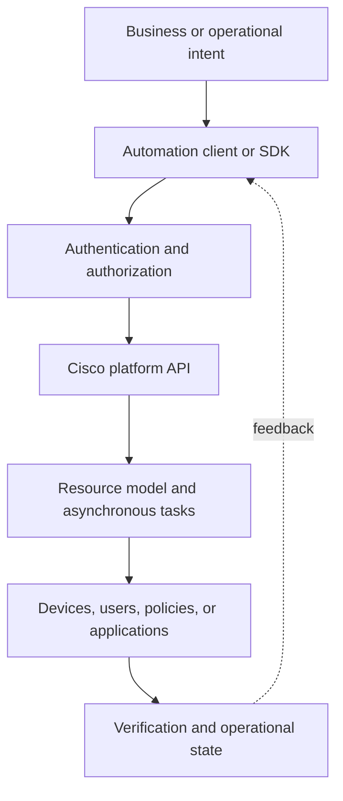
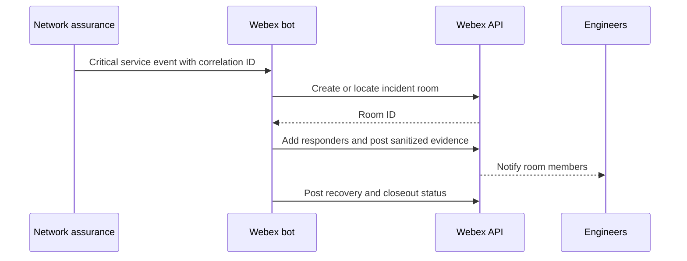
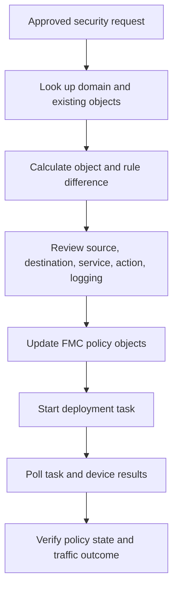
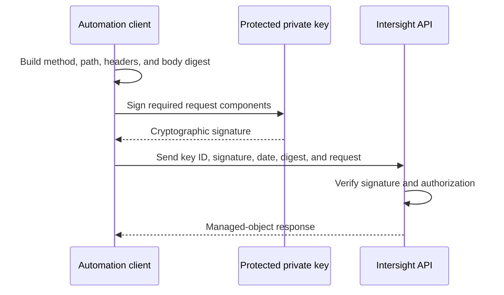
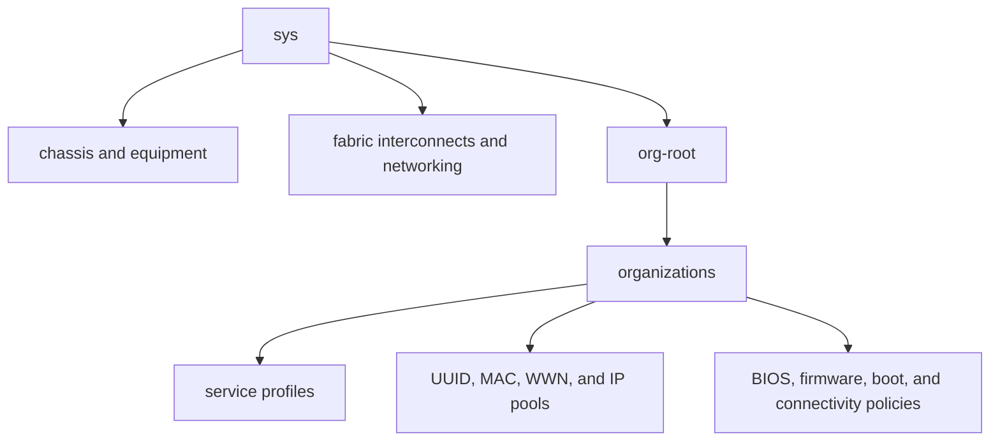
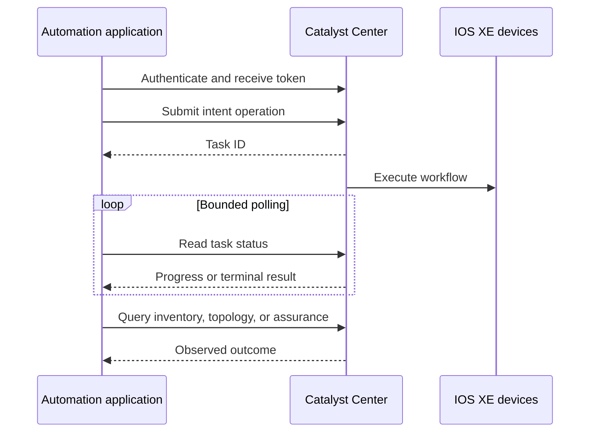
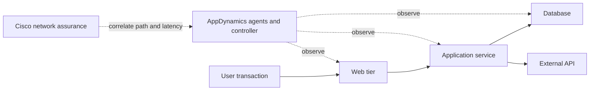
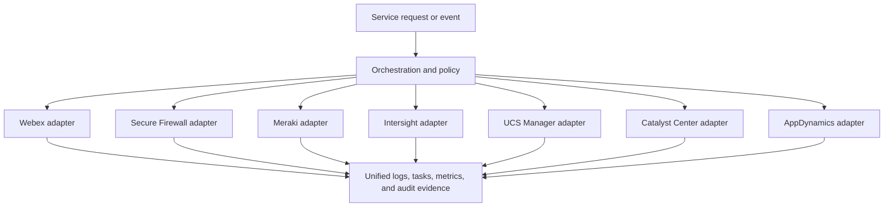
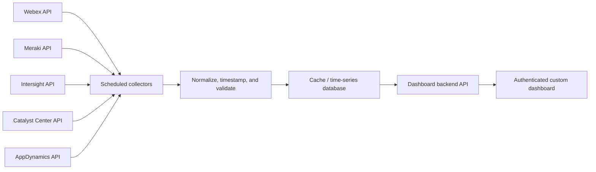

# Chapter 16: Cisco Platform APIs

## Chapter Introduction

Cisco platforms expose programmability in different ways because they solve different operational problems. Webex provides cloud collaboration APIs; Cisco Secure Firewall Management Center controls security policy; Meraki Dashboard manages cloud-operated networks; Intersight manages computing and infrastructure services; UCS Manager exposes a hierarchical managed-object model; Cisco Catalyst Center automates campus networks; and AppDynamics provides application-performance observability.

Although the resource models differ, the engineering method remains consistent. An application must authenticate safely, understand the API contract, select the correct resource, handle pagination and asynchronous tasks, interpret errors, respect rate limits, and verify that the requested business outcome occurred. This chapter develops that method through Cisco-oriented workflows and Python examples.

An enterprise operations portal illustrates the value of that common method. It might open a Webex incident room, inspect a Meraki branch, retrieve wireless health from Catalyst Center, check an AppDynamics transaction, and display compute inventory from Intersight. Although each call has different authentication and data, the portal still needs consistent timeout, error, audit, and verification behavior.

Product names and interfaces also evolve. Cisco DNA Center is now commonly presented as Cisco Catalyst Center, while Firepower Management Center belongs to the Cisco Secure Firewall portfolio. Nevertheless, an API or SDK may retain an earlier name, so learners should always compare the example with documentation for the deployed release.

## 1. A Common Model for Cisco Platform APIs

Before examining individual products, it helps to establish a common mental model. Most controller workflows can be understood through five layers, beginning with operational intent and ending with observed state:



Authentication proves or establishes identity. Authorization determines which resources and operations that identity may use. The API then maps HTTP requests or XML operations to a platform-specific resource model. Many controllers return a task identifier before work completes, so the client must poll or subscribe for completion. Finally, the application reads operational state rather than treating an accepted request as proof of success.

### 1.1 Choosing Direct REST, an SDK, or an Automation Tool

Direct API calls provide visibility into headers, URIs, payloads, and status codes. They are valuable when learning a platform, troubleshooting, or using an endpoint not yet wrapped by an SDK. An SDK reduces repeated work such as authentication, pagination, object serialization, and endpoint construction. Ansible collections and Terraform providers add declarative or workflow-oriented abstraction for infrastructure teams.

The highest abstraction is not automatically best. A rapidly changing endpoint may be available through REST before an SDK release. Conversely, implementing request signing manually for every Intersight call is unnecessary when an official or established SDK performs it correctly. A production design should choose the narrowest maintained interface that exposes the required capability and provides predictable error behavior.

### 1.2 A Reusable HTTP Client Pattern

```python
import os
import random
import time
import requests

class CiscoApiClient:
    def __init__(self, base_url, headers, ca_bundle=True):
        self.base_url = base_url.rstrip("/")
        self.session = requests.Session()
        self.session.headers.update(headers)
        self.session.verify = ca_bundle

    def request(self, method, path, *, retry_safe=False, **kwargs):
        attempts = 5 if retry_safe else 1
        for attempt in range(attempts):
            response = self.session.request(
                method,
                f"{self.base_url}{path}",
                timeout=(3.05, 30),
                **kwargs,
            )
            if response.status_code not in {429, 502, 503, 504}:
                response.raise_for_status()
                return response

            if attempt + 1 == attempts:
                response.raise_for_status()
            retry_after = response.headers.get("Retry-After")
            delay = float(retry_after) if retry_after else min(2 ** attempt, 20)
            time.sleep(delay + random.uniform(0, 0.5))
```

Retry only operations known to be safe. A `GET` can usually be repeated. A `POST` that creates a room, deploys policy, or starts discovery may duplicate work unless the platform supports an idempotency mechanism or the client first checks for an existing task.

## 2. Webex Platform

Webex combines messaging, meetings, calling, events, devices, and administration. Its APIs support bots, integrations, embedded applications, administrative workflows, and notifications. A network operations team might use a bot to open an incident room, invite responders, post controller evidence, and update the room when service recovers.

### 2.1 Identity and Application Types

Webex API requests normally use bearer authentication:

```http
Authorization: Bearer ACCESS_TOKEN
```

A personal access token is convenient for short developer tests but is time-limited and tied to a person. A bot token represents a bot identity and should be stored as a secret. An OAuth integration obtains user-authorized access with defined scopes and is better for multi-user applications. Guest issuer applications serve specialized embedded experiences. Production applications should request only the scopes they need and implement token refresh or reauthorization behavior appropriate to their application type.

### 2.2 Rooms, Messages, Memberships, and Pagination

```python
import os
import requests

token = os.environ["WEBEX_ACCESS_TOKEN"]
session = requests.Session()
session.headers.update({"Authorization": f"Bearer {token}"})

response = session.get(
    "https://webexapis.com/v1/rooms",
    params={"type": "group", "max": 100},
    timeout=20,
)
response.raise_for_status()

for room in response.json().get("items", []):
    print(room["id"], room["title"])
```

Webex collections may paginate through links in HTTP headers. An application must follow the documented next link instead of assuming that the first successful response contains every room or message. Resource IDs should be treated as opaque strings; do not derive identity from a room title or email display value.

To post an incident message, the client sends a `POST` to the messages resource with a room ID and Markdown or text content. Validate user-supplied content and avoid posting secrets, complete configurations, or tokens into collaboration rooms. Sensitive diagnostic artifacts should be stored in an approved repository with a controlled link.



### 2.3 Webhooks and Bots

Polling for every new message is inefficient. A webhook asks Webex to deliver an HTTPS request when a selected resource event occurs. The receiving endpoint must be publicly reachable as required, validate that notifications are legitimate, respond quickly, and place longer processing on a queue. Webhooks can be duplicated or arrive out of order, so handlers should be idempotent and retrieve authoritative resource state when necessary.

## 3. Cisco Secure Firewall Management Center

Cisco Secure Firewall Threat Defense devices enforce security policy, while Firewall Management Center (FMC) provides centralized policy, object, deployment, event, and device management. The FMC API allows automation to create network objects, update access-control rules, inspect managed devices, and deploy approved policy.

### 3.1 Authentication and Domains

FMC authentication commonly starts with a request to the platform token-generation endpoint using approved credentials. The response supplies access and refresh tokens in headers. API clients must preserve the domain UUID and use the correct domain in resource paths. Tokens should never be printed in diagnostic output.

```python
import os
import requests

fmc = os.environ["FMC_URL"].rstrip("/")
response = requests.post(
    f"{fmc}/api/fmc_platform/v1/auth/generatetoken",
    auth=(os.environ["FMC_USER"], os.environ["FMC_PASSWORD"]),
    headers={"Accept": "application/json"},
    timeout=20,
)
response.raise_for_status()

access_token = response.headers["X-auth-access-token"]
domain_uuid = response.headers["DOMAIN_UUID"]
headers = {"X-auth-access-token": access_token, "Accept": "application/json"}
```

Exact header capitalization and token behavior can vary by release and client library, so inspect the deployed FMC API Explorer. Reuse sessions carefully because a platform can limit concurrent sessions for the same identity. Dedicated automation accounts improve attribution and reduce interference with interactive administrators.

### 3.2 Object and Policy Workflow

Security automation should reference reusable objects rather than embed address literals repeatedly. A workflow can check whether a host or network object exists, compare its value, create or update it, attach it to a narrowly scoped access rule, and then deploy policy to selected devices.



A successful policy-object update does not mean the change has reached a firewall. Deployment is a separate, potentially asynchronous operation. The client should identify which managed devices require deployment, present the pending changes, initiate deployment within policy, poll status, and inspect per-device failure detail. Afterward, verify the intended flow and confirm that unrelated traffic remains protected.

Pagination and expanded-object query options affect FMC results. Handle collection metadata and do not assume names are globally unique across domains or object types. Security changes should use least privilege, peer review, and a rollback or compensating plan because an overly broad rule can create immediate exposure.

## 4. Cisco Meraki Dashboard

The Meraki Dashboard provides cloud management for wireless, switching, security appliances, cameras, sensors, cellular gateways, and systems management. The Dashboard API uses a resource hierarchy centered on organizations and networks. Organizations contain administrators, inventory, licenses, and networks; networks contain devices, clients, configuration, and events.

### 4.1 Authentication, Organizations, and Networks

Dashboard API access commonly uses an API key in the documented authorization header. Modern environments may also use OAuth where supported. Keys are powerful secrets and should be restricted, rotated, and stored outside code. The calling administrator's Dashboard permissions determine accessible organizations and operations.

```python
import os
import requests

session = requests.Session()
session.headers.update({
    "Authorization": f"Bearer {os.environ['MERAKI_DASHBOARD_API_KEY']}",
    "Accept": "application/json",
})

r = session.get(
    "https://api.meraki.com/api/v1/organizations",
    timeout=20,
)
r.raise_for_status()
for organization in r.json():
    print(organization["id"], organization["name"])
```

Always verify the currently documented authentication form for the API generation and environment. Avoid placing keys in URLs, shell history, notebooks, or screenshots.

### 4.2 Meraki Python SDK

The Dashboard API Python SDK wraps endpoint construction, pagination, logging, and retry behavior. Method families generally follow the resource hierarchy, such as organization or network operations.

```python
import os
import meraki

dashboard = meraki.DashboardAPI(
    api_key=os.environ["MERAKI_DASHBOARD_API_KEY"],
    output_log=False,
    print_console=False,
    suppress_logging=True,
)

organization_id = os.environ["MERAKI_ORG_ID"]
devices = dashboard.organizations.getOrganizationDevices(
    organization_id,
    total_pages="all",
)

for device in devices:
    print(device.get("serial"), device.get("model"), device.get("networkId"))
```

Meraki enforces rate limits to protect the cloud service. Use SDK retry features or honor HTTP 429 and `Retry-After`. Spread bulk work, filter server-side, and avoid repeatedly retrieving entire organizations. A workflow that updates many networks should use bounded concurrency and record each network result so it can resume without repeating successful changes.

### 4.3 Action Batches and Webhooks

Action batches combine supported operations and can execute synchronously or asynchronously. They improve efficiency but do not remove the need to inspect individual action results. Validate every target before submission, keep batches within documented limits, and poll asynchronous batches to a terminal state.

Meraki webhooks and alerting integrations can drive event-based workflows. For example, an appliance connectivity alert can open a ticket, enrich it with organization and network information, and notify a Webex room. The handler should correlate repeated alerts and avoid launching remediation when Dashboard itself is reporting a broader service condition.

## 5. Cisco Intersight

Cisco Intersight is a cloud operations platform for compute, virtualization, infrastructure services, and lifecycle management. It manages claimed targets through device connectors and represents resources as managed objects with globally unique identifiers, references, tags, and organization relationships.

### 5.1 Claiming and Resource Identity

A target must establish trust with Intersight before it can be managed. Device claiming associates a device identifier and claim code with an Intersight account. The connector then maintains secure communication to the service. Automation should treat claim codes as temporary secrets and verify that the target appears in the expected account and organization.

Intersight object references commonly use a `Moid` rather than a display name. Names can be duplicated or changed; the Moid is the stable resource identifier. An application often queries a collection using an OData-style filter, retrieves the intended object's Moid, and uses it in a policy or profile reference.

### 5.2 API-Key Request Signing

Intersight API authentication uses an API key identifier and corresponding private key to sign requests. This is different from sending a reusable bearer token in every request. The signature covers request elements so the service can verify identity and integrity. Protect the private key with strict file permissions or a secret-signing service, and rotate it according to policy.



Because signing details and supported signature versions evolve, use the supported Intersight SDK where possible rather than creating a custom signer from memory.

### 5.3 SDKs, Ansible, and Terraform

Intersight can be integrated through REST, Python and PowerShell tooling, Ansible modules, and Terraform providers. SDK clients can filter, sort, and paginate managed-object collections. Ansible is useful for procedural workflows and configuration across adjacent systems. Terraform is useful when policies and profiles have a declarative lifecycle and state ownership is clear.

A server-profile workflow typically resolves organization and policy Moids, constructs the profile references, creates or updates the profile, deploys it to an assigned server, follows the workflow status, and validates resulting hardware or operating state. Profiles can have many dependencies, so deletion or replacement must be reviewed for downstream impact.

## 6. Cisco UCS Manager

UCS Manager provides embedded management for Cisco Unified Computing System domains. Its model is a hierarchical tree of managed objects. Organizations, service profiles, pools, policies, equipment, faults, and operational state are represented by distinguished names (DNs) and class identifiers.

### 6.1 XML API and Managed Objects

The UCS Manager API is XML-based. Operations such as authentication, class queries, DN queries, and configuration changes are expressed as XML documents sent to the API endpoint. A login returns a session cookie that subsequent requests include until logout or expiration.

```xml
<aaaLogin inName="automation" inPassword="REDACTED"/>
```

A class query returns all managed objects of a selected class, optionally filtered. A DN query retrieves a specific location in the object tree. Configuration operations can include one or more managed objects beneath a configuration container. The returned XML should be parsed with a safe XML parser, not searched with regular expressions.



Understanding the tree is essential because the same class may appear under different organizations and inherit policy through its location. The DN is both an identifier and a path through the managed-object hierarchy.

### 6.2 SDK and PowerTool Use

Cisco UCS Python SDK (`ucsmsdk`) represents managed objects as Python objects and handles XML exchange and session cookies. Cisco UCS PowerTool offers PowerShell cmdlets with filtering and pipeline integration. These tools are preferable to constructing XML manually for complex changes, but engineers should still understand the underlying model and inspect the generated difference.

Service-profile automation can allocate identities from pools, bind templates, associate a profile with a server, and monitor finite-state-machine progress. The association operation is asynchronous and can fail because of inventory, firmware, connectivity, or policy dependencies. Poll the relevant operational state and fault objects rather than assuming that the requested association succeeded.

## 7. Cisco Catalyst Center

Cisco Catalyst Center, formerly Cisco DNA Center, provides campus automation, assurance, inventory, software-image management, topology, policy, discovery, Plug and Play, and software-defined access workflows. Its Intent APIs expose high-level network operations and reduce the need to manage each IOS XE device independently.

### 7.1 Token Authentication

A client first exchanges approved credentials for a token at the authentication endpoint. Subsequent requests carry the token in the platform's documented header, commonly `X-Auth-Token`. The token has a lifetime and should be cached securely rather than regenerated for every call.

```python
import os
import requests

base = os.environ["CATALYST_CENTER_URL"].rstrip("/")
token_response = requests.post(
    f"{base}/dna/system/api/v1/auth/token",
    auth=(os.environ["CC_USER"], os.environ["CC_PASSWORD"]),
    timeout=20,
)
token_response.raise_for_status()
token = token_response.json()["Token"]

devices_response = requests.get(
    f"{base}/dna/intent/api/v1/network-device",
    headers={"X-Auth-Token": token, "Accept": "application/json"},
    params={"family": "Switches and Hubs"},
    timeout=30,
)
devices_response.raise_for_status()
devices = devices_response.json().get("response", [])
```

Use enterprise CA validation. Disabling TLS verification hides certificate and identity problems that will eventually become operational or security incidents.

### 7.2 Intent APIs and Tasks

Catalyst Center operations frequently return a task or execution identifier. Discovery, provisioning, command execution, software distribution, and path-trace operations may continue after the initial request. Poll the task endpoint, recognize error details, and then read inventory or assurance state for independent verification.



Task success may precede convergence in another API view. Define a verification window and avoid immediate false failures. For broad changes, filter by site and role, deploy to a canary device or site, and maintain a correlation between the business request, Catalyst Center task ID, and affected devices.

### 7.3 SDK and Platform Workflows

The community-supported `dnacentersdk` maps API families into Python methods and helps with object access and endpoint construction. As with any SDK, pin a tested version and verify compatibility with the Catalyst Center release. The API may expose features before the SDK does, so a project can combine SDK calls with direct REST behind one internal adapter.

Useful workflows include inventory reconciliation, compliance reporting, software-image readiness, client-health investigation, Plug and Play onboarding, command-runner diagnostics, and path trace. Command Runner is valuable for gaps but should not become a substitute for structured intent APIs. Limit commands, sanitize output, and account for asynchronous execution and device support.

## 8. Cisco AppDynamics

AppDynamics observes application transactions, services, databases, infrastructure, and end-user experience. It connects technical behavior to business transactions, helping teams determine whether network symptoms are causing application impact or whether the fault lies in code, dependencies, or capacity.

### 8.1 Application Model and Observability

Applications contain tiers and nodes. Business transactions represent important request paths. Metrics, snapshots, health rules, policies, actions, and events help operators move from symptom to cause. An API integration can retrieve health-rule violations, metric data, application identifiers, or event details and correlate them with network telemetry and recent changes.



### 8.2 Authentication and API Use

AppDynamics deployments and editions can provide basic credentials, account-qualified identities, API clients, client secrets, and short-lived access tokens. A common secure pattern creates an API client with roles, exchanges the client ID and secret for a temporary token, and uses the bearer token for subsequent calls. The long-lived secret belongs in a secret manager; the short-lived token remains in memory and is refreshed before expiry.

The API can return JSON or XML depending on endpoint and output parameter. Always request and parse the documented representation rather than assuming every endpoint has the same default. Metric paths and time ranges must be URL encoded correctly, and large queries should be bounded to avoid controller load.

```python
import os
import requests

controller = os.environ["APPD_CONTROLLER_URL"].rstrip("/")
params = {
    "metric-path": "Overall Application Performance|Calls per Minute",
    "time-range-type": "BEFORE_NOW",
    "duration-in-mins": 30,
    "rollup": "true",
    "output": "JSON",
}

r = requests.get(
    f"{controller}/controller/rest/applications/{os.environ['APPD_APP_ID']}/metric-data",
    params=params,
    headers={"Authorization": f"Bearer {os.environ['APPD_ACCESS_TOKEN']}"},
    timeout=30,
)
r.raise_for_status()
metric_data = r.json()
```

### 8.3 Correlating Application and Network Evidence

An application slowdown can result from code regression, database saturation, downstream API failure, packet loss, DNS delay, or path change. AppDynamics provides transaction and dependency evidence; Catalyst Center, Meraki, SD-WAN, or telemetry platforms provide network context. Correlation should use time, site, application, endpoint, and change identifiers.

An automated workflow can receive an AppDynamics health-rule event, identify affected tiers and user locations, query network assurance for those sites, retrieve recent controller changes, and post a summarized incident to Webex. The workflow should preserve source evidence and distinguish observed facts from inferred diagnosis.

## 9. Cross-Platform Automation Architecture

The seven platforms should not be connected through a fragile chain of ad hoc scripts. A service layer can expose stable business operations, while platform adapters handle authentication, API versions, schemas, tasks, and errors.



Each adapter should return normalized outcomes such as success, retryable failure, invalid request, authorization failure, partial completion, or asynchronous task. Preserve platform-specific details for troubleshooting. A correlation ID should appear in logs across the workflow, while secrets and sensitive payloads are redacted.

## 10. Security, Reliability, and Testing

Use a separate least-privilege identity for each platform and environment. Store API keys, private keys, client secrets, and passwords in a managed secret service. Rotate credentials, monitor expiry, and avoid sharing one administrator account between humans and automation. Validate TLS server identity and protect webhook endpoints with verification, replay protection, and rate limits.

Contract tests should run against sandboxes or representative labs to detect API and SDK changes. Unit tests can mock platform responses, but integration tests should cover token expiry, pagination, rate limiting, asynchronous failure, empty collections, malformed bodies, and partial deployment. Record sanitized response fixtures for difficult cases and update them when platform versions change.

Observability should measure request latency, success rate, retry count, rate-limit responses, authentication failures, task duration, and verification failure by platform and operation. A controller returning HTTP success while downstream tasks repeatedly fail is not healthy automation. Circuit breakers can temporarily stop calls to a degraded platform and prevent a workflow from amplifying an outage.

## 11. Testing a Webex Chatbot with API Requests

A bot test should verify identity, room access, message creation, and response handling. Create or identify a test room, add the bot, and store its token in a secret environment variable. The script below lists memberships indirectly by locating the room and posts a controlled test message.

```python
import os
import requests

session = requests.Session()
session.headers.update({
    "Authorization": f"Bearer {os.environ['WEBEX_BOT_TOKEN']}",
    "Content-Type": "application/json",
})

me = session.get("https://webexapis.com/v1/people/me", timeout=15)
me.raise_for_status()
print("Testing bot:", me.json()["displayName"])

message = session.post(
    "https://webexapis.com/v1/messages",
    json={
        "roomId": os.environ["WEBEX_TEST_ROOM_ID"],
        "markdown": "**DevNet test:** the automation bot can reach this room.",
    },
    timeout=15,
)
message.raise_for_status()
print("Created message:", message.json()["id"])
```

An interactive chatbot also requires a webhook for new-message events. Ignore messages created by the bot itself to prevent a response loop, retrieve the message details using its ID, authorize the requested operation, and respond quickly while longer work runs asynchronously.

## 12. Building an FDM Access-Policy Request

Firewall Device Manager (FDM) provides a device-local REST API for supported Secure Firewall Threat Defense deployments. This differs from the FMC API used for centrally managed devices. A common workflow authenticates to FDM, discovers API and object versions, resolves the access-policy ID, creates network and port objects where needed, and inserts an access rule. To allow traffic to exit the firewall, the rule usually needs corresponding routing and NAT; an access rule alone does not create a usable outbound path.

```python
import os
import requests

base = os.environ["FDM_URL"].rstrip("/")
login = requests.post(
    f"{base}/api/fdm/latest/fdm/token",
    json={
        "grant_type": "password",
        "username": os.environ["FDM_USER"],
        "password": os.environ["FDM_PASSWORD"],
    },
    timeout=20,
)
login.raise_for_status()
token = login.json()["access_token"]
headers = {"Authorization": f"Bearer {token}", "Accept": "application/json"}

policies = requests.get(
    f"{base}/api/fdm/latest/policy/accesspolicies",
    headers=headers,
    timeout=20,
)
policies.raise_for_status()
for policy in policies.json().get("items", []):
    print(policy["id"], policy["name"])
```

When creating the rule, use references returned by FDM for source/destination networks, zones, and ports instead of inventing IDs. Set the action explicitly, enable logging according to policy, place the rule at the intended order, deploy pending changes, and verify both an allowed flow and a flow that should remain denied. For inbound access, limit destination and service precisely and confirm any static NAT requirement. Because endpoint schemas differ among FDM releases, build the final rule body from the live API Explorer for the deployed version.

## 13. Meraki Task Workflow

Meraki tasks should begin by resolving organization and network IDs. The following SDK workflow inventories networks and retrieves wireless SSIDs only for wireless-capable networks. It handles pagination through the SDK and keeps identifiers rather than names as resource keys.

```python
import os
import meraki

dashboard = meraki.DashboardAPI(
    os.environ["MERAKI_DASHBOARD_API_KEY"],
    suppress_logging=True,
)
org_id = os.environ["MERAKI_ORG_ID"]

for network in dashboard.organizations.getOrganizationNetworks(
    org_id, total_pages="all"
):
    if "wireless" not in network.get("productTypes", []):
        continue
    ssids = dashboard.wireless.getNetworkWirelessSsids(network["id"])
    enabled = [ssid["name"] for ssid in ssids if ssid.get("enabled")]
    print(network["name"], enabled)
```

A configuration task should read current state, calculate the intended difference, update only the selected networks, honor rate limits, and verify the result. For large changes, use action batches where supported and inspect every action result.

## 14. Intersight Data Retrieval

Intersight queries commonly use OData filters and return managed objects identified by Moid. With an authenticated SDK client, retrieve a narrow collection rather than downloading every object and filtering locally. A server inventory workflow might filter compute blades by serial number, name, or management mode and then follow references to profiles and organizations. Preserve the Moid in internal state because display names can change.

```python
# The configured SDK client signs requests with the API key and private key.
from intersight.api import compute_blades_api

def list_blades(api_client, serial=None):
    api = compute_blades_api.ComputeBladesApi(api_client)
    query = f"Serial eq '{serial}'" if serial else None
    result = api.get_compute_blade_list(filter=query, top=100)
    return [
        {"moid": blade.moid, "name": blade.name, "serial": blade.serial}
        for blade in result.results
    ]
```

SDK class names can change between generated versions, so pin the tested package and verify it against the Intersight OpenAPI release. Never place the private key in the script or repository.

## 15. Provisioning an Australian UCS Server from a Template

Assume a UCS service-profile template already defines the approved Australian server configuration: firmware policy, boot order, BIOS settings, vNIC/vHBA templates, and identity pools. The workflow instantiates a new service profile in the Australian organization and associates it with an available server. Template instantiation should be preferred over rebuilding every child policy in Python.

```python
import os
from ucsmsdk.ucshandle import UcsHandle

handle = UcsHandle(
    os.environ["UCSM_HOST"],
    os.environ["UCSM_USER"],
    os.environ["UCSM_PASSWORD"],
)

try:
    handle.login()
    template_dn = "org-root/org-australia/ls-AU-Standard-Template"
    server_dn = os.environ["UCS_AU_SERVER_DN"]
    profile_name = os.environ.get("UCS_AU_PROFILE", "AU-SYD-APP-001")

    profiles = handle.ls_instantiate_template(
        dn=template_dn,
        in_server_name=profile_name,
        in_target_org="org-root/org-australia",
        in_hierarchical="false",
    )
    profile = profiles[0]
    profile.pn_dn = server_dn
    handle.set_mo(profile)
    handle.commit()

    updated = handle.query_dn(profile.dn)
    print(updated.dn, updated.assoc_state, updated.oper_state)
finally:
    handle.logout()
```

Method parameters vary by UCSM SDK release, so validate the exact `ucsmsdk` signature in the lab. Before association, confirm that the server is available and compatible with the template. After commit, monitor the service-profile finite-state machine and faults until association succeeds or fails; `commit()` confirms that UCS Manager accepted the configuration, not that hardware provisioning is complete.

## 16. Retrieving Wireless Status from Catalyst Center

Catalyst Center can provide device, client, site, and assurance information. A wireless-status script typically authenticates, requests client-health or wireless-device data for a time window, and formats the useful fields. Endpoint names and response schemas vary by release, so the path should be confirmed in the platform's API catalog.

```python
import os
import time
import requests

base = os.environ["CATALYST_CENTER_URL"].rstrip("/")
auth = requests.post(
    f"{base}/dna/system/api/v1/auth/token",
    auth=(os.environ["CC_USER"], os.environ["CC_PASSWORD"]),
    timeout=20,
)
auth.raise_for_status()
headers = {"X-Auth-Token": auth.json()["Token"], "Accept": "application/json"}

health = requests.get(
    f"{base}/dna/intent/api/v1/client-health",
    headers=headers,
    params={"timestamp": int(time.time() * 1000)},
    timeout=30,
)
health.raise_for_status()

for score in health.json().get("response", []):
    for detail in score.get("scoreDetail", []):
        if detail.get("scoreCategory", {}).get("value") == "WIRELESS":
            print({
                "clients": detail.get("clientCount"),
                "score": detail.get("scoreValue"),
            })
```

For a useful report, combine wireless client health with access-point inventory, site hierarchy, issue counts, and data freshness. A response with no clients may indicate an empty site, an API scope problem, delayed assurance data, or a collection failure; it is not automatically a healthy zero.

## 17. AppDynamics Measurement Design

Creating useful AppDynamics measurement begins by identifying important business transactions, tiers, nodes, and dependencies. Install or configure the appropriate agents, group nodes consistently, and verify that traffic reaches the application. Then define health rules from service objectives rather than arbitrary thresholds. Useful measures include calls per minute, error rate, average and percentile response time, slow or stalled transactions, JVM or runtime pressure, database time, and external-call latency.

Baselines help identify deviation from normal behavior, but alerts should remain actionable. A health rule can trigger a policy that sends a webhook to an incident workflow, which then correlates AppDynamics evidence with Cisco network assurance. Validate the system by generating a controlled transaction and confirming that the metric, snapshot, health evaluation, and notification all appear with correct timestamps.

## 18. Building a Custom Cisco API Dashboard

A custom dashboard should collect data through a backend service rather than expose Cisco credentials to browser JavaScript. The backend authenticates independently to each platform, retrieves only necessary fields, normalizes them into a common model, and stores short-lived snapshots or time-series data. The front end calls the backend using its own authenticated API.



Build the dashboard in these steps:

1. Define the operational questions and freshness target for each panel.
2. Create least-privilege platform identities and store secrets centrally.
3. Implement collectors with timeouts, pagination, rate-limit handling, and schema validation.
4. Normalize identifiers, site names, timestamps, health states, and error classifications.
5. Store collection time separately from source-event time and mark stale data visibly.
6. Expose a narrow backend API with caching and user authorization.
7. Create overview, drill-down, and failure panels with links to source systems.
8. Monitor collector failures, credential expiry, API latency, and missing data.

Avoid querying every Cisco platform whenever a user refreshes the browser. Scheduled collection and cache controls protect rate limits and make dashboard latency predictable. Display the last successful collection time, partial-source failures, and data confidence so an attractive dashboard does not conceal stale or incomplete evidence.

## 19. Platform Comparison

The platform sections reveal a common engineering discipline, but they also show why one authentication or execution pattern cannot be copied everywhere. The following table summarizes the differences that most directly affect an integration design.

| Platform | Primary domain | Typical interface characteristic | Important automation concern |
|---|---|---|---|
| Webex | Collaboration | Cloud REST, bearer tokens, webhooks | Scopes, pagination, event idempotency |
| Secure Firewall FMC | Security policy | Token headers, domain-scoped REST | Separate policy update and deployment |
| Meraki | Cloud-managed networking | Organization/network REST and SDK | Rate limits, pagination, action batches |
| Intersight | Cloud infrastructure operations | Signed REST requests and managed objects | Private-key security, Moid references |
| UCS Manager | Compute domain management | Stateful XML managed-object API | DN hierarchy, cookies, asynchronous FSM state |
| Catalyst Center | Campus automation and assurance | Token-based Intent APIs | Task polling and eventual consistency |
| AppDynamics | Application observability | Metrics, events, and controller REST | Time ranges, metric paths, application context |

## 20. Implementation Checklist

Before releasing a Cisco platform integration, confirm that the team can answer the following operational questions:

- Which API and software versions are supported and tested?
- How is the identity created, authorized, rotated, and revoked?
- Are TLS verification and secret storage production-ready?
- How are pagination, rate limits, timeouts, and retries handled?
- Is the operation synchronous, or must a task be polled?
- Can a retry duplicate or broaden a change?
- How is partial completion detected and recovered?
- What state proves the intended service outcome?
- Are logs useful without disclosing tokens or sensitive configuration?
- Can the integration be disabled safely during a platform incident?

> **Study guide takeaway:** Cisco platforms share common software-engineering concerns but expose distinct identities, resource models, and task behavior. Reliable integrations respect those differences while presenting consistent validation, error handling, verification, and audit behavior to the wider automation system.

## Key Takeaways

- Webex, Secure Firewall, Meraki, Intersight, UCS Manager, Catalyst Center, and AppDynamics expose different authentication and resource models.
- Production integrations must handle scopes, signatures, XML or JSON schemas, pagination, rate limits, asynchronous tasks, and independent outcome verification.
- Cisco APIs can support chatbots, firewall policy, cloud-managed networking, server provisioning, wireless assurance, application measurement, and consolidated dashboards.
- Least privilege, protected secrets, TLS validation, bounded retries, version-aware testing, and operational evidence apply across every platform.

This completes the chapter sequence; learners can now use the blueprint as a revision map and combine these platform exercises into an end-to-end DEVCOR lab portfolio.

## Further Reading and References

- [Webex for Developers](https://developer.webex.com/docs) - Webex APIs, bots, integrations, and webhooks.
- [Meraki Dashboard API](https://developer.cisco.com/meraki/api-v1/) - Meraki REST API reference.
- [Cisco Intersight API](https://intersight.com/apidocs/) - Intersight OpenAPI and managed objects.
- [Cisco Catalyst Center APIs](https://developer.cisco.com/docs/dna-center/) - intent, inventory, automation, and assurance APIs.
- [Cisco DevNet documentation](https://developer.cisco.com/docs/) - UCS, Secure Firewall, AppDynamics, and other Cisco platform resources.
