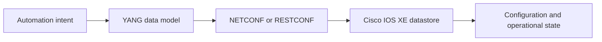
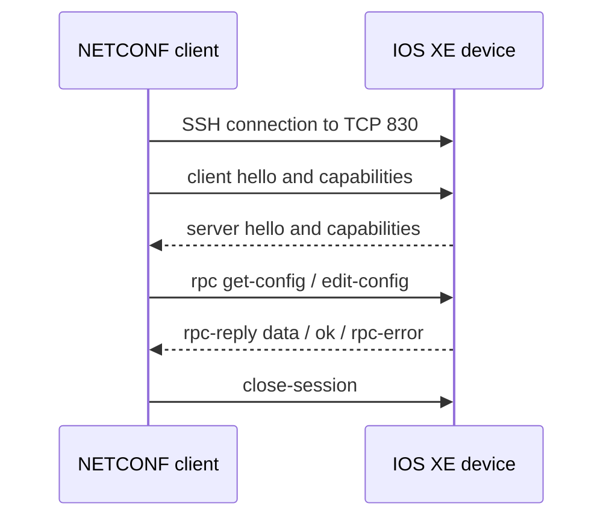
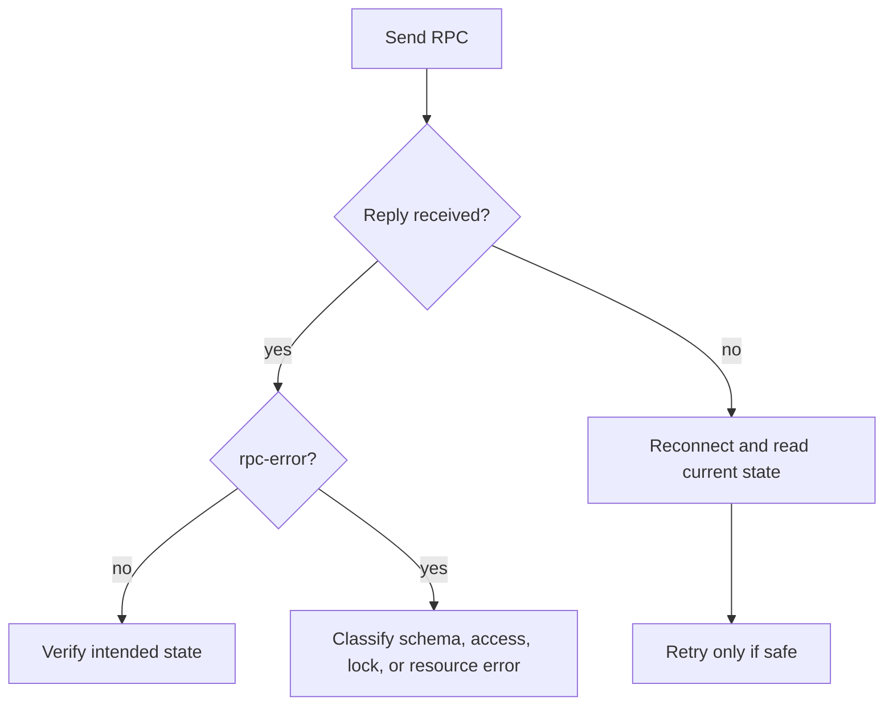
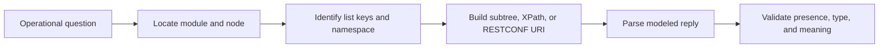
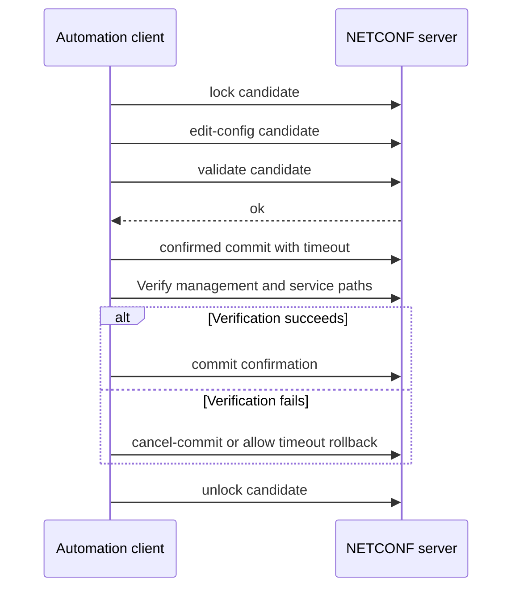

# Chapter 11: NETCONF, RESTCONF, and YANG

## Chapter Introduction

NETCONF and RESTCONF replace fragile screen scraping with structured, model-driven network management. Both use YANG models to describe valid data, but they differ in transport and operations. This chapter develops the protocols through Cisco IOS XE configuration scenarios.

Suppose a campus team must create the same VLAN, loopback, and static route on a mixed group of IOS XE devices. A CLI script might work until a prompt, command form, or output layout changes. With YANG-modeled data, the application can validate types and hierarchy before sending the change and can interpret a structured error afterward. The chapter therefore begins with the model, moves through the protocols, and finishes with complete configuration and verification workflows.

## 1. Why Model-Driven Management?

CLI syntax varies across platforms and releases. A model describes data independently of screen layout, including hierarchy, type, constraints, configuration, and operational state.



Model-driven management enables schema validation before a device accepts a change and makes data easier for software to process.

## 2. YANG Fundamentals

YANG is a data modeling language maintained through the IETF NETMOD work. A **module** has a namespace and prefix. Common nodes include:

- `container`: groups related nodes.
- `list`: repeatable entries identified by one or more keys.
- `leaf`: one typed value.
- `leaf-list`: repeated scalar values.
- `choice` and `case`: mutually exclusive structures.
- `rpc` and `action`: operations defined by a model.
- `notification`: asynchronous event data.

Cisco IOS XE exposes native Cisco models and standards-based OpenConfig or IETF models where supported. Check the device's YANG library because platform and release determine availability.

## 3. NETCONF Architecture

NETCONF, currently defined by RFC 6241, normally runs over SSH on TCP port 830. Client and server exchange `<hello>` messages to advertise capabilities. The client then sends XML RPC requests and receives `<rpc-reply>` responses.



NETCONF datastores can include `running`, `candidate`, and `startup`, depending on advertised capabilities. Candidate configuration permits staging and validation before commit. Locking prevents competing clients from changing the same datastore during a transaction.

Key operations include `<get>`, `<get-config>`, `<edit-config>`, `<copy-config>`, `<delete-config>`, `<lock>`, `<unlock>`, `<commit>`, and `<close-session>`.

## 4. Reading and Changing Configuration

On IOS XE, `netconf-yang` enables the service. A filtered read avoids retrieving an entire datastore.

```python
from ncclient import manager

with manager.connect(
    host="10.10.20.48", port=830,
    username="automation", password="secret",
    hostkey_verify=True, device_params={"name": "iosxe"},
) as session:
    reply = session.get_config(
        source="running",
        filter=("subtree", """
          <interfaces xmlns="urn:ietf:params:xml:ns:yang:ietf-interfaces">
            <interface><name>GigabitEthernet2</name></interface>
          </interfaces>"""),
    )
    print(reply.xml)
```

An `<edit-config>` payload must use the correct namespace and hierarchy. The `default-operation` can be `merge`, `replace`, or `none`; node-level operations can create, merge, replace, delete, or remove data. Use precise edits because replacing a parent container may remove sibling configuration.

## 5. NETCONF Error Handling

An `<rpc-error>` can include error type, tag, severity, path, message, and vendor information. Treat schema violations differently from temporary transport failures. Retrying malformed configuration will not help; a timeout may be retried only after determining whether the original operation took effect.



## 6. RESTCONF Architecture

RESTCONF, defined by RFC 8040, maps YANG data to HTTP resources. It commonly uses HTTPS on TCP 443. The API root is typically `/restconf`; data resources appear below `/restconf/data`, while model-defined operations appear below `/restconf/operations`.

Use these media types:

- `application/yang-data+json`
- `application/yang-data+xml`

`Accept` requests a response representation. `Content-Type` describes the request body.

## 7. RESTCONF Operations

After the client has identified the correct YANG resource, the HTTP operation becomes straightforward. The following request retrieves the modeled interface collection and illustrates the headers, authentication, timeout, and response handling that later configuration calls will reuse.

```python
import requests

url = "https://10.10.20.48/restconf/data/ietf-interfaces:interfaces"
headers = {"Accept": "application/yang-data+json"}
r = requests.get(url, headers=headers, auth=("automation", "secret"), timeout=15)
r.raise_for_status()
interfaces = r.json()["ietf-interfaces:interfaces"]["interface"]
```

`GET` retrieves data, `POST` creates a child resource, `PUT` creates or replaces a resource at a specific URI, `PATCH` changes selected content, and `DELETE` removes a resource. A RESTCONF URI uses module-qualified names where needed and URL-encoded list keys.

To configure a loopback, send a JSON body whose top-level member matches the target resource. After the write, retrieve the interface and verify both configuration and operational state.

## 8. NETCONF or RESTCONF?

Because both protocols operate on YANG-modeled data, the decision is usually shaped by transaction requirements, existing application skills, and platform capabilities rather than by the data model itself. The comparison below brings those practical differences together.

| Consideration | NETCONF | RESTCONF |
|---|---|---|
| Encoding | XML | JSON or XML |
| Transport | SSH, usually 830 | HTTPS, usually 443 |
| Transactions | Rich datastore, lock, and commit capabilities | Familiar HTTP resource operations |
| Best fit | Configuration workflows needing transaction control | Web-style integration and simple resource access |

Both protocols are only as portable as the selected YANG model and device support. Standards-based models improve consistency, while native models often expose deeper platform features.

## 9. Datastores, Transactions, and Safe Changes

NETCONF's datastore model is one of its strongest advantages. The `running` datastore represents active configuration. A device that supports `candidate` allows a client to stage several related edits without exposing an incomplete configuration. The client can validate the candidate and commit it as one logical change. If the device advertises confirmed-commit capability, a commit can automatically revert unless the client confirms it before a timer expires. This pattern is valuable for remote changes that could break management connectivity.

Capabilities must be discovered rather than assumed. They are advertised in the server `<hello>` and may indicate writable running configuration, candidate, startup, URL support, validation, rollback-on-error, notifications, or XPath filtering. An application intended for multiple IOS XE releases should inspect these capabilities and select a safe workflow. If candidate is absent, edits to running require smaller changes and stronger post-change verification.

Locking protects a datastore from concurrent NETCONF edits, but it does not necessarily prevent changes made through CLI or another management system. Broader operational ownership is still required. A controller, an Ansible job, and an engineer should not independently manage the same interface fields. When a lock cannot be acquired, the client should report contention and retry within policy instead of forcing its change.

## 10. Filtering and Data Retrieval

Retrieving the complete operational tree wastes device CPU, bandwidth, and application memory. A subtree filter supplies a partial XML hierarchy, while an XPath filter expresses a path when the server advertises XPath capability. The filter namespace is not cosmetic: it tells the server which YANG module defines each node. A structurally correct filter using the wrong namespace can return no data without being an obvious syntax error.

NETCONF `<get-config>` reads configuration from a datastore. `<get>` can return configuration and operational state. RESTCONF distinguishes content through resource paths and query parameters supported by the implementation. The application should retrieve only the fields needed for its decision and account for list keys. For interfaces, the interface name identifies the list entry; for a static route, address-family, prefix, and next-hop structure may determine the modeled identity.



## 11. IOS XE Configuration Scenarios

An interface workflow typically creates or updates the interface description, administrative state, and IPv4 configuration using `ietf-interfaces`, `ietf-ip`, or an IOS XE native model. These models do not always provide identical features. Standards-based models are preferable when the required function exists across vendors; native models are appropriate when Cisco-specific capability is needed. The application should never combine fields from unrelated model trees without understanding how IOS XE reconciles them internally.

VLAN configuration follows the same principle. First discover the supported VLAN model and exact resource hierarchy, then create the VLAN resource and separately associate switchports if the model requires it. A successful VLAN creation does not prove that an access port has joined it or that the VLAN is forwarding. Verification should retrieve both intended configuration and operational state.

Static routes require special care because a route is a structured object, not merely a command string. The address family, destination prefix, next-hop choice, interface, administrative distance, and VRF all contribute meaning. After using RESTCONF or NETCONF to create the route, verify that it appears in configuration and determine whether it entered the routing table. A route whose next hop is unreachable may be correctly configured but operationally inactive.

## 12. RESTCONF Responses and Errors

HTTP status codes provide the first result classification. A successful read normally returns 200, creation may return 201, and a successful operation with no response body may return 204. A 400 response indicates malformed input, 401 means authentication is required or failed, 403 means the identity lacks permission, 404 means the resource or data does not exist, 409 can represent a resource conflict, and 412 can indicate a failed conditional request. Server errors in the 500 range may be transient but still require bounded retry behavior.

RESTCONF error bodies use a modeled `errors` container and can report error type, tag, path, message, and additional information. Preserve this detail in sanitized logs. Do not reduce a useful message such as “data-missing at interface list key” to “request failed.” At the same time, avoid exposing credentials, full configurations, or sensitive topology in user-facing output.

TLS certificate verification should remain enabled. In a lab, it is tempting to use `verify=False`, but production automation should trust an enterprise CA or a pinned certificate chain. The connection identity, RESTCONF authorization, and YANG validation solve different security problems and all are required.

## 13. YANG Model Structure in Greater Detail

A YANG module declares its namespace, prefix, organization, revisions, imports, and data definitions. Imports allow one module to reference types or nodes from another module. Revisions matter because the same module name can evolve. An application should discover the module set implemented by a device rather than assume that a model found online exactly matches the deployed software.

Reusable definitions improve consistency. A `typedef` creates a named type, a `grouping` defines a reusable node structure, and `uses` inserts that structure. `augment` allows one module to add data beneath a node defined elsewhere, which is common when a vendor extends a standards model. `deviation` describes where an implementation differs from the base model. These mechanisms explain why simply reading one model file may not reveal the complete effective schema.

Constraints carry operational meaning. A leaf can define a range, length, pattern, default, mandatory status, or units. `must` expressions enforce conditions, while `when` makes a node conditional on other state. Lists define keys and may require uniqueness. A model-aware server checks these rules and returns structured errors, moving validation closer to the authoritative configuration system.

```yang
container services {
  list service {
    key "name";
    leaf name {
      type string { length "1..64"; }
    }
    leaf vlan-id {
      type uint16 { range "2..4094"; }
      mandatory true;
    }
    leaf enabled {
      type boolean;
      default true;
    }
  }
}
```

YANG is not an encoding. The same modeled tree can be represented as XML for NETCONF or as JSON/XML for RESTCONF. In JSON, module names may qualify members where namespace context is required. In XML, namespace URIs provide that context. The application must preserve types: a boolean is not the string `"true"`, and an integer is not interchangeable with a quoted number unless the encoding rules say so.

## 14. NETCONF Message Framing and Sessions

NETCONF 1.0 uses the `]]>]]>` end-of-message delimiter. NETCONF 1.1 introduces chunked framing, which avoids limitations of searching message content for a delimiter. Version negotiation occurs through the capabilities in the hello exchange. Libraries such as `ncclient` handle framing, but engineers should recognize it when troubleshooting raw SSH captures or session failures.

A session has an identifier and remains stateful. Locks, pending candidate configuration, and subscriptions can belong to that session. If the transport fails, the server releases session-scoped resources according to its implementation. Clients should close sessions cleanly and must not assume that a disconnected edit was rejected. Reconnect and read the datastore before deciding whether to repeat an operation.

RPCs include a message ID that associates a reply with its request. Multiple RPCs can be in flight depending on client behavior, so a robust library rather than manual string exchange is appropriate for production. XML parsing must disable unsafe external-entity behavior and should not use regular expressions to interpret structured XML.

## 15. A Transactional NETCONF Workflow

Where capabilities permit, a safe multi-step change can lock candidate, copy or edit the intended configuration, validate candidate, request a confirmed commit, test management and service reachability, confirm the commit, and unlock. If validation fails, discard changes. If connectivity is lost before confirmation, the device automatically reverts after the timeout.



Not every IOS XE feature or release offers this complete capability set. When editing running directly, obtain a pre-change snapshot of the managed subtree, calculate the exact difference, use rollback-on-error if supported, and maintain an explicit recovery payload. Device configuration rollback is still not equivalent to service rollback; external systems such as DNS, firewall policy, or controller inventory may also need compensation.

## 16. RESTCONF Resource Construction

A RESTCONF resource path follows the YANG hierarchy. A list entry is addressed with its key value, and multi-key lists encode keys in schema order according to the RESTCONF URI rules. Reserved characters in interface names, prefixes, or other keys require percent encoding. Building paths with string concatenation invites subtle errors; use a URL encoder while preserving the separators required by the API.

Query parameters can request depth, fields, content, or default handling when supported. The `fields` parameter can reduce a large response to required descendants. Conditional HTTP requests using entity tags can protect against lost updates: retrieve a resource and ETag, then update with `If-Match`. If another client changes the resource first, the server can reject the stale update rather than overwrite it silently.

```python
from urllib.parse import quote
import requests

interface = quote("GigabitEthernet1/0/24", safe="")
url = (
    "https://router.example/restconf/data/"
    f"ietf-interfaces:interfaces/interface={interface}"
)

get_response = requests.get(url, headers={
    "Accept": "application/yang-data+json"
}, auth=("automation", "secret"), timeout=15)
get_response.raise_for_status()

etag = get_response.headers.get("ETag")
headers = {"Content-Type": "application/yang-data+json"}
if etag:
    headers["If-Match"] = etag
```

## 17. Security and Operational Practice

Use dedicated automation identities with only the YANG paths and operations they require. Central AAA and command or API accounting improve attribution, but secrets and returned configuration must still be protected in application logs. NETCONF host-key verification and RESTCONF certificate validation prevent connections to an impersonated device. Rotate credentials and certificates without requiring code changes.

Rate-limit clients and use bounded concurrency. A structured API is not free of device cost; large operational reads and frequent configuration transactions can consume control-plane resources. Cache stable schema information, filter reads, and avoid repeatedly downloading full trees. Maintenance windows and canary scopes remain relevant even when the protocol is transactional.

Finally, log intent and outcome rather than dumping raw payloads indiscriminately. A useful record states the requested service, target device and modeled resources, pre-change version or hash, RPC or HTTP result, verification, and correlation ID. Sensitive values can be redacted while preserving enough evidence for troubleshooting and audit.

## 18. IOS XE RESTCONF Configuration Workflow

The following client illustrates the common mechanics for configuring an IOS XE resource. The exact native-model path can vary with IOS XE release, so inspect the device's YANG library and RESTCONF API documentation before using a payload. Standards-based `ietf-interfaces` is used where possible.

```python
import os
from urllib.parse import quote
import requests

BASE = os.environ["IOSXE_URL"].rstrip("/")
AUTH = (os.environ["IOSXE_USER"], os.environ["IOSXE_PASSWORD"])
HEADERS = {
    "Accept": "application/yang-data+json",
    "Content-Type": "application/yang-data+json",
}

def restconf(method, resource, *, payload=None):
    response = requests.request(
        method,
        f"{BASE}/restconf/data/{resource}",
        headers=HEADERS,
        auth=AUTH,
        json=payload,
        timeout=(3, 20),
    )
    response.raise_for_status()
    return response.json() if response.content else None

name = "Loopback100"
key = quote(name, safe="")
interface_payload = {
    "ietf-interfaces:interface": {
        "name": name,
        "description": "Managed by RESTCONF",
        "type": "iana-if-type:softwareLoopback",
        "enabled": True,
        "ietf-ip:ipv4": {
            "address": [{"ip": "192.0.2.100", "netmask": "255.255.255.255"}]
        },
    }
}

restconf(
    "PUT",
    f"ietf-interfaces:interfaces/interface={key}",
    payload=interface_payload,
)
configured = restconf("GET", f"ietf-interfaces:interfaces/interface={key}")
print(configured)
```

For a VLAN, the workflow uses the IOS XE VLAN model supported by the device. A representative payload has a keyed VLAN entry containing the VLAN ID and name. For a static route, the IOS XE native routing model represents the prefix, mask, and forwarding choice as structured data. Do not copy a model path from another release without checking advertised schemas.

```json
{
  "Cisco-IOS-XE-vlan-cfg:vlan-list": {
    "id": 310,
    "name": "AUTOMATION-USERS"
  }
}
```

```json
{
  "Cisco-IOS-XE-native:ip-route-interface-forwarding-list": {
    "prefix": "198.51.100.0",
    "mask": "255.255.255.0",
    "fwd-list": [{"fwd": "192.0.2.1"}]
  }
}
```

After creating the VLAN, retrieve it and confirm any required switchport association and spanning-tree state. After creating the route, retrieve configuration and operational routing state; a configured route whose next hop is unresolved may not be installed. When several resources form one service, apply dependency-aware rollback or use NETCONF candidate/confirmed-commit capabilities where supported.

> **Study guide takeaway:** YANG defines the contract; NETCONF and RESTCONF carry requests against that contract. Reliable automation discovers capabilities, sends minimal validated changes, interprets structured errors, and verifies resulting state.

## Key Takeaways

- YANG defines structured configuration, operational data, constraints, RPCs, and notifications.
- NETCONF provides XML RPC operations, datastores, locks, validation, and transactional commit capabilities over SSH.
- RESTCONF maps YANG resources to HTTP and can configure IOS XE interfaces, VLANs, and static routes using JSON or XML.

Chapter 12 uses the same model-driven foundation to stream operational state through modern network telemetry pipelines.

## Further Reading and References

- [NETCONF - RFC 6241](https://www.rfc-editor.org/rfc/rfc6241) - NETCONF operations and datastores.
- [RESTCONF - RFC 8040](https://www.rfc-editor.org/rfc/rfc8040) - YANG data over HTTP.
- [YANG 1.1 - RFC 7950](https://www.rfc-editor.org/rfc/rfc7950) - YANG language definition.
- [Cisco YANG models](https://github.com/YangModels/yang/tree/main/vendor/cisco) - published Cisco model files.

**Next chapter:** [Chapter 12: Streaming Network Telemetry](Chapter12.md)
