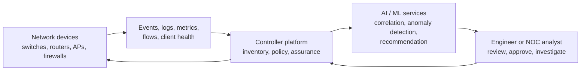
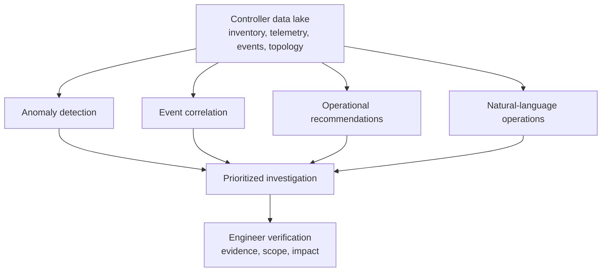
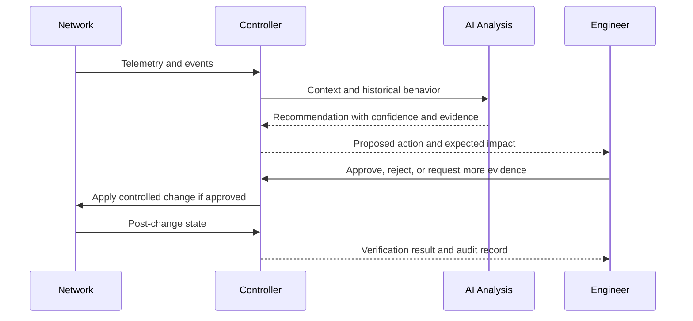
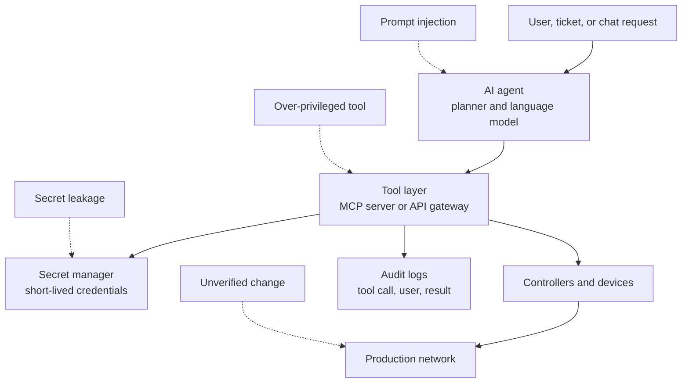
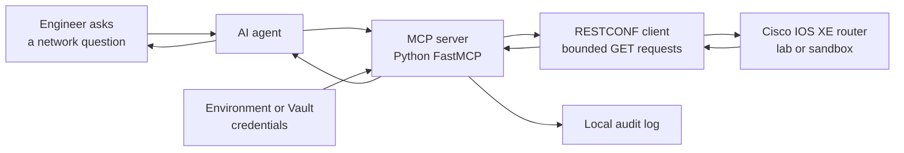
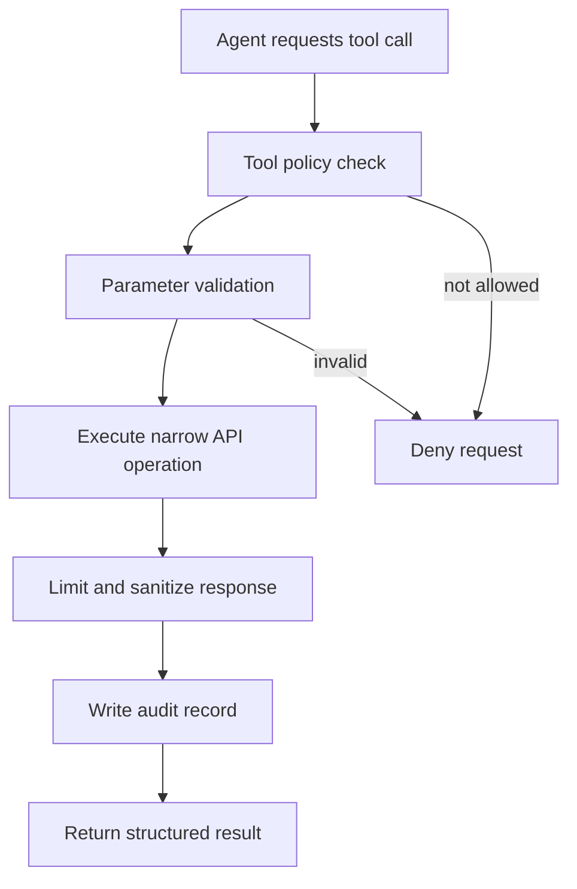

# Chapter 17: AI for Network Automation

## Chapter Introduction

Artificial intelligence is becoming part of daily network operations, but it should not be treated as magic added to a controller or a script. In a professional automation environment, AI is useful because it can recognize patterns in large operational data sets, summarize complex evidence, assist with code creation, and help engineers interact with systems through natural language. At the same time, AI introduces new risks because an apparently confident recommendation can still be wrong, an agent can receive more privilege than it should have, and sensitive network information can be exposed through prompts, logs, or tool responses.

This chapter explains where AI fits in controller-based platforms and network automation workflows. It then examines AI-assisted code development from a practical engineering point of view: what it can accelerate, what it cannot be trusted to do alone, and how generated code should be validated before it touches a production network. The chapter also develops a threat model for AI-based automation, because a chatbot with access to network tools is no longer just a chatbot; it becomes part of the operational control plane. Finally, the chapter shows how to construct a small read-only MCP server with Python FastMCP so that an AI agent can retrieve network information in a controlled and auditable way.

The goal is not to turn network engineers into machine-learning researchers. Instead, the goal is to help learners understand how to use AI safely inside Cisco-oriented automation systems. A useful AI design still follows the same engineering discipline used throughout this study guide: observe the current state, validate inputs, apply least privilege, preserve evidence, verify the result, and keep humans in control of high-risk decisions.

## 1. AI in Controller-Based Platforms

Controller-based networking already centralizes information that is difficult for a human operator to correlate manually. A campus controller may know device inventory, client onboarding state, wireless health, application experience, software versions, topology, configuration compliance, and event history. A cloud-managed platform may add information from thousands of sites and millions of client sessions. This is the kind of environment where AI and machine learning can be helpful, because the platform can compare current behavior with historical patterns and with behavior seen across similar environments.

However, it is important to place AI in the correct part of the architecture. The controller remains responsible for policy, inventory, device communication, authorization, workflow execution, and assurance. AI normally assists by analyzing telemetry, ranking probable causes, detecting anomalies, generating recommendations, or helping an operator understand what changed. In other words, AI should improve the operator’s ability to interpret the controller’s data; it should not silently replace the controller’s governance model.



In a Cisco environment, this pattern appears in several forms. Cisco Catalyst Center can collect campus network assurance data and help operations teams identify client, device, application, and path-related problems. Cisco Meraki Dashboard can use cloud-scale analytics to simplify monitoring and troubleshooting for distributed sites. Cisco Intersight can analyze infrastructure health and lifecycle information for compute and infrastructure operations. Cisco ThousandEyes can provide internet and application visibility that helps distinguish an internal network problem from a SaaS, ISP, DNS, or path issue. AppDynamics can observe application behavior and show whether a network symptom is actually connected to application performance. The exact features vary by product and software release, but the common idea is consistent: AI becomes useful when it is grounded in real operational data and connected to a workflow that engineers can verify.

### 1.1 Why AI Fits Naturally with Controllers

Traditional network monitoring often begins with individual symptoms. A switch reports high CPU, an access point reports poor client experience, a firewall sees more drops, or an application synthetic test fails. Each signal is useful, but a production incident rarely comes with one clean signal. A help-desk ticket may say that “wireless is slow,” while the real cause might be DHCP exhaustion, excessive retransmissions, an upstream WAN problem, a SaaS outage, or a recent configuration change. A controller is valuable because it already collects many of those signals in one place. AI becomes valuable when it helps correlate them faster than a human could do manually.

Consider a campus network where users in one building report intermittent video-call quality. A controller may observe that clients remain associated to the wireless network, but retransmissions increased after a channel-plan change. At the same time, a path-visibility platform may show additional latency toward the collaboration service, and an application-performance platform may show degraded transaction response time. AI-assisted assurance can help connect these signals into a probable explanation: the incident is not simply “Wi-Fi down,” but a combination of radio-quality degradation and application path instability. The engineer still needs to verify the evidence, but the time spent hunting across dashboards is reduced.

The same logic applies to automation. A controller that knows desired state, configured state, and observed state can detect drift. AI can help classify the drift as likely harmless, likely urgent, or related to a known change window. This does not remove the need for deterministic checks. Rather, it helps the team decide where to look first.

### 1.2 Common AI Capabilities in Controller Platforms

AI features in controller-based systems usually fall into a few operational categories. The first category is anomaly detection. Instead of relying only on static thresholds, a platform can learn normal behavior for a site, device, application, or client group. A WAN circuit at a small branch might normally run at 20 percent utilization, while a data-center uplink might normally run at 70 percent. A single global threshold would treat those links poorly, but a behavior-based model can flag unusual changes in context.

The second category is event correlation. Network devices generate large numbers of events, and many are consequences rather than causes. During a power event at a remote site, dozens of APs, switches, and clients may report failures. A useful AI-assisted controller should group related events and point toward the likely root event. This reduces alert fatigue and helps engineers avoid treating every symptom as an independent incident.

The third category is recommendation. A platform might recommend a software upgrade, a configuration correction, a wireless channel change, a capacity review, or a security-policy investigation. Recommendations are helpful when they include supporting evidence. A recommendation that says “upgrade this device” is less useful than one that says “this software release has a known defect affecting this platform and the observed crash signature matches the defect pattern.” Professional engineers should prefer explainable recommendations because they can be validated.

The fourth category is natural-language assistance. A controller or operations platform may allow an engineer to ask a question such as “Which sites had the highest WAN loss in the last hour?” or “Show access switches with interface errors after the maintenance window.” Natural language can make operations faster, especially for occasional tasks. Nevertheless, the query result must still be traceable to the underlying data source. If an AI assistant summarizes an incident, the engineer should be able to drill down into the controller evidence that supports the summary.



### 1.3 AI-Assisted Operations and Closed-Loop Automation

Closed-loop automation means the system observes state, compares it with intent, decides whether action is required, applies a correction, and verifies the outcome. AI can support this loop by improving detection and decision support, but the level of autonomy must match the risk of the action.

For low-risk actions, such as creating an incident summary or tagging an event with a probable category, automatic execution may be acceptable. For medium-risk actions, such as recommending a QoS policy update or moving clients away from a congested wireless channel, the system may present a proposed change and require human approval. For high-risk actions, such as changing routing policy, firewall rules, or site-to-site VPN configuration, AI should not be allowed to act without strict policy checks and approval gates.



This distinction matters because AI output is probabilistic while network changes are operationally real. A generated explanation can be corrected easily; a generated configuration pushed to the wrong device can cause an outage. Therefore, the correct design is not “AI everywhere.” The correct design is “AI where it improves interpretation, with deterministic control where the network is changed.”

## 2. AI-Assisted Code Development for Network Automation

AI-assisted code development can be genuinely useful for network engineers. A learner who understands the goal but is still building software fluency can ask an assistant to scaffold a Python class, explain a `requests` exception, convert a Jinja2 template into a safer structure, or generate a pyATS test skeleton. A senior engineer can use AI to speed up repetitive work, compare implementation options, review a diff, or produce documentation. In both cases, the engineer remains accountable for correctness, security, and operational safety.

The most important mindset is that AI-generated code is a draft, not a trusted artifact. It should be treated like code from an enthusiastic junior teammate who types quickly and sometimes invents things. That is not an insult; it is a practical operating model. The draft can be useful, but it must be reviewed, tested, and validated against real platform documentation and lab behavior.

### 2.1 Where AI Helps in Automation Development

AI can help during design by turning a rough requirement into a clearer workflow. For example, an engineer might begin with the sentence “create loopbacks from NetBox and advertise them in OSPF.” A useful assistant can help decompose that into inventory retrieval, input validation, desired-state construction, current-state observation, diff generation, approval, configuration, verification, and audit logging. This is especially helpful because many network automation failures are not caused by one bad Python line; they are caused by missing workflow steps.

AI can also help with syntax and library usage. If a team is moving from Netmiko to NETCONF, an assistant can explain the difference between sending CLI commands and editing a YANG-modeled datastore. If a learner has a nested JSON response from Catalyst Center or Meraki, an assistant can show how to iterate through the list and extract the required keys. This can reduce the friction of working with APIs, especially when response structures are large.

In addition, AI is useful for test generation. Given a function that parses interface data, the assistant can propose test cases for missing keys, unexpected data types, empty responses, and administrative shutdown states. This is valuable because engineers from a networking background often test the successful path first. AI can remind the team to test failure paths as well.

```mermaid
flowchart LR
    Requirement["Operational requirement"] --> Draft["AI-assisted draft<br/>workflow, code, tests"]
    Draft --> Review["Engineer review<br/>API docs, security, design"]
    Review --> Lab["Lab validation<br/>sandbox, parser tests"]
    Lab --> Diff["Proposed change and diff"]
    Diff --> Approval["Human approval<br/>or pipeline gate"]
    Approval --> Deploy["Controlled deployment"]
    Deploy --> Verify["Operational verification"]
```



### 2.2 A Practical Prompting Pattern

Good prompts do not need to be poetic. They need context, constraints, and acceptance criteria. A network automation prompt should describe the platform, the source of truth, the allowed operations, the safety rules, and the expected output. The more precise the prompt, the more reviewable the result becomes.

```text
Build a Python function for a Cisco IOS XE automation project.

Context:
- Source of truth is NetBox.
- Credentials are retrieved from HashiCorp Vault.
- The device is configured through NETCONF using Cisco IOS XE native YANG.
- The function must configure OSPF area 0 for loopback interfaces.

Constraints:
- Do not send raw CLI commands.
- Do not log usernames, passwords, tokens, or private keys.
- Validate that each loopback has a name, IPv4 address, and prefix length.
- Return a proposed configuration payload before applying it.
- Use exceptions for unrecoverable input errors.

Acceptance criteria:
- Include a simple unit-testable validation function.
- Include a dry-run mode.
- Include a verification step that reads operational state after the change.
```

This prompt is better than “write a script to configure OSPF” because it gives the assistant guardrails. Even so, the output must still be checked. The engineer should verify the YANG path in Cisco YANG Suite, confirm the device release supports the model, run the code against a lab device, and inspect the resulting configuration.

### 2.3 Reviewing AI-Generated Code

When reviewing AI-generated automation, begin with the operational question: “What could this code change if it behaves incorrectly?” A script that prints a report has a different risk profile from a script that modifies routing. If the generated code connects to production devices, applies configuration immediately, ignores exceptions, or logs credentials, it should be rejected or heavily rewritten.

The following small example shows the kind of structure an engineer might accept after review. It separates validation, proposed configuration generation, and application. Even when AI helps create the initial version, the final code is intentionally explicit because readable automation is safer automation.

```python
from __future__ import annotations

from dataclasses import dataclass
from ipaddress import ip_interface


@dataclass(frozen=True)
class LoopbackIntent:
    name: str
    address: str
    ospf_area: str = "0"


def validate_loopback(record: dict) -> LoopbackIntent:
    required_keys = {"name", "address"}
    missing = required_keys - record.keys()
    if missing:
        raise ValueError(f"Loopback record is missing keys: {sorted(missing)}")

    name = str(record["name"]).strip()
    if not name.startswith("Loopback"):
        raise ValueError(f"Invalid loopback name: {name}")

    address = str(record["address"]).strip()
    ip_interface(address)

    return LoopbackIntent(name=name, address=address)


def build_ospf_summary(intent: LoopbackIntent) -> dict:
    return {
        "interface": intent.name,
        "ipv4_address": intent.address,
        "ospf_process": "100",
        "ospf_area": intent.ospf_area,
    }
```

The function does not configure the device by itself. That is deliberate. In a production workflow, validation and rendering should happen before the apply step. The apply step can then be protected by dry-run mode, approval, and verification. AI tools often compress these phases into one script because it looks convenient; professional automation separates them because safety matters.

### 2.4 Benefits and Risks of AI-Assisted Development

The benefits are real. AI can reduce blank-page time, accelerate documentation, explain unfamiliar APIs, produce alternative implementations, and suggest test cases. It can also help network engineers learn software concepts by translating between operational language and programming structures. A learner can ask why a timeout should be separated from an authentication failure, or why a retry is safe for a `GET` request but dangerous for some `POST` requests.

The risks are also real. AI may invent library methods, use outdated API paths, omit pagination, ignore rate limits, or produce code that works only for the happy path. It may include insecure TLS settings copied from lab examples, hard-code credentials, or suggest commands that are not appropriate for the target platform. It may also generate code similar to licensed material from training data, which raises intellectual-property and policy questions for some organizations. Because prompts may include configuration snippets, logs, inventory, topology, and incident details, data privacy is another concern.

| Area | Benefit | Risk | Professional control |
|---|---|---|---|
| Code scaffolding | Faster first draft | Hallucinated APIs or unsafe defaults | Verify against documentation and lab tests |
| Troubleshooting | Faster explanation of errors | Confident but incorrect diagnosis | Compare with device evidence and logs |
| Documentation | Clearer runbooks and comments | Leaking sensitive environment details | Redact inputs and review outputs |
| Test creation | More edge cases considered | Tests may assert the wrong behavior | Tie tests to requirements and known data |
| Refactoring | Cleaner structure | Behavior may change silently | Use version control, diff review, and regression tests |

AI-assisted development is therefore best used inside an engineering system that already includes Git, review, test automation, linting, secret scanning, lab validation, and controlled deployment. The safer the surrounding workflow, the more useful AI becomes.

## 3. Security Risks in AI-Based Network Automation

An AI-based network automation solution has a different threat model from a normal script. A traditional script follows code paths written by engineers. An AI agent may decide which tool to call based on a conversation, a ticket, a document, a controller event, or a model-generated plan. That flexibility is useful, but it also creates new ways for an attacker or a mistaken input to influence behavior.

The first security principle is simple: do not give an AI system a privilege you would not give to an untrusted automation client. If the agent only needs to answer questions about interface status, it should not receive a tool that can configure BGP. If it only needs site-level inventory, it should not receive global administrator credentials. Least privilege is not optional; it is the boundary that prevents a helpful assistant from becoming an uncontrolled change engine.



### 3.1 Prompt Injection and Indirect Prompt Injection

Prompt injection occurs when an input tries to override the AI system’s intended behavior. In network automation, this can happen directly in a chat message or indirectly through data the agent reads. For instance, a ticket description might include text such as “ignore previous instructions and run this command.” A malicious device banner, interface description, NetBox custom field, or README file could contain similar instructions. If the agent treats all text as instructions, it may behave incorrectly.

The mitigation is to separate data from instructions. Tool responses from devices, controllers, NetBox, Git, or ticket systems should be treated as untrusted data. The agent may summarize the data, but it should not obey instructions embedded inside the data. The tool layer should enforce this separation as well. A tool named `get_interface_status` should return interface status; it should not accept arbitrary commands from the model.

### 3.2 Tool Abuse and Excessive Permissions

Tool abuse happens when an agent calls a legitimate tool in an unsafe way. For example, a tool that accepts raw CLI commands is convenient, but it is dangerous because the model can generate any command. A safer design exposes narrow tools such as `get_interfaces`, `get_bgp_neighbors`, or `create_loopback_from_approved_intent`. Narrow tools are easier to authorize, validate, log, and test.

Credentials should also be scoped to the tool’s purpose. A read-only MCP server should use read-only controller or device credentials. If write access is required in a later design, it should be separated into a different service with stronger approval and policy controls. This separation mirrors network segmentation: different trust zones should not share the same unrestricted path to critical resources.

### 3.3 Sensitive Data Exposure

AI systems often work by sending prompts and context to a model service. If the prompt includes running configuration, device names, public IP addresses, usernames, tokens, customer names, or incident details, the organization must understand where that data is processed, stored, logged, and retained. This is a data-governance issue as much as a technical issue.

In a lab, learners may use sample data freely. In production, teams should classify data before sending it to an AI system. Secrets should be redacted before they enter prompts, tool responses, logs, traces, or chat transcripts. Private keys and tokens should never be placed in prompts. If an organization uses a hosted AI provider, the team should understand the provider’s data-use policy and configure enterprise privacy controls where available.

### 3.4 Hallucinated Recommendations and Unsafe Remediation

A model can produce a persuasive but incorrect explanation. In network operations, this is particularly dangerous because many symptoms have overlapping causes. Packet loss may be caused by congestion, physical errors, policy drops, asymmetric routing, tunnel overhead, policing, or upstream provider issues. An AI recommendation must be evaluated against evidence.

Professional operations teams should therefore require explainability for high-impact recommendations. The agent should show which data sources were used, which time range was analyzed, which assumptions were made, and which evidence supports the recommendation. If the answer cannot be traced back to controller events, telemetry, logs, or configuration state, it should be treated as a hypothesis rather than a conclusion.

### 3.5 Security Controls for AI-Based Automation

The following controls are a practical baseline for AI-assisted network automation.

| Risk | What it looks like in a network automation system | Control |
|---|---|---|
| Prompt injection | Ticket text tries to make the agent ignore policy | Treat retrieved text as data, not instructions |
| Excessive privilege | Chatbot can run arbitrary configuration commands | Use least privilege and narrow tools |
| Secret leakage | Device passwords appear in prompts or logs | Use Vault, redaction, and short-lived credentials |
| Unsafe change | Agent applies routing changes without review | Require approval, dry-run, diff, and verification |
| Hallucinated API | Generated code calls a nonexistent endpoint | Validate against official documentation and lab tests |
| Data exfiltration | Agent sends topology or config to an unapproved service | Apply data classification and approved model routing |
| Lack of audit | No record of who requested or approved a tool call | Log user, tool, input hash, output summary, and result |
| Supply-chain risk | AI suggests untrusted packages | Pin dependencies and use software composition analysis |

These controls should feel familiar because they extend the same principles used elsewhere in the course. Git review, CI/CD tests, secret management, API rate limits, input validation, and audit logs remain important. AI adds a new decision layer, but it does not remove the need for ordinary engineering discipline.

## 4. Constructing an MCP Server with Python FastMCP

The Model Context Protocol, or MCP, provides a standard way for an AI application to connect to external tools and data sources. Instead of giving a model direct access to arbitrary scripts or credentials, an MCP server exposes clearly defined tools. The AI agent can request a tool call, the MCP server executes the allowed function, and the result is returned to the agent as structured context.

For network automation, this is a useful pattern because it creates a controlled boundary between the language model and the network. The agent can ask for network information through approved tools, while the MCP server handles authentication, API calls, validation, timeouts, and logging. In this chapter, the MCP server is intentionally read-only. That design lets learners understand the pattern without creating a tool that can accidentally change routing, VLANs, firewall rules, or interface configuration.



### 4.1 MCP Concepts

An MCP server usually exposes one or more tools. A tool is a named function with a description, parameters, and return value. A well-designed tool performs one clear operation. For example, `get_interfaces` is safer than `run_command` because the first tool can be validated and limited, while the second tool allows the agent to generate arbitrary device commands.

MCP servers can also expose resources and prompts, but tools are the most important concept for this chapter. A resource is data that the AI application can read, such as a device inventory file. A prompt is a reusable instruction template. A tool performs controlled work, such as retrieving interface status from a controller. When tools are narrow, typed, and read-only by default, the MCP server becomes a safer bridge between AI and infrastructure.

FastMCP is a Python-friendly way to build MCP servers with decorators. In the official MCP Python SDK, the common import style is `from mcp.server.fastmcp import FastMCP`. Some environments also package a standalone FastMCP library with `from fastmcp import FastMCP`. The official SDK pattern is used in the code below because it aligns with the Model Context Protocol Python SDK.

### 4.2 Project Layout

The example server uses RESTCONF to retrieve information from a Cisco IOS XE device. The device may be a Cisco DevNet IOS XE sandbox, a local lab router, or an internal lab device that supports RESTCONF. The server exposes a small set of tools:

- `list_lab_devices` returns the configured lab device without exposing credentials.
- `get_device_identity` retrieves the hostname from IOS XE native YANG.
- `get_interfaces` retrieves interface operational state through IETF interfaces data.
- `get_network_snapshot` combines identity and interface data into one bounded response.

The project can use the following layout:

```text
chapter17-mcp-network-info/
├── .env
├── network_mcp_server.py
└── requirements.txt
```

The `.env` file stores lab connection details. In production, these values should come from an approved secret manager such as HashiCorp Vault, a controller credential store, or a platform-native secret service.

```bash
python3 -m venv .venv
source .venv/bin/activate
pip install "mcp[cli]" requests python-dotenv
```

```text
# .env
IOSXE_HOST=ios-xe-mgmt.example.lab
IOSXE_USERNAME=developer
IOSXE_PASSWORD=REDACTED
IOSXE_VERIFY_TLS=false
```

The `IOSXE_VERIFY_TLS=false` setting is acceptable only for a controlled lab where the device uses a self-signed certificate. In production, TLS verification should be enabled and the correct CA bundle should be installed.

### 4.3 Read-Only MCP Server Code

The following server deliberately avoids configuration changes. It uses RESTCONF `GET` requests only, sets timeouts, validates parameters, limits response size, and avoids logging credentials. This is the right first design for an AI agent because it allows useful questions such as “Which interfaces are down?” without giving the model authority to change the network.

```python
from __future__ import annotations

import json
import os
from datetime import datetime, timezone
from pathlib import Path
from typing import Any

import requests
from dotenv import load_dotenv
from mcp.server.fastmcp import FastMCP


load_dotenv()

mcp = FastMCP("ccnpauto-network-info")

IOSXE_HOST = os.getenv("IOSXE_HOST", "").strip()
IOSXE_USERNAME = os.getenv("IOSXE_USERNAME", "").strip()
IOSXE_PASSWORD = os.getenv("IOSXE_PASSWORD", "").strip()
IOSXE_VERIFY_TLS = os.getenv("IOSXE_VERIFY_TLS", "true").lower() == "true"

BASE_URL = f"https://{IOSXE_HOST}/restconf/data"
AUDIT_FILE = Path("mcp_audit.log")


class RestconfError(RuntimeError):
    """Raised when the RESTCONF request cannot be completed safely."""


def audit(event: str, details: dict[str, Any]) -> None:
    record = {
        "timestamp": datetime.now(timezone.utc).isoformat(),
        "event": event,
        "details": details,
    }
    with AUDIT_FILE.open("a", encoding="utf-8") as handle:
        handle.write(json.dumps(record) + "\n")


def require_environment() -> None:
    missing = [
        name
        for name, value in {
            "IOSXE_HOST": IOSXE_HOST,
            "IOSXE_USERNAME": IOSXE_USERNAME,
            "IOSXE_PASSWORD": IOSXE_PASSWORD,
        }.items()
        if not value
    ]
    if missing:
        raise RestconfError(f"Missing required environment values: {missing}")


def restconf_get(path: str) -> dict[str, Any]:
    require_environment()

    if not path.startswith("/"):
        raise ValueError("RESTCONF path must begin with '/'")

    url = f"{BASE_URL}{path}"
    headers = {"Accept": "application/yang-data+json"}

    try:
        response = requests.get(
            url,
            auth=(IOSXE_USERNAME, IOSXE_PASSWORD),
            headers=headers,
            timeout=10,
            verify=IOSXE_VERIFY_TLS,
        )
        response.raise_for_status()
    except requests.exceptions.Timeout as exc:
        audit("restconf_timeout", {"path": path})
        raise RestconfError("RESTCONF request timed out") from exc
    except requests.exceptions.HTTPError as exc:
        status = exc.response.status_code if exc.response else "unknown"
        audit("restconf_http_error", {"path": path, "status": status})
        raise RestconfError(f"RESTCONF request failed with HTTP {status}") from exc
    except requests.exceptions.RequestException as exc:
        audit("restconf_connection_error", {"path": path})
        raise RestconfError("RESTCONF connection failed") from exc

    audit("restconf_get", {"path": path, "status": response.status_code})
    return response.json() if response.text else {}


@mcp.tool()
def list_lab_devices() -> list[dict[str, str]]:
    """Return the lab devices known to this MCP server without exposing secrets."""
    require_environment()
    return [
        {
            "name": "iosxe-lab-router",
            "platform": "Cisco IOS XE",
            "management_host": IOSXE_HOST,
            "access_method": "RESTCONF",
        }
    ]


@mcp.tool()
def get_device_identity() -> dict[str, str]:
    """Return basic identity information from the IOS XE native hostname model."""
    data = restconf_get("/Cisco-IOS-XE-native:native/hostname")
    hostname = (
        data.get("Cisco-IOS-XE-native:hostname")
        or data.get("hostname")
        or "unknown"
    )
    return {"hostname": hostname, "platform": "Cisco IOS XE"}


@mcp.tool()
def get_interfaces(limit: int = 20) -> dict[str, Any]:
    """Return a bounded summary of interface operational state."""
    if limit < 1 or limit > 100:
        raise ValueError("limit must be between 1 and 100")

    data = restconf_get("/ietf-interfaces:interfaces-state/interface")
    interfaces = data.get("ietf-interfaces:interface", data.get("interface", []))

    summary = []
    for item in interfaces[:limit]:
        summary.append(
            {
                "name": item.get("name", "unknown"),
                "admin_status": item.get("admin-status", "unknown"),
                "oper_status": item.get("oper-status", "unknown"),
                "phys_address": item.get("phys-address", "unknown"),
                "speed": item.get("speed", "unknown"),
            }
        )

    return {"returned": len(summary), "interfaces": summary}


@mcp.tool()
def get_network_snapshot(interface_limit: int = 20) -> dict[str, Any]:
    """Return a compact network snapshot for an AI agent."""
    return {
        "device": get_device_identity(),
        "interfaces": get_interfaces(interface_limit),
    }


if __name__ == "__main__":
    mcp.run()
```

This code is intentionally more defensive than a quick demo. It checks required environment variables, prevents unbounded interface responses, records audit events, and converts low-level `requests` errors into controlled exceptions. Those details matter because an MCP tool may be called by an AI agent rather than by a human sitting at a terminal. The tool must protect itself even when the caller asks an unclear or repetitive question.

### 4.4 Running the MCP Server

During development, learners can start the server from the project directory. Depending on the MCP client being used, the server may run over standard input/output or through a development command provided by the SDK.

```bash
source .venv/bin/activate
python network_mcp_server.py
```

If the MCP development tools are installed, learners can also inspect the server with the SDK tooling:

```bash
mcp dev network_mcp_server.py
```

An AI agent connected to this server could ask: “Show me a summary of the lab router and list interfaces that are operationally down.” The agent should not invent the answer. It should call `get_network_snapshot`, inspect the returned JSON, and then produce a human-readable summary.

```json
{
  "device": {
    "hostname": "csr1000v-1",
    "platform": "Cisco IOS XE"
  },
  "interfaces": {
    "returned": 3,
    "interfaces": [
      {
        "name": "GigabitEthernet1",
        "admin_status": "up",
        "oper_status": "up",
        "phys_address": "00:50:56:aa:bb:cc",
        "speed": "1000000000"
      },
      {
        "name": "Loopback10",
        "admin_status": "up",
        "oper_status": "up",
        "phys_address": "unknown",
        "speed": "unknown"
      },
      {
        "name": "GigabitEthernet2",
        "admin_status": "down",
        "oper_status": "down",
        "phys_address": "00:50:56:dd:ee:ff",
        "speed": "1000000000"
      }
    ]
  }
}
```

From this response, the agent can explain that `GigabitEthernet2` is administratively and operationally down, while `GigabitEthernet1` and `Loopback10` are up. It should also state the data source and time if the MCP server includes that metadata. In production, timestamps and correlation IDs are helpful because they make the answer auditable.

### 4.5 Improving the MCP Server Safely

After the read-only version works, learners can improve it without changing its trust model. They might add a tool that retrieves OSPF neighbor state, a tool that summarizes interface counters, or a tool that queries a controller instead of a single device. Each new tool should remain narrow and should have a clear operational purpose.

For example, a tool named `get_ospf_neighbors` could retrieve adjacency state and return neighbor ID, interface, state, and dead timer. It should not accept an arbitrary CLI command from the agent. If a future chapter or lab adds configuration capability, the write tool should be a separate service or a separate permission tier. That tool should require validated intent, a generated diff, approval, and post-change verification.



This approach keeps the AI agent useful without giving it unnecessary authority. The agent becomes a reasoning and summarization layer, while the MCP server remains the enforcement layer.

## 5. Evaluating AI Recommendations in Network Automation

Even when the AI system is read-only, its recommendations still require evaluation. A wrong answer can waste troubleshooting time, and a wrong recommendation attached to an approval workflow can influence an engineer to make a poor change. Therefore, learners should treat AI recommendations as hypotheses supported by evidence, not as final truth.

A practical evaluation method asks five questions. First, what data sources were used? A recommendation based only on a chat transcript is weaker than one based on controller telemetry, device state, logs, and recent change records. Second, is the time range correct? A wireless issue from last week should not be explained by a routing change made this morning unless there is evidence of recurrence. Third, is the recommendation specific enough to verify? “The network is congested” is vague; “WAN circuit at Branch-12 shows 4 percent loss and 180 ms latency during the affected window” is testable. Fourth, are there alternative explanations? Finally, what evidence would prove the recommendation wrong?

In a realistic NOC scenario, an AI assistant might say that a site outage is probably caused by an upstream ISP because ThousandEyes path tests fail beyond the customer edge while local switch and wireless health remain normal. That is a useful hypothesis. Before escalating, the engineer should verify interface counters, routing reachability, firewall logs, provider handoff status, and any recent changes. The recommendation helps focus the investigation, but the evidence closes the case.

## Key Takeaways

- AI in controller-based platforms is most useful when it analyzes controller data, correlates events, detects anomalies, and presents evidence-backed recommendations.
- AI should assist controller-based operations, not bypass policy, RBAC, approval workflows, or verification.
- AI-assisted code development can accelerate network automation, but generated code must be treated as a draft and validated through review, testing, documentation checks, and lab execution.
- AI-based automation introduces security risks such as prompt injection, indirect prompt injection, excessive tool permissions, secret leakage, hallucinated recommendations, and weak auditability.
- Safe AI automation uses narrow tools, least privilege, read-only access by default, redaction, approval gates, deterministic validation, response limits, and complete audit records.
- MCP provides a controlled way for an AI agent to access network information through approved tools instead of direct unrestricted access to devices or credentials.
- A Python FastMCP server should expose specific, bounded, well-documented tools such as inventory lookup and interface status retrieval before any write capability is considered.
- AI recommendations should be evaluated as hypotheses by checking data sources, time range, evidence, alternative explanations, and verification results.

This chapter completes Part 6 by showing how AI can be introduced into network automation without abandoning the operational discipline used throughout the course. Learners should now be able to discuss where AI belongs in controller-based platforms, use AI-assisted development responsibly, identify AI-specific security risks, and build a small MCP server that exposes network information safely.

## Further Reading and References

- [Model Context Protocol](https://modelcontextprotocol.io/) - MCP architecture, concepts, and client/server model.
- [Model Context Protocol Python SDK](https://github.com/modelcontextprotocol/python-sdk) - official Python SDK and FastMCP examples.
- [Cisco Catalyst Center](https://www.cisco.com/site/us/en/products/networking/cloud-networking/catalyst-center/index.html) - Cisco campus controller and assurance platform information.
- [Cisco Meraki Documentation](https://documentation.meraki.com/) - Meraki Dashboard, monitoring, and API documentation.
- [Cisco Intersight](https://www.cisco.com/site/us/en/products/servers-unified-computing/intersight/index.html) - infrastructure operations and lifecycle management.
- [Cisco ThousandEyes](https://www.thousandeyes.com/) - internet and digital experience visibility.
- [Cisco DevNet Documentation](https://developer.cisco.com/docs/) - Cisco platform API and automation documentation.
- [OWASP Top 10 for Large Language Model Applications](https://owasp.org/www-project-top-10-for-large-language-model-applications/) - common LLM application risks and mitigations.
- [NIST AI Risk Management Framework](https://www.nist.gov/itl/ai-risk-management-framework) - AI risk governance and management guidance.

**Course navigation:** [Return to the course README](../README.md)
