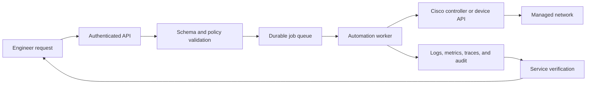

# Cisco DevNet Professional Study Guide

This course is a practical study guide for the Cisco Certified DevNet Professional core examination, commonly identified as **DEVCOR 350-901**. It connects software engineering with real network operations so that learners can design applications, consume and build APIs, automate Cisco infrastructure, secure delivery pipelines, and integrate major Cisco platforms.

The material is written at a professional level. Rather than treating automation as a collection of isolated scripts, the course follows the complete lifecycle from requirements and architecture through development, testing, deployment, security, observability, infrastructure automation, and production support. Network automation scenarios, Python examples, configuration samples, diagrams, and operational trade-offs are used throughout.

> This is an independent study guide. Always compare exam preparation with the current updated official Cisco exam blueprint and product documentation.

## Learning Outcomes

After completing the course, learners should be able to:

- Design distributed applications with front-end, back-end, load-balancing, messaging, and data components.
- Evaluate scalability, modularity, availability, resilience, latency, bandwidth, maintainability, and observability.
- Select relational, document, graph, column-family, key-value, and time-series databases according to application requirements.
- Use Git, code review, release packaging, dependency management, CI/CD, Docker, Kubernetes, and GitOps.
- Construct and consume REST APIs with secure authentication, caching, pagination, rate-limit handling, and controlled error recovery.
- Apply privacy, secret-management, PKI, TLS, OAuth, OWASP, and software supply-chain controls.
- Automate Cisco infrastructure with controllers, RESTCONF, NETCONF, YANG, model-driven telemetry, Ansible, and Terraform.
- Host and operate suitable containerized applications on supported Cisco network and IOx platforms.
- Integrate Webex, Cisco Secure Firewall, Meraki, Intersight, UCS Manager, Catalyst Center, and AppDynamics APIs.
- Explain where AI fits in controller-based platforms, evaluate AI-assisted automation risks, and construct a read-only MCP server for network information retrieval.

## Course Structure

### Part 1: Software Development and Design

1. [Software Design Foundations](Part1/Chapter1.md) introduces software architecture, requirements, distributed applications, development models, DevOps, reviews, and testing.
2. [Software Quality and Resilience](Part1/Chapter2.md) measurable quality attributes, modularity, scalability, availability, resilience, and hybrid deployment considerations.
3. [Performance, Data, and Observability](Part1/Chapter3.md) connects maintainability, latency, throughput, caching, logs, metrics, traces, failure diagnosis, and database selection.
4. [Git and Release Management](Part1/Chapter4.md) covers professional Git workflows, advanced history operations, branching, review, release artifacts, and dependency controls.

### Part 2: APIs

5. [Network API Fundamentals](Part2/Chapter5.md) explains REST, HTTP, RPC, gRPC, GraphQL, OpenAPI, resource design, idempotency, and cache controls.
6. [Resilient API Development](Part2/Chapter6.md) covers authentication, OAuth, pagination, webhooks, streaming, timeouts, rate limits, retries, and unrecoverable-error flow control.

### Part 3: Application Deployment and Security

7. [CI/CD and Application Deployment](Part3/Chapter7.md) develops DevOps, SRE, pipelines, continuous testing, static analysis, Docker, Kubernetes, GitOps, deployment strategies, logging, and 12-factor applications.
8. [Secure Application Design](Part3/Chapter8.md) covers privacy, secrets, PKI, TLS, encryption, OAuth, injection, XSS, CSRF, and secure CI/CD.

### Part 4: Infrastructure and Automation

9. [Network Infrastructure Management](Part4/Chapter9.md) explains PDIOO, management planes, provisioning, ZTP, SDN, intent, inventory, topology, and assurance.
10. [Network Automation and Orchestration](Part4/Chapter10.md) develops safe automation workflows, concurrency, APIs, cross-domain orchestration, governance, and reliable verification.
11. [NETCONF, RESTCONF, and YANG](Part4/Chapter11.md) covers data models, datastores, RPCs, transactions, errors, and IOS XE interface, VLAN, and static-route workflows.
12. [Streaming Network Telemetry](Part4/Chapter12.md) explains polling and streaming models, subscriptions, sensor paths, gNMI, storage, dashboards, alerting, and event-driven operations.
13. [Infrastructure as Code Tools](Part4/Chapter13.md) compares Puppet, Chef, Ansible, and Terraform, including state, secrets, inventories, workflow design, and tool selection.
14. [Configuration and Release Control](Part4/Chapter14.md) covers configuration items, baselines, traceability, audits, requirements, reproducibility, dependencies, and technical debt.
15. [Edge Application Hosting](Part4/Chapter15.md) explains containers, Cisco IOx, Catalyst application hosting, networking, security, offline behavior, fleet operation, and troubleshooting.

### Part 5: Cisco Platform APIs

16. [Cisco Platform APIs](Part5/Chapter16.md) provides integrated explanations and practical workflows for Webex, Cisco Secure Firewall FMC and FDM, Meraki, Intersight, UCS Manager, Catalyst Center, AppDynamics, and custom dashboards.

### Part 6: AI for Network Automation

17. [AI for Network Automation](Part6/Chapter17.md) explains AI in controller-based platforms, AI-assisted code development, AI-specific automation security risks, and a Python FastMCP server that provides controlled network information to an AI agent.

## Recommended Prerequisites

Learners will benefit from:

- CCNA-level networking knowledge, including IP addressing, routing, switching, VLANs, and security fundamentals.
- CCNA Automation/DevNet Associate level with basic Python skills, including functions, data structures, exceptions, modules, and virtual environments.
- Familiarity with JSON, YAML, XML, HTTP, Linux command-line tools, and Git.
- Access to Cisco DevNet Sandboxes or equivalent lab platforms for API experimentation.

The course introduces the required software concepts, but practical repetition is important. Learners who are new to programming should type and modify the examples rather than only read them.

## Suggested Study Method

1. Read the chapter introduction and identify the operational problem being addressed.
2. Follow the diagrams before studying the implementation details.
3. Re-create code and API calls in a virtual environment or sandbox.
4. Test both successful and unsuccessful responses, including timeouts, authentication failures, rate limits, malformed data, and partial completion.
5. Explain the design trade-offs in your own words.
6. Review the Key Takeaways and follow the chapter references for deeper study.
7. Combine related chapters into an end-to-end lab rather than practicing each technology in isolation.

## Practical Lab Path

A useful capstone project is a controlled network-change service:

The project can be expanded gradually:

- Store source and tests in Git with a protected review workflow.
- Publish an OpenAPI contract and build a resilient Python client.
- Package the application with Docker and deploy it to Kubernetes.
- Retrieve secrets from an approved secret manager.
- Use NETCONF or RESTCONF for an IOS XE lab device.
- Collect telemetry and display service health on a dashboard.
- Use Ansible or Terraform for infrastructure definitions.

## Working with the Markdown Files

The chapters use GitHub-flavored Markdown and Mermaid diagrams. A compatible Markdown renderer is required to display diagrams. Code blocks identify their language so that editors can provide syntax highlighting.

When updating the material:

- Keep headings sequential and concise.
- Preserve balanced code fences.
- Validate Python examples before publishing.
- Use authoritative Cisco, IETF, NIST, OWASP, and project documentation in reference sections.
- Keep examples free of real credentials, customer data, and sensitive production configurations.
- Treat product API behavior as release-specific and verify it against current documentation.

## Exam Preparation Reminder

The DEVCOR exam tests judgment as well as recall. Learners should be able to interpret code, API requests, responses, diagrams, security controls, failure behavior, and architectural trade-offs. Memorizing an endpoint or command is less valuable than understanding how to discover capabilities, validate inputs, handle uncertainty, protect credentials, and verify the final service outcome.

Begin with [Chapter 1: Software Design Foundations](Part1/Chapter1.md).
